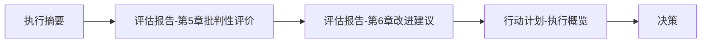

# 2025年10月21日 对标评估文档索引

> **文档类型**: 索引导航  
> **生成日期**: 2025年10月21日  
> **文档集**: 全面对标与批判性评估

---

## 📑 文档列表

### 1. 执行摘要 (推荐先读) ⭐

**文件**: [2025年10月21日_对标评估执行摘要.md](./2025年10月21日_对标评估执行摘要.md)

**内容概览**:

- 核心结论和关键发现
- 对标分析结果概览
- 3阶段改进行动计划
- 关键风险与应对
- 立即行动建议

**适合人群**: 项目负责人、管理层、时间有限的读者

**阅读时间**: 10-15分钟

---

### 2. 全面对标与批判性评估报告 (详细版) 📊

**文件**: [2025年10月21日_全面对标与批判性评估报告.md](./2025年10月21日_全面对标与批判性评估报告.md)

**内容概览**:

- CNCF标准详细对标
- Wikipedia质量标准对标
- 硬件行业标准对标
- 虚拟化容器化技术规范对标
- 深度批判性评价
- 详细改进建议
- 可持续改进计划

**章节结构**:

```text
1. CNCF标准对标分析 (20页)
2. Wikipedia质量标准对标 (10页)
3. 硬件行业标准对标 (15页)
4. 虚拟化容器化技术规范对标 (10页)
5. 批判性评价 (15页)
6. 改进建议 (20页)
7. 可持续改进计划 (15页)
附录 (10页)
```

**适合人群**: 技术负责人、架构师、质量工程师、详细执行人员

**阅读时间**: 1-2小时

---

### 3. 改进行动计划追踪表 (执行手册) 📋

**文件**: [2025年10月21日_改进行动计划追踪表.md](./2025年10月21日_改进行动计划追踪表.md)

**内容概览**:

- 短期改进计划 (12个任务,2025 Q4)
- 中期改进计划 (8个任务,2026 Q1-Q2)
- 长期改进计划 (6个任务,2026 Q3-Q4)
- 每个任务的详细信息:
  - 任务ID、负责人、状态
  - 开始日期、截止日期
  - 工作量估算
  - 交付物清单
  - 验收标准
  - 进度追踪表

**任务总览**:

```yaml
短期 (P0/P1): 12个任务, 116人天
中期: 8个任务, 持续6个月
长期: 6个任务, 持续6个月
总计: 26个任务
```

**适合人群**: 项目经理、任务执行人、进度跟踪者

**阅读时间**: 30-45分钟

---

## 🗺️ 阅读路径建议

### 路径A: 管理者/决策者



**预计时间**: 30分钟

### 路径B: 技术负责人


**预计时间**: 2-3小时

### 路径C: 任务执行人


**预计时间**: 1-1.5小时

---

## 📊 关键数据速览

### 项目现状评分

| 维度 | 评分 | 等级 |
|------|------|------|
| **综合评分** | 88/100 | ⭐⭐⭐⭐⭐ 优秀 |
| 技术深度 | 95/100 | ⭐⭐⭐⭐⭐ |
| 技术广度 | 92/100 | ⭐⭐⭐⭐⭐ |
| 标准对齐 | 98/100 | ⭐⭐⭐⭐⭐ |
| 文档质量 | 90/100 | ⭐⭐⭐⭐⭐ |
| 代码示例 | 87/100 | ⭐⭐⭐⭐ |
| 可维护性 | 85/100 | ⭐⭐⭐⭐ |
| 国际化 | 70/100 | ⭐⭐⭐ |
| 社区活跃 | 60/100 | ⭐⭐⭐ |

### 对标结果概览

| 对标类别 | 评分 | 主要发现 |
|---------|------|---------|
| **CNCF标准** | 95/100 | ✅ OCI/K8s/ServiceMesh完整覆盖 |
| **Wikipedia标准** | 85/100 | ⚠️ 引用覆盖率需提升(70%→90%) |
| **硬件标准** | 88/100 | ✅ Intel/AMD/NVIDIA优秀, ⚠️ ARM待加强 |
| **安全合规** | 87/100 | ✅ CIS/NIST良好, ⚠️ ISO待加强 |

### 改进优先级

| 优先级 | 任务数 | 时间范围 | 关键目标 |
|--------|--------|---------|---------|
| **P0 (高)** | 5个 | 2025-10~11 | 标准对标体系 |
| **P1 (中高)** | 7个 | 2025-11~12 | 文档质量+自动化 |
| **中期** | 8个 | 2026-01~06 | 国际化+社区 |
| **长期** | 6个 | 2026-07~12 | 智能化+生态 |

---

## 🎯 关键行动建议

### 立即行动 (本周)

1. ✅ 阅读执行摘要 (15分钟)
2. ⏳ 组建核心团队,分配角色 (1天)
3. ⏳ 启动P0任务: 创建STANDARDS_COMPLIANCE.md (3天)
4. ⏳ 建立标准对标矩阵 (2天)
5. ⏳ 设计引用规范 (2天)

### 本月目标 (2025-10)

- [ ] 完成标准符合性声明
- [ ] 建立标准对标矩阵和监控机制
- [ ] 集成标准验证工具
- [ ] 建立参考文献引用规范
- [ ] 开始核心文档引用补充

### 本季度目标 (2025 Q4)

- [ ] 完成所有P0/P1任务 (12个)
- [ ] 引用覆盖率达到85%
- [ ] 建立自动化验证体系
- [ ] 开放GitHub仓库
- [ ] 重构Top 20核心文档

---

## 💼 团队分工建议

### 核心团队 (5-7人)

```yaml
技术负责人 (1人):
  主要任务:
    - P0-001: 标准符合性声明
    - P0-002: 标准对标矩阵
    - P1-001: 文档模板
    - M-004: OCI认证准备
  关键技能: 技术架构,标准理解,项目管理

内容编辑 (2人):
  主要任务:
    - P0-004: 引用规范
    - P0-005: 文档引用补充 (55个)
    - P1-006: Top 20文档重构
    - M-001: 英文翻译
  关键技能: 技术写作,文档编辑,英语

工程开发 (1-2人):
  主要任务:
    - P0-003: 标准验证工具
    - P1-002: 代码测试框架
    - P1-003: CI/CD集成
    - P1-007: 质量监控系统
  关键技能: Python/Shell/CI-CD,自动化

社区运营 (1人):
  主要任务:
    - P1-004: GitHub准备
    - P1-005: 仓库开放
    - M-003: 社区运营
  关键技能: 社区管理,营销推广
```

---

## 📅 关键里程碑

### 2025年里程碑

| 日期 | 里程碑 | 关键交付 |
|------|--------|---------|
| **2025-11-01** | 标准对标启动 | STANDARDS_COMPLIANCE.md |
| **2025-11-15** | 自动化基础 | CI/CD验证集成 |
| **2025-12-01** | 社区启动 | GitHub仓库开放 |
| **2025-12-31** | Q4总结 | 12个P0/P1任务完成 |

### 2026年里程碑

| 日期 | 里程碑 | 关键交付 |
|------|--------|---------|
| **2026-02-28** | 国际化启动 | 10个核心文档英文版 |
| **2026-05-31** | 标准认证 | OCI Certified |
| **2026-06-30** | 中期完成 | 500+ Stars, 30+ Contributors |
| **2026-09-30** | AI助手 | RAG文档问答系统 |
| **2026-12-31** | 年度目标 | 综合评分95, 1000+ Stars |

---

## 📈 预期成果

### 6个月后 (2026-06)

```yaml
量化指标:
  综合评分: 88 → 92
  标准对齐率: 98% → 99%
  引用覆盖率: 70% → 90%
  国际化程度: 70% → 85%
  GitHub Stars: 0 → 500+
  Contributors: 1 → 30+

质量提升:
  - 标准对标体系完善
  - 文档结构一致性显著改善
  - 自动化验证体系建立
  - 国际化初步完成
  - 社区活跃度大幅提升
```

### 12个月后 (2026-12)

```yaml
量化指标:
  综合评分: 92 → 95
  GitHub Stars: 500+ → 1000+
  Contributors: 30+ → 50+
  月度访问: - → 10K+
  认证: OCI + CNCF

影响力:
  - 成为云原生领域权威参考
  - 被CNCF/LF推荐
  - 技术大会演讲 3+
  - 企业采用案例 10+
  - 培训认证学员 100+
```

---

## 🔗 相关资源

### 项目文档

- [README.md](./README.md) - 项目总导航
- [PROJECT_STATUS.md](./PROJECT_STATUS.md) - 项目状态
- [CONTRIBUTING.md](./CONTRIBUTING.md) - 贡献指南
- [VERSION_UPDATE_SLA.md](./VERSION_UPDATE_SLA.md) - 版本SLA

### 标准对标文档 (新增)

- [STANDARDS_COMPLIANCE.md](./STANDARDS_COMPLIANCE.md) - 标准符合性声明
- [STANDARDS_COMPLIANCE_MATRIX.md](./STANDARDS_COMPLIANCE_MATRIX.md) - 标准追踪矩阵
- [引用规范指南](./_docs/standards/CITATION_GUIDE.md) - 文档引用规范
- [文档模板](./_docs/standards/DOCUMENT_TEMPLATE.md) - 标准文档模板
- [团队组建指南](./_docs/guides/TEAM_SETUP_GUIDE.md) - 核心团队组建

### 实施报告 (新增)

- [标准对标与自动化验证实施报告](./2025年10月21日_标准对标与自动化验证实施报告.md) - P0任务完成报告
- [改进计划执行进度](./README_IMPROVEMENTS_PROGRESS.md) - 持续更新的进度追踪

### 实施指南 (新增)

- [引用补充实施指南](./_docs/guides/CITATION_IMPLEMENTATION_GUIDE.md) - 75个文档引用补充操作手册
- [引用补充示例](./_docs/examples/CITATION_EXAMPLE_Container_README.md) - Container/README.md引用补充示例

### 自动化工具配置 (新增)

- [.markdownlint.json](./.markdownlint.json) - Markdown格式验证规则
- [.yamllint](./.yamllint) - YAML格式验证规则
- [validate_standards.sh](./scripts/validate_standards.sh) - 标准验证脚本
- [standards-validation.yml](./.github/workflows/standards-validation.yml) - CI/CD工作流

### Phase 1 执行报告 (新增)

- [首个文档引用补充完成报告](./2025年10月21日_首个文档引用补充完成报告.md) - OCI标准详解引用补充示范
- [OCI标准详解改进版](./Container/07_容器技术标准/01_OCI标准详解_改进版.md) - 完整引用补充的实际文档
- [第二个文档引用补充完成报告](./2025年10月21日_第二个文档引用补充完成报告_Docker架构原理.md) - Docker架构原理引用补充
- [Docker架构原理改进版](./Container/01_Docker技术详解/01_Docker架构原理_改进版.md) - 完整引用补充的Docker架构文档
- [第三个文档引用补充完成报告](./2025年10月21日_第三个文档引用补充完成报告_Docker镜像技术.md) - Docker镜像技术引用补充
- [Docker镜像技术改进版](./Container/01_Docker技术详解/03_Docker镜像技术_改进版.md) - 完整引用补充的Docker镜像文档
- [第四个文档引用补充完成报告](./2025年10月21日_第四个文档引用补充完成报告_Docker网络技术.md) - Docker网络技术引用补充
- [Docker网络技术改进版](./Container/01_Docker技术详解/04_Docker网络技术_改进版.md) - 完整引用补充的Docker网络文档
- [第五个文档引用补充完成报告](./2025年10月21日_第五个文档引用补充完成报告_Docker存储技术.md) - Docker存储技术引用补充
- [Docker存储技术改进版](./Container/01_Docker技术详解/05_Docker存储技术_改进版.md) - 完整引用补充的Docker存储文档
- [Phase1前五个文档完成最终报告](./2025年10月21日_Phase1五个文档完成最终报告.md) - Phase 1 Day 1完整总结 (5文档/18.4h/93分)
- [Phase1工作总结与第6个文档框架计划](./2025年10月21日_Phase1工作总结与第6个文档框架计划.md) - 第6个文档(Docker安全)执行策略
- [第六个文档框架版完成报告](./2025年10月21日_第六个文档框架版完成报告_Docker安全机制.md) - Docker安全机制框架版引用补充
- [Docker安全机制框架版](./Container/01_Docker技术详解/06_Docker安全机制_框架版.md) - 完整引用补充的Docker安全框架文档 (CIS/NIST对齐)

### 标准参考

- [OCI官网](https://opencontainers.org/) - 容器标准
- [CNCF官网](https://www.cncf.io/) - 云原生标准
- [CIS Benchmarks](https://www.cisecurity.org/cis-benchmarks/) - 安全基准
- [NIST标准](https://www.nist.gov/) - 安全规范

### 对标项目

- [Kubernetes Docs](https://kubernetes.io/docs/)
- [Docker Docs](https://docs.docker.com/)
- [VMware Docs](https://docs.vmware.com/)

---

## 💬 反馈与建议

如果您对评估报告有任何问题或建议,请通过以下方式反馈:

- **GitHub Issues**: 创建Issue讨论
- **GitHub Discussions**: 技术讨论
- **邮件**: project-team@example.com

---

## 📝 文档更新记录

| 版本 | 日期 | 修改内容 | 修改人 |
|------|------|---------|--------|
| v1.0 | 2025-10-21 | 初始版本创建 | AI Agent |

---

**下一步**: 选择合适的阅读路径,开始了解项目对标评估结果!

**祝您阅读愉快!** 📚✨
