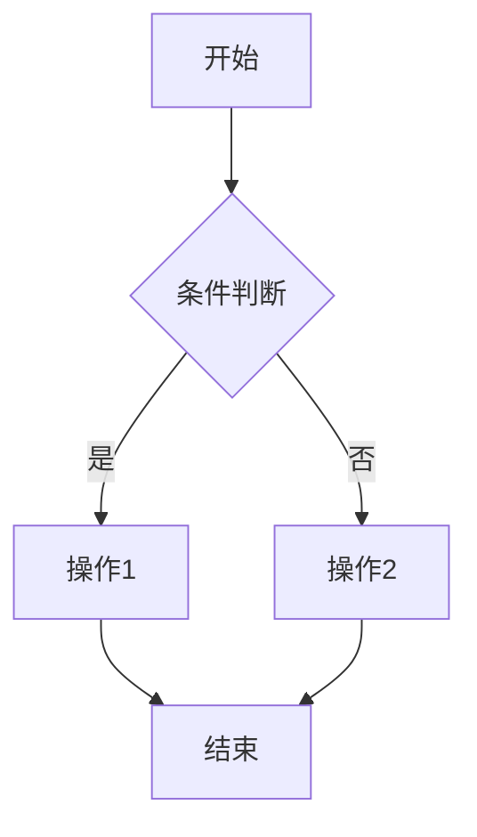

# 贡献指南 (Contributing Guide)

感谢您对虚拟化容器化技术知识库项目的关注！我们欢迎任何形式的贡献。

[English Version](#english-version) | [中文版本](#中文版本)

---

## 中文版本

### 📋 目录

- [行为准则](#行为准则)
- [如何贡献](#如何贡献)
- [贡献类型](#贡献类型)
- [提交指南](#提交指南)
- [文档规范](#文档规范)
- [代码规范](#代码规范)
- [审核流程](#审核流程)
- [贡献者认可](#贡献者认可)

---

### 行为准则

本项目采用[贡献者公约](https://www.contributor-covenant.org/)行为准则。参与本项目即表示您同意遵守其条款。

核心原则：

- ✅ 尊重不同观点和经验
- ✅ 优雅地接受建设性批评
- ✅ 关注对社区最有利的事情
- ✅ 对其他社区成员表示同理心

---

### 如何贡献

#### 第一步：Fork仓库

```bash
# 1. Fork本仓库到您的账号
# 2. Clone到本地
git clone https://github.com/YOUR_USERNAME/vShpere_Docker.git
cd vShpere_Docker

# 3. 添加上游仓库
git remote add upstream https://github.com/ORIGINAL_OWNER/vShpere_Docker.git

# 4. 创建新分支
git checkout -b feature/your-feature-name
# 或
git checkout -b docs/your-doc-update
```

#### 第二步：进行修改

- 遵循[文档规范](#文档规范)
- 遵循[代码规范](#代码规范)
- 确保所有示例可执行
- 添加必要的测试

#### 第三步：提交Pull Request

```bash
# 1. 提交更改
git add .
git commit -m "feat: 添加XXX功能" # 遵循提交规范

# 2. 推送到您的仓库
git push origin feature/your-feature-name

# 3. 在GitHub上创建Pull Request
```

---

### 贡献类型

#### 1. 文档贡献 📝

**内容更新**:

- 版本信息更新
- 技术细节修正
- 添加新技术专题
- 补充最佳实践

**质量改进**:

- 修正错别字和语法
- 改进文档结构
- 增加代码示例
- 补充图表说明

**示例**:

```markdown
## 更新Docker 25.0特性

- 更新位置: Container/01_Docker技术详解/07_Docker_25.0新特性详解.md
- 更新内容: 添加BuildKit 0.12新特性
- 参考资料: [Docker官方发行说明](https://docs.docker.com/...)
```

#### 2. 代码贡献 💻

**自动化脚本**:

- 版本监控脚本
- 质量检查工具
- 文档生成工具

**配置示例**:

- Kubernetes YAML
- Docker Compose配置
- PowerCLI脚本

#### 3. 翻译贡献 🌍

**英文翻译**:

- README英文版
- 核心文档英文版
- 技术术语表

**质量要求**:

- 技术准确
- 术语统一
- 可读流畅

#### 4. 测试贡献 🧪

**配置测试**:

- 验证代码示例可执行
- 测试配置文件正确
- 检查链接可达性

**性能测试**:

- 性能基准测试
- 对比测试
- 优化建议

#### 5. 反馈贡献 💬

**Issue报告**:

- Bug报告
- 功能建议
- 文档改进建议

**讨论参与**:

- 技术讨论
- 最佳实践分享
- 使用经验反馈

---

### 提交指南

#### Commit Message规范

使用[Conventional Commits](https://www.conventionalcommits.org/)规范：

```text
<type>(<scope>): <subject>

<body>

<footer>
```

**Type类型**:

- `feat`: 新功能
- `fix`: Bug修复
- `docs`: 文档更新
- `style`: 格式调整（不影响代码含义）
- `refactor`: 重构
- `test`: 测试相关
- `chore`: 构建/工具相关

**示例**:

```bash
# 好的示例
git commit -m "docs: 更新Kubernetes 1.31新特性文档

- 添加Sidecar Containers GA特性说明
- 补充AppArmor配置示例
- 更新DRA使用指南

Closes #123"

# 不好的示例
git commit -m "更新文档"
git commit -m "fix bug"
```

#### Branch命名规范

```text
<type>/<description>
```

**示例**:

```bash
feature/add-ebpf-chapter          # 新功能
docs/update-k8s-1.31              # 文档更新
fix/broken-links-in-readme        # Bug修复
refactor/restructure-container    # 重构
```

---

### 文档规范

#### 文件结构

```markdown
# 标题（一级标题，文档唯一）

## 目录

- [章节1](#章节1)
- [章节2](#章节2)

## 概述

简要介绍...

## 章节1

### 子章节1.1

内容...

### 子章节1.2

内容...

## 参考资料

- [参考1](链接)
- [参考2](链接)
```

#### 内容规范

**基础概念** (1500-2000字):

```markdown
## 概念名称

### 定义
清晰的定义...

### 核心特点
- 特点1
- 特点2

### 应用场景
1. 场景1
2. 场景2

### 与其他技术对比
| 维度 | 本技术 | 对比技术 |
|-----|-------|---------|
```

**架构原理** (3000-5000字):

```markdown
## 架构设计

### 整体架构
- 架构图
- 组件说明

### 核心组件
#### 组件1
- 功能
- 实现原理

### 工作流程
1. 步骤1
2. 步骤2

### 设计考量
- 性能
- 安全
- 可扩展性
```

**实践指南** (5000-8000字):

```markdown
    ## 实践指南

    ### 前置条件
    - 环境要求
    - 依赖项

    ### 部署步骤
    1. 步骤1
    ```bash
    # 具体命令
    ```

    ### 配置示例

    ```yaml
    # 完整配置
    ```

    ### 验证测试

    ```bash
    # 测试命令
    ```

    ### 故障排查

    问题1:

    - 症状
    - 原因
    - 解决方案

    ### 最佳实践

    1. 实践1
    2. 实践2

```

#### 代码示例规范

**必须包含**:

- 功能说明
- 前置条件
- 适用版本
- 预期结果

```yaml
# 功能: 部署Nginx Pod
# 前置条件: Kubernetes 1.30+
# 适用场景: 生产环境
# 预期结果: Pod Running状态

apiVersion: v1
kind: Pod
metadata:
  name: nginx
spec:
  containers:
  - name: nginx
    image: nginx:1.25
    ports:
    - containerPort: 80
```

#### 图表规范

**架构图**:

- 使用draw.io或Excalidraw
- 提供源文件或可编辑链接
- 清晰标注组件和连接
- 统一配色方案

**流程图**:

- 使用Mermaid（Markdown原生）
- 逻辑清晰
- 步骤完整



#### 性能数据规范

**必须注明**:

- 测试环境
- 测试方法
- 测试日期
- 数据来源

```yaml
性能测试结果:
  指标: 容器启动时间
  数值: 125ms
  
  测试环境:
    平台: AWS EC2
    实例: m5.large (2 vCPU, 8GB RAM)
    操作系统: Ubuntu 22.04
  
  测试方法:
    工具: Firecracker v1.6.0
    场景: 空白容器启动
    样本: 100次平均值
  
  测试日期: 2025-10-15
  数据来源: [官方Benchmark](链接)
```

---

### 代码规范

#### Shell脚本

```bash
#!/usr/bin/env bash
#
# 脚本功能: XXX
# 适用版本: XXX
# 作者: XXX
# 日期: 2025-10-19

set -euo pipefail  # 严格模式

# 常量定义
readonly SCRIPT_DIR="$(cd "$(dirname "${BASH_SOURCE[0]}")" && pwd)"
readonly VERSION="1.0.0"

# 函数定义
function check_prerequisites() {
    # 检查前置条件
    if ! command -v docker &> /dev/null; then
        echo "Error: Docker not found"
        exit 1
    fi
}

function main() {
    check_prerequisites
    # 主逻辑
}

main "$@"
```

#### Python脚本

```python
#!/usr/bin/env python3
"""
脚本功能: XXX
适用版本: Python 3.11+
作者: XXX
日期: 2025-10-19
"""

import sys
from typing import Optional

def check_version() -> bool:
    """检查版本"""
    if sys.version_info < (3, 11):
        print("Error: Python 3.11+ required")
        return False
    return True

def main() -> int:
    """主函数"""
    if not check_version():
        return 1
    
    # 主逻辑
    return 0

if __name__ == '__main__':
    sys.exit(main())
```

#### YAML配置

```yaml
# Kubernetes Deployment示例
# 版本: Kubernetes 1.30+
# 场景: 生产环境

apiVersion: apps/v1
kind: Deployment
metadata:
  name: nginx
  labels:
    app: nginx
spec:
  replicas: 3
  selector:
    matchLabels:
      app: nginx
  template:
    metadata:
      labels:
        app: nginx
    spec:
      containers:
      - name: nginx
        image: nginx:1.25
        ports:
        - containerPort: 80
        resources:
          requests:
            memory: "128Mi"
            cpu: "100m"
          limits:
            memory: "256Mi"
            cpu: "200m"
```

---

### 审核流程

#### 自动化检查

PR提交后会自动运行：

✅ **格式检查**:

- Markdown语法
- 链接可达性
- 代码语法高亮

✅ **内容检查**:

- 版本号一致性
- 术语使用规范
- 文件大小限制

#### 人工审核

**审核重点**:

1. **技术准确性** ⭐⭐⭐⭐⭐
   - 技术细节正确
   - 版本信息准确
   - 配置示例可用

2. **内容完整性** ⭐⭐⭐⭐⭐
   - 结构完整
   - 逻辑清晰
   - 示例充分

3. **标准对齐** ⭐⭐⭐⭐
   - 符合项目规范
   - 符合行业标准
   - 术语统一

4. **可读性** ⭐⭐⭐⭐
   - 表达清晰
   - 易于理解
   - 格式规范

#### 审核时间

- **简单修改**: 3天内审核
- **重大更新**: 7天内审核
- **新专题**: 14天内审核

#### 反馈处理

收到审核反馈后：

1. **及时响应**: 3天内回复
2. **修改完善**: 根据建议修改
3. **再次提交**: 更新PR
4. **持续沟通**: 保持交流

---

### 贡献者认可

#### 贡献者名单

所有贡献者将被记录在：

- README.md - Contributors部分
- 项目网站（如有）
- 年度总结报告

#### 贡献者等级

**新手贡献者** 🌱:

- 1-5个PR合并
- 获得"新手贡献者"徽章

**活跃贡献者** 🌟:

- 6-20个PR合并
- 获得"活跃贡献者"徽章
- 优先审核权限

**核心贡献者** 💎:

- 21+个PR合并
- 获得"核心贡献者"徽章
- 审核权限
- 决策参与权

**专家顾问** 🏆:

- 技术专家认证
- 审核和指导权限
- 项目决策权

#### 激励机制

**月度**:

- 优秀贡献者公开表扬
- 技术文章推荐发布

**季度**:

- 贡献排行榜
- 优秀PR评选
- 奖励证书

**年度**:

- 年度贡献者大会（可选）
- 技术专家认证
- 推荐信/背书（可选）

---

### 常见问题

#### Q1: 我是新手，可以贡献吗？

**A**: 当然可以！建议从以下开始：

- 修正错别字
- 改进文档格式
- 补充代码注释
- 查找标有`good-first-issue`的Issue

#### Q2: 不确定修改是否合适怎么办？

**A**: 建议先开Issue讨论：

- 描述您的想法
- 说明改进理由
- 征求社区意见
- 获得反馈后再动手

#### Q3: 如何查看贡献是否被采纳？

**A**: 通过以下方式：

- PR状态：Open/Merged/Closed
- 邮件通知：GitHub自动发送
- 项目动态：Watch仓库获取更新

#### Q4: 贡献有什么要求？

**A**: 核心要求：

- 技术准确
- 内容完整
- 格式规范
- 可复现
- 尊重版权

#### Q5: 如何获得帮助？

**A**: 多种方式：

- GitHub Issue: 提问题
- GitHub Discussions: 讨论
- Pull Request: 代码审核
- 邮件联系（如有）

---

### 致谢

感谢所有贡献者的付出！您的贡献让项目越来越好！

**特别感谢**:

- 核心维护团队
- 技术审核专家
- 所有贡献者

---

## English Version

### 📋 Table of Contents

- [Code of Conduct](#code-of-conduct)
- [How to Contribute](#how-to-contribute-1)
- [Types of Contributions](#types-of-contributions)
- [Submission Guidelines](#submission-guidelines)
- [Documentation Standards](#documentation-standards)
- [Code Standards](#code-standards)
- [Review Process](#review-process)
- [Contributor Recognition](#contributor-recognition)

---

### Code of Conduct

This project adopts the [Contributor Covenant](https://www.contributor-covenant.org/) Code of Conduct. By participating, you are expected to uphold this code.

Core Principles:

- ✅ Respect differing viewpoints and experiences
- ✅ Gracefully accept constructive criticism
- ✅ Focus on what is best for the community
- ✅ Show empathy towards other community members

---

### How to Contribute

#### Step 1: Fork the Repository

```bash
# 1. Fork this repository to your account
# 2. Clone to local
git clone https://github.com/YOUR_USERNAME/vShpere_Docker.git
cd vShpere_Docker

# 3. Add upstream repository
git remote add upstream https://github.com/ORIGINAL_OWNER/vShpere_Docker.git

# 4. Create a new branch
git checkout -b feature/your-feature-name
# or
git checkout -b docs/your-doc-update
```

#### Step 2: Make Changes

- Follow [Documentation Standards](#documentation-standards)
- Follow [Code Standards](#code-standards)
- Ensure all examples are executable
- Add necessary tests

#### Step 3: Submit Pull Request

```bash
# 1. Commit changes
git add .
git commit -m "feat: add XXX feature" # Follow commit conventions

# 2. Push to your repository
git push origin feature/your-feature-name

# 3. Create Pull Request on GitHub
```

---

### Types of Contributions

#### 1. Documentation Contributions 📝

**Content Updates**:

- Version information updates
- Technical detail corrections
- Adding new technology topics
- Supplementing best practices

**Quality Improvements**:

- Fixing typos and grammar
- Improving document structure
- Adding code examples
- Supplementing diagrams

#### 2. Code Contributions 💻

**Automation Scripts**:

- Version monitoring scripts
- Quality check tools
- Documentation generation tools

**Configuration Examples**:

- Kubernetes YAML
- Docker Compose configurations
- PowerCLI scripts

#### 3. Translation Contributions 🌍

**English Translations**:

- README English version
- Core document English versions
- Technical terminology glossary

**Quality Requirements**:

- Technically accurate
- Consistent terminology
- Readable and fluent

#### 4. Testing Contributions 🧪

**Configuration Testing**:

- Verify code examples are executable
- Test configuration files are correct
- Check link accessibility

**Performance Testing**:

- Performance benchmarks
- Comparative testing
- Optimization suggestions

#### 5. Feedback Contributions 💬

**Issue Reports**:

- Bug reports
- Feature requests
- Documentation improvement suggestions

**Discussion Participation**:

- Technical discussions
- Best practices sharing
- Usage experience feedback

---

### Submission Guidelines

#### Commit Message Format

Use [Conventional Commits](https://www.conventionalcommits.org/) specification:

```text
<type>(<scope>): <subject>

<body>

<footer>
```

**Type**:

- `feat`: New feature
- `fix`: Bug fix
- `docs`: Documentation update
- `style`: Format adjustment (doesn't affect code meaning)
- `refactor`: Refactoring
- `test`: Test-related
- `chore`: Build/tool-related

**Examples**:

```bash
# Good example
git commit -m "docs: update Kubernetes 1.31 features

- Add Sidecar Containers GA feature description
- Supplement AppArmor configuration examples
- Update DRA usage guide

Closes #123"

# Bad example
git commit -m "update docs"
git commit -m "fix bug"
```

---

### Documentation Standards

*(Detailed standards similar to Chinese version...)*

---

### Review Process

#### Automated Checks

After PR submission, automatic checks run:

✅ **Format Checks**:

- Markdown syntax
- Link accessibility
- Code syntax highlighting

✅ **Content Checks**:

- Version number consistency
- Terminology usage standards
- File size limits

#### Manual Review

**Review Focus**:

1. **Technical Accuracy** ⭐⭐⭐⭐⭐
2. **Content Completeness** ⭐⭐⭐⭐⭐
3. **Standard Alignment** ⭐⭐⭐⭐
4. **Readability** ⭐⭐⭐⭐

#### Review Timeline

- **Simple changes**: Within 3 days
- **Major updates**: Within 7 days
- **New topics**: Within 14 days

---

### Contributor Recognition

#### Contributor List

All contributors will be recorded in:

- README.md - Contributors section
- Project website (if available)
- Annual summary report

#### Contributor Levels

**Newbie Contributor** 🌱:

- 1-5 PRs merged
- "Newbie Contributor" badge

**Active Contributor** 🌟:

- 6-20 PRs merged
- "Active Contributor" badge
- Priority review privileges

**Core Contributor** 💎:

- 21+ PRs merged
- "Core Contributor" badge
- Review privileges
- Decision-making participation

**Expert Advisor** 🏆:

- Technical expert certification
- Review and guidance authority
- Project decision rights

---

### FAQ

*(FAQ section similar to Chinese version...)*

---

### Acknowledgments

Thanks to all contributors for their efforts! Your contributions make the project better!

**Special Thanks**:

- Core maintenance team
- Technical review experts
- All contributors

---

**Last Updated**: 2025-10-19  
**Version**: v1.0
