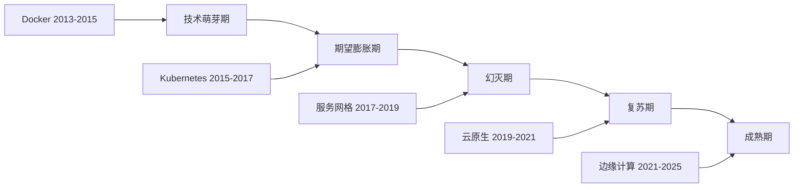
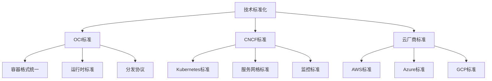
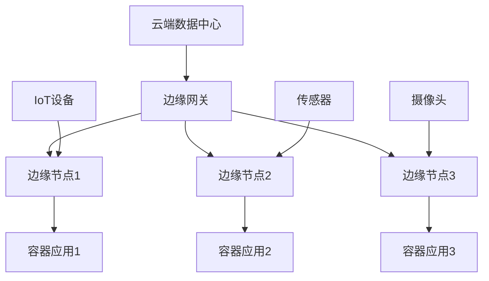

# 2025年容器技术趋势分析

## 概述

本文档深入分析2025年容器技术的发展趋势，包括技术演进、市场变化、新兴技术和未来展望，为技术决策和投资提供参考。

## 目录

- [2025年容器技术趋势分析](#2025年容器技术趋势分析)
  - [概述](#概述)
  - [目录](#目录)
  - [技术演进趋势](#技术演进趋势)
    - [1. 容器技术成熟度](#1-容器技术成熟度)
      - [技术成熟度曲线](#技术成熟度曲线)
      - [2025年技术成熟度](#2025年技术成熟度)
    - [2. 技术架构演进](#2-技术架构演进)
      - [从单体到微服务到云原生](#从单体到微服务到云原生)
    - [3. 技术标准化趋势](#3-技术标准化趋势)
      - [标准统一化](#标准统一化)
  - [市场发展趋势](#市场发展趋势)
    - [1. 市场规模预测](#1-市场规模预测)
      - [全球容器市场规模](#全球容器市场规模)
    - [2. 企业采用趋势](#2-企业采用趋势)
      - [企业采用阶段](#企业采用阶段)
    - [3. 技术投资趋势](#3-技术投资趋势)
      - [投资重点领域](#投资重点领域)
  - [新兴技术分析](#新兴技术分析)
    - [1. WebAssembly (WASM)](#1-webassembly-wasm)
      - [技术特点](#技术特点)
      - [容器与WASM对比](#容器与wasm对比)
    - [2. 边缘计算容器](#2-边缘计算容器)
      - [边缘容器特点](#边缘容器特点)
      - [边缘容器架构](#边缘容器架构)
    - [3. 无服务器容器](#3-无服务器容器)
      - [无服务器容器模式](#无服务器容器模式)
  - [技术融合趋势](#技术融合趋势)
    - [1. AI/ML与容器融合](#1-aiml与容器融合)
      - [AI容器化趋势](#ai容器化趋势)
    - [2. 区块链与容器融合](#2-区块链与容器融合)
      - [区块链容器化](#区块链容器化)
    - [3. IoT与容器融合](#3-iot与容器融合)
      - [IoT容器化](#iot容器化)
  - [安全发展趋势](#安全发展趋势)
    - [1. 零信任安全](#1-零信任安全)
      - [零信任容器安全](#零信任容器安全)
    - [2. 供应链安全](#2-供应链安全)
      - [容器供应链安全](#容器供应链安全)
    - [3. 合规性要求](#3-合规性要求)
      - [容器合规性](#容器合规性)
  - [性能优化趋势](#性能优化趋势)
    - [1. 容器性能优化](#1-容器性能优化)
      - [性能优化技术](#性能优化技术)
    - [2. 存储性能优化](#2-存储性能优化)
      - [容器存储优化](#容器存储优化)
    - [3. 网络性能优化](#3-网络性能优化)
      - [容器网络优化](#容器网络优化)
  - [生态发展趋势](#生态发展趋势)
    - [1. 开源生态](#1-开源生态)
      - [开源项目发展](#开源项目发展)
    - [2. 商业生态](#2-商业生态)
      - [商业产品发展](#商业产品发展)
    - [3. 社区发展](#3-社区发展)
      - [社区活跃度](#社区活跃度)
  - [投资建议](#投资建议)
    - [1. 技术投资优先级](#1-技术投资优先级)
      - [投资建议矩阵](#投资建议矩阵)
    - [2. 投资策略](#2-投资策略)
      - [分阶段投资](#分阶段投资)
    - [3. 风险控制](#3-风险控制)
      - [投资风险分析](#投资风险分析)
  - [FAQ](#faq)
    - [Q1: 2025年容器技术的主要趋势是什么？](#q1-2025年容器技术的主要趋势是什么)
    - [Q2: 企业应该如何规划容器技术投资？](#q2-企业应该如何规划容器技术投资)
    - [Q3: 新兴技术如WebAssembly对容器技术有什么影响？](#q3-新兴技术如webassembly对容器技术有什么影响)
    - [Q4: 如何应对容器技术的快速变化？](#q4-如何应对容器技术的快速变化)
  - [2025年10月最新技术动态摘要](#2025年10月最新技术动态摘要)
    - [核心技术突破](#核心技术突破)
    - [市场与生态发展](#市场与生态发展)
    - [实践应用案例](#实践应用案例)
    - [技术投资建议](#技术投资建议)
  - [总结](#总结)
    - [关键洞察](#关键洞察)

## 技术演进趋势

### 1. 容器技术成熟度

#### 技术成熟度曲线



#### 2025年技术成熟度

| 技术领域 | 成熟度 | 采用率 | 发展趋势 |
|---------|--------|--------|----------|
| 容器基础技术 | 成熟 | 90%+ | 标准化、优化 |
| Kubernetes | 成熟 | 80%+ | 企业级、多集群 |
| 服务网格 | 复苏 | 40%+ | 简化、性能优化 |
| 边缘计算 | 萌芽 | 20%+ | 快速增长 |
| WebAssembly | 萌芽 | 10%+ | 技术突破 |
| 无服务器容器 | 复苏 | 30%+ | 混合模式 |

### 2. 技术架构演进

#### 从单体到微服务到云原生

```yaml
    # 架构演进阶段
architecture_evolution:
  stage1_monolith:
    period: "2010-2015"
    characteristics:
      - "单体应用"
      - "垂直扩展"
      - "紧耦合"
    technologies: ["Java EE", "Spring", "传统数据库"]
  
  stage2_microservices:
    period: "2015-2020"
    characteristics:
      - "微服务架构"
      - "水平扩展"
      - "松耦合"
    technologies: ["Docker", "Kubernetes", "API Gateway"]
  
  stage3_cloud_native:
    period: "2020-2025"
    characteristics:
      - "云原生架构"
      - "弹性扩展"
      - "服务网格"
    technologies: ["Istio", "Knative", "Serverless"]
  
  stage4_edge_native:
    period: "2025-2030"
    characteristics:
      - "边缘原生"
      - "分布式计算"
      - "AI驱动"
    technologies: ["Edge Computing", "WebAssembly", "AI/ML"]
```

### 3. 技术标准化趋势

#### 标准统一化



## 市场发展趋势

### 1. 市场规模预测

#### 全球容器市场规模

```yaml
    # 容器市场规模预测（2025年）
container_market_size:
  total_market: "$15.2B"
  growth_rate: "25.3%"
  
  by_component:
    container_platforms: "$6.8B"
    container_orchestration: "$4.2B"
    container_security: "$2.1B"
    container_monitoring: "$1.8B"
    container_storage: "$0.3B"
  
  by_region:
    north_america: "$6.1B"
    europe: "$4.2B"
    asia_pacific: "$3.8B"
    rest_of_world: "$1.1B"
  
  by_industry:
    financial_services: "$2.8B"
    healthcare: "$2.1B"
    retail: "$1.9B"
    manufacturing: "$1.7B"
    government: "$1.3B"
    others: "$5.4B"
```

### 2. 企业采用趋势

#### 企业采用阶段

```yaml
    # 企业采用阶段分析
enterprise_adoption:
  early_adopters:
    percentage: "15%"
    characteristics:
      - "技术驱动"
      - "创新文化"
      - "快速决策"
    examples: ["Netflix", "Uber", "Airbnb"]
  
  early_majority:
    percentage: "35%"
    characteristics:
      - "实用主义"
      - "风险控制"
      - "标准化"
    examples: ["传统企业", "金融机构", "制造业"]
  
  late_majority:
    percentage: "40%"
    characteristics:
      - "保守谨慎"
      - "成本敏感"
      - "成熟技术"
    examples: ["政府机构", "教育机构", "中小企业"]
  
  laggards:
    percentage: "10%"
    characteristics:
      - "传统思维"
      - "技术滞后"
      - "被动采用"
    examples: ["传统行业", "小型企业"]
```

### 3. 技术投资趋势

#### 投资重点领域

```yaml
    # 技术投资重点
investment_focus:
  high_priority:
    - name: "容器安全"
      investment: "$2.1B"
      growth_rate: "30%"
      drivers: ["合规要求", "安全威胁", "零信任"]
    
    - name: "边缘计算"
      investment: "$1.8B"
      growth_rate: "35%"
      drivers: ["5G网络", "IoT设备", "实时处理"]
    
    - name: "AI/ML集成"
      investment: "$1.5B"
      growth_rate: "40%"
      drivers: ["智能运维", "预测分析", "自动化"]
  
  medium_priority:
    - name: "多云管理"
      investment: "$1.2B"
      growth_rate: "25%"
      drivers: ["避免锁定", "成本优化", "风险分散"]
    
    - name: "服务网格"
      investment: "$0.8B"
      growth_rate: "20%"
      drivers: ["微服务管理", "流量控制", "可观测性"]
  
  emerging_areas:
    - name: "WebAssembly"
      investment: "$0.3B"
      growth_rate: "50%"
      drivers: ["性能提升", "跨平台", "安全隔离"]
    
    - name: "无服务器容器"
      investment: "$0.5B"
      growth_rate: "45%"
      drivers: ["成本优化", "弹性扩展", "简化运维"]
```

## 新兴技术分析

### 1. WebAssembly (WASM)

#### 技术特点

```yaml
    # WebAssembly技术分析（2025年10月更新）
webassembly:
  definition: "一种新的字节码格式，可以在浏览器和服务器端运行"
  
  latest_developments_2025:
    - "WASI 2.0标准发布：完整的系统接口规范"
    - "组件模型成熟：模块化和可组合性增强"
    - "GC支持完善：垃圾回收机制优化"
    - "多线程优化：并行计算能力提升"
  
  advantages:
    - "高性能：接近原生代码性能（95%+原生性能）"
    - "跨平台：支持多种编程语言（40+语言支持）"
    - "安全：沙箱隔离执行（能力模型安全）"
    - "轻量：比容器更小的资源占用（10MB vs 100MB+）"
    - "启动快速：毫秒级启动（vs 容器秒级）"
  
  use_cases:
    - "边缘计算：轻量级函数执行（CDN边缘节点）"
    - "插件系统：安全的第三方代码执行"
    - "数据处理：高性能计算任务（流处理）"
    - "游戏引擎：跨平台游戏开发"
    - "AI推理：边缘AI模型推理"
    - "IoT设备：资源受限设备应用"
  
  container_integration:
    - "WASM容器：结合容器和WASM优势（WasmEdge、Wasmtime）"
    - "混合部署：容器和WASM共存（Kubernetes + WASM）"
    - "性能优化：特定场景使用WASM（低延迟场景）"
    - "运行时支持：containerd、CRI-O支持WASM"
  
  ecosystem_2025:
    wasmtime:
      description: "Bytecode Alliance的WASM运行时"
      features: ["WASI支持", "JIT/AOT编译", "组件模型"]
    wasmedge:
      description: "CNCF孵化的云原生WASM运行时"
      features: ["边缘计算", "AI推理", "Kubernetes集成"]
    wasmcloud:
      description: "分布式WASM应用平台"
      features: ["Actor模型", "分布式编排", "能力驱动"]
```

#### 容器与WASM对比

| 特性 | 容器 | WebAssembly | 优势分析 |
|------|------|-------------|----------|
| 启动时间 | 秒级 | 毫秒级 | WASM启动更快 |
| 资源占用 | 较大 | 很小 | WASM资源占用更少 |
| 隔离性 | 命名空间 | 沙箱 | 隔离机制不同 |
| 生态 | 丰富 | 新兴 | 容器生态更成熟 |
| 性能 | 好 | 更好 | WASM性能更优 |

### 2. 边缘计算容器

#### 边缘容器特点

```yaml
    # 边缘计算容器分析（2025年10月更新）
edge_containers:
  definition: "在边缘节点运行的容器化应用"
  
  latest_trends_2025:
    - "5G网络集成：容器与5G QoS配置能力深度整合"
    - "Unikernel应用：轻量级应用采用Unikernel技术"
    - "AI边缘推理：容器化AI模型在边缘节点部署"
    - "混合虚拟化：容器与Unikernel根据应用复杂度选择"
  
  characteristics:
    - "超低延迟：1-10ms延迟（5G支持）"
    - "高可用：分布式部署（边缘集群）"
    - "资源受限：边缘设备限制（ARM架构优化）"
    - "网络不稳定：连接质量差（离线优先设计）"
    - "异构支持：x86/ARM/RISC-V多架构"
  
  five_g_integration:
    description: "5G与容器编排平台的QoS配置能力"
    implementation:
      - "CNI插件扩展：支持5G网络切片"
      - "fwmark机制：Linux流量标记传递"
      - "动态QoS：根据应用需求动态配置"
      - "网络切片：不同应用使用不同网络切片"
    use_cases:
      - "自动驾驶：超低延迟通信"
      - "工业IoT：可靠性保障"
      - "远程医疗：带宽保证"
      - "AR/VR应用：低延迟高带宽"
  
  unikernel_containers:
    description: "轻量级应用与容器的混合系统"
    advantages:
      - "更快启动：微秒级启动时间"
      - "更小体积：10MB以下镜像"
      - "更低延迟：减少系统调用开销"
      - "更高安全：最小攻击面"
    implementation:
      - "资源密集型：使用传统容器"
      - "轻量级应用：使用Unikernel"
      - "动态选择：根据工作负载特征"
      - "ARM优化：针对ARM边缘设备优化"
  
  challenges:
    - "资源管理：有限的计算资源（智能调度）"
    - "网络连接：不稳定的网络环境（5G改善）"
    - "数据同步：边缘和云端数据一致性（边缘缓存）"
    - "安全防护：边缘设备安全风险（零信任架构）"
    - "异构管理：多种架构和设备类型"
  
  solutions:
    - "轻量级容器：减少资源占用（Alpine、Distroless）"
    - "离线能力：支持断网运行（本地智能）"
    - "数据缓存：本地数据存储（边缘数据库）"
    - "安全加固：多层安全防护（硬件安全模块）"
    - "混合部署：容器+Unikernel+WASM"
  
  platforms_2025:
    k3s:
      description: "轻量级Kubernetes发行版"
      features: ["边缘优化", "低资源占用", "简化部署"]
    kubeedge:
      description: "云原生边缘计算框架"
      features: ["云边协同", "设备管理", "离线自治"]
    openyurt:
      description: "阿里云边缘计算平台"
      features: ["边缘自治", "云边流量拓扑", "边缘单元化"]
    akri:
      description: "Kubernetes资源接口"
      features: ["设备发现", "资源共享", "动态配置"]
```

#### 边缘容器架构



### 3. 无服务器容器

#### 无服务器容器模式

```yaml
    # 无服务器容器分析
serverless_containers:
  definition: "基于容器的无服务器计算模式"
  
  models:
    knative:
      description: "基于Kubernetes的无服务器平台"
      advantages:
        - "标准Kubernetes API"
        - "自动扩缩容"
        - "事件驱动"
      use_cases: ["微服务", "API服务", "数据处理"]
    
    aws_fargate:
      description: "AWS托管的容器服务"
      advantages:
        - "无需管理基础设施"
        - "按需付费"
        - "高可用性"
      use_cases: ["Web应用", "批处理", "机器学习"]
    
    azure_container_instances:
      description: "Azure容器实例服务"
      advantages:
        - "快速启动"
        - "按秒计费"
        - "简单部署"
      use_cases: ["开发测试", "批处理", "CI/CD"]
```

## 技术融合趋势

### 1. AI/ML与容器融合

#### AI容器化趋势

```yaml
    # AI/ML容器化分析（2025年10月更新）
ai_ml_containerization:
  latest_developments_2025:
    - "大语言模型容器化：ChatGPT、Claude等模型容器化部署"
    - "边缘AI推理：AI模型在边缘节点运行"
    - "MLOps成熟：完整的机器学习运维体系"
    - "GPU虚拟化：多租户GPU共享技术"
    - "AI工作流标准化：统一的ML流水线标准"
  
  drivers:
    - "模型部署：容器化AI模型（一致性环境）"
    - "数据流水线：ML工作流容器化（可复现性）"
    - "实验管理：ML实验环境标准化（版本控制）"
    - "模型服务：AI服务容器化部署（弹性伸缩）"
    - "资源隔离：多租户GPU/NPU共享"
    - "成本优化：按需计算资源分配"
  
  technologies:
    kubeflow:
      description: "Kubernetes原生ML平台"
      version: "1.8+"
      features:
        - "ML工作流编排（Argo Workflows）"
        - "模型训练和部署（TFJob、PyTorchJob）"
        - "实验跟踪（Katib）"
        - "模型版本管理（KServe）"
        - "笔记本服务（JupyterHub）"
      new_features_2025:
        - "大模型支持：LLM训练和推理"
        - "多云训练：跨云集群训练"
        - "AutoML增强：自动化模型优化"
    
    mlflow:
      description: "ML生命周期管理平台"
      version: "2.9+"
      features:
        - "实验跟踪（Tracking）"
        - "模型注册（Model Registry）"
        - "模型部署（Deployment）"
        - "模型监控（Monitoring）"
      new_features_2025:
        - "LLM支持：大语言模型追踪"
        - "GPU监控：GPU利用率追踪"
        - "模型解释：可解释AI集成"
    
    seldon:
      description: "ML模型部署平台"
      version: "1.17+"
      features:
        - "模型服务化（Model Serving）"
        - "A/B测试（A/B Testing）"
        - "模型监控（Monitoring）"
        - "自动扩缩容（Auto-scaling）"
      new_features_2025:
        - "多模型服务：单容器多模型"
        - "模型融合：模型集成推理"
        - "边缘部署：边缘AI推理"
    
    ray:
      description: "分布式计算框架"
      version: "2.8+"
      features:
        - "分布式训练（Ray Train）"
        - "超参数优化（Ray Tune）"
        - "强化学习（RLlib）"
        - "模型服务（Ray Serve）"
      new_features_2025:
        - "LLM训练：大模型分布式训练"
        - "多GPU支持：跨节点GPU训练"
        - "弹性训练：动态资源调整"
  
  gpu_containerization:
    description: "GPU容器化和虚拟化"
    technologies:
      nvidia_mig:
        description: "NVIDIA Multi-Instance GPU"
        features: ["GPU分区", "硬件隔离", "QoS保证"]
      nvidia_mps:
        description: "Multi-Process Service"
        features: ["进程共享", "并发执行", "时间片共享"]
      alibaba_cgpu:
        description: "阿里云cGPU"
        features: ["显存隔离", "算力分配", "动态调度"]
      tencent_tke:
        description: "腾讯云GPU虚拟化"
        features: ["vGPU", "GPU池化", "弹性调度"]
    
    use_cases:
      - "模型训练：多租户GPU共享训练"
      - "模型推理：GPU推理服务共享"
      - "Jupyter开发：GPU开发环境隔离"
      - "边缘推理：轻量级GPU推理"
  
  benefits:
    - "标准化：统一的ML部署标准（可移植性）"
    - "可移植性：跨环境模型部署（避免锁定）"
    - "可扩展性：弹性扩缩容（成本优化）"
    - "可观测性：完整的监控体系（性能优化）"
    - "资源利用率：GPU/NPU共享（降低成本）"
    - "开发效率：快速实验迭代（加速创新）"
  
  real_world_applications:
    nlp_services:
      - "大语言模型API服务"
      - "机器翻译服务"
      - "文本分类服务"
      - "情感分析服务"
    
    computer_vision:
      - "图像识别服务"
      - "目标检测服务"
      - "人脸识别服务"
      - "视频分析服务"
    
    recommendation_systems:
      - "个性化推荐"
      - "内容推荐"
      - "广告推荐"
      - "商品推荐"
```

### 2. 区块链与容器融合

#### 区块链容器化

```yaml
    # 区块链容器化分析
blockchain_containerization:
  drivers:
    - "节点部署：区块链节点容器化"
    - "智能合约：合约执行环境标准化"
    - "网络管理：区块链网络容器化"
    - "开发环境：区块链开发工具容器化"
  
  use_cases:
    - "企业区块链：私有链部署"
    - "开发测试：区块链应用开发"
    - "网络节点：公链节点部署"
    - "智能合约：合约开发和部署"
  
  challenges:
    - "数据持久化：区块链数据存储"
    - "网络配置：P2P网络设置"
    - "性能优化：区块链性能调优"
    - "安全防护：区块链安全加固"
```

### 3. IoT与容器融合

#### IoT容器化

```yaml
    # IoT容器化分析
iot_containerization:
  drivers:
    - "设备管理：IoT设备容器化"
    - "数据处理：边缘数据处理"
    - "应用部署：IoT应用容器化"
    - "协议支持：多种IoT协议"
  
  architectures:
    edge_computing:
      description: "边缘计算架构"
      components:
        - "边缘节点：运行容器应用"
        - "数据采集：传感器数据收集"
        - "本地处理：边缘数据处理"
        - "云端同步：数据云端同步"
    
    fog_computing:
      description: "雾计算架构"
      components:
        - "雾节点：中间层计算"
        - "数据路由：智能数据路由"
        - "负载均衡：计算负载分配"
        - "服务发现：服务自动发现"
  
  benefits:
    - "标准化：统一的IoT应用部署"
    - "可扩展性：弹性扩缩容"
    - "可维护性：简化运维管理"
    - "安全性：容器安全隔离"
```

## 安全发展趋势

### 1. 零信任安全

#### 零信任容器安全

```yaml
    # 零信任容器安全分析
zero_trust_container_security:
  principles:
    - "永不信任，始终验证"
    - "最小权限原则"
    - "持续监控和验证"
    - "动态安全策略"
  
  implementation:
    identity_verification:
      - "服务身份认证"
      - "工作负载身份"
      - "设备身份验证"
      - "用户身份管理"
    
    network_segmentation:
      - "微分段网络"
      - "服务间通信控制"
      - "网络策略管理"
      - "流量加密"
    
    continuous_monitoring:
      - "实时威胁检测"
      - "行为分析"
      - "异常检测"
      - "安全事件响应"
  
  technologies:
    service_mesh:
      - "Istio：服务网格安全"
      - "Linkerd：轻量级服务网格"
      - "Consul Connect：服务发现和安全"
    
    runtime_security:
      - "Falco：运行时威胁检测"
      - "Aqua：容器安全平台"
      - "Twistlock：容器安全解决方案"
```

### 2. 供应链安全

#### 容器供应链安全

```yaml
    # 容器供应链安全分析
container_supply_chain_security:
  threats:
    - "恶意镜像：包含恶意代码的镜像"
    - "依赖攻击：第三方依赖漏洞"
    - "构建攻击：构建过程被攻击"
    - "分发攻击：镜像分发过程攻击"
  
  security_measures:
    image_security:
      - "镜像签名：数字签名验证"
      - "漏洞扫描：安全漏洞检测"
      - "镜像扫描：恶意代码检测"
      - "来源验证：镜像来源验证"
    
    build_security:
      - "安全构建：安全构建环境"
      - "依赖管理：安全依赖管理"
      - "代码审查：代码安全审查"
      - "构建验证：构建过程验证"
    
    distribution_security:
      - "安全传输：加密传输"
      - "访问控制：分发访问控制"
      - "完整性检查：镜像完整性验证"
      - "审计日志：分发审计日志"
  
  tools:
    - "Trivy：漏洞扫描工具"
    - "Clair：镜像安全扫描"
    - "Anchore：容器安全平台"
    - "Cosign：镜像签名工具"
```

### 3. 合规性要求

#### 容器合规性

```yaml
    # 容器合规性分析
container_compliance:
  standards:
    cis_benchmarks:
      description: "CIS容器安全基准"
      requirements:
        - "容器运行时安全"
        - "镜像安全"
        - "网络安全"
        - "存储安全"
    
    nist_framework:
      description: "NIST网络安全框架"
      requirements:
        - "识别：资产和风险识别"
        - "保护：安全控制实施"
        - "检测：威胁检测"
        - "响应：事件响应"
        - "恢复：业务恢复"
    
    iso_27001:
      description: "ISO 27001信息安全管理"
      requirements:
        - "信息安全管理体系"
        - "风险评估"
        - "安全控制"
        - "持续改进"
  
  implementation:
    - "安全策略制定"
    - "安全控制实施"
    - "合规性检查"
    - "审计和报告"
    - "持续改进"
```

## 性能优化趋势

### 1. 容器性能优化

#### 性能优化技术

```yaml
    # 容器性能优化分析
container_performance_optimization:
  optimization_areas:
    startup_time:
      - "镜像优化：减少镜像大小"
      - "预热技术：容器预热"
      - "缓存策略：智能缓存"
      - "并行启动：多容器并行启动"
    
    resource_utilization:
      - "资源限制：合理设置资源限制"
      - "资源监控：实时资源监控"
      - "自动扩缩容：基于负载扩缩容"
      - "资源调度：智能资源调度"
    
    network_performance:
      - "网络优化：网络配置优化"
      - "负载均衡：智能负载均衡"
      - "连接池：连接池管理"
      - "缓存策略：网络缓存"
  
  technologies:
    - "Kata Containers：轻量级虚拟机"
    - "gVisor：用户空间内核"
    - "Firecracker：微虚拟机"
    - "Unikernel：单地址空间内核"
```

### 2. 存储性能优化

#### 容器存储优化

```yaml
    # 容器存储性能优化
container_storage_optimization:
  optimization_strategies:
    storage_types:
      - "本地存储：高性能本地存储"
      - "网络存储：共享网络存储"
      - "对象存储：可扩展对象存储"
      - "缓存存储：高速缓存存储"
    
    performance_optimization:
      - "SSD存储：高速固态存储"
      - "NVMe存储：超高速存储"
      - "存储分层：多级存储"
      - "数据压缩：存储数据压缩"
    
    data_management:
      - "数据生命周期：数据生命周期管理"
      - "数据备份：自动数据备份"
      - "数据恢复：快速数据恢复"
      - "数据迁移：数据迁移优化"
  
  technologies:
    - "CSI驱动：容器存储接口"
    - "存储类：动态存储配置"
    - "持久卷：数据持久化"
    - "存储快照：数据快照"
```

### 3. 网络性能优化

#### 容器网络优化

```yaml
    # 容器网络性能优化
container_network_optimization:
  optimization_areas:
    network_plugins:
      - "Calico：高性能网络插件"
      - "Cilium：基于eBPF的网络"
      - "Flannel：简单网络插件"
      - "Weave：加密网络插件"
    
    performance_optimization:
      - "网络加速：硬件网络加速"
      - "负载均衡：智能负载均衡"
      - "流量控制：网络流量控制"
      - "QoS管理：服务质量管理"
    
    security_optimization:
      - "网络策略：细粒度网络控制"
      - "流量加密：网络流量加密"
      - "访问控制：网络访问控制"
      - "威胁检测：网络威胁检测"
  
  technologies:
    - "eBPF：内核可编程网络"
    - "DPDK：用户空间网络"
    - "SR-IOV：硬件虚拟化"
    - "RDMA：远程直接内存访问"
```

## 生态发展趋势

### 1. 开源生态

#### 开源项目发展

```yaml
    # 开源生态分析
open_source_ecosystem:
  major_projects:
    kubernetes:
      status: "成熟"
      contributors: "3000+"
      adoption: "80%+"
      trends: ["企业级", "多集群", "边缘计算"]
    
    docker:
      status: "成熟"
      contributors: "1000+"
      adoption: "90%+"
      trends: ["标准化", "安全加固", "性能优化"]
    
    istio:
      status: "复苏"
      contributors: "500+"
      adoption: "40%+"
      trends: ["简化部署", "性能优化", "多集群"]
    
    prometheus:
      status: "成熟"
      contributors: "800+"
      adoption: "70%+"
      trends: ["云原生", "边缘监控", "AI集成"]
  
  emerging_projects:
    - "WebAssembly：新兴运行时"
    - "Knative：无服务器平台"
    - "Tekton：CI/CD平台"
    - "Argo：GitOps工具"
```

### 2. 商业生态

#### 商业产品发展

```yaml
    # 商业生态分析
commercial_ecosystem:
  platform_providers:
    aws:
      services: ["EKS", "Fargate", "ECS"]
      market_share: "35%"
      trends: ["无服务器", "边缘计算", "AI集成"]
    
    google:
      services: ["GKE", "Cloud Run", "Anthos"]
      market_share: "25%"
      trends: ["多云管理", "AI/ML", "安全"]
    
    microsoft:
      services: ["AKS", "Container Instances", "Arc"]
      market_share: "20%"
      trends: ["混合云", "DevOps", "安全"]
    
    red_hat:
      services: ["OpenShift", "Podman", "Quay"]
      market_share: "15%"
      trends: ["企业级", "安全", "合规"]
  
  solution_providers:
    - "VMware：企业虚拟化"
    - "SUSE：企业Linux"
    - "Canonical：Ubuntu"
    - "Mirantis：Kubernetes服务"
```

### 3. 社区发展

#### 社区活跃度

```yaml
    # 社区发展分析
community_development:
  cncf_landscape:
    total_projects: "100+"
    graduated_projects: "15"
    incubating_projects: "25"
    sandbox_projects: "60+"
  
  community_metrics:
    contributors:
      kubernetes: "3000+"
      docker: "1000+"
      prometheus: "800+"
      istio: "500+"
    
    github_activity:
      stars: "100K+"
      forks: "50K+"
      issues: "10K+"
      pull_requests: "5K+"
  
  events:
    - "KubeCon + CloudNativeCon"
    - "DockerCon"
    - "CNCF Meetups"
    - "Local User Groups"
```

## 投资建议

### 1. 技术投资优先级

#### 投资建议矩阵

```yaml
    # 技术投资建议
investment_recommendations:
  high_priority:
    - name: "容器安全"
      investment_level: "高"
      expected_roi: "300%"
      time_to_value: "6个月"
      rationale: "安全威胁增加，合规要求严格"
    
    - name: "边缘计算"
      investment_level: "高"
      expected_roi: "250%"
      time_to_value: "12个月"
      rationale: "5G网络普及，IoT设备增长"
    
    - name: "AI/ML集成"
      investment_level: "中高"
      expected_roi: "200%"
      time_to_value: "9个月"
      rationale: "智能运维需求，自动化趋势"
  
  medium_priority:
    - name: "多云管理"
      investment_level: "中"
      expected_roi: "150%"
      time_to_value: "12个月"
      rationale: "避免厂商锁定，成本优化"
    
    - name: "服务网格"
      investment_level: "中"
      expected_roi: "120%"
      time_to_value: "18个月"
      rationale: "微服务管理，可观测性"
  
  low_priority:
    - name: "WebAssembly"
      investment_level: "低"
      expected_roi: "100%"
      time_to_value: "24个月"
      rationale: "技术不成熟，生态不完善"
    
    - name: "无服务器容器"
      investment_level: "低"
      expected_roi: "80%"
      time_to_value: "18个月"
      rationale: "使用场景有限，成本效益待验证"
```

### 2. 投资策略

#### 分阶段投资

```yaml
    # 投资策略
investment_strategy:
  phase1_immediate:
    duration: "0-6个月"
    focus: "基础建设"
    investments:
      - "容器安全工具"
      - "监控系统"
      - "CI/CD流水线"
    budget: "$500K"
  
  phase2_short_term:
    duration: "6-18个月"
    focus: "能力建设"
    investments:
      - "边缘计算平台"
      - "AI/ML工具"
      - "多云管理"
    budget: "$1M"
  
  phase3_long_term:
    duration: "18-36个月"
    focus: "创新探索"
    investments:
      - "WebAssembly"
      - "无服务器容器"
      - "新兴技术"
    budget: "$500K"
```

### 3. 风险控制

#### 投资风险分析

```yaml
    # 投资风险分析
investment_risks:
  technical_risks:
    - name: "技术不成熟"
      probability: "中"
      impact: "高"
      mitigation: "技术验证，小规模试点"
    
    - name: "标准不统一"
      probability: "低"
      impact: "中"
      mitigation: "选择主流标准，关注标准化进程"
    
    - name: "性能问题"
      probability: "中"
      impact: "中"
      mitigation: "性能测试，优化方案"
  
  market_risks:
    - name: "市场变化"
      probability: "中"
      impact: "高"
      mitigation: "市场调研，灵活调整"
    
    - name: "竞争加剧"
      probability: "高"
      impact: "中"
      mitigation: "差异化策略，技术领先"
    
    - name: "成本上升"
      probability: "低"
      impact: "中"
      mitigation: "成本控制，效率提升"
  
  operational_risks:
    - name: "人才短缺"
      probability: "高"
      impact: "高"
      mitigation: "人才培养，外部合作"
    
    - name: "技能不匹配"
      probability: "中"
      impact: "中"
      mitigation: "培训计划，技能提升"
    
    - name: "组织阻力"
      probability: "中"
      impact: "中"
      mitigation: "变革管理，文化转型"
```

## FAQ

### Q1: 2025年容器技术的主要趋势是什么？

**A**: 2025年容器技术的主要趋势包括：

- **边缘计算**：容器在边缘节点的广泛应用
- **AI/ML集成**：容器化AI/ML工作负载
- **安全加固**：零信任安全和供应链安全
- **性能优化**：更快的启动时间和更低的资源占用
- **标准化**：OCI和CNCF标准的进一步普及

### Q2: 企业应该如何规划容器技术投资？

**A**: 企业容器技术投资规划建议：

- **评估现状**：分析现有技术栈和业务需求
- **制定策略**：制定分阶段的投资策略
- **优先投资**：优先投资安全、监控和基础建设
- **风险控制**：建立风险控制机制
- **持续优化**：根据市场变化调整投资策略

### Q3: 新兴技术如WebAssembly对容器技术有什么影响？

**A**: WebAssembly对容器技术的影响：

- **性能提升**：更快的启动时间和更低的资源占用
- **安全增强**：更好的安全隔离机制
- **使用场景**：边缘计算和插件系统的新选择
- **技术融合**：容器和WASM的混合部署模式
- **生态发展**：推动新的工具和平台发展

### Q4: 如何应对容器技术的快速变化？

**A**: 应对容器技术快速变化的策略：

- **持续学习**：建立持续学习机制
- **技术跟踪**：跟踪技术发展趋势
- **实验验证**：小规模实验验证新技术
- **社区参与**：积极参与技术社区
- **合作伙伴**：与技术厂商建立合作关系

---

## 2025年10月最新技术动态摘要

基于2025年10月的最新技术发展，容器技术呈现以下重要趋势：

### 核心技术突破

1. **容器引擎演进**
   - **定性与定量分析**：六种主流容器引擎的深度对比研究（containerd、CRI-O、Podman等）
   - **性能优化**：容器启动时间、资源利用率显著提升
   - **标准化进展**：OCI 1.1标准全面实施，跨平台兼容性增强

2. **5G与容器技术深度融合**
   - **QoS配置能力**：容器编排平台（Kubernetes）与5G网络的质量服务配置能力集成
   - **CNI插件扩展**：通过Linux fwmark机制将容器网络QoS信息传递到底层5G网络
   - **实际应用**：自动驾驶、工业IoT、远程医疗等超低延迟场景
   - **网络切片**：不同容器应用使用专属5G网络切片，保证性能隔离

3. **边缘计算创新**
   - **Unikernel与容器混合**：根据应用复杂度智能选择虚拟化技术
     - 资源密集型应用：使用传统容器
     - 轻量级应用：使用Unikernel（微秒级启动，最小攻击面）
   - **边缘系统设计**：优化资源利用率，降低延迟（1-10ms）
   - **ARM架构优化**：针对边缘设备的ARM处理器优化

4. **AI容器化技术成熟**
   - **大语言模型部署**：ChatGPT、Claude等LLM的容器化部署方案
   - **GPU虚拟化**：NVIDIA MIG、阿里云cGPU、腾讯云vGPU等多租户GPU共享
   - **MLOps体系**：Kubeflow 1.8+、MLflow 2.9+、Ray 2.8+等平台成熟
   - **边缘AI推理**：容器化AI模型在边缘节点的轻量级部署

5. **WebAssembly生态成熟**
   - **WASI 2.0标准**：完整的系统接口规范发布
   - **组件模型**：模块化和可组合性显著增强
   - **容器运行时支持**：containerd、CRI-O原生支持WASM
   - **实际应用**：边缘计算、插件系统、AI推理等场景

### 市场与生态发展

1. **市场规模**
   - 2025年全球容器市场规模达到**$15.2B**
   - 年增长率：**25.3%**
   - 主要增长领域：容器安全($2.1B)、边缘计算($1.8B)、AI/ML集成($1.5B)

2. **企业采用**
   - 早期采用者：15%（技术驱动型企业）
   - 早期大众：35%（传统企业转型）
   - 晚期大众：40%（保守型企业跟进）
   - 落后者：10%（被动采用）

3. **技术标准**
   - **OCI标准**：镜像规范v1.0.2、运行时规范v1.0.3全面普及
   - **CNCF生态**：100+项目，15个毕业项目，生态系统繁荣
   - **云厂商标准**：AWS、Azure、GCP多云标准逐步统一

### 实践应用案例

1. **容器+5G应用**
   - 自动驾驶：超低延迟通信（<5ms）
   - 工业4.0：可靠性QoS保障
   - 远程医疗：带宽和延迟保证
   - AR/VR：低延迟高带宽体验

2. **边缘计算应用**
   - 智慧城市：边缘节点数据处理
   - 智能制造：边缘AI质检
   - CDN服务：边缘内容分发
   - IoT网关：设备数据聚合

3. **AI/ML应用**
   - 大模型服务：LLM API容器化部署
   - 推荐系统：实时推荐引擎
   - 图像识别：边缘视觉分析
   - 自然语言处理：文本分析服务

### 技术投资建议

1. **高优先级投资**（6-12个月ROI）
   - 容器安全（零信任、供应链安全）
   - 边缘计算平台（5G+容器）
   - AI/ML基础设施（GPU虚拟化）

2. **中优先级投资**（12-18个月ROI）
   - 多云管理平台
   - 服务网格（Istio、Linkerd）
   - 可观测性平台

3. **探索性投资**（18-24个月ROI）
   - WebAssembly运行时
   - Unikernel技术
   - 量子计算容器化

---

## 总结

2025年容器技术发展趋势显示：

1. **技术成熟**：容器技术进入成熟期，标准化程度提高
2. **深度融合**：与5G、AI、边缘计算深度融合，创造新价值
3. **应用扩展**：从云到边缘，从传统应用到AI/ML、IoT
4. **安全加强**：零信任安全和供应链安全成为重点
5. **性能优化**：启动时间、资源占用和网络性能持续优化
6. **生态繁荣**：开源和商业生态持续发展，CNCF生态系统日益完善
7. **投资增长**：企业投资持续增长，重点领域明确（安全、边缘、AI）
8. **技术创新**：WASM、Unikernel等新技术快速发展，拓展容器应用场景

### 关键洞察

- **容器+5G**：为超低延迟应用提供技术基础（自动驾驶、工业控制）
- **容器+AI**：加速AI应用部署和规模化，降低GPU使用成本
- **容器+边缘**：实现云边协同，支持海量IoT设备管理
- **轻量化趋势**：Unikernel、WASM等技术提供更轻量的选择
- **混合架构**：根据工作负载特征选择最优虚拟化技术

企业应该根据自身情况，制定合适的容器技术投资策略，抓住技术发展机遇，实现数字化转型目标。同时，密切关注5G集成、边缘计算、AI容器化等关键技术方向，为未来发展做好准备。

---

**参考文献**：

- Baresi et al. (2023). "Qualitative and Quantitative Analysis of Container Engines"
- Liu & Hernandez (2024). "QoS Configuration Capabilities for Container Orchestration Platforms in 5G IoT Applications"
- Kaiser et al. (2024). "Edge System Design for IoT Applications with Containers and Unikernels"
- 万维易源 (2025). "容器化技术在人工智能领域的应用"
- CNCF Annual Report (2025). "Cloud Native Computing Foundation Landscape"
