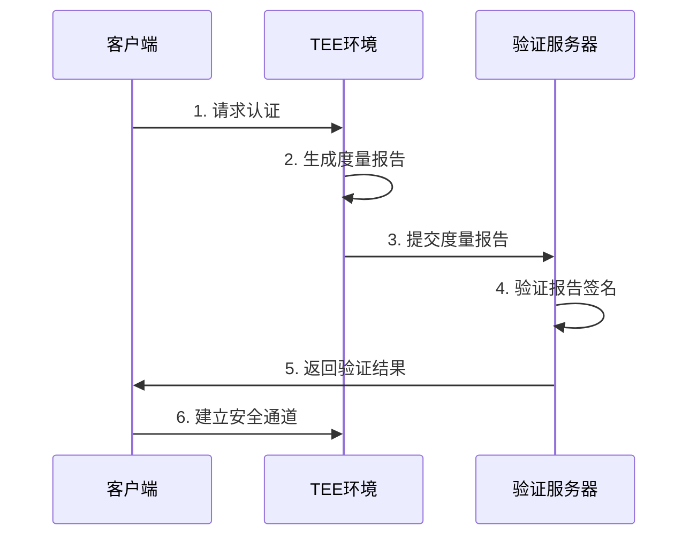

# 机密计算技术详解

## 📋 目录

- [机密计算技术详解](#机密计算技术详解)
  - [📋 目录](#-目录)
  - [概述](#概述)
    - [什么是机密计算](#什么是机密计算)
    - [核心价值](#核心价值)
    - [技术标准](#技术标准)
  - [核心概念](#核心概念)
    - [可信执行环境 (TEE)](#可信执行环境-tee)
    - [远程认证 (Remote Attestation)](#远程认证-remote-attestation)
    - [内存加密](#内存加密)
  - [Intel TDX](#intel-tdx)
    - [Trust Domain Extensions概述](#trust-domain-extensions概述)
    - [架构设计](#架构设计)
    - [TDX工作流程](#tdx工作流程)
    - [TDX性能优化](#tdx性能优化)
  - [AMD SEV-SNP](#amd-sev-snp)
    - [Secure Encrypted Virtualization概述](#secure-encrypted-virtualization概述)
    - [架构设计1](#架构设计1)
    - [SEV-SNP部署](#sev-snp部署)
    - [SEV-SNP vs TDX对比](#sev-snp-vs-tdx对比)
  - [机密容器](#机密容器)
    - [Confidential Containers (CoCo)概述](#confidential-containers-coco概述)
    - [CoCo架构](#coco架构)
    - [Kubernetes集成](#kubernetes集成)
    - [镜像加密](#镜像加密)
  - [应用场景](#应用场景)
    - [金融服务](#金融服务)
    - [医疗健康](#医疗健康)
    - [AI/ML](#aiml)
    - [云原生应用](#云原生应用)
  - [最佳实践](#最佳实践)
    - [性能优化](#性能优化)
    - [安全加固](#安全加固)
    - [监控和调试](#监控和调试)
  - [参考资料](#参考资料)
    - [官方文档](#官方文档)
    - [技术博客](#技术博客)
    - [社区资源](#社区资源)
    - [标准和规范](#标准和规范)

---

## 概述

### 什么是机密计算

机密计算（Confidential Computing）是一种通过硬件级加密保护使用中数据（Data-in-Use）的技术。
与传统的静态数据加密（Data-at-Rest）和传输数据加密（Data-in-Transit）不同，机密计算确保数据在处理过程中也保持加密状态。

### 核心价值

**数据安全三态**:

- ✅ Data-at-Rest: 存储加密 ✓
- ✅ Data-in-Transit: 传输加密 ✓
- ⭐ Data-in-Use: **处理加密** (机密计算的核心)

**关键优势**:

- 🔐 硬件级加密保护
- 🛡️ 防止云提供商访问
- 🔒 隔离敏感工作负载
- ✅ 满足合规要求
- 🌐 支持跨域数据共享

### 技术标准

**机密计算联盟 (CCC)**:

- 成立时间: 2019年
- 创始成员: Intel, Microsoft, Google, IBM, 阿里巴巴等
- 官网: [confidentialcomputing.io](https://confidentialcomputing.io/)

---

## 核心概念

### 可信执行环境 (TEE)

**Trusted Execution Environment**:

```text
┌─────────────────────────────────────┐
│         应用程序层                   │
│  ┌──────────────┐  ┌─────────────┐  │
│  │  普通应用     │  │  TEE应用    │  │
│  └──────────────┘  └─────────────┘  │
├─────────────────────────────────────┤
│         操作系统层                   │
│  ┌──────────────┐  ┌─────────────┐  │
│  │  普通OS      │  │  安全OS      │  │
│  └──────────────┘  └─────────────┘  │
├─────────────────────────────────────┤
│         硬件层                       │
│  ┌──────────────┐  ┌─────────────┐  │
│  │  普通内存     │  │  隔离内存   │  │
│  │  (明文)      │  │  (加密)     │  │
│  └──────────────┘  └─────────────┘  │
└─────────────────────────────────────┘
```

**TEE关键特性**:

- 数据隔离: 硬件级内存加密
- 代码隔离: 独立执行环境
- 远程认证: 可验证的执行证明
- 密封存储: 加密的数据持久化

### 远程认证 (Remote Attestation)

**工作流程**:



**度量内容**:

- CPU型号和固件版本
- TEE软件栈版本
- 应用程序代码哈希
- 配置参数
- 安全状态

### 内存加密

**加密模式**:

| 技术 | 粒度 | 性能影响 | 安全级别 |
|------|------|---------|---------|
| **TME** (Total Memory Encryption) | 全系统 | ~3-5% | 基础 |
| **MKTME** (Multi-Key TME) | 多密钥域 | ~5-8% | 中级 |
| **TDX/SEV-SNP** | 每虚拟机 | ~8-15% | 高级 |

---

## Intel TDX

### Trust Domain Extensions概述

**版本历史**:

- TDX 1.0: 2023年Q4
- TDX 1.5: 2024年Q2
- **TDX 2.0**: 2025年Q1 (最新)

**核心特性**:

```yaml
技术规格:
  CPU要求: Intel Sapphire Rapids (第4代至强) 或更高
  加密引擎: AES-XTS-128
  密钥管理: 每TD独立密钥
  性能损失: 8-12%
  
支持功能:
  - 完全内存加密
  - CPU状态加密
  - I/O数据保护
  - 远程认证
  - 安全迁移 (TDX 2.0新增)
```

### 架构设计

**Trust Domain架构**:

```text
┌─────────────────────────────────────────┐
│           Host VMM (Hypervisor)         │
├─────────────────────────────────────────┤
│  TD 1           │  TD 2        │  TD 3  │
│ ┌─────────┐     │ ┌──────────┐ │ ┌────┐ │
│ │ App     │     │ │ App      │ │ │App │ │
│ ├─────────┤     │ ├──────────┤ │ ├────┤ │
│ │ Guest OS│     │ │ Guest OS │ │ │OS  │ │
│ └─────────┘     │ └──────────┘ │ └────┘ │
├─────────────────────────────────────────┤
│         TDX Module (固件层)              │
├─────────────────────────────────────────┤
│         Intel CPU (硬件加密)             │
└─────────────────────────────────────────┘
```

**核心组件**:

1. **TDX Module**:
   - 运行在CPU的SEAM模式
   - 管理TD生命周期
   - 处理加密和解密
   - 提供远程认证服务

2. **Secure EPT (SEPT)**:
   - 加密的页表
   - 防止VMM窥探
   - 确保内存隔离

3. **TD密钥管理**:
   - 每个TD独立密钥
   - 硬件随机生成
   - 密钥不离开CPU

### TDX工作流程

**VM启动流程**:

```bash
# 1. 创建Trust Domain
tdx-tool create-td \
  --cpus 4 \
  --memory 8G \
  --image ubuntu-22.04-confidential.qcow2

# 2. TD配置
tdx-tool configure-td \
  --td-id td-001 \
  --attestation-enabled \
  --secure-boot

# 3. 启动TD
tdx-tool start-td --td-id td-001

# 4. 获取认证报告
tdx-tool get-quote --td-id td-001 --output quote.dat

# 5. 验证报告
tdx-tool verify-quote --quote quote.dat --policy policy.json
```

### TDX性能优化

**优化技巧**:

```yaml
CPU配置:
  - 启用硬件加速: 确保BIOS中TME/TDX已启用
  - CPU亲和性: 绑定TD到特定物理核心
  - NUMA优化: TD内存分配在同一NUMA节点

内存优化:
  - 使用大页: 2MB或1GB页提升性能
  - 预分配内存: 避免运行时分配开销
  - 减少内存交换: 禁用TD的swap

I/O优化:
  - 使用virtio设备: 减少虚拟化开销
  - SR-IOV: 直通网卡提升网络性能
  - 批量I/O: 减少VM exit次数
```

**性能基准**:

```yaml
测试环境:
  CPU: Intel Xeon Platinum 8380 (Ice Lake)
  内存: 256GB DDR4-3200
  OS: Ubuntu 22.04 + TDX支持

基准测试结果:
  计算密集型:
    加密影响: 8-10%
    适用场景: 数据分析、AI推理
  
  内存密集型:
    加密影响: 10-15%
    适用场景: 数据库、缓存
  
  I/O密集型:
    加密影响: 5-8%
    适用场景: Web服务、API网关
```

---

## AMD SEV-SNP

### Secure Encrypted Virtualization概述

**版本演进**:

- SEV: 2016年 (内存加密)
- SEV-ES: 2020年 (+ CPU寄存器加密)
- **SEV-SNP**: 2022年 (+ 完整性保护)

**SEV-SNP特性**:

```yaml
技术规格:
  CPU要求: AMD EPYC Milan (第3代) 或更高
  加密引擎: AES-128
  完整性保护: VMPL (虚拟机权限级别)
  性能损失: 5-10%

关键能力:
  - 内存加密
  - 完整性保护 (防回滚攻击)
  - 远程认证
  - 安全嵌套虚拟化
  - 实时迁移支持
```

### 架构设计1

**SEV-SNP架构**:

```text
┌─────────────────────────────────────────┐
│           Hypervisor (KVM)              │
├─────────────────────────────────────────┤
│  VM 1 (SEV-SNP)  │  VM 2 (SEV-SNP)      │
│ ┌─────────┐      │ ┌──────────┐         │
│ │ VMPL0   │      │ │ VMPL0    │         │
│ │ (Guest) │      │ │ (Guest)  │         │
│ └─────────┘      │ └──────────┘         │
├─────────────────────────────────────────┤
│         AMD PSP (Platform Security)     │
├─────────────────────────────────────────┤
│         AMD EPYC CPU                    │
│  ┌────────────────────────────────┐     │
│  │  SME (Secure Memory Encryption)│     │
│  │  + RMP (Reverse Map Table)     │     │
│  └────────────────────────────────┘     │
└─────────────────────────────────────────┘
```

**核心机制**:

1. **Reverse Map Table (RMP)**:
   - 跟踪每个物理页的所有者
   - 防止Hypervisor重映射
   - 硬件强制执行

2. **VMPL (VM Privilege Levels)**:

   ```text
   VMPL0: Guest OS (最高权限)
   VMPL1: Guest安全服务
   VMPL2: 保留
   VMPL3: Hypervisor (最低权限)
   ```

3. **完整性保护**:
   - 每个页面有128位MAC标签
   - 防止重放攻击
   - 防止数据篡改

### SEV-SNP部署

**QEMU/KVM配置**:

```xml
<!-- SEV-SNP VM配置 -->
<domain type='kvm'>
  <name>sev-snp-vm</name>
  <memory unit='GiB'>8</memory>
  <vcpu>4</vcpu>
  
  <!-- SEV-SNP配置 -->
  <launchSecurity type='sev'>
    <cbitpos>51</cbitpos>
    <reducedPhysBits>1</reducedPhysBits>
    <policy>0x0003</policy>
    <snp enabled='yes'/>
    <attestation>
      <enabled>yes</enabled>
      <report-server>https://attestation.example.com</report-server>
    </attestation>
  </launchSecurity>
  
  <devices>
    <disk type='file' device='disk'>
      <driver name='qemu' type='qcow2'/>
      <source file='/var/lib/libvirt/images/sev-snp.qcow2'/>
      <target dev='vda' bus='virtio'/>
    </disk>
    
    <interface type='network'>
      <source network='default'/>
      <model type='virtio'/>
    </interface>
  </devices>
</domain>
```

**命令行启动**:

```bash
# 启动SEV-SNP VM
qemu-system-x86_64 \
  -enable-kvm \
  -machine q35,confidential-guest-support=sev0 \
  -object sev-snp-guest,id=sev0,cbitpos=51,reduced-phys-bits=1 \
  -cpu EPYC-v4 \
  -smp 4 \
  -m 8G \
  -drive file=ubuntu-22.04-sev.qcow2,if=virtio \
  -netdev user,id=net0 \
  -device virtio-net-pci,netdev=net0 \
  -nographic

# 获取认证报告
sev-guest-get-report \
  --output report.bin \
  --nonce $(openssl rand -hex 32)

# 验证报告
sev-guest-verify-report \
  --report report.bin \
  --vcek-cert vcek.pem
```

### SEV-SNP vs TDX对比

| 维度 | AMD SEV-SNP | Intel TDX |
|------|-------------|-----------|
| **CPU要求** | EPYC Milan+ | Sapphire Rapids+ |
| **加密粒度** | 每VM | 每TD |
| **完整性保护** | ✅ RMP + MAC | ✅ SEPT |
| **性能影响** | 5-10% | 8-12% |
| **嵌套虚拟化** | ✅ 支持 | ⚠️ 有限支持 |
| **实时迁移** | ✅ 支持 | 🚧 开发中 |
| **生态成熟度** | 高 (5年+) | 中 (2年+) |
| **云供应商** | Azure, GCP, AWS | Azure, Alibaba |

---

## 机密容器

### Confidential Containers (CoCo)概述

**项目信息**:

- 组织: CNCF Sandbox Project
- 创建时间: 2021年
- 最新版本: v0.8.0 (2024年Q4)
- GitHub: [github.com/confidential-containers](https://github.com/confidential-containers)

**架构愿景**:

```text
传统容器:
┌─────────────────────┐
│   容器应用           │
├─────────────────────┤
│   容器运行时         │
├─────────────────────┤
│   Host OS (可见数据) │
└─────────────────────┘

机密容器:
┌─────────────────────┐
│   容器应用           │
├─────────────────────┤
│   Guest OS (TEE内)  │
├─────────────────────┤
│   容器运行时 (TEE外) │
├─────────────────────┤
│   Host OS (数据加密) │
└─────────────────────┘
```

### CoCo架构

**组件架构**:

```text
┌──────────────────────────────────────────────┐
│         Kubernetes集群                        │
│  ┌────────────────────────────────────────┐  │
│  │  Pod (机密容器)                         │  │
│  │  ┌──────────┐  ┌──────────┐           │  │
│  │  │Container1│  │Container2│           │  │
│  │  └──────────┘  └──────────┘           │  │
│  │         ↓                              │  │
│  │  ┌──────────────────────────┐         │  │
│  │  │  kata-runtime (shim)     │         │  │
│  │  └──────────────────────────┘         │  │
│  └────────────────────────────────────────┘  │
├──────────────────────────────────────────────┤
│  ┌────────────────────────────────────────┐  │
│  │  Kata Containers (TEE内)               │  │
│  │  ┌────────────────────────────────┐   │  │
│  │  │  Guest OS (加密)                │   │  │
│  │  │  - containerd-shim-kata-v2    │   │  │
│  │  │  - Agent                       │   │  │
│  │  └────────────────────────────────┘   │  │
│  └────────────────────────────────────────┘  │
├──────────────────────────────────────────────┤
│           Host OS + CRI-O/containerd         │
├──────────────────────────────────────────────┤
│           TEE (TDX/SEV-SNP/SGX)              │
└──────────────────────────────────────────────┘
```

**核心组件**:

1. **Kata Containers**:
   - 轻量级VM作为容器隔离
   - 支持TDX/SEV-SNP TEE
   - 兼容OCI标准

2. **Attestation Service**:
   - 远程认证验证
   - 策略引擎
   - 密钥管理

3. **Image Security**:
   - 镜像加密
   - 签名验证
   - 安全拉取

### Kubernetes集成

**部署CoCo**:

```yaml
# 1. 安装operator
kubectl apply -f https://raw.githubusercontent.com/confidential-containers/operator/main/config/release/operator.yaml

# 2. 配置CoCo运行时
apiVersion: confidentialcontainers.org/v1beta1
kind: CcRuntime
metadata:
  name: ccruntime-sample
spec:
  runtimeName: kata
  ccNodeSelector:
    matchLabels:
      node.kubernetes.io/cc-capable: "true"
  config:
    teeType: tdx  # 或 sev, sgx
    attestation:
      enabled: true
      server: "https://attestation.example.com"
    imageEncryption:
      enabled: true
      kbs: "https://kbs.example.com"

# 3. 创建RuntimeClass
apiVersion: node.k8s.io/v1
kind: RuntimeClass
metadata:
  name: kata-cc
handler: kata
overhead:
  podFixed:
    memory: "256Mi"
    cpu: "250m"
scheduling:
  nodeSelector:
    node.kubernetes.io/cc-capable: "true"
```

**部署机密Pod**:

```yaml
apiVersion: v1
kind: Pod
metadata:
  name: confidential-nginx
  labels:
    app: nginx
    confidential: "true"
spec:
  runtimeClassName: kata-cc
  containers:
  - name: nginx
    image: docker.io/library/nginx:encrypted
    ports:
    - containerPort: 80
    env:
    - name: CC_IMAGE_KEY_PROVIDER
      value: "attestation-agent"
    resources:
      requests:
        memory: "512Mi"
        cpu: "500m"
      limits:
        memory: "1Gi"
        cpu: "1000m"
    securityContext:
      runAsNonRoot: true
      runAsUser: 101
  
  # 认证配置
  initContainers:
  - name: attestation-init
    image: ghcr.io/confidential-containers/attestation-agent:latest
    command: ["/bin/attestation-agent", "init"]
    volumeMounts:
    - name: attestation-data
      mountPath: /run/attestation
  
  volumes:
  - name: attestation-data
    emptyDir: {}
```

### 镜像加密

**加密容器镜像**:

```bash
# 1. 生成加密密钥
openssl rand -out image-key.bin 32

# 2. 加密镜像
skopeo copy \
  --encryption-key provider:attestation-agent:kbs:///default/image-key \
  docker://nginx:latest \
  docker://registry.example.com/nginx:encrypted

# 3. 配置KBS (Key Broker Service)
cat <<EOF | kubectl apply -f -
apiVersion: v1
kind: Secret
metadata:
  name: image-encryption-key
  namespace: coco-system
type: Opaque
data:
  key: $(base64 -w0 image-key.bin)
EOF

# 4. 验证加密镜像
cosign verify \
  --key cosign.pub \
  registry.example.com/nginx:encrypted
```

---

## 应用场景

### 金融服务

**场景**: 多方数据分析

```yaml
需求:
  - 多家银行共享客户数据进行风险分析
  - 数据不能被云提供商访问
  - 需要证明计算环境可信

解决方案:
  - 使用TDX/SEV-SNP创建可信计算环境
  - 远程认证确保环境完整性
  - 加密数据输入和输出
  - 审计日志不可篡改

技术栈:
  - TEE: Intel TDX
  - 编排: Kubernetes + CoCo
  - 认证: Intel Attestation Service
  - 加密: AES-256-GCM
```

### 医疗健康

**场景**: 基因数据分析

```yaml
需求:
  - 敏感基因数据处理
  - 符合HIPAA/GDPR合规
  - 防止数据泄露

解决方案:
  - SEV-SNP VM运行分析工作负载
  - 加密存储和传输
  - 访问控制和审计
  - 定期认证检查

技术栈:
  - TEE: AMD SEV-SNP
  - 平台: Azure Confidential VM
  - 数据库: Encrypted PostgreSQL
  - 分析: Encrypted Spark
```

### AI/ML

**场景**: 模型训练和推理

```yaml
需求:
  - 保护训练数据隐私
  - 保护模型IP
  - 验证模型完整性

解决方案:
  - 机密容器运行训练任务
  - GPU虚拟化 + TEE
  - 模型加密存储
  - 推理结果可验证

技术栈:
  - TEE: Intel TDX
  - GPU: NVIDIA H100 + CC支持
  - 框架: TensorFlow + Confidential Computing
  - 编排: Kubernetes + CoCo
```

### 云原生应用

**场景**: 多租户SaaS平台

```yaml
需求:
  - 租户数据强隔离
  - 防止跨租户攻击
  - 合规审计

解决方案:
  - 每租户独立TEE
  - 机密容器部署应用
  - 零信任网络
  - 持续认证

技术栈:
  - TEE: TDX/SEV-SNP混合
  - 容器: CoCo + Kata
  - 服务网格: Istio + mTLS
  - 监控: Prometheus + 加密指标
```

---

## 最佳实践

### 性能优化

**1. 选择合适的TEE类型**:

```yaml
工作负载特征匹配:
  计算密集型:
    - 优选: Intel TDX
    - 原因: 更好的CPU性能
  
  内存密集型:
    - 优选: AMD SEV-SNP
    - 原因: 更低的内存加密开销
  
  I/O密集型:
    - 优选: AMD SEV-SNP
    - 原因: 更成熟的I/O虚拟化
  
  GPU加速:
    - 优选: Intel TDX + NVIDIA CC
    - 原因: 更好的GPU虚拟化支持
```

**2. 资源配置优化**:

```yaml
CPU配置:
  # 避免过度订阅
  vcpus_per_physical_cpu: 1-2
  # CPU亲和性
  cpu_pinning: true
  # NUMA对齐
  numa_aware: true

内存配置:
  # 使用大页
  huge_pages: 2MB或1GB
  # 预分配内存
  prealloc: true
  # 禁用内存气球
  balloon: false

存储配置:
  # 使用virtio-blk
  disk_driver: virtio-blk
  # 启用direct I/O
  cache: none
  direct_io: true
```

**3. 减少VM Exit**:

```yaml
优化措施:
  - 使用virtio半虚拟化设备
  - 批量I/O操作
  - 禁用不必要的虚拟化特性
  - 使用SR-IOV直通

监控VM Exit:
  perf kvm stat live
```

### 安全加固

**1. 认证策略**:

```json
{
  "version": "1.0",
  "attestation_policy": {
    "tee_type": "tdx",
    "min_tcb_level": {
      "sgx_tcb": "0xFFFFFFFFFFFFFFFF",
      "tdx_tcb": "0x03000000"
    },
    "allowed_measurements": [
      "sha384:abcd1234...",
      "sha384:efgh5678..."
    ],
    "enforce_debug_disabled": true,
    "require_secure_boot": true
  },
  "runtime_policy": {
    "max_memory": "16GB",
    "max_cpus": 8,
    "allowed_devices": ["virtio-net", "virtio-blk"],
    "network_policy": {
      "allow_egress": ["10.0.0.0/8"],
      "deny_egress": ["0.0.0.0/0"]
    }
  }
}
```

**2. 密钥管理**:

```yaml
Key Broker Service (KBS)配置:
  backend: HashiCorp Vault
  
  key_hierarchy:
    root_key:
      type: HSM-backed
      rotation: 90天
    
    image_keys:
      type: AES-256-GCM
      per_image: true
      rotation: 30天
    
    attestation_keys:
      type: ECDSA P-384
      per_workload: true
      ephemeral: true

  access_control:
    authentication:
      - method: attestation-based
        require: valid_quote
      - method: OIDC
        provider: https://oidc.example.com
    
    authorization:
      - resource: image_keys/*
        action: read
        condition: attestation.tcb_level >= required_level
```

**3. 网络隔离**:

```yaml
# Kubernetes NetworkPolicy
apiVersion: networking.k8s.io/v1
kind: NetworkPolicy
metadata:
  name: cc-workload-isolation
spec:
  podSelector:
    matchLabels:
      confidential: "true"
  policyTypes:
  - Ingress
  - Egress
  ingress:
  - from:
    - podSelector:
        matchLabels:
          access: "allowed"
    ports:
    - protocol: TCP
      port: 443
  egress:
  - to:
    - podSelector:
        matchLabels:
          type: "kbs"
    ports:
    - protocol: TCP
      port: 8080
  - to:
    - namespaceSelector:
        matchLabels:
          name: attestation-service
    ports:
    - protocol: TCP
      port: 443
```

### 监控和调试

**1. 性能监控**:

```yaml
# Prometheus指标
metrics:
  - tee_vm_creation_duration_seconds
  - tee_attestation_duration_seconds
  - tee_memory_encrypted_bytes
  - tee_vm_exit_count
  - tee_cpu_utilization_percent

# Grafana仪表板
dashboard:
  panels:
    - TEE VM性能
    - 认证成功率
    - 加密开销
    - 资源利用率
```

**2. 日志审计**:

```yaml
日志收集:
  - 认证事件
  - 密钥访问
  - VM生命周期
  - 安全告警

日志存储:
  backend: Encrypted Elasticsearch
  retention: 90天
  integrity: SHA-256哈希链

告警规则:
  - 认证失败 > 5次/分钟
  - 未授权密钥访问
  - TEE完整性检查失败
  - 异常网络流量
```

**3. 调试工具**:

```bash
# TDX调试
tdx-tool debug --td-id td-001
  --dump-memory
  --trace-vm-exits

# SEV-SNP调试
sevtool --platform-status
sevtool --guest-status --vm-id vm-123

# CoCo调试
kubectl logs -n coco-system kata-runtime-xxxxx
kubectl describe ccruntime ccruntime-sample
```

---

## 参考资料

### 官方文档

**Intel TDX**:

- [Intel TDX Whitepaper](https://www.intel.com/content/www/us/en/developer/articles/technical/intel-trust-domain-extensions.html)
- [TDX Virtual Firmware Design Guide](https://software.intel.com/content/www/us/en/develop/download/intel-tdx-virtual-firmware-design-guide.html)
- [TDX Module Specification](https://www.intel.com/content/www/us/en/developer/articles/technical/intel-trust-domain-extensions.html)

**AMD SEV-SNP**:

- [AMD SEV-SNP Whitepaper](https://www.amd.com/system/files/TechDocs/SEV-SNP-strengthening-vm-isolation-with-integrity-protection-and-more.pdf)
- [SEV-SNP API Specification](https://www.amd.com/system/files/TechDocs/56860.pdf)
- [SEV-SNP Firmware ABI Specification](https://www.amd.com/system/files/TechDocs/56421.pdf)

**Confidential Computing Consortium**:

- [CCC Homepage](https://confidentialcomputing.io/)
- [CCC GitHub](https://github.com/confidential-computing)
- [Technical Analysis of Confidential Computing](https://confidentialcomputing.io/wp-content/uploads/sites/85/2021/03/confidentialcomputing_outreach_whitepaper-8-5x11-1.pdf)

**Confidential Containers**:

- [CoCo GitHub](https://github.com/confidential-containers)
- [CoCo Documentation](https://confidentialcontainers.org/)
- [CoCo Architecture](https://github.com/confidential-containers/documentation/blob/main/architecture.md)

### 技术博客

- [Microsoft Azure Confidential Computing](https://azure.microsoft.com/en-us/solutions/confidential-compute/)
- [Google Cloud Confidential VMs](https://cloud.google.com/confidential-computing)
- [Red Hat: Confidential Containers](https://www.redhat.com/en/blog/confidential-containers)
- [IBM: Confidential Computing Explained](https://www.ibm.com/cloud/learn/confidential-computing)

### 社区资源

- [CNCF Confidential Containers WG](https://github.com/cncf/tag-security/tree/main/supply-chain-security/compromises)
- [Kata Containers Community](https://katacontainers.io/)
- [OpenStack with Confidential Computing](https://wiki.openstack.org/wiki/Confidential_Computing)

### 标准和规范

- [TCG DICE (Device Identifier Composition Engine)](https://trustedcomputinggroup.org/work-groups/dice-architectures/)
- [IETF RATS (Remote ATtestation procedureS)](https://datatracker.ietf.org/wg/rats/about/)
- [ISO/IEC 11889 (TPM Specification)](https://www.iso.org/standard/66510.html)

---

**文档版本**: v1.0  
**最后更新**: 2025-10-19  
**维护者**: 虚拟化容器化技术知识库项目组

**下一步阅读**:

- [02_机密计算实践指南](./02_机密计算实践指南.md)
- [03_机密计算性能调优](./03_机密计算性能调优.md)
- [04_机密计算安全最佳实践](./04_机密计算安全最佳实践.md)
