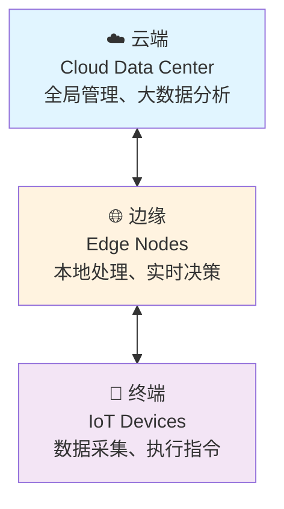

# 边缘计算概述与架构

## 📋 目录

- [什么是边缘计算](#什么是边缘计算)
- [边缘计算架构](#边缘计算架构)
- [技术栈对比](#技术栈对比)
- [应用场景](#应用场景)
- [技术挑战](#技术挑战)
- [发展趋势](#发展趋势)
- [参考资料](#参考资料)

---

## 什么是边缘计算

### 定义

**边缘计算**（Edge Computing）是一种分布式计算架构，将计算、存储和网络能力从中心云下沉到靠近数据源的网络边缘侧，实现数据就近处理和分析。

### 核心概念

**云边端三层架构**:



**与云计算的区别**:

| 维度 | 云计算 | 边缘计算 |
|------|--------|---------|
| **位置** | 中心化数据中心 | 分散在网络边缘 |
| **延迟** | 50-100ms | <10ms |
| **带宽** | 高带宽需求 | 低带宽优化 |
| **可靠性** | 依赖网络连接 | 离线自治能力 |
| **计算能力** | 强大（无限扩展） | 有限（资源受限） |
| **适用场景** | 大数据分析、训练 | 实时处理、推理 |

### 核心价值

**1. 超低延迟**:

- 实时响应: <10ms往返时间
- 本地处理: 避免数据往返云端
- 关键应用: 自动驾驶、工业控制

**2. 带宽优化**:

- 数据本地处理: 减少云端传输
- 流量分流: 降低骨干网压力
- 成本降低: 减少云端带宽费用

**3. 数据隐私**:

- 本地存储: 敏感数据不出边缘
- 合规简化: 满足数据主权要求
- 安全加固: 多层防护

**4. 离线自治**:

- 断网运行: 不依赖云端连接
- 本地决策: 关键业务不中断
- 可靠性高: 单点故障影响小

**5. 规模扩展**:

- 分布式部署: 水平扩展能力
- 就近服务: 降低全局负载
- 弹性伸缩: 按需调度资源

---

## 边缘计算架构

### ETSI边缘计算参考架构

**欧洲电信标准化协会（ETSI）标准**:

```text
┌─────────────────────────────────────────────────────┐
│                   云端 (Cloud)                       │
│  ┌────────────────────────────────────────────────┐ │
│  │  Cloud Orchestrator                            │ │
│  │  - 全局策略管理                                │ │
│  │  - 应用生命周期管理                            │ │
│  │  - 边缘节点管理                                │ │
│  └────────────────────────────────────────────────┘ │
└────────────────┬────────────────────────────────────┘
                 │ 管理和编排
                 ↓
┌─────────────────────────────────────────────────────┐
│              边缘层 (Edge Layer)                     │
│  ┌──────────────────┐  ┌──────────────────┐        │
│  │ Edge Node 1      │  │ Edge Node 2      │        │
│  │ ┌──────────────┐ │  │ ┌──────────────┐ │        │
│  │ │ Edge Apps    │ │  │ │ Edge Apps    │ │        │
│  │ ├──────────────┤ │  │ ├──────────────┤ │        │
│  │ │ Edge Runtime │ │  │ │ Edge Runtime │ │        │
│  │ ├──────────────┤ │  │ ├──────────────┤ │        │
│  │ │ Edge OS      │ │  │ │ Edge OS      │ │        │
│  │ └──────────────┘ │  │ └──────────────┘ │        │
│  └──────────────────┘  └──────────────────┘        │
└────────────────┬────────────────────────────────────┘
                 │ 设备接入
                 ↓
┌─────────────────────────────────────────────────────┐
│             终端层 (Device Layer)                    │
│  [IoT设备] [传感器] [摄像头] [机器人] [车辆]        │
└─────────────────────────────────────────────────────┘
```

### 云原生边缘架构

**Kubernetes边缘扩展**:

```text
┌──────────────────────────────────────────────────────────┐
│                 Cloud Kubernetes Cluster                  │
│  ┌────────────────────────────────────────────────────┐  │
│  │  Control Plane                                     │  │
│  │  ┌───────────┐ ┌────────┐ ┌──────────┐           │  │
│  │  │API Server │ │Scheduler│ │Controller│           │  │
│  │  └───────────┘ └────────┘ └──────────┘           │  │
│  │                                                    │  │
│  │  Edge Orchestrator (KubeEdge CloudCore / K3s)    │  │
│  └────────────────────────────────────────────────────┘  │
└──────────────────┬───────────────────────────────────────┘
                   │ Cloud-Edge 同步
                   │ (WebSocket/QUIC/MQTT)
                   ↓
┌──────────────────────────────────────────────────────────┐
│                    Edge Kubernetes Nodes                  │
│  ┌──────────────┐  ┌──────────────┐  ┌──────────────┐  │
│  │ Edge Node 1  │  │ Edge Node 2  │  │ Edge Node N  │  │
│  │ ┌──────────┐ │  │ ┌──────────┐ │  │ ┌──────────┐ │  │
│  │ │EdgeCore/ │ │  │ │EdgeCore/ │ │  │ │EdgeCore/ │ │  │
│  │ │K3s Agent │ │  │ │K3s Agent │ │  │ │K3s Agent │ │  │
│  │ ├──────────┤ │  │ ├──────────┤ │  │ ├──────────┤ │  │
│  │ │ Pods     │ │  │ │ Pods     │ │  │ │ Pods     │ │  │
│  │ │ - App1   │ │  │ │ - App2   │ │  │ │ - AppN   │ │  │
│  │ │ - App2   │ │  │ │ - App3   │ │  │ │ - ...    │ │  │
│  │ └──────────┘ │  │ └──────────┘ │  │ └──────────┘ │  │
│  └──────────────┘  └──────────────┘  └──────────────┘  │
│         ↓                 ↓                 ↓            │
│  [IoT Devices]     [Sensors]          [Cameras]         │
└──────────────────────────────────────────────────────────┘
```

### 边缘节点类型

**按规模分类**:

| 类型 | CPU核心 | 内存 | 存储 | 典型设备 | 应用场景 |
|------|---------|------|------|---------|---------|
| **微边缘** | 1-2 | 512MB-2GB | 8-32GB | 树莓派、IoT网关 | 家庭、小型场所 |
| **小边缘** | 2-8 | 4-16GB | 64-256GB | Intel NUC、工控机 | 零售店、办公室 |
| **中边缘** | 8-32 | 16-64GB | 0.5-2TB | 边缘服务器 | 工厂、园区 |
| **大边缘** | 32+ | 64GB+ | 2TB+ | 边缘数据中心 | 区域中心、基站 |

**按形态分类**:

1. **固定边缘节点**:
   - 位置: 固定部署（机房、基站）
   - 特点: 稳定电源、高带宽、易维护
   - 示例: 5G MEC、CDN边缘节点

2. **移动边缘节点**:
   - 位置: 移动部署（车辆、无人机）
   - 特点: 电池供电、无线网络、动态位置
   - 示例: 车载计算、移动监控

3. **临时边缘节点**:
   - 位置: 临时部署（活动、应急）
   - 特点: 快速部署、灵活配置
   - 示例: 应急救援、临时监控

### 网络拓扑

**星型拓扑** (适用于集中管理):

```text
        Cloud
          ↓
    ┌─────┼─────┐
    ↓     ↓     ↓
  Edge1 Edge2 Edge3
    ↓     ↓     ↓
  Dev   Dev   Dev
```

**网状拓扑** (适用于边缘协同):

```text
    Cloud
      ↓
   Edge1 ←→ Edge2
     ↕       ↕
   Edge3 ←→ Edge4
```

**分层拓扑** (适用于大规模部署):

```text
         Cloud
           ↓
     Regional Edge
      ↙    ↓    ↘
   Local  Local  Local
    Edge   Edge   Edge
     ↓     ↓      ↓
   Device Device Device
```

---

## 技术栈对比

### 主流边缘计算平台

#### 1. KubeEdge（华为主导）

**项目信息**:

- 组织: CNCF孵化项目
- 开源时间: 2018年
- 最新版本: v1.18 (2024年10月)
- GitHub: [github.com/kubeedge/kubeedge](https://github.com/kubeedge/kubeedge)

**核心特性**:

```yaml
优势:
  - Kubernetes原生: 完全兼容K8s API
  - 云边协同: 可靠的消息传递机制
  - 设备管理: 内置设备孪生和管理
  - 离线自治: 边缘节点断网仍可运行
  - 轻量级: EdgeCore内存占用 <70MB

架构组件:
  CloudCore:
    - EdgeController: 边缘节点管理
    - DeviceController: 设备生命周期管理
    - CloudHub: 云边通信中心

  EdgeCore:
    - Edged: 轻量级Kubelet
    - EdgeHub: 云边消息同步
    - EventBus: MQTT事件总线
    - MetaManager: 元数据本地存储

资源要求:
  边缘节点:
    最小: 1核CPU, 512MB内存
    推荐: 2核CPU, 1GB内存

  云端控制:
    最小: Kubernetes 1.21+
    推荐: Kubernetes 1.27+

适用场景:
  - 大规模IoT设备管理 (10K+ devices)
  - 需要完整K8s兼容性
  - 工业互联网、智慧城市
  - 对设备管理有强需求
```

#### 2. K3s（Rancher/SUSE）

**项目信息**:

- 组织: CNCF沙箱项目
- 开源时间: 2019年
- 最新版本: v1.29 (2024年12月)
- GitHub: [github.com/k3s-io/k3s](https://github.com/k3s-io/k3s)

**核心特性**:

```yaml
优势:
  - 极度轻量: 单一二进制 <100MB
  - 快速部署: 30秒安装完成
  - 资源占用低: 内存 <512MB
  - 完整K8s: 99%兼容性
  - 易于管理: 简化的操作体验

简化设计:
  - SQLite替代etcd (可选外部数据库)
  - containerd内置
  - 去除云提供商代码
  - Traefik Ingress内置
  - Local Storage内置

资源要求:
  Server节点:
    最小: 1核CPU, 512MB内存
    推荐: 2核CPU, 2GB内存

  Agent节点:
    最小: 1核CPU, 256MB内存
    推荐: 1核CPU, 512MB内存

适用场景:
  - 边缘集群部署
  - 资源受限环境
  - CI/CD边缘构建
  - 快速原型验证
  - ARM设备（树莓派等）
```

#### 3. OpenYurt（阿里云）

**项目信息**:

- 组织: CNCF沙箱项目
- 开源时间: 2020年
- 最新版本: v1.4 (2024年8月)
- GitHub: [github.com/openyurtio/openyurt](https://github.com/openyurtio/openyurt)

**核心特性**:

```yaml
优势:
  - 无侵入: 直接扩展原生K8s
  - 平滑迁移: 现有集群无缝升级
  - 单元化管理: NodePool概念
  - 双向多路复用: 云边网络隧道
  - 边缘自治: 完善的离线能力

架构组件:
  云端:
    - YurtHub: 请求代理和缓存
    - Yurt Controller Manager: 边缘控制器
    - Yurt App Manager: 单元化应用管理

  边缘:
    - YurtHub: 本地数据缓存
    - Yurt IoT Dock: 设备管理

资源要求:
  边缘节点:
    最小: 1核CPU, 1GB内存
    推荐: 2核CPU, 2GB内存

适用场景:
  - 已有K8s集群扩展到边缘
  - 混合云/多云边缘管理
  - 需要NodePool单元化管理
  - 阿里云生态集成
```

#### 4. Azure IoT Edge（微软）

**项目信息**:

- 提供商: Microsoft Azure
- 发布时间: 2017年
- 最新版本: 1.5 LTS (2024年)

**核心特性**:

```yaml
优势:
  - 云服务集成: 深度Azure生态
  - 企业级支持: 微软官方支持
  - AI加速: Azure ML边缘推理
  - 安全性强: TPM硬件安全
  - 容器化: 基于Docker/Moby

架构组件:
  - IoT Edge Runtime
  - IoT Edge Agent (模块管理)
  - IoT Edge Hub (消息路由)
  - IoT Hub (云端服务)

资源要求:
  边缘设备:
    最小: 1核CPU, 512MB内存, 10GB存储
    推荐: 多核CPU, 2GB+内存

适用场景:
  - Azure云用户
  - 需要企业级支持
  - AI/ML边缘推理
  - Windows IoT设备
```

#### 5. AWS IoT Greengrass（亚马逊）

**项目信息**:

- 提供商: Amazon Web Services
- 发布时间: 2017年
- 最新版本: v2.13 (2024年)

**核心特性**:

```yaml
优势:
  - AWS生态: 深度集成AWS服务
  - Lambda@Edge: 无服务器边缘计算
  - ML推理: SageMaker Edge Manager
  - 流处理: IoT Analytics边缘
  - 安全性: AWS IoT Device Defender

架构组件:
  - Greengrass Core
  - Lambda函数运行时
  - 本地Shadow同步
  - Stream Manager (流处理)

资源要求:
  边缘设备:
    最小: 1GHz CPU, 256MB内存
    推荐: 多核CPU, 1GB+内存

适用场景:
  - AWS云用户
  - 无服务器边缘应用
  - ML模型边缘部署
  - 复杂IoT数据处理
```

### 对比总结

| 维度 | KubeEdge | K3s | OpenYurt | Azure IoT Edge | AWS Greengrass |
|------|----------|-----|----------|---------------|---------------|
| **CNCF状态** | 孵化 | 沙箱 | 沙箱 | N/A | N/A |
| **K8s兼容** | 100% | 99% | 100% | 部分 | N/A |
| **资源占用** | 低 | 极低 | 中 | 低 | 中 |
| **设备管理** | ⭐⭐⭐⭐⭐ | ⭐⭐ | ⭐⭐⭐ | ⭐⭐⭐⭐ | ⭐⭐⭐⭐ |
| **离线自治** | ⭐⭐⭐⭐⭐ | ⭐⭐⭐ | ⭐⭐⭐⭐ | ⭐⭐⭐⭐ | ⭐⭐⭐⭐ |
| **易用性** | ⭐⭐⭐ | ⭐⭐⭐⭐⭐ | ⭐⭐⭐⭐ | ⭐⭐⭐ | ⭐⭐⭐ |
| **生态** | 开源社区 | 开源社区 | 开源社区 | Azure | AWS |
| **成本** | 免费 | 免费 | 免费 | 按量付费 | 按量付费 |
| **适用规模** | 大规模 | 中小规模 | 大规模 | 中大规模 | 中大规模 |

**选择建议**:

```yaml
选择KubeEdge:
  - 需要管理大量IoT设备 (10K+)
  - 要求100% Kubernetes兼容
  - 工业互联网、智慧城市场景
  - 开源优先，避免云厂商锁定

选择K3s:
  - 资源极度受限 (<512MB内存)
  - 快速部署和原型验证
  - 边缘AI推理 (ARM设备)
  - 简单易用优先

选择OpenYurt:
  - 已有K8s集群需扩展到边缘
  - 需要NodePool单元化管理
  - 混合云/多云场景
  - 与阿里云生态集成

选择Azure IoT Edge:
  - Azure云重度用户
  - 需要企业级商业支持
  - Windows IoT设备为主
  - 集成Azure AI/ML服务

选择AWS Greengrass:
  - AWS云重度用户
  - 无服务器边缘应用
  - 复杂IoT数据流处理
  - 集成AWS SageMaker ML
```

---

## 应用场景

### 1. 工业物联网 (IIoT)

**场景**: 智能工厂

```yaml
需求:
  - 实时生产监控 (延迟<10ms)
  - 设备预测性维护
  - 质量检测 (视觉AI)
  - 生产数据本地存储

架构:
  边缘层:
    - 工控机运行K3s/KubeEdge
    - 部署AI推理服务
    - 本地时序数据库
    - MQTT消息总线

  设备层:
    - PLC设备 (OPC-UA协议)
    - 工业相机 (GigE Vision)
    - 传感器 (Modbus)

技术栈:
  - 边缘平台: KubeEdge
  - 容器运行时: containerd
  - AI框架: TensorFlow Lite
  - 消息: MQTT (Mosquitto)
  - 存储: InfluxDB
  - 可视化: Grafana

价值:
  - 响应时间: 从100ms降至5ms
  - 带宽节省: 90% (本地处理)
  - 停机减少: 30% (预测维护)
  - 质检准确率: 提升至99.5%
```

**部署示例**:

```yaml
# 边缘AI推理Pod
apiVersion: v1
kind: Pod
metadata:
  name: quality-inspection
  labels:
    app: vision-ai
spec:
  nodeSelector:
    node-role.kubernetes.io/edge: ""
    hardware.kubeedge.io/camera: "true"
  containers:
  - name: inference
    image: tensorflow/serving:latest-gpu
    resources:
      limits:
        nvidia.com/gpu: 1
        memory: "4Gi"
      requests:
        memory: "2Gi"
    env:
    - name: MODEL_NAME
      value: "quality_inspection"
    volumeMounts:
    - name: model
      mountPath: /models
  - name: preprocessor
    image: opencv-preprocessor:latest
    resources:
      limits:
        memory: "1Gi"
      requests:
        memory: "512Mi"
  volumes:
  - name: model
    hostPath:
      path: /data/models/quality
```

### 2. 智慧城市

**场景**: 智能交通管理

```yaml
需求:
  - 实时交通流量分析
  - 车辆识别和追踪
  - 违章自动检测
  - 信号灯智能控制

架构:
  区域边缘中心:
    - 多节点K3s集群
    - AI推理集群
    - 视频流处理
    - 交通数据汇总

  路口边缘节点:
    - 单节点KubeEdge
    - 摄像头接入
    - 本地AI推理
    - 信号灯控制

技术栈:
  - 边缘平台: K3s + KubeEdge
  - 视频: FFmpeg, GStreamer
  - AI: YOLO, DeepStream
  - 存储: MinIO (对象存储)
  - 消息: Kafka

价值:
  - 通行效率: 提升25%
  - 违章检出: 95%准确率
  - 响应时间: <3秒
  - 云端带宽: 节省80%
```

### 3. 智慧零售

**场景**: 无人便利店

```yaml
需求:
  - 顾客行为分析
  - 商品自动识别
  - 自助结账
  - 库存实时管理

架构:
  店内边缘:
    - Intel NUC运行K3s
    - 多摄像头AI分析
    - 本地商品数据库
    - POS系统集成

  区域中心:
    - 多店铺数据聚合
    - 供应链优化
    - 用户画像分析

技术栈:
  - 边缘平台: K3s
  - AI: OpenVINO, TensorRT
  - 数据库: SQLite (边缘), PostgreSQL (云端)
  - 支付: 支付宝/微信SDK

价值:
  - 购物体验: 无需排队
  - 运营成本: 降低60%
  - 库存周转: 提升40%
  - 顾客洞察: 实时分析
```

### 4. 自动驾驶

**场景**: 车载计算

```yaml
需求:
  - 超低延迟 (<10ms)
  - 高可靠性 (99.999%)
  - 多传感器融合
  - V2X通信

架构:
  车载边缘:
    - NVIDIA Drive平台
    - 实时操作系统
    - AI推理加速
    - 安全冗余设计

  路侧边缘:
    - 5G MEC节点
    - 交通信息广播
    - 协同感知

技术栈:
  - 平台: NVIDIA Drive OS
  - AI: TensorRT, CUDA
  - 通信: 5G, V2X
  - 安全: 功能安全 (ISO 26262)

价值:
  - 安全性: 事故率降低90%
  - 响应时间: <5ms
  - 感知范围: 扩展3倍
  - 通行效率: 提升30%
```

### 5. 内容分发网络 (CDN)

**场景**: 视频边缘加速

```yaml
需求:
  - 内容就近缓存
  - 流量负载均衡
  - 实时转码
  - 高并发支持

架构:
  边缘CDN节点:
    - K3s集群
    - Nginx/Varnish缓存
    - 视频转码服务
    - 流媒体服务器

  中心源站:
    - 内容存储
    - 全局调度
    - 数据分析

技术栈:
  - 边缘平台: K3s
  - 缓存: Varnish, Redis
  - 转码: FFmpeg
  - 流媒体: HLS, DASH

价值:
  - 播放延迟: 降低70%
  - 卡顿率: 降至<1%
  - 带宽成本: 节省50%
  - 并发能力: 提升10倍
```

### 6. AR/VR

**场景**: 增强现实游戏

```yaml
需求:
  - 极低延迟 (<20ms)
  - 高帧率渲染
  - 空间定位
  - 多人同步

架构:
  边缘渲染节点:
    - GPU服务器
    - 实时渲染引擎
    - 空间计算
    - 多用户同步

  终端设备:
    - AR眼镜
    - 轻量级客户端
    - 低延迟传输

技术栈:
  - 边缘平台: K3s
  - 渲染: Unity, Unreal
  - GPU: NVIDIA RTX
  - 网络: 5G, WiFi 6

价值:
  - 渲染质量: 4K@90FPS
  - 延迟: <15ms
  - 电池续航: 延长3倍
  - 用户体验: 沉浸感提升
```

---

## 技术挑战

### 1. 资源受限

**挑战**:

- CPU: 有限的计算能力
- 内存: 512MB-4GB典型配置
- 存储: 32GB-256GB有限空间
- 电源: 可能依赖电池或低功耗

**解决方案**:

```yaml
资源优化:
  容器镜像:
    - 使用Alpine基础镜像
    - 多阶段构建减少体积
    - 镜像压缩和缓存

  应用优化:
    - 微服务精简
    - AI模型量化 (INT8/FP16)
    - 懒加载和按需加载

  资源管理:
    - Kubernetes资源限制
    - QoS策略
    - 优先级调度
```

**示例**:

```dockerfile
# 多阶段构建精简镜像
FROM golang:1.21-alpine AS builder
WORKDIR /app
COPY . .
RUN CGO_ENABLED=0 go build -ldflags="-s -w" -o app

FROM scratch
COPY --from=builder /app/app /app
ENTRYPOINT ["/app"]

# 镜像大小: 从800MB降至10MB
```

### 2. 网络不稳定

**挑战**:

- 间歇性断网
- 高延迟和抖动
- 低带宽
- NAT穿透

**解决方案**:

```yaml
离线自治:
  - 本地数据缓存 (YurtHub, EdgeHub)
  - 断网期间自主决策
  - 重连后增量同步

网络优化:
  - 消息压缩和去重
  - 批量传输
  - 自适应速率
  - QUIC/WebSocket可靠传输

边缘协同:
  - P2P边缘间通信
  - 就近数据同步
  - 边缘缓存共享
```

### 3. 设备异构

**挑战**:

- CPU架构: x86, ARM, RISC-V
- 操作系统: Linux, Windows, RTOS
- 协议多样: MQTT, CoAP, OPC-UA, Modbus
- 硬件加速: GPU, NPU, FPGA

**解决方案**:

```yaml
多架构支持:
  - 多架构容器镜像
  - 交叉编译
  - 硬件抽象层

协议适配:
  - 协议转换网关
  - 标准化数据模型
  - gRPC/RESTful统一接口

硬件加速:
  - Kubernetes Device Plugin
  - GPU虚拟化 (vGPU, MIG)
  - 智能调度
```

### 4. 安全威胁

**挑战**:

- 物理安全风险
- 网络攻击
- 数据泄露
- 设备劫持

**解决方案**:

```yaml
多层防护:
  物理安全:
    - TPM硬件安全模块
    - 安全启动 (Secure Boot)
    - 设备认证

  网络安全:
    - mTLS加密通信
    - 零信任网络
    - 防火墙和IDS

  应用安全:
    - 容器镜像扫描
    - 运行时安全 (Falco)
    - 最小权限原则

  数据安全:
    - 数据加密 (传输+存储)
    - 密钥管理
    - 审计日志
```

### 5. 运维复杂

**挑战**:

- 分布式部署
- 远程维护困难
- 版本碎片化
- 故障诊断难

**解决方案**:

```yaml
自动化运维:
  - GitOps声明式管理
  - OTA远程升级
  - 灰度发布和回滚
  - 自动故障恢复

集中监控:
  - 边缘Prometheus采集
  - 集中Grafana展示
  - 告警聚合
  - 日志集中分析

智能诊断:
  - 健康检查
  - 自动问题定位
  - 预测性维护
  - 远程调试工具
```

---

## 发展趋势

### 1. 5G + MEC融合

**Multi-access Edge Computing**:

```yaml
特点:
  - 超低延迟 (<1ms)
  - 海量连接 (百万级/km²)
  - 网络切片
  - 边缘计算内生

应用:
  - 车联网 (V2X)
  - 工业互联网
  - 远程医疗
  - 云游戏/AR/VR

技术:
  - UPF下沉到边缘
  - MEC与5G核心网融合
  - 网络能力开放API
```

### 2. AI边缘化

**Edge AI**:

```yaml
趋势:
  - 模型压缩和量化
  - 端侧AI芯片 (NPU)
  - 联邦学习
  - 模型即服务 (MaaS)

技术:
  - TensorFlow Lite, ONNX Runtime
  - 模型蒸馏和剪枝
  - INT8/FP16量化
  - 边缘推理优化

应用:
  - 计算机视觉
  - 语音识别
  - 异常检测
  - 个性化推荐
```

### 3. 边缘原生

**Cloud Native Edge**:

```yaml
特点:
  - Kubernetes边缘扩展
  - 无服务器边缘函数
  - 服务网格下沉
  - eBPF边缘加速

标准化:
  - CNCF边缘工作组
  - 边缘计算标准 (IEEE, ETSI)
  - 开放接口和协议

生态:
  - KubeEdge, K3s, OpenYurt
  - Istio Ambient Mesh
  - Cilium边缘网络
```

### 4. 边缘安全

**Confidential Edge**:

```yaml
技术:
  - 机密计算 (TDX, SEV-SNP)
  - 零信任架构
  - 区块链边缘存证
  - 联邦学习隐私保护

合规:
  - GDPR数据主权
  - 等保2.0
  - 行业特定规范
```

### 5. 边缘-云协同演进

**Cloud-Edge-Device Continuum**:

```yaml
趋势:
  - 云边端一体化管理
  - 工作负载智能调度
  - 数据分层存储
  - 统一可观测性

技术:
  - 跨云边编排 (Kubernetes Federation)
  - 边缘服务网格
  - 统一存储 (Rook, Longhorn)
  - 全链路追踪
```

---

## 参考资料

### 官方文档

- [KubeEdge Documentation](https://kubeedge.io/docs/)
- [K3s Documentation](https://docs.k3s.io/)
- [OpenYurt Documentation](https://openyurt.io/docs/)
- [ETSI MEC Specifications](https://www.etsi.org/technologies/multi-access-edge-computing)
- [IEEE Edge Computing](https://edgecomputing.ieee.org/)

### 技术标准

- **ETSI MEC**: Multi-access Edge Computing标准
- **3GPP Release 16/17**: 5G边缘计算标准
- **IEEE 1934**: Software-Defined Networking for Edge Computing
- **ISO/IEC 30145**: Edge Computing参考架构

### 行业报告

- [Gartner: Edge Computing Market](https://www.gartner.com/en/information-technology/glossary/edge-computing)
- [IDC: Worldwide Edge Spending Guide](https://www.idc.com/getdoc.jsp?containerId=IDC_P33198)
- [CNCF: Edge Computing Survey](https://www.cncf.io/reports/edge-computing-survey/)

### 开源社区

- [CNCF Edge Computing WG](https://github.com/cncf/wg-edge)
- [LF Edge](https://www.lfedge.org/)
- [OpenEdge Computing](https://www.openedge-computing.org/)

### 技术博客

- [KubeEdge Blog](https://kubeedge.io/blog/)
- [K3s Blog](https://k3s.io/blog/)
- [AWS IoT Blog](https://aws.amazon.com/blogs/iot/)
- [Azure IoT Blog](https://azure.microsoft.com/en-us/blog/topics/internet-of-things/)

---

**文档版本**: v1.0
**最后更新**: 2025-10-19
**维护者**: 虚拟化容器化技术知识库项目组

**下一步阅读**:

- [02_KubeEdge技术详解](./02_KubeEdge技术详解.md)
- [03_K3s轻量级Kubernetes](./03_K3s轻量级Kubernetes.md)
- [04_5G边缘计算(MEC)](./04_5G边缘计算MEC.md)

---

## 相关文档

### 本模块相关

- [KubeEdge技术详解](./02_KubeEdge技术详解.md) - KubeEdge技术详解
- [K3s轻量级Kubernetes](./03_K3s轻量级Kubernetes.md) - K3s轻量级Kubernetes详解
- [5G边缘计算MEC](./04_5G边缘计算MEC.md) - 5G边缘计算MEC详解
- [边缘存储与数据管理](./05_边缘存储与数据管理.md) - 边缘存储与数据管理
- [边缘AI与推理优化](./06_边缘AI与推理优化.md) - 边缘AI与推理优化
- [边缘网络与通信](./07_边缘网络与通信.md) - 边缘网络与通信
- [边缘安全与运维](./08_边缘安全与运维.md) - 边缘安全与运维
- [README.md](./README.md) - 本模块导航

### 其他模块相关

- [Kubernetes技术详解](../03_Kubernetes技术详解/README.md) - Kubernetes技术体系
- [容器编排技术](../04_容器编排技术/README.md) - 容器编排技术
- [容器监控与运维](../06_容器监控与运维/README.md) - 容器监控运维
- [容器技术发展趋势](../09_容器技术发展趋势/README.md) - 容器技术发展趋势

---

**最后更新**: 2025年11月11日
**维护状态**: 持续更新
