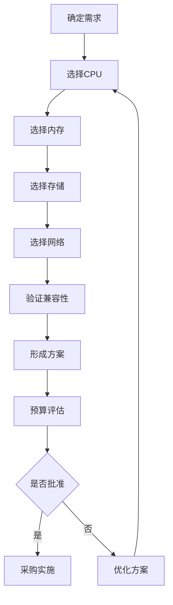

# 硬件规范与选型指南

> **返回**: [虚拟化部署](../README.md) | [部署指南首页](../../00_索引导航/README.md)

---

## 📚 本模块内容

硬件规范模块提供完整的虚拟化硬件选型标准，包括CPU、内存、存储、网络设备的详细选型指南和配置标准。

---

## 📄 文档列表

### ✅ 已完成文档

1. **[CPU处理器选型](01_CPU处理器选型.md)** ✅
   - Intel Xeon全系列对比
   - AMD EPYC处理器推荐
   - 国产处理器支持
   - 按环境规模选型建议
   - 性价比分析

2. **[内存选型指南](02_内存选型.md)** ✅
   - DDR4 vs DDR5对比
   - 内存配置原则
   - 按环境规模选型
   - 内存超额配比策略
   - NUMA优化建议

### 🔄 待完成文档

1. **[存储选型指南](03_存储选型.md)** 🔄
   - HDD/SSD/NVMe对比
   - RAID配置方案
   - 存储控制器选型
   - 性能与成本平衡

2. **[网络设备选型](04_网络设备选型.md)** 🔄
   - 网卡选型（1GbE到100GbE）
   - 交换机选型
   - 网络拓扑设计
   - 品牌对比

3. **[完整硬件配置方案](05_完整硬件配置方案.md)** 🔄
   - 小型环境（¥15万）
   - 中型环境（¥75万）
   - 大型环境（¥538万）
   - 完整BOM清单

4. **[BIOS固件配置](06_BIOS固件配置.md)** 🔄
   - 虚拟化功能启用
   - 电源管理配置
   - NUMA设置
   - 各品牌服务器配置步骤

5. **[硬件兼容性清单](07_硬件兼容性清单.md)** 🔄
   - VMware HCL查询
   - Kubernetes硬件要求
   - 国产化兼容性
   - 硬件测试清单

---

## 🎯 快速选型

### 按预算选型

```yaml
预算¥15万以下:
  → 查看: 完整硬件配置方案 - 小型环境
  适用: <50台虚拟机

预算¥15-80万:
  → 查看: 完整硬件配置方案 - 中型环境
  适用: 50-200台虚拟机

预算¥80万以上:
  → 查看: 完整硬件配置方案 - 大型环境
  适用: >200台虚拟机
```

### 按组件选型

```yaml
选CPU:
  → 查看: CPU处理器选型
  要点: 核心数 > 主频

选内存:
  → 查看: 内存选型指南
  要点: ECC + 对称配置 + 填满通道

选存储:
  → 查看: 存储选型指南
  要点: NVMe优先 + RAID10/RAID6

选网络:
  → 查看: 网络设备选型
  要点: 10GbE起步 + 双链路冗余
```

---

## 📊 选型对比表

### 环境规模对比

| 规模 | VM数量 | CPU | 内存 | 存储 | 网络 | 预算 |
|------|--------|-----|------|------|------|------|
| **小型** | <50 | 2x Silver 4310 | 128GB | 9TB | 10GbE | ¥15万 |
| **中型** | 50-200 | 2x Gold 6326 | 384GB | 34TB | 25GbE | ¥75万 |
| **大型** | >200 | 2x Platinum 8358 | 1.5TB | 100TB+ | 100GbE | ¥538万 |

### 性价比对比

| 品牌 | 性能 | 价格 | 性价比 | 推荐度 |
|------|------|------|--------|--------|
| **Intel** | ⭐⭐⭐⭐⭐ | ⭐⭐⭐ | ⭐⭐⭐⭐ | 稳定可靠 |
| **AMD** | ⭐⭐⭐⭐⭐ | ⭐⭐⭐⭐ | ⭐⭐⭐⭐⭐ | 性价比高 |
| **国产** | ⭐⭐⭐ | ⭐⭐⭐⭐ | ⭐⭐⭐ | 国产化 |

---

## 📝 选型流程

### 标准流程



### 关键决策点

1. **需求分析** (1-2天)
   - 虚拟机数量预估
   - 性能要求评估
   - 预算范围确定

2. **选型设计** (3-5天)
   - CPU选型
   - 内存配置
   - 存储方案
   - 网络架构

3. **兼容性验证** (1-2天)
   - 查询HCL
   - 确认软件兼容
   - 验证驱动支持

4. **方案输出** (1天)
   - BOM清单
   - 拓扑图
   - 预算报告

---

## ⚠️ 注意事项

### 硬件选型原则

✅ **性能优先**: 满足5年使用需求  
✅ **兼容性**: 查询官方HCL  
✅ **冗余设计**: 关键组件双份  
✅ **预留扩展**: 保留20-30%余量  
✅ **标准化**: 同型号便于维护  

### 常见误区

❌ **误区1**: 只看CPU主频，忽略核心数  
✅ **正确**: 虚拟化优先选择多核心

❌ **误区2**: 内存通道没填满  
✅ **正确**: 充分利用所有内存通道

❌ **误区3**: 存储用HDD节省成本  
✅ **正确**: SSD/NVMe是虚拟化基础

❌ **误区4**: 网络只配置1GbE  
✅ **正确**: 10GbE是起步标准

❌ **误区5**: 不查HCL兼容性  
✅ **正确**: 必须查询官方兼容列表

---

## 🔗 相关资源

### 官方资源

- [VMware HCL](https://www.vmware.com/resources/compatibility/search.php)
- [Intel处理器选择工具](https://ark.intel.com/)
- [AMD处理器对比](https://www.amd.com/en/processors/epyc)
- [存储控制器HCL](https://www.vmware.com/resources/compatibility/search.php?deviceCategory=io)

### 内部文档

- [软件安装指南](../02_软件安装/)
- [存储架构设计](../03_存储架构/)
- [网络架构设计](../04_网络架构/)
- [BIOS配置详解](06_BIOS固件配置.md)

---

## 📊 文档状态

| 文档 | 状态 | 更新日期 | 进度 |
|------|------|----------|------|
| CPU选型 | ✅ 已完成 | 2025-10-19 | 100% |
| 内存选型 | ✅ 已完成 | 2025-10-19 | 100% |
| 存储选型 | ✅ 已完成 | 2025-10-19 | 100% |
| 网络设备选型 | ✅ 已完成 | 2025-10-19 | 100% |
| 完整配置方案 | ✅ 已完成 | 2025-10-19 | 100% |
| BIOS配置 | ✅ 已完成 | 2025-10-19 | 100% |
| 硬件兼容性 | ✅ 已完成 | 2025-10-19 | 100% |

**总进度**: 7/7 (100%) ✅ **模块完成！**

---

**模块创建**: 2025-10-19  
**最后更新**: 2025-10-19  
**维护者**: System  
**状态**: ✅ 已完成
