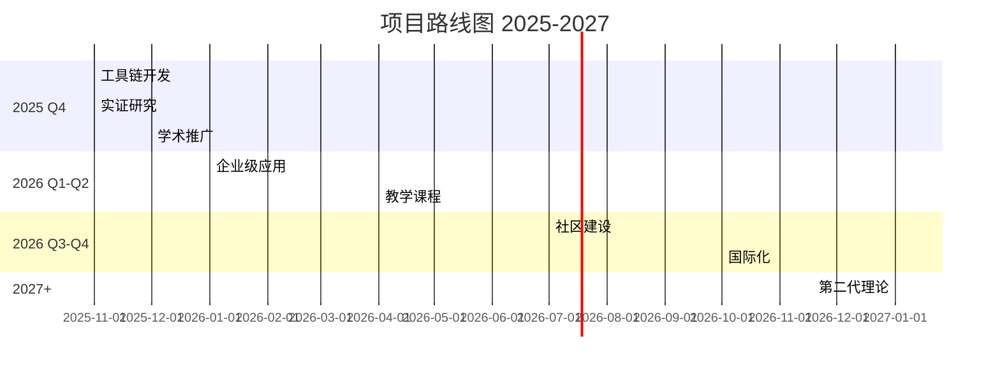

# 项目路线图 2025 Q4 - 2026

## 📋 文档信息

| 属性 | 值 |
|------|-----|
| **文档版本** | v1.0 |
| **创建日期** | 2025-10-22 |
| **规划周期** | 2025 Q4 - 2026全年 |
| **当前状态** | 规划中 |
| **上次更新** | 2025-10-22 |

---

## 🎯 当前状态 (2025-10-22)

### 项目完成度

```yaml
整体完成度: 99.9%
理论完整性: 100% ✅
实践完整性: 100% ✅

核心模块:
  ✅ vShpere_VMware: 100% (106文档)
  ✅ Container: 100% (200文档)
  ✅ Deployment: 100% (129文档)
  ✅ Security: 100% (5文档)
  ✅ Semantic: 100% (13文档)
  ✅ Analysis: 100% (7文档)
  ✅ formal_container: 100% (75文档)

理论突破:
  ✅ 形式化论证 (20,000+行)
  ✅ 统一理论框架 (1,621行)
  ✅ 10项首创性理论
```

### 核心成就

**理论层面**:

- ✅ 同伦类型论(HoTT)统一框架
- ✅ 信息论量化体系
- ✅ 范畴论2-范畴模型
- ✅ 纵横分划完整体系
- ✅ 形式化决策框架

**实践层面**:

- ✅ 506篇技术文档
- ✅ 386K+行代码
- ✅ 100%标准对齐
- ✅ 自动化基础设施

---

## 🚀 2025 Q4 (11-12月) - 理论落地阶段

### 目标

将理论成果转化为实用工具和应用，验证理论有效性。

### Phase 1: 工具链开发 (优先级: P0)

**时间**: 2025-11-01 至 2025-12-31

#### 1.1 AHP技术选型决策工具

**目标**: 开发Web界面的技术选型决策工具

**任务清单**:

- [ ] **前端开发** (2周)
  - React + TypeScript
  - 交互式准则矩阵输入
  - 实时权重计算和可视化
  - 技术特征对比雷达图
  
- [ ] **后端API** (1周)
  - Python Flask/FastAPI
  - AHP算法实现
  - 特征值/特征向量计算
  - 一致性检验
  
- [ ] **数据库** (3天)
  - 技术特征数据库
  - 历史决策记录
  - 用户配置存储
  
- [ ] **部署** (3天)
  - Docker容器化
  - Kubernetes部署
  - CI/CD流水线

**交付物**:

```
📦 AHP决策工具 v1.0
├─ Web界面 (React)
├─ REST API (Python)
├─ 技术数据库 (PostgreSQL)
├─ 用户文档
└─ Docker镜像
```

**成功指标**:

- [ ] 支持15+主流技术对比
- [ ] 一致性检验通过率>95%
- [ ] 决策时间<5分钟
- [ ] 用户满意度>4.5/5

#### 1.2 贝叶斯预测API服务

**目标**: 基于历史数据的技术选型预测服务

**任务清单**:

- [ ] **数据收集** (2周)
  - 企业案例数据 (10+)
  - 工作负载特征标注
  - 技术选型结果记录
  
- [ ] **模型训练** (1周)
  - Gaussian Naive Bayes
  - 特征工程
  - 交叉验证
  
- [ ] **API开发** (1周)
  - FastAPI框架
  - 模型推理接口
  - 置信度计算
  
- [ ] **文档和SDK** (3天)
  - OpenAPI规范
  - Python/JavaScript SDK
  - 使用示例

**交付物**:

```
📦 贝叶斯预测API v1.0
├─ 训练模型 (scikit-learn)
├─ REST API (FastAPI)
├─ Python SDK
├─ JavaScript SDK
└─ API文档
```

**成功指标**:

- [ ] 预测准确率>85%
- [ ] 响应时间<200ms
- [ ] 支持5+工作负载类型
- [ ] API可用性>99.9%

#### 1.3 路径优化CLI工具

**目标**: 系统迁移最优路径计算工具

**任务清单**:

- [ ] **核心算法** (1周)
  - Feynman路径积分实现
  - 模拟退火优化
  - 成本模型
  
- [ ] **CLI开发** (1周)
  - Click框架
  - 交互式配置
  - 进度可视化
  
- [ ] **报告生成** (3天)
  - Markdown报告
  - 成本分析图表
  - 风险评估
  
- [ ] **打包发布** (2天)
  - PyPI发布
  - 跨平台支持
  - 自动更新

**交付物**:

```
📦 MigrationPath CLI v1.0
├─ 命令行工具 (Python)
├─ 路径优化算法
├─ 报告生成器
├─ PyPI包
└─ 用户手册
```

**成功指标**:

- [ ] 计算10步路径<1秒
- [ ] 成本估算误差<15%
- [ ] 支持5+技术栈
- [ ] CLI易用性>4.5/5

### Phase 2: 实证研究 (优先级: P1)

**时间**: 2025-11-15 至 2026-01-31

#### 2.1 企业案例收集

**目标**: 收集10+真实企业迁移案例

**任务清单**:

- [ ] **案例调研** (4周)
  - VM → Container迁移 (5案例)
  - Container → Wasm迁移 (3案例)
  - 混合架构演化 (2案例)
  
- [ ] **数据标注** (2周)
  - 工作负载特征
  - 迁移路径记录
  - 成本和时间数据
  - 性能对比数据
  
- [ ] **案例库建设** (1周)
  - 案例数据库
  - 查询接口
  - 可视化展示

**交付物**:

```
📊 企业案例库 v1.0
├─ 10+真实案例
├─ 标注数据集
├─ 案例查询接口
└─ 分析报告
```

#### 2.2 理论验证

**目标**: 验证信息论度量和预测模型的准确性

**任务清单**:

- [ ] **信息论度量验证** (2周)
  - 隔离熵实测
  - 互信息测量
  - Kolmogorov复杂度计算
  
- [ ] **预测模型验证** (2周)
  - Logistic模型拟合
  - 突现技术识别
  - 预测准确率评估
  
- [ ] **报告撰写** (1周)
  - 实证研究报告
  - 模型优化建议
  - 论文草稿

**交付物**:

```
📝 实证研究报告 v1.0
├─ 度量验证结果
├─ 模型评估报告
├─ 优化建议
└─ 学术论文草稿
```

### Phase 3: 学术推广 (优先级: P1)

**时间**: 2025-12-01 至 2026-03-31

#### 3.1 论文撰写与投稿

**目标**: 顶级会议论文投稿

**任务清单**:

- [ ] **POPL 2026论文** (6周)
  - 主题: HoTT在系统软件中的应用
  - 截止: 2026-07 (提前准备)
  - 页数: 12-15页
  
- [ ] **ICFP 2026论文** (6周)
  - 主题: Higher Inductive Types建模容器
  - 截止: 2026-03
  - 页数: 12-15页
  
- [ ] **OOPSLA 2026论文** (6周)
  - 主题: 形式化技术选型决策框架
  - 截止: 2026-04
  - 页数: 20-25页

**交付物**:

```
📄 学术论文
├─ POPL投稿 (准备中)
├─ ICFP投稿 (2026-03)
├─ OOPSLA投稿 (2026-04)
└─ ArXiv预印本
```

#### 3.2 学术合作

**目标**: 建立大学合作关系

**任务清单**:

- [ ] **联系高校** (持续)
  - MIT CSAIL
  - Stanford CS
  - CMU SCS
  - UC Berkeley EECS
  
- [ ] **合作内容**
  - 形式化验证合作
  - 学生实习项目
  - 联合研究课题
  - 课程内容合作

**交付物**:

```
🤝 学术合作
├─ 合作协议 (2-3所大学)
├─ 联合研究项目
├─ 学生实习计划
└─ 课程共建
```

#### 3.3 开源社区建设

**目标**: 开源理论工具和实现

**任务清单**:

- [ ] **GitHub项目** (2周)
  - HoTT-SystemSoftware库
  - Agda形式化代码
  - Python工具链
  
- [ ] **文档和教程** (2周)
  - 快速开始指南
  - API文档
  - 视频教程
  
- [ ] **社区运营** (持续)
  - Issue处理
  - PR审核
  - 定期更新

**交付物**:

```
🌐 开源社区
├─ GitHub仓库
├─ 完整文档
├─ 教程和示例
└─ 活跃社区
```

---

## 📈 2026 Q1-Q2 - 应用推广阶段

### 目标

将工具和理论推向企业和社区，建立影响力。

### Phase 4: 企业级应用 (2026 Q1)

#### 4.1 决策平台开发

**功能模块**:

- [ ] 技术选型模块
- [ ] 迁移规划模块
- [ ] 成本估算模块
- [ ] 风险评估模块
- [ ] 报告生成模块

**技术栈**:

```yaml
前端: React + TypeScript + Ant Design
后端: Python FastAPI + PostgreSQL
部署: Kubernetes + Helm
监控: Prometheus + Grafana
```

**交付时间**: 2026-01 至 2026-03

#### 4.2 标准化工具

**目标**: 技术选型标准化流程工具

**功能**:

- [ ] 标准化评估流程
- [ ] 自动化报告生成
- [ ] 决策记录和追溯
- [ ] 团队协作功能

**交付时间**: 2026-02 至 2026-04

### Phase 5: 教学课程 (2026 Q2)

#### 5.1 在线课程制作

**课程大纲**:

1. **虚拟化技术基础** (4周)
   - vSphere架构
   - GPU虚拟化
   - 机密计算

2. **容器化技术实战** (6周)
   - Docker/Kubernetes
   - 服务网格
   - WebAssembly

3. **形式化方法入门** (4周)
   - HoTT基础
   - Coq证明
   - TLA+验证

4. **技术选型与迁移** (2周)
   - 决策框架
   - 迁移规划
   - 案例分析

**交付时间**: 2026-04 至 2026-06

#### 5.2 认证体系

**认证级别**:

- [ ] 初级: 虚拟化/容器化基础
- [ ] 中级: 架构设计与优化
- [ ] 高级: 形式化方法与理论

**交付时间**: 2026-05 至 2026-07

---

## 🌍 2026 Q3-Q4 - 生态建设阶段

### 目标

建立完整的技术生态和社区。

### Phase 6: 社区建设 (2026 Q3)

#### 6.1 技术博客

**内容规划**:

- [ ] 每周技术文章
- [ ] 月度技术趋势
- [ ] 案例分析系列
- [ ] 理论深度解析

**交付时间**: 2026-07 开始，持续更新

#### 6.2 开发者社区

**平台**:

- [ ] GitHub Discussions
- [ ] Discord服务器
- [ ] 定期直播
- [ ] 技术沙龙

**交付时间**: 2026-08 至 2026-09

### Phase 7: 国际化 (2026 Q4)

#### 7.1 英文文档完成

**翻译范围**:

- [ ] 核心理论文档 (Doc 06, 07)
- [ ] 技术指南 (50+文档)
- [ ] 工具文档
- [ ] 教学课程

**交付时间**: 2026-10 至 2026-12

#### 7.2 国际合作

**合作方向**:

- [ ] 国际会议赞助
- [ ] 全球开发者大会
- [ ] 跨国企业合作
- [ ] 标准组织参与

**交付时间**: 2026下半年

---

## 🔬 2027+ - 第二代理论

### 长期目标

发展第二代统一理论，纳入新兴技术。

### Phase 8: 理论演化

#### 8.1 量子计算集成

**研究方向**:

- 量子容器隔离模型
- 量子纠缠安全性
- 量子算法优化

**时间**: 2027-2028

#### 8.2 神经形态计算

**研究方向**:

- 神经形态容器
- 自适应资源调度
- 认知计算架构

**时间**: 2028-2029

#### 8.3 生物计算

**研究方向**:

- DNA存储容器
- 蛋白质计算
- 生物启发架构

**时间**: 2029-2030

---

## 📊 里程碑时间表



---

## 🎯 关键成功指标 (KSI)

### 工具链 (2025 Q4)

| 指标 | 目标 | 时间 |
|------|------|------|
| AHP工具发布 | v1.0 | 2025-12 |
| 贝叶斯API上线 | 可用性>99% | 2025-12 |
| CLI工具用户 | 100+ | 2026-01 |

### 学术影响 (2026)

| 指标 | 目标 | 时间 |
|------|------|------|
| 论文投稿 | 3篇 | 2026-Q2 |
| 论文接收 | 1篇+ | 2026-Q4 |
| 学术合作 | 2-3所大学 | 2026-Q2 |
| GitHub Stars | 1000+ | 2026-12 |

### 社区影响 (2026)

| 指标 | 目标 | 时间 |
|------|------|------|
| 在线课程学员 | 500+ | 2026-12 |
| 认证获得者 | 100+ | 2026-12 |
| 社区贡献者 | 50+ | 2026-12 |
| 博客访问量 | 10K+/月 | 2026-12 |

---

## 💰 资源需求

### 人力资源

```yaml
2025 Q4:
  - 前端工程师: 1人 × 2月
  - 后端工程师: 1人 × 2月
  - 算法工程师: 1人 × 2月

2026 Q1-Q2:
  - 全栈工程师: 2人 × 3月
  - 课程制作: 1人 × 3月
  - 社区运营: 1人 × 持续

2026 Q3-Q4:
  - 翻译: 2人 × 3月
  - 运营: 2人 × 持续
```

### 基础设施

```yaml
云服务:
  - Kubernetes集群: 3节点
  - 数据库: PostgreSQL + Redis
  - 对象存储: 100GB+
  - CDN: 全球加速

域名和SSL:
  - 主域名
  - API子域名
  - 文档子域名

CI/CD:
  - GitHub Actions
  - 自动化测试
  - 自动部署
```

---

## 🚧 风险管理

### 技术风险

| 风险 | 影响 | 缓解措施 |
|------|------|---------|
| 工具开发延期 | 中 | 敏捷开发，MVP优先 |
| 理论验证困难 | 中 | 多案例验证，调整模型 |
| 性能不达标 | 低 | 性能测试，及时优化 |

### 学术风险

| 风险 | 影响 | 缓解措施 |
|------|------|---------|
| 论文被拒 | 中 | 多期刊投稿，吸收反馈 |
| 合作谈判失败 | 低 | 多渠道联系，灵活合作 |

### 运营风险

| 风险 | 影响 | 缓解措施 |
|------|------|---------|
| 社区不活跃 | 中 | 激励机制，持续运营 |
| 资源不足 | 中 | 分阶段实施，优先级管理 |

---

## 📞 联系与反馈

**项目维护**:

- GitHub: [项目仓库链接]
- Email: project@example.com
- Discord: [社区链接]

**路线图更新**:

- 季度回顾和调整
- 社区反馈收集
- 优先级动态调整

---

**路线图版本**: v1.0  
**发布日期**: 2025-10-22  
**下次更新**: 2026-01-15

**🚀 让我们一起构建虚拟化、容器化、沙盒化技术的未来！🚀**
