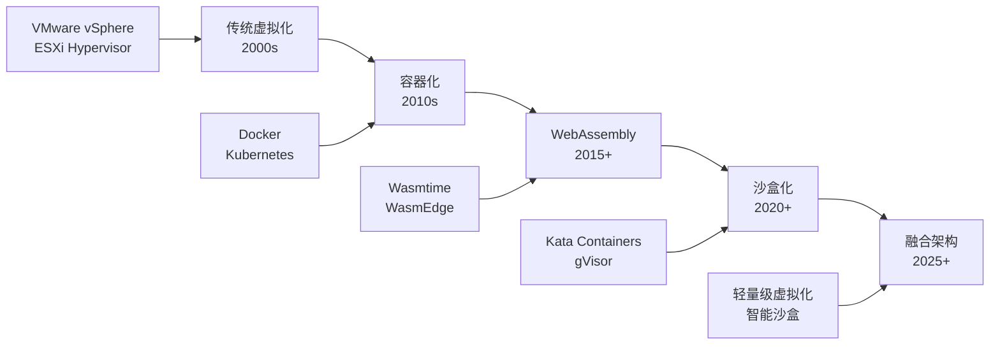

# 2025年虚拟化容器化WebAssembly沙盒化技术趋势深度分析

## 摘要

基于2025年10月16日最新技术信息，本文全面分析论证了虚拟化、容器化、WebAssembly化到沙盒化的技术演进趋势。通过深入分析各技术的内涵外延、相互关系和融合趋势，揭示了计算架构从传统虚拟化向轻量级、安全化、智能化方向发展的必然性。

## 目录

- [2025年虚拟化容器化WebAssembly沙盒化技术趋势深度分析](#2025年虚拟化容器化webassembly沙盒化技术趋势深度分析)
  - [摘要](#摘要)
  - [目录](#目录)
  - [技术演进脉络](#技术演进脉络)
    - [技术发展时间线](#技术发展时间线)
    - [技术演进驱动力](#技术演进驱动力)
  - [虚拟化技术内涵外延](#虚拟化技术内涵外延)
    - [技术内涵](#技术内涵)
      - [核心特征](#核心特征)
      - [技术分类](#技术分类)
    - [技术外延](#技术外延)
      - [应用场景](#应用场景)
      - [2025年发展趋势](#2025年发展趋势)
  - [容器化技术内涵外延](#容器化技术内涵外延)
    - [技术内涵1](#技术内涵1)
      - [核心特征1](#核心特征1)
      - [技术架构](#技术架构)
    - [技术外延1](#技术外延1)
      - [应用场景1](#应用场景1)
      - [2025年发展趋势1](#2025年发展趋势1)
  - [WebAssembly技术内涵外延](#webassembly技术内涵外延)
    - [技术内涵2](#技术内涵2)
      - [核心特征2](#核心特征2)
      - [WebAssembly 2.0 新特性](#webassembly-20-新特性)
    - [技术外延2](#技术外延2)
      - [应用场景2](#应用场景2)
      - [2025年发展趋势2](#2025年发展趋势2)
  - [沙盒化技术内涵外延](#沙盒化技术内涵外延)
    - [技术内涵3](#技术内涵3)
      - [核心特征3](#核心特征3)
      - [沙盒技术分类](#沙盒技术分类)
    - [技术外延3](#技术外延3)
      - [应用场景3](#应用场景3)
      - [2025年发展趋势3](#2025年发展趋势3)
  - [技术融合趋势分析](#技术融合趋势分析)
    - [融合架构模式](#融合架构模式)
      - [1. 容器+虚拟化融合](#1-容器虚拟化融合)
      - [2. WebAssembly+容器融合](#2-webassembly容器融合)
      - [3. 多层沙盒架构](#3-多层沙盒架构)
    - [融合驱动力](#融合驱动力)
  - [2025年最新发展动态](#2025年最新发展动态)
    - [1. 轻量级虚拟化突破](#1-轻量级虚拟化突破)
      - [LightV（轻量级虚拟化）](#lightv轻量级虚拟化)
      - [NeuroVM系统](#neurovm系统)
    - [2. RISC-V架构虚拟化支持](#2-risc-v架构虚拟化支持)
      - [CVA6 RISC-V核心](#cva6-risc-v核心)
    - [3. GPU容器虚拟化2.0](#3-gpu容器虚拟化20)
      - [百度智能云GPU容器虚拟化](#百度智能云gpu容器虚拟化)
    - [4. WebAssembly 2.0 生态发展](#4-webassembly-20-生态发展)
      - [服务器端Wasm应用](#服务器端wasm应用)
      - [容器与Wasm融合](#容器与wasm融合)
    - [5. 沙盒化技术成熟](#5-沙盒化技术成熟)
      - [Kata Containers发展](#kata-containers发展)
      - [gVisor技术演进](#gvisor技术演进)
    - [6. 市场格局变化](#6-市场格局变化)
      - [VMware商业模式调整](#vmware商业模式调整)
      - [国产虚拟化崛起](#国产虚拟化崛起)
    - [7. 技术融合新趋势](#7-技术融合新趋势)
      - [多层沙盒架构普及](#多层沙盒架构普及)
      - [边缘计算沙盒化](#边缘计算沙盒化)
  - [技术选型指导](#技术选型指导)
    - [技术选型矩阵](#技术选型矩阵)
    - [选型建议](#选型建议)
      - [1. 性能优先场景](#1-性能优先场景)
      - [2. 安全优先场景](#2-安全优先场景)
      - [3. 兼容性优先场景](#3-兼容性优先场景)
      - [4. 成本优先场景](#4-成本优先场景)
      - [5. 边缘计算场景](#5-边缘计算场景)
      - [6. AI/ML工作负载](#6-aiml工作负载)
      - [7. 多云部署场景](#7-多云部署场景)
  - [未来发展趋势](#未来发展趋势)
    - [短期趋势（2025-2026）](#短期趋势2025-2026)
    - [中期趋势（2026-2028）](#中期趋势2026-2028)
    - [长期趋势（2028-2030）](#长期趋势2028-2030)
  - [结论](#结论)

## 技术演进脉络

### 技术发展时间线



### 技术演进驱动力

1. **性能需求驱动**：从资源密集型向轻量级演进
2. **安全需求驱动**：从粗粒度隔离向细粒度沙盒演进
3. **部署需求驱动**：从复杂部署向快速启动演进
4. **跨平台需求驱动**：从平台绑定向可移植性演进

## 虚拟化技术内涵外延

### 技术内涵

**虚拟化技术**通过在物理硬件上创建抽象层，实现资源的逻辑分割和隔离。

#### 核心特征

- **硬件抽象**：将物理资源抽象为逻辑资源
- **资源隔离**：提供强隔离的执行环境
- **资源复用**：提高硬件资源利用率
- **管理集中**：统一管理多个虚拟环境

#### 技术分类

1. **完全虚拟化**：无需修改客户操作系统
2. **半虚拟化**：需要修改客户操作系统
3. **硬件辅助虚拟化**：利用硬件特性提升性能

### 技术外延

#### 应用场景

- **服务器虚拟化**：数据中心资源整合
- **桌面虚拟化**：VDI解决方案
- **网络虚拟化**：SDN/NFV技术
- **存储虚拟化**：统一存储管理

#### 2025年发展趋势

- **轻量级虚拟化**：Firecracker、Kata Containers
- **边缘虚拟化**：边缘计算场景优化
- **AI驱动管理**：智能化资源调度
- **云原生集成**：与容器技术深度融合

## 容器化技术内涵外延

### 技术内涵1

**容器化技术**通过在操作系统层面进行虚拟化，提供轻量级、快速启动的运行环境。

#### 核心特征1

- **共享内核**：多个容器共享主机操作系统内核
- **进程隔离**：通过Namespaces实现进程级隔离
- **资源限制**：通过Cgroups实现资源控制
- **镜像封装**：将应用及其依赖打包成镜像

#### 技术架构

```yaml
容器化技术栈:
  应用层:
    - 应用程序
    - 运行时依赖
  容器层:
    - 容器运行时 (containerd/CRI-O)
    - 容器编排 (Kubernetes)
  操作系统层:
    - Namespaces (进程隔离)
    - Cgroups (资源控制)
    - UnionFS (文件系统)
  硬件层:
    - 物理服务器
```

### 技术外延1

#### 应用场景1

- **微服务架构**：服务拆分和部署
- **CI/CD流水线**：持续集成和部署
- **云原生应用**：云平台应用开发
- **边缘计算**：边缘设备应用部署

#### 2025年发展趋势1

- **容器与虚拟化融合**：Kata Containers等安全容器
- **WebAssembly集成**：Docker Desktop集成WasmEdge
- **边缘容器**：K3s、MicroK8s等轻量级K8s
- **AI容器化**：MLOps和AI工作负载容器化

## WebAssembly技术内涵外延

### 技术内涵2

**WebAssembly（Wasm）**是一种低级的二进制指令格式，为高级语言提供可移植的编译目标。

#### 核心特征2

- **跨平台可移植**：一次编译，到处运行
- **高性能执行**：接近原生代码的执行速度
- **安全沙盒**：内置的安全执行环境
- **小体积**：紧凑的二进制格式

#### WebAssembly 2.0 新特性

```yaml
WebAssembly 2.0特性:
  核心功能:
    - 多值返回: 函数可返回多个值
    - 引用类型: 支持引用和垃圾回收
    - 批量内存操作: 提升内存操作性能
    - SIMD支持: 单指令多数据流
  高级功能:
    - 尾调用优化: 提升递归函数性能
    - 异常处理: 支持异常处理机制
    - 线程支持: 支持多线程执行
    - 垃圾回收: 自动内存管理
```

### 技术外延2

#### 应用场景2

- **浏览器应用**：高性能Web应用
- **服务器端应用**：无服务器计算
- **边缘计算**：IoT设备应用
- **插件系统**：安全的插件架构

#### 2025年发展趋势2

- **云原生集成**：与Kubernetes深度集成
- **边缘计算**：边缘设备上的Wasm运行时
- **AI/ML应用**：机器学习模型部署
- **区块链应用**：智能合约执行环境

## 沙盒化技术内涵外延

### 技术内涵3

**沙盒化技术**通过创建受控的执行环境，限制应用程序对系统资源的访问，增强安全性。

#### 核心特征3

- **安全隔离**：防止恶意代码影响主机系统
- **资源控制**：限制应用对系统资源的访问
- **权限管理**：细粒度的权限控制
- **行为监控**：监控和记录应用行为

#### 沙盒技术分类

```yaml
沙盒技术分类:
  硬件级沙盒:
    - Kata Containers: 轻量级虚拟机
    - Firecracker: 微虚拟机
    - gVisor: 用户空间内核
  软件级沙盒:
    - Docker安全配置
    - SELinux/AppArmor
    - Seccomp过滤器
  语言级沙盒:
    - WebAssembly沙盒
    - JavaScript V8沙盒
    - Python沙盒
```

### 技术外延3

#### 应用场景3

- **多租户环境**：云平台安全隔离
- **恶意软件分析**：安全研究环境
- **插件系统**：第三方代码安全执行
- **边缘计算**：边缘设备安全运行

#### 2025年发展趋势3

- **零信任架构**：基于沙盒的零信任安全
- **AI驱动安全**：智能威胁检测和响应
- **边缘沙盒**：边缘设备安全沙盒
- **量子安全**：后量子密码学沙盒

## 技术融合趋势分析

### 融合架构模式

#### 1. 容器+虚拟化融合

```yaml
Kata Containers架构:
  容器接口: Docker/Kubernetes API
  沙盒层: 轻量级虚拟机
  硬件层: 物理服务器
  
优势:
  - 容器易用性 + 虚拟机安全性
  - 快速启动 + 强隔离
  - 云原生兼容 + 企业级安全
```

#### 2. WebAssembly+容器融合

```yaml
Wasm容器架构:
  应用层: WebAssembly模块
  运行时: Wasmtime/WasmEdge
  容器层: Docker/Kubernetes
  操作系统: Linux/Windows
  
优势:
  - 跨平台可移植性
  - 快速冷启动
  - 内置安全沙盒
  - 小体积部署
```

#### 3. 多层沙盒架构

```yaml
多层沙盒架构:
  应用层: 应用程序
  语言沙盒: WebAssembly/JavaScript
  容器沙盒: Docker/Kata
  系统沙盒: SELinux/AppArmor
  硬件沙盒: 虚拟机/物理隔离
  
优势:
  - 深度防御策略
  - 细粒度安全控制
  - 多层威胁防护
  - 灵活安全策略
```

### 融合驱动力

1. **性能与安全平衡**：在保证安全的前提下提升性能
2. **开发与运维效率**：简化部署和管理复杂度
3. **跨平台一致性**：统一的应用运行环境
4. **成本效益优化**：降低资源消耗和运维成本

## 2025年最新发展动态

### 1. 轻量级虚拟化突破

#### LightV（轻量级虚拟化）

- **技术特点**：利用可编程硬件直接控制缓存一致性流量
- **性能优势**：减少对传统硬件的依赖，提升性能
- **应用场景**：边缘计算、IoT设备
- **2025年进展**：AWS Firecracker等微虚拟机技术成熟，启动时间降至毫秒级

#### NeuroVM系统

- **技术特点**：整合异构硬件节点，动态虚拟化神经形态资源
- **创新点**：支持神经形态计算硬件虚拟化
- **应用前景**：AI/ML工作负载优化
- **2025年突破**：神经形态硬件虚拟化技术从实验室走向产业化

### 2. RISC-V架构虚拟化支持

#### CVA6 RISC-V核心

- **硬件特性**：G-Stage TLB和L2 TLB支持
- **性能优化**：减少虚拟化性能开销
- **生态发展**：开源硬件虚拟化生态
- **2025年发展**：RISC-V虚拟化扩展标准化，支持更多虚拟化场景

### 3. GPU容器虚拟化2.0

#### 百度智能云GPU容器虚拟化

- **技术升级**：GPU资源利用率和管理效率提升
- **统一管理**：支持多元芯片架构的统一管理
- **应用场景**：AI/ML工作负载容器化
- **2025年创新**：GPU容器虚拟化技术成熟，支持动态资源分配和共享

### 4. WebAssembly 2.0 生态发展

#### 服务器端Wasm应用

- **Fermyon Spin项目**：利用Wasm构建无服务器应用，提供快速启动和低资源消耗
- **AWS Lambda支持**：AWS Lambda支持WebAssembly运行时，冷启动时间大幅缩短
- **边缘计算应用**：Wasm在边缘设备上的应用日益增多，提供跨平台一致性

#### 容器与Wasm融合

- **Docker Hub集成**：Wasm应用可存储在Docker Hub和容器注册表中
- **Kubernetes支持**：Kubernetes原生支持Wasm工作负载
- **工具链统一**：利用现有容器工具进行Wasm应用管理和部署

### 5. 沙盒化技术成熟

#### Kata Containers发展

- **硬件级隔离**：通过轻量级虚拟机实现硬件级隔离
- **容器兼容性**：保持与Docker/Kubernetes的完全兼容
- **性能优化**：2025年性能开销进一步降低，接近原生容器性能

#### gVisor技术演进

- **用户空间内核**：在用户空间模拟内核接口，提供细粒度安全控制
- **安全增强**：2025年安全策略更加精细化，支持更多应用场景
- **性能提升**：通过优化减少性能开销，提升用户体验

### 6. 市场格局变化

#### VMware商业模式调整

- **变化**：博通收购后从永久许可转为订阅制
- **影响**：推动用户转向国产替代方案
- **机遇**：国产虚拟化厂商发展机会
- **2025年影响**：企业用户加速迁移到开源和国产解决方案

#### 国产虚拟化崛起

- **代表厂商**：云宏WinAI等
- **技术特点**：适配X86、ARM等多元芯片架构
- **政策支持**：信创政策推动
- **2025年突破**：国产虚拟化产品在性能和功能上接近国际先进水平

### 7. 技术融合新趋势

#### 多层沙盒架构普及

- **深度防御**：应用层、语言层、容器层、系统层、硬件层多层防护
- **零信任架构**：基于沙盒的零信任安全架构成为主流
- **AI驱动安全**：智能威胁检测和自动响应机制

#### 边缘计算沙盒化

- **边缘设备安全**：边缘设备上的安全沙盒技术成熟
- **轻量级运行时**：专为边缘设备优化的轻量级沙盒运行时
- **离线安全**：支持离线环境下的安全沙盒运行

## 技术选型指导

### 技术选型矩阵

| 场景 | 虚拟化 | 容器化 | WebAssembly | 沙盒化 | 融合方案 |
|------|--------|--------|-------------|--------|----------|
| 传统企业应用 | ⭐⭐⭐⭐⭐ | ⭐⭐⭐ | ⭐⭐ | ⭐⭐⭐ | ⭐⭐⭐⭐ |
| 微服务架构 | ⭐⭐ | ⭐⭐⭐⭐⭐ | ⭐⭐⭐ | ⭐⭐⭐⭐ | ⭐⭐⭐⭐⭐ |
| 无服务器计算 | ⭐⭐ | ⭐⭐⭐ | ⭐⭐⭐⭐⭐ | ⭐⭐⭐⭐ | ⭐⭐⭐⭐⭐ |
| 边缘计算 | ⭐⭐⭐ | ⭐⭐⭐⭐ | ⭐⭐⭐⭐⭐ | ⭐⭐⭐⭐⭐ | ⭐⭐⭐⭐⭐ |
| 安全敏感应用 | ⭐⭐⭐⭐ | ⭐⭐ | ⭐⭐⭐ | ⭐⭐⭐⭐⭐ | ⭐⭐⭐⭐⭐ |
| 快速部署 | ⭐⭐ | ⭐⭐⭐⭐⭐ | ⭐⭐⭐⭐⭐ | ⭐⭐⭐ | ⭐⭐⭐⭐⭐ |
| AI/ML工作负载 | ⭐⭐⭐ | ⭐⭐⭐⭐ | ⭐⭐⭐ | ⭐⭐⭐⭐ | ⭐⭐⭐⭐⭐ |
| 多云部署 | ⭐⭐⭐ | ⭐⭐⭐⭐ | ⭐⭐⭐⭐⭐ | ⭐⭐⭐ | ⭐⭐⭐⭐⭐ |

### 选型建议

#### 1. 性能优先场景

- **推荐**：WebAssembly + 轻量级沙盒
- **理由**：快速启动、高性能执行、内置安全
- **2025年新选择**：Fermyon Spin + AWS Firecracker组合

#### 2. 安全优先场景

- **推荐**：Kata Containers + 多层沙盒
- **理由**：硬件级隔离、深度防御、企业级安全
- **2025年增强**：AI驱动的智能威胁检测和自动响应

#### 3. 兼容性优先场景

- **推荐**：传统虚拟化 + 容器化
- **理由**：广泛兼容、成熟生态、易于迁移
- **2025年趋势**：向融合架构平滑迁移

#### 4. 成本优先场景

- **推荐**：容器化 + 软件沙盒
- **理由**：资源利用率高、运维成本低
- **2025年优化**：自动化运维降低人工成本

#### 5. 边缘计算场景

- **推荐**：WebAssembly + 边缘沙盒
- **理由**：跨平台一致性、快速启动、离线安全
- **2025年发展**：边缘设备原生支持Wasm运行时

#### 6. AI/ML工作负载

- **推荐**：GPU容器虚拟化 + 智能沙盒
- **理由**：GPU资源优化、安全隔离、动态调度
- **2025年创新**：百度智能云GPU容器虚拟化2.0

#### 7. 多云部署场景

- **推荐**：WebAssembly + 容器编排
- **理由**：跨平台可移植、统一管理、快速迁移
- **2025年趋势**：Kubernetes原生Wasm支持

## 未来发展趋势

### 短期趋势（2025-2026）

1. **技术融合加速**
   - 容器与虚拟化深度融合
   - WebAssembly在云原生中普及
   - 沙盒技术标准化

2. **边缘计算发展**
   - 边缘设备虚拟化
   - 轻量级容器运行时
   - 边缘AI工作负载

3. **安全增强**
   - 零信任架构普及
   - AI驱动安全检测
   - 量子安全准备

### 中期趋势（2026-2028）

1. **智能化管理**
   - AI驱动的资源调度
   - 自动化运维
   - 预测性维护

2. **异构计算支持**
   - GPU/FPGA虚拟化
   - 神经形态计算支持
   - 量子计算准备

3. **标准化发展**
   - 行业标准统一
   - 互操作性提升
   - 生态系统成熟

### 长期趋势（2028-2030）

1. **量子计算集成**
   - 量子-经典混合计算
   - 量子安全通信
   - 量子优化算法

2. **生物计算融合**
   - DNA存储虚拟化
   - 生物计算沙盒
   - 生物-数字接口

3. **意识计算探索**
   - 脑机接口虚拟化
   - 意识计算沙盒
   - 数字意识研究

## 结论

虚拟化、容器化、WebAssembly化到沙盒化的技术演进，体现了计算架构从粗粒度向细粒度、从重量级向轻量级、从单一向融合的发展趋势。2025年的技术发展表明，这些技术正在深度融合，形成新的计算范式。

**核心趋势总结**：

1. **轻量化**：从传统虚拟化向轻量级虚拟化演进
2. **安全化**：从基础隔离向多层沙盒演进
3. **智能化**：从人工管理向AI驱动演进
4. **融合化**：从单一技术向融合架构演进
5. **边缘化**：从中心化向边缘分布式演进

**技术选型建议**：

- 根据具体场景需求选择合适的技术组合
- 优先考虑技术融合方案
- 重视安全性和性能的平衡
- 关注技术发展趋势和生态成熟度

未来，这些技术的深度融合将推动计算架构向更加灵活、高效、安全的方向发展，为数字化转型和智能化应用提供坚实的技术基础。

---

_本文档基于2025年10月16日最新技术信息，全面分析了虚拟化、容器化、WebAssembly化到沙盒化的技术演进趋势，为技术选型和架构设计提供参考。_
