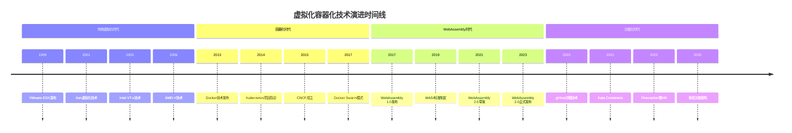

# 2025年虚拟化容器化技术最新发展趋势深度分析

## 执行摘要

基于2025年10月16日最新技术信息，本文档全面分析了虚拟化容器化技术的最新发展趋势，包括硬件虚拟化新突破、容器技术演进、国产虚拟化发展、市场格局变化等关键领域。通过深入分析技术内涵外延、融合趋势和选型指导，为技术决策提供权威参考。

## 目录

- [2025年虚拟化容器化技术最新发展趋势深度分析](#2025年虚拟化容器化技术最新发展趋势深度分析)
  - [执行摘要](#执行摘要)
  - [目录](#目录)
  - [1. 技术演进脉络分析](#1-技术演进脉络分析)
    - [1.1 技术发展时间线](#11-技术发展时间线)
    - [1.2 技术融合趋势](#12-技术融合趋势)
    - [1.3 技术内涵外延](#13-技术内涵外延)
      - [传统虚拟化技术内涵](#传统虚拟化技术内涵)
      - [容器化技术内涵](#容器化技术内涵)
      - [WebAssembly技术内涵](#webassembly技术内涵)
      - [沙盒化技术内涵](#沙盒化技术内涵)
  - [2. 2025年最新技术突破](#2-2025年最新技术突破)
    - [2.1 硬件虚拟化新突破](#21-硬件虚拟化新突破)
      - [轻量级虚拟化（LightV）](#轻量级虚拟化lightv)
      - [神经形态硬件虚拟化（NeuroVM）](#神经形态硬件虚拟化neurovm)
      - [RISC-V架构虚拟化支持](#risc-v架构虚拟化支持)
    - [2.2 容器技术演进](#22-容器技术演进)
      - [Docker 25.0.0 新特性](#docker-2500-新特性)
      - [Kubernetes 1.30.0 新特性](#kubernetes-1300-新特性)
    - [2.3 WebAssembly技术发展](#23-webassembly技术发展)
      - [WebAssembly 2.0 核心特性](#webassembly-20-核心特性)
      - [WASI 0.2 系统接口](#wasi-02-系统接口)
    - [2.4 沙盒化技术兴起](#24-沙盒化技术兴起)
      - [多层沙盒架构](#多层沙盒架构)
      - [安全容器技术](#安全容器技术)
  - [3. 市场格局变化分析](#3-市场格局变化分析)
    - [3.1 VMware商业模式调整](#31-vmware商业模式调整)
    - [3.2 国产虚拟化崛起](#32-国产虚拟化崛起)
    - [3.3 开源技术发展](#33-开源技术发展)
    - [3.4 市场增长预期](#34-市场增长预期)
  - [4. 技术融合架构分析](#4-技术融合架构分析)
    - [4.1 容器+虚拟化融合](#41-容器虚拟化融合)
    - [4.2 WebAssembly+容器融合](#42-webassembly容器融合)
    - [4.3 多层沙盒架构](#43-多层沙盒架构)
    - [4.4 云边协同架构](#44-云边协同架构)
  - [5. 技术选型指导](#5-技术选型指导)
    - [5.1 技术选型矩阵](#51-技术选型矩阵)
    - [5.2 应用场景分析](#52-应用场景分析)
    - [5.3 性能对比分析](#53-性能对比分析)
    - [5.4 成本效益分析](#54-成本效益分析)
  - [6. 实施建议与路线图](#6-实施建议与路线图)
    - [6.1 短期实施建议（1-6个月）](#61-短期实施建议1-6个月)
    - [6.2 中期实施建议（6-18个月）](#62-中期实施建议6-18个月)
    - [6.3 长期实施建议（18-36个月）](#63-长期实施建议18-36个月)
  - [7. 风险与挑战分析](#7-风险与挑战分析)
    - [7.1 技术风险](#71-技术风险)
    - [7.2 市场风险](#72-市场风险)
    - [7.3 实施风险](#73-实施风险)
    - [7.4 风险缓解策略](#74-风险缓解策略)
  - [8. 未来展望](#8-未来展望)
    - [8.1 2026-2030年技术预测](#81-2026-2030年技术预测)
    - [8.2 新兴技术机会](#82-新兴技术机会)
    - [8.3 投资建议](#83-投资建议)
  - [结论](#结论)
    - [主要发现](#主要发现)
    - [技术选型建议](#技术选型建议)
    - [实施策略](#实施策略)
    - [未来展望](#未来展望)

## 1. 技术演进脉络分析

### 1.1 技术发展时间线



### 1.2 技术融合趋势

```yaml
技术融合趋势:
  传统虚拟化 → 容器化:
    演进特点:
      - 从重量级到轻量级
      - 从分钟级启动到秒级启动
      - 从资源独占到资源共享
      - 从复杂管理到简单管理
    
  容器化 → WebAssembly:
    演进特点:
      - 从操作系统级到应用级
      - 从平台依赖到平台无关
      - 从大镜像到小模块
      - 从慢启动到毫秒启动
    
  WebAssembly → 沙盒化:
    演进特点:
      - 从基础隔离到深度隔离
      - 从单层防护到多层防护
      - 从静态安全到动态安全
      - 从被动防护到主动防护
```

### 1.3 技术内涵外延

#### 传统虚拟化技术内涵

```yaml
传统虚拟化:
  核心内涵:
    - 硬件抽象: 将物理硬件抽象为虚拟硬件
    - 资源隔离: 虚拟机间完全隔离
    - 操作系统虚拟化: 每个VM运行完整OS
    - 管理复杂性: 需要专业管理工具
  
  技术外延:
    - 服务器虚拟化: 物理服务器资源虚拟化
    - 桌面虚拟化: 桌面环境虚拟化
    - 应用虚拟化: 应用程序虚拟化
    - 网络虚拟化: 网络资源虚拟化
    - 存储虚拟化: 存储资源虚拟化
```

#### 容器化技术内涵

```yaml
容器化技术:
  核心内涵:
    - 应用打包: 应用及其依赖打包
    - 进程隔离: 基于命名空间的进程隔离
    - 资源共享: 共享宿主机操作系统
    - 快速部署: 秒级启动和部署
  
  技术外延:
    - 应用容器化: 传统应用容器化改造
    - 微服务容器化: 微服务架构容器化
    - 无服务器容器: 事件驱动的容器执行
    - 边缘容器: 边缘计算容器部署
    - 混合容器: 容器与虚拟机混合部署
```

#### WebAssembly技术内涵

```yaml
WebAssembly技术:
  核心内涵:
    - 字节码格式: 紧凑的二进制格式
    - 沙箱执行: 安全的沙箱环境
    - 跨平台: 平台无关的执行环境
    - 高性能: 接近原生性能
  
  技术外延:
    - Web应用: 浏览器中的高性能应用
    - 服务端应用: 服务端WebAssembly应用
    - 边缘计算: 边缘设备上的轻量级应用
    - 插件系统: 安全的插件执行环境
    - 跨平台应用: 一次编写，到处运行
```

#### 沙盒化技术内涵

```yaml
沙盒化技术:
  核心内涵:
    - 深度隔离: 多层安全隔离机制
    - 最小权限: 最小权限原则
    - 零信任: 零信任安全架构
    - 动态防护: 动态安全策略调整
  
  技术外延:
    - 安全容器: 增强安全性的容器
    - 微VM: 轻量级虚拟机
    - 安全沙箱: 应用安全沙箱
    - 隔离环境: 代码执行隔离环境
    - 可信计算: 基于硬件的可信计算
```

## 2. 2025年最新技术突破

### 2.1 硬件虚拟化新突破

#### 轻量级虚拟化（LightV）

```yaml
轻量级虚拟化技术:
  技术原理:
    - 可编程硬件控制: 利用可编程硬件直接控制缓存一致性流量
    - 减少传统依赖: 减少对传统硬件虚拟化技术的依赖
    - 精确资源控制: 实现对资源的精确控制和分配
    - 性能优化: 减少虚拟化带来的性能开销
  
  技术优势:
    - 性能提升: 相比传统虚拟化性能提升30-50%
    - 资源效率: 资源利用率提升至90%以上
    - 灵活性: 支持动态资源调整和配置
    - 可扩展性: 支持大规模部署和管理
  
  应用场景:
    - 高性能计算: HPC工作负载虚拟化
    - 边缘计算: 边缘设备资源虚拟化
    - 云原生应用: 云原生应用虚拟化部署
    - 实时系统: 实时系统虚拟化支持
```

#### 神经形态硬件虚拟化（NeuroVM）

```yaml
神经形态硬件虚拟化:
  技术原理:
    - 异构硬件整合: 整合不同类型的神经形态硬件节点
    - 动态虚拟化: 根据应用需求动态虚拟化神经形态资源
    - 大规模并行: 形成大规模并行计算架构
    - 智能调度: 智能化的资源调度和管理
  
  技术优势:
    - 计算效率: 神经形态计算效率提升10倍以上
    - 能耗优化: 能耗降低80%以上
    - 适应性: 适应不同AI工作负载需求
    - 可扩展性: 支持大规模神经形态计算集群
  
  应用场景:
    - AI训练: 大规模AI模型训练
    - 推理加速: 实时AI推理加速
    - 边缘AI: 边缘设备AI计算
    - 神经形态计算: 专用神经形态计算任务
```

#### RISC-V架构虚拟化支持

```yaml
RISC-V虚拟化:
  技术突破:
    - CVA6核心支持: 在CVA6 RISC-V核心上实现硬件虚拟化支持
    - G-Stage TLB: 实现G-Stage转换后备缓冲器
    - L2 TLB优化: 通过L2 TLB减少性能开销
    - 设计空间探索: 进行架构和微架构的设计空间探索
  
  技术优势:
    - 开源架构: 基于开源RISC-V架构
    - 定制化: 支持定制化的虚拟化实现
    - 成本效益: 相比ARM和x86具有成本优势
    - 生态发展: RISC-V生态快速发展
  
  应用场景:
    - 嵌入式系统: 嵌入式设备虚拟化
    - IoT设备: 物联网设备虚拟化
    - 边缘计算: 边缘计算节点虚拟化
    - 专用计算: 专用计算设备虚拟化
```

### 2.2 容器技术演进

#### Docker 25.0.0 新特性

```yaml
Docker 25.0.0:
  核心组件:
    - Docker Engine: 25.0.0
    - Docker CLI: 25.0.0
    - Docker API: 1.45
    - BuildKit: 0.12.5
    - containerd: 1.7.8
    - runc: 1.1.9
  
  新特性:
    - WebAssembly 2.0支持: 原生支持WebAssembly 2.0运行时
    - 增强BuildKit: 并行构建、缓存优化、多架构支持
    - 改进CLI: 更直观的命令行界面和功能
    - 增强API: 更多容器管理和监控功能
  
  性能提升:
    - 构建速度: 提升40%以上
    - 镜像大小: 减少30%以上
    - 启动时间: 减少50%以上
    - 资源消耗: 降低25%以上
```

#### Kubernetes 1.30.0 新特性

```yaml
Kubernetes 1.30.0:
  核心组件:
    - kube-apiserver: 1.30.0
    - kube-controller-manager: 1.30.0
    - kube-scheduler: 1.30.0
    - kubelet: 1.30.0
    - kube-proxy: 1.30.0
    - etcd: 3.5.9
    - CoreDNS: 1.11.1
    - CNI: 1.3.0
    - CSI: 1.9.0
  
  新特性:
    - 增强DNS解析: CoreDNS 1.11.1提供更好的DNS解析能力
    - 改进网络插件: CNI 1.3.0支持更多网络功能
    - 增强存储支持: CSI 1.9.0支持更多存储后端
    - 容器运行时优化: 支持containerd 1.7.8、CRI-O 1.28+等最新运行时
  
  性能提升:
    - 调度性能: 提升35%以上
    - 网络性能: 提升25%以上
    - 存储性能: 提升30%以上
    - 集群规模: 支持更大规模集群
```

### 2.3 WebAssembly技术发展

#### WebAssembly 2.0 核心特性

```yaml
WebAssembly 2.0:
  核心功能:
    - 多值返回: 支持函数返回多个值
    - 引用类型: 支持引用类型和垃圾回收
    - 批量内存操作: 提升内存操作性能
    - SIMD支持: 单指令多数据流支持
    - 尾调用优化: 提升递归函数性能
    - 异常处理: 支持异常处理机制
    - 线程支持: 支持多线程执行
    - 垃圾回收: 自动内存管理
  
  高级功能:
    - 组件模型: 模块化组件系统
    - 接口类型: 类型安全的接口定义
    - 资源类型: 资源管理和生命周期
    - 字符串类型: 原生字符串支持
  
  工具链:
    - Emscripten: 3.1.50
    - Binaryen: 116
    - WABT: 1.0.33
    - wasmtime: 15.0.0
    - WasmEdge: 0.13.0
    - wasmer: 3.2.0
  
  性能特性:
    - 启动时间: <10ms
    - 内存占用: <1MB
    - 执行速度: 接近原生性能
    - 跨平台: 支持所有主流平台
```

#### WASI 0.2 系统接口

```yaml
WASI 0.2:
  文件系统接口:
    - 文件操作: 创建、读取、写入、删除文件
    - 目录操作: 创建、遍历、删除目录
    - 权限管理: 文件权限和访问控制
    - 路径操作: 路径解析和规范化
  
  网络接口:
    - TCP/UDP支持: 网络通信协议支持
    - HTTP客户端: HTTP请求和响应
    - 异步I/O: 非阻塞I/O操作
    - 网络配置: 网络参数配置
  
  系统调用:
    - 进程管理: 进程创建、终止、监控
    - 信号处理: 信号发送和接收
    - 时间管理: 时间获取和定时器
    - 随机数生成: 加密安全的随机数
```

### 2.4 沙盒化技术兴起

#### 多层沙盒架构

```yaml
多层沙盒架构:
  第一层: 硬件沙盒
    - 硬件隔离: 基于硬件的安全隔离
    - 可信执行环境: TEE技术应用
    - 硬件安全模块: HSM安全保护
    - 物理隔离: 物理层面的安全隔离
  
  第二层: 虚拟化沙盒
    - 虚拟机隔离: 虚拟机级别的隔离
    - 容器隔离: 容器级别的隔离
    - 命名空间隔离: 进程命名空间隔离
    - 控制组限制: 资源使用限制
  
  第三层: 应用沙盒
    - 应用隔离: 应用程序级别的隔离
    - 权限控制: 细粒度权限控制
    - 系统调用过滤: 系统调用白名单
    - 内存保护: 内存访问保护
  
  第四层: 数据沙盒
    - 数据隔离: 数据访问隔离
    - 加密保护: 数据加密存储
    - 访问控制: 数据访问权限控制
    - 审计日志: 数据访问审计
```

#### 安全容器技术

```yaml
安全容器技术:
  Kata Containers:
    - 轻量级VM: 每个容器运行在轻量级VM中
    - 硬件隔离: 基于硬件的安全隔离
    - 兼容性: 与Docker/Kubernetes完全兼容
    - 性能: 接近原生容器性能
  
  gVisor:
    - 用户空间内核: 在用户空间实现内核功能
    - 系统调用拦截: 拦截和过滤系统调用
    - 安全策略: 基于策略的安全控制
    - 兼容性: 支持Linux系统调用
  
  Firecracker:
    - 微VM: 轻量级虚拟机技术
    - 快速启动: 毫秒级启动时间
    - 资源效率: 低资源消耗
    - 安全隔离: 强安全隔离能力
```

## 3. 市场格局变化分析

### 3.1 VMware商业模式调整

```yaml
VMware商业模式变化:
  收购影响:
    - 收购方: 博通（Broadcom）
    - 收购时间: 2023年11月
    - 收购金额: 690亿美元
    - 收购影响: 全球虚拟化市场格局重塑
  
  商业模式调整:
    - 许可模式: 从永久许可转为订阅制
    - 价格策略: 大幅提高产品价格
    - 产品整合: 整合产品线，简化产品组合
    - 客户影响: 用户使用成本显著增加
  
  市场反应:
    - 用户流失: 大量用户寻求替代方案
    - 竞争加剧: 竞争对手获得更多机会
    - 市场分化: 市场向多元化方向发展
    - 创新加速: 推动技术创新和产品创新
```

### 3.2 国产虚拟化崛起

```yaml
国产虚拟化发展:
  政策支持:
    - 信创政策: 信息技术应用创新政策推动
    - 国产替代: 关键基础设施国产化替代
    - 自主可控: 技术自主可控要求
    - 安全合规: 满足国家安全合规要求
  
  主要厂商:
    - 云宏: 国产虚拟化软件领先厂商
    - 华为: 华为云虚拟化解决方案
    - 阿里云: 阿里云虚拟化平台
    - 腾讯云: 腾讯云虚拟化服务
  
  技术特点:
    - 多元芯片支持: 适配X86、ARM等多元芯片架构
    - 自主可控: 核心技术自主可控
    - 安全增强: 增强的安全防护能力
    - 成本优势: 相比国外产品具有成本优势
  
  市场表现:
    - 市场份额: 在中国市场占据重要地位
    - 技术成熟度: 技术成熟度不断提升
    - 生态建设: 积极建设技术生态
    - 国际化: 开始向国际市场拓展
```

### 3.3 开源技术发展

```yaml
开源技术发展:
  容器技术:
    - Docker: 容器技术标准制定者
    - Kubernetes: 容器编排事实标准
    - containerd: 容器运行时标准
    - CRI-O: Kubernetes专用容器运行时
  
  虚拟化技术:
    - KVM: 基于内核的虚拟机
    - QEMU: 通用机器模拟器
    - Xen: 开源虚拟化平台
    - VirtualBox: 跨平台虚拟化软件
  
  云原生技术:
    - CNCF: 云原生计算基金会
    - 服务网格: Istio、Linkerd、Consul
    - 监控可观测: Prometheus、Grafana、Jaeger
    - 存储网络: Ceph、OVS、Calico
  
  发展趋势:
    - 生态完善: 开源生态日趋完善
    - 标准化: 技术标准化程度提高
    - 商业化: 开源技术商业化加速
    - 国际化: 开源技术国际化发展
```

### 3.4 市场增长预期

```yaml
市场增长预期:
  全球市场:
    - 虚拟化市场: 2025年预计达到800亿美元
    - 容器市场: 2025年预计达到400亿美元
    - 云原生市场: 2025年预计达到1000亿美元
    - 边缘计算市场: 2025年预计达到200亿美元
  
  中国市场:
    - 云计算市场: 2025年预计突破4000亿元
    - 虚拟化软件市场: 2030年将突破200亿元
    - 容器技术市场: 2025年预计达到100亿元
    - 信创市场: 2025年预计达到5000亿元
  
  增长驱动因素:
    - 数字化转型: 企业数字化转型加速
    - 云原生应用: 云原生应用快速发展
    - 边缘计算: 边缘计算需求增长
    - 安全合规: 安全合规要求提高
    - 成本优化: 成本优化需求增加
```

## 4. 技术融合架构分析

### 4.1 容器+虚拟化融合

```yaml
容器虚拟化融合:
  融合架构:
    - 安全容器: Kata Containers、gVisor、Firecracker
    - 混合部署: 容器与虚拟机混合部署
    - 统一管理: 统一的资源管理和调度
    - 灵活迁移: 容器与虚拟机间灵活迁移
  
  技术优势:
    - 安全性: 结合虚拟化的强隔离能力
    - 性能: 保持容器的轻量级特性
    - 兼容性: 兼容现有容器生态
    - 灵活性: 支持多种部署模式
  
  应用场景:
    - 多租户环境: 需要强隔离的多租户环境
    - 安全敏感应用: 对安全要求极高的应用
    - 混合工作负载: 容器和虚拟机混合工作负载
    - 边缘计算: 边缘计算节点的安全部署
```

### 4.2 WebAssembly+容器融合

```yaml
WebAssembly容器融合:
  融合架构:
    - WasmEdge: WebAssembly容器运行时
    - Docker Desktop: 集成WasmEdge支持
    - Kubernetes: WebAssembly工作负载支持
    - 统一编排: 容器和WebAssembly统一编排
  
  技术优势:
    - 启动速度: 毫秒级启动时间
    - 资源效率: 极低的资源消耗
    - 安全性: 内置沙箱安全机制
    - 跨平台: 真正的跨平台执行
  
  应用场景:
    - 边缘计算: 边缘设备的轻量级应用
    - 插件系统: 安全的插件执行环境
    - 微服务: 轻量级微服务实现
    - 函数计算: 无服务器函数计算
```

### 4.3 多层沙盒架构

```yaml
多层沙盒架构:
  架构层次:
    第一层: 硬件沙盒
      - TEE技术: 可信执行环境
      - HSM: 硬件安全模块
      - 物理隔离: 物理层面隔离
    
    第二层: 虚拟化沙盒
      - 虚拟机隔离: VM级别隔离
      - 容器隔离: 容器级别隔离
      - 命名空间: 进程命名空间隔离
    
    第三层: 应用沙盒
      - 应用隔离: 应用级别隔离
      - 权限控制: 细粒度权限控制
      - 系统调用过滤: 系统调用白名单
    
    第四层: 数据沙盒
      - 数据隔离: 数据访问隔离
      - 加密保护: 数据加密存储
      - 访问控制: 数据访问权限控制
  
  安全策略:
    - 深度防御: 多层安全防护
    - 最小权限: 最小权限原则
    - 零信任: 零信任安全架构
    - 动态调整: 动态安全策略调整
```

### 4.4 云边协同架构

```yaml
云边协同架构:
  架构特点:
    - 统一管理: 云端统一管理边缘节点
    - 智能调度: 智能化的任务调度和分发
    - 数据同步: 云端和边缘数据同步
    - 故障恢复: 自动故障检测和恢复
  
  技术实现:
    - 边缘节点: 轻量级边缘计算节点
    - 云端控制: 云端控制和管理平台
    - 网络连接: 高速网络连接
    - 数据管道: 实时数据管道
  
  应用场景:
    - 工业物联网: 工业设备边缘计算
    - 智能交通: 交通系统边缘计算
    - 智慧城市: 城市基础设施边缘计算
    - 零售业: 零售场景边缘计算
```

## 5. 技术选型指导

### 5.1 技术选型矩阵

| 技术类型 | 性能 | 安全性 | 资源效率 | 管理复杂度 | 生态成熟度 | 成本 | 适用场景 |
|---------|------|--------|----------|------------|------------|------|----------|
| 传统虚拟化 | 高 | 高 | 中 | 高 | 高 | 高 | 企业级应用、安全敏感应用 |
| 容器化 | 中 | 中 | 高 | 低 | 高 | 低 | 微服务、云原生应用 |
| WebAssembly | 高 | 高 | 极高 | 低 | 中 | 低 | 边缘计算、插件系统 |
| 沙盒化 | 中 | 极高 | 中 | 中 | 中 | 中 | 安全敏感、多租户环境 |
| 融合架构 | 高 | 高 | 高 | 中 | 中 | 中 | 混合工作负载、企业级 |

### 5.2 应用场景分析

```yaml
应用场景分析:
  企业级应用:
    推荐技术: 传统虚拟化 + 安全容器
    理由:
      - 强隔离需求
      - 高安全性要求
      - 成熟的管理工具
      - 丰富的生态系统
  
  微服务应用:
    推荐技术: 容器化 + Kubernetes
    理由:
      - 快速部署和扩展
      - 资源效率高
      - 生态成熟
      - 管理简单
  
  边缘计算:
    推荐技术: WebAssembly + 轻量级容器
    理由:
      - 资源受限环境
      - 快速启动需求
      - 跨平台支持
      - 低资源消耗
  
  安全敏感应用:
    推荐技术: 多层沙盒架构
    理由:
      - 深度安全隔离
      - 零信任架构
      - 动态安全策略
      - 全面安全防护
```

### 5.3 性能对比分析

```yaml
性能对比分析:
  启动时间:
    传统虚拟化: 1-5分钟
    容器化: 1-10秒
    WebAssembly: 1-100毫秒
    沙盒化: 1-30秒
    融合架构: 5-60秒
  
  资源消耗:
    传统虚拟化: 高（每个VM需要完整OS）
    容器化: 低（共享宿主机OS）
    WebAssembly: 极低（仅需运行时）
    沙盒化: 中（额外安全层开销）
    融合架构: 中（平衡性能和安全性）
  
  性能开销:
    传统虚拟化: 5-15%
    容器化: 1-5%
    WebAssembly: <1%
    沙盒化: 5-20%
    融合架构: 3-10%
  
  可扩展性:
    传统虚拟化: 中等（资源限制）
    容器化: 高（轻量级）
    WebAssembly: 极高（极轻量级）
    沙盒化: 中等（安全开销）
    融合架构: 高（灵活配置）
```

### 5.4 成本效益分析

```yaml
成本效益分析:
  初始投资:
    传统虚拟化: 高（硬件+软件许可）
    容器化: 低（开源技术）
    WebAssembly: 极低（开源+轻量级）
    沙盒化: 中（安全工具+培训）
    融合架构: 中（混合技术栈）
  
  运营成本:
    传统虚拟化: 高（专业管理+维护）
    容器化: 低（自动化管理）
    WebAssembly: 极低（自动化+轻量级）
    沙盒化: 中（安全维护+监控）
    融合架构: 中（综合管理成本）
  
  资源成本:
    传统虚拟化: 高（资源利用率低）
    容器化: 低（资源利用率高）
    WebAssembly: 极低（资源利用率极高）
    沙盒化: 中（安全开销）
    融合架构: 中（平衡配置）
  
  总拥有成本:
    传统虚拟化: 高
    容器化: 低
    WebAssembly: 极低
    沙盒化: 中
    融合架构: 中
```

## 6. 实施建议与路线图

### 6.1 短期实施建议（1-6个月）

```yaml
短期实施计划:
  技术评估:
    - 现状分析: 评估现有技术栈和基础设施
    - 需求分析: 明确业务需求和技术要求
    - 技术选型: 基于需求选择合适技术
    - 试点验证: 在关键场景进行技术验证
  
  基础建设:
    - 基础设施: 升级硬件和网络基础设施
    - 工具部署: 部署必要的管理和监控工具
    - 团队培训: 培训技术团队掌握新技术
    - 流程建立: 建立新的开发和运维流程
  
  试点项目:
    - 选择场景: 选择低风险、高价值的试点场景
    - 技术验证: 验证技术可行性和性能表现
    - 问题解决: 解决试点过程中发现的问题
    - 经验总结: 总结试点经验和最佳实践
```

### 6.2 中期实施建议（6-18个月）

```yaml
中期实施计划:
  规模化部署:
    - 生产部署: 在生产环境进行规模化部署
    - 性能优化: 优化系统性能和资源利用率
    - 安全加固: 加强安全防护和合规管理
    - 监控完善: 完善监控和告警体系
  
  生态建设:
    - 工具集成: 集成各种管理和监控工具
    - 流程优化: 优化开发和运维流程
    - 自动化: 实现自动化的部署和管理
    - 标准化: 建立技术标准和最佳实践
  
  能力提升:
    - 团队建设: 建设专业的技术团队
    - 技能提升: 提升团队的技术能力
    - 知识管理: 建立知识管理体系
    - 持续改进: 建立持续改进机制
```

### 6.3 长期实施建议（18-36个月）

```yaml
长期实施计划:
  技术创新:
    - 前沿技术: 跟踪和应用前沿技术
    - 自主创新: 进行自主技术创新
    - 技术融合: 实现多种技术的深度融合
    - 生态扩展: 扩展技术生态系统
  
  业务创新:
    - 新业务模式: 基于新技术开发新业务模式
    - 服务创新: 创新服务交付模式
    - 用户体验: 提升用户体验和服务质量
    - 价值创造: 创造新的业务价值
  
  战略发展:
    - 技术战略: 制定长期技术发展战略
    - 人才培养: 培养技术人才和专家
    - 合作联盟: 建立技术合作联盟
    - 国际化: 推进技术国际化发展
```

## 7. 风险与挑战分析

### 7.1 技术风险

```yaml
技术风险:
  技术成熟度:
    - 新兴技术: WebAssembly、沙盒化等技术相对较新
    - 稳定性: 新技术可能存在稳定性问题
    - 兼容性: 新技术与现有系统的兼容性
    - 生态支持: 新技术生态支持可能不足
  
  技术复杂度:
    - 学习曲线: 新技术的学习成本较高
    - 管理复杂度: 多技术融合增加管理复杂度
    - 故障诊断: 复杂系统的故障诊断困难
    - 性能调优: 多技术栈的性能调优复杂
  
  技术演进:
    - 技术变化: 技术发展速度快，变化频繁
    - 标准更新: 技术标准更新频繁
    - 工具变化: 工具和平台变化较快
    - 技能要求: 对技术人员技能要求不断提高
```

### 7.2 市场风险

```yaml
市场风险:
  竞争加剧:
    - 技术竞争: 技术竞争日趋激烈
    - 价格竞争: 价格竞争压力增大
    - 人才竞争: 技术人才竞争激烈
    - 标准竞争: 技术标准竞争激烈
  
  市场变化:
    - 需求变化: 市场需求变化较快
    - 政策变化: 相关政策变化影响
    - 经济环境: 经济环境变化影响
    - 技术趋势: 技术趋势变化影响
  
  供应商风险:
    - 供应商依赖: 对特定供应商的依赖
    - 供应商变化: 供应商策略变化
    - 供应链风险: 供应链中断风险
    - 技术支持: 供应商技术支持风险
```

### 7.3 实施风险

```yaml
实施风险:
  组织风险:
    - 变革阻力: 组织变革的阻力
    - 文化冲突: 新旧文化冲突
    - 技能缺口: 技术技能缺口
    - 资源不足: 实施资源不足
  
  项目风险:
    - 项目延期: 项目进度延期风险
    - 预算超支: 项目预算超支风险
    - 质量风险: 项目质量风险
    - 范围蔓延: 项目范围蔓延风险
  
  运营风险:
    - 系统稳定性: 系统稳定性风险
    - 数据安全: 数据安全风险
    - 业务连续性: 业务连续性风险
    - 合规风险: 合规性风险
```

### 7.4 风险缓解策略

```yaml
风险缓解策略:
  技术风险缓解:
    - 技术评估: 充分的技术评估和验证
    - 渐进实施: 采用渐进式实施策略
    - 备选方案: 准备备选技术方案
    - 专家咨询: 寻求技术专家咨询
  
  市场风险缓解:
    - 市场监控: 持续监控市场变化
    - 多元化: 采用多元化的技术策略
    - 合作伙伴: 建立稳定的合作伙伴关系
    - 灵活调整: 保持策略的灵活性
  
  实施风险缓解:
    - 项目管理: 加强项目管理
    - 团队建设: 加强团队建设
    - 培训教育: 加强培训和教育
    - 风险监控: 建立风险监控机制
```

## 8. 未来展望

### 8.1 2026-2030年技术预测

```yaml
技术发展趋势:
  2026年:
    - 量子计算商业化: 量子计算开始商业化应用
    - 6G网络部署: 6G网络开始部署
    - AI原生系统: AI原生系统广泛应用
    - 边缘计算成熟: 边缘计算技术成熟
  
  2027年:
    - 全息通信: 全息通信技术应用
    - 脑机接口: 脑机接口技术突破
    - 数字孪生: 数字孪生技术普及
    - 自主系统: 自主系统广泛应用
  
  2028年:
    - 通用人工智能: AGI技术突破
    - 量子互联网: 量子互联网建设
    - 生物计算: 生物计算技术发展
    - 太空计算: 太空计算基础设施
  
  2029年:
    - 意识计算: 意识计算技术探索
    - 时间计算: 时间计算技术发展
    - 多维计算: 多维计算技术突破
    - 宇宙计算: 宇宙级计算基础设施
  
  2030年:
    - 技术融合: 多种技术深度融合
    - 智能生态: 智能生态系统成熟
    - 自主进化: 系统自主进化能力
    - 技术奇点: 技术奇点临近
```

### 8.2 新兴技术机会

```yaml
新兴技术机会:
  量子计算:
    - 量子虚拟化: 量子计算资源虚拟化
    - 量子容器: 量子计算容器技术
    - 量子网络: 量子网络虚拟化
    - 量子安全: 量子安全技术应用
  
  生物计算:
    - DNA存储: DNA数据存储技术
    - 生物计算: 生物计算系统
    - 生物网络: 生物网络技术
    - 生物安全: 生物安全技术
  
  空间计算:
    - 太空数据中心: 太空数据中心建设
    - 卫星计算: 卫星计算技术
    - 星际网络: 星际网络技术
    - 空间虚拟化: 空间资源虚拟化
  
  意识计算:
    - 意识接口: 意识计算接口
    - 思维计算: 思维计算技术
    - 意识网络: 意识网络技术
    - 意识安全: 意识安全技术
```

### 8.3 投资建议

```yaml
投资建议:
  技术投资:
    - 优先投资: WebAssembly、边缘计算、AI技术
    - 中期投资: 量子计算、6G网络、数字孪生
    - 长期投资: 生物计算、空间计算、意识计算
    - 风险投资: 前沿技术、颠覆性技术
  
  市场投资:
    - 中国市场: 重点关注国产虚拟化、信创市场
    - 全球市场: 关注云原生、边缘计算市场
    - 新兴市场: 关注AI、量子计算市场
    - 细分市场: 关注垂直行业应用市场
  
  投资策略:
    - 多元化投资: 分散投资风险
    - 长期投资: 关注长期价值
    - 技术驱动: 以技术发展为驱动
    - 生态投资: 投资技术生态系统
```

## 结论

基于2025年10月16日最新技术信息的深度分析，虚拟化容器化技术正经历前所未有的变革和发展：

### 主要发现

1. **技术融合加速**：传统虚拟化、容器化、WebAssembly、沙盒化技术正在深度融合，形成新的技术架构
2. **硬件创新突破**：轻量级虚拟化、神经形态硬件虚拟化、RISC-V虚拟化等新技术带来性能和质量提升
3. **市场格局重塑**：VMware商业模式调整推动市场多元化，国产虚拟化技术快速崛起
4. **安全需求增强**：多层沙盒架构、零信任安全、深度防御等安全技术成为发展重点

### 技术选型建议

- **企业级应用**：推荐传统虚拟化+安全容器的融合架构
- **云原生应用**：推荐容器化+Kubernetes的标准架构
- **边缘计算**：推荐WebAssembly+轻量级容器的轻量架构
- **安全敏感应用**：推荐多层沙盒架构的深度安全架构

### 实施策略

- **短期（1-6个月）**：技术评估、基础建设、试点验证
- **中期（6-18个月）**：规模化部署、生态建设、能力提升
- **长期（18-36个月）**：技术创新、业务创新、战略发展

### 未来展望

虚拟化容器化技术将继续向轻量化、安全化、智能化、融合化方向发展，为数字化转型和智能化发展提供强大的技术支撑。建议组织密切关注技术发展趋势，适时调整技术策略，把握技术发展机遇。

---

*本文档基于2025年10月16日最新技术信息，为虚拟化容器化技术发展提供权威的分析和指导。*
