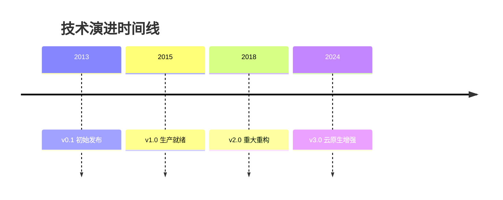
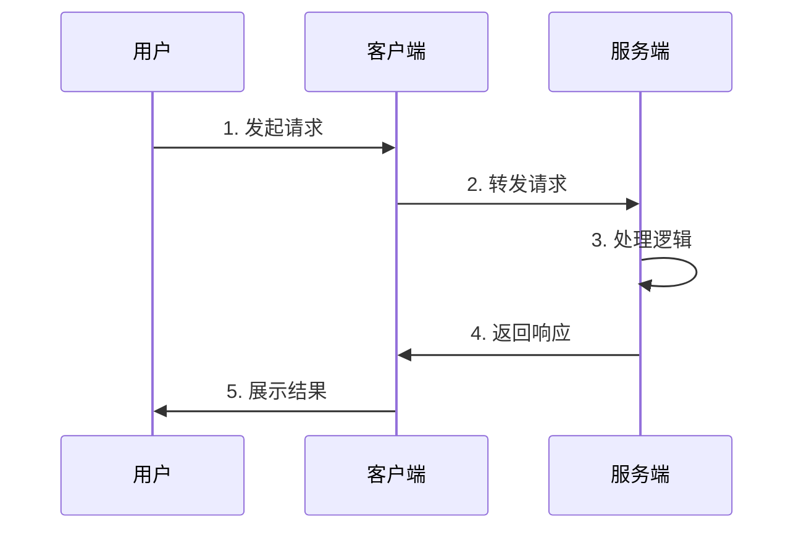

# [技术名称] 技术详解

> **文档定位**: [一句话说明文档用途,如"Kubernetes核心概念和实践指南"]  
> **技术版本**: [版本号,如"v1.30+"]  
> **最后更新**: [日期,如"2025-10-21"]  
> **标准对齐**: [相关标准列表,如"CNCF, OCI v1.0.2, CRI v1"]  
> **文档版本**: v1.0

---

## 📋 目录

- [1. 概述](#1-概述)
- [2. 技术原理](#2-技术原理)
- [3. 配置实践](#3-配置实践)
- [4. 运维管理](#4-运维管理)
- [5. 安全加固](#5-安全加固)
- [6. 性能优化](#6-性能优化)
- [7. 故障排查](#7-故障排查)
- [8. 最佳实践](#8-最佳实践)
- [9. 参考资料](#9-参考资料)

---

## 1. 概述

### 1.1 技术定义

[简明定义,100字以内,回答"What is it?"的问题]

**示例**:
> Docker是一个开源的容器化平台,用于开发、交付和运行应用程序。它将应用及其依赖打包到轻量级、可移植的容器中,确保应用在任何环境中都能一致运行[^1]。

### 1.2 核心概念

[列出5-10个关键概念,每个概念一句话解释]

**格式示例**:

| 概念 | 定义 | 重要性 |
|------|------|--------|
| **[概念1]** | [一句话定义] | ⭐⭐⭐⭐⭐ 核心 |
| **[概念2]** | [一句话定义] | ⭐⭐⭐⭐ 重要 |
| **[概念3]** | [一句话定义] | ⭐⭐⭐ 常用 |

### 1.3 应用场景

[描述3-5个典型应用场景]

**格式示例**:

#### 场景1: [场景名称]

**业务需求**: [描述业务需求]

**技术解决方案**: [如何使用该技术解决]

**适用条件**:

- ✅ 条件1
- ✅ 条件2
- ⚠️ 注意事项

**案例**: [实际案例,可选]

#### 场景2: [场景名称]

[同上...]

### 1.4 技术演进

[描述技术的历史和发展,可选章节]

**格式示例**:



**关键里程碑**:

- **[年份]**: [重要事件/版本]
- **[年份]**: [重要事件/版本]

### 1.5 技术优势与限制

**优势**:

- ✅ **优势1**: [说明]
- ✅ **优势2**: [说明]
- ✅ **优势3**: [说明]

**限制**:

- ⚠️ **限制1**: [说明和应对方案]
- ⚠️ **限制2**: [说明和应对方案]

**技术对比**: [与同类技术的对比,可选]

| 技术 | 优势 | 劣势 | 适用场景 |
|------|------|------|---------|
| 本技术 | ... | ... | ... |
| 竞品A | ... | ... | ... |
| 竞品B | ... | ... | ... |

---

## 2. 技术原理

### 2.1 架构设计

[描述整体架构]

**架构图**:


**组件说明**:

| 组件 | 职责 | 关键特性 |
|------|------|---------|
| **组件A** | [职责描述] | [特性1, 特性2] |
| **组件B** | [职责描述] | [特性1, 特性2] |

### 2.2 工作机制

[描述核心工作流程]

**流程图**:



**步骤说明**:

1. **[步骤1]**: [详细说明]
2. **[步骤2]**: [详细说明]
3. **[步骤3]**: [详细说明]

### 2.3 关键技术

[描述2-3个核心技术点,深入讲解]

#### 技术点1: [名称]

**技术原理**: [说明]

**实现细节**: [说明]

**技术优势**: [说明]

**参考资料**: [引用]

#### 技术点2: [名称]

[同上...]

### 2.4 数据流和控制流

[描述数据如何流动,控制如何传递,可选章节]

**数据流图**:


---

## 3. 配置实践

### 3.1 环境要求

**硬件要求**:

```yaml
最小配置:
  CPU: 2核
  内存: 4GB
  存储: 20GB
  网络: 1Gbps

推荐配置:
  CPU: 4核+
  内存: 8GB+
  存储: 100GB+
  网络: 10Gbps
```

**软件要求**:

```yaml
操作系统:
  - Ubuntu 22.04 LTS (推荐)
  - CentOS 8+
  - RHEL 8+

依赖软件:
  - 软件A: v1.2+
  - 软件B: v2.0+

内核要求:
  - Linux Kernel 5.10+ (推荐5.15+)
```

### 3.2 安装部署

#### 方式1: [安装方式名称,如"二进制安装"]

**步骤**:

```bash
# 1. 下载安装包
wget https://example.com/package.tar.gz

# 2. 解压
tar -xzf package.tar.gz

# 3. 安装
cd package && sudo make install

# 4. 验证
command --version
```

**验证安装**:

```bash
# 检查版本
command --version

# 检查服务状态
systemctl status service-name
```

#### 方式2: [另一种安装方式]

[同上...]

### 3.3 配置示例

#### 基础配置

```yaml
# 来源: [官方文档链接]
# 最后验证: 2025-10-21

# 配置说明: 最小化配置用于开发测试
apiVersion: v1
kind: Config
metadata:
  name: basic-config
spec:
  # 参数1: [说明]
  parameter1: value1
  
  # 参数2: [说明]
  parameter2: value2
```

**配置说明**:

- `parameter1`: [详细说明,包括默认值、取值范围]
- `parameter2`: [详细说明]

#### 生产配置

```yaml
# 自定义生产配置
# 基于: 官方推荐配置 + 生产实践
# 注意: 请根据实际环境调整

apiVersion: v1
kind: Config
metadata:
  name: production-config
spec:
  # 高可用配置
  replicas: 3
  
  # 资源限制
  resources:
    requests:
      cpu: 500m
      memory: 1Gi
    limits:
      cpu: 2000m
      memory: 4Gi
  
  # 存储配置
  storage:
    type: persistent
    size: 100Gi
```

**生产配置要点**:

1. **高可用**: 至少3副本
2. **资源配置**: 根据负载调整
3. **持久化**: 启用持久化存储

### 3.4 参数详解

| 参数 | 类型 | 默认值 | 说明 | 生产建议 |
|------|------|--------|------|---------|
| `param1` | string | "default" | [参数说明] | [建议值] |
| `param2` | integer | 100 | [参数说明] | [建议值] |
| `param3` | boolean | false | [参数说明] | [建议值] |

**参考资料**: [官方配置文档链接][^2]

---

## 4. 运维管理

### 4.1 启动和停止

```bash
# 启动服务
sudo systemctl start service-name

# 停止服务
sudo systemctl stop service-name

# 重启服务
sudo systemctl restart service-name

# 查看状态
sudo systemctl status service-name
```

### 4.2 日志管理

**日志位置**:

```bash
# 应用日志
/var/log/app/application.log

# 系统日志
journalctl -u service-name

# 实时查看
tail -f /var/log/app/application.log
```

**日志级别**:

```yaml
日志级别:
  DEBUG: 调试信息
  INFO: 常规信息
  WARN: 警告信息
  ERROR: 错误信息
  FATAL: 致命错误

生产建议: INFO
开发建议: DEBUG
```

### 4.3 监控指标

**关键指标**:

| 指标 | 类型 | 描述 | 告警阈值 |
|------|------|------|---------|
| CPU使用率 | Gauge | CPU占用百分比 | >80% |
| 内存使用率 | Gauge | 内存占用百分比 | >85% |
| 请求QPS | Counter | 每秒请求数 | - |
| 响应延迟 | Histogram | 请求响应时间 | P99 > 100ms |
| 错误率 | Gauge | 错误请求百分比 | >1% |

**监控配置**:

```yaml
# Prometheus监控配置示例
scrape_configs:
  - job_name: 'service-name'
    static_configs:
      - targets: ['localhost:9090']
    metrics_path: '/metrics'
```

### 4.4 备份恢复

**备份策略**:

```bash
# 全量备份
./backup.sh --type full --output /backup/full-$(date +%Y%m%d).tar.gz

# 增量备份
./backup.sh --type incremental --output /backup/incr-$(date +%Y%m%d).tar.gz
```

**恢复流程**:

```bash
# 1. 停止服务
systemctl stop service-name

# 2. 恢复数据
tar -xzf /backup/full-20251021.tar.gz -C /data/

# 3. 启动服务
systemctl start service-name

# 4. 验证
./verify.sh
```

### 4.5 版本升级

**升级前准备**:

1. ☑️ 阅读Release Notes
2. ☑️ 备份当前数据
3. ☑️ 在测试环境验证
4. ☑️ 制定回滚计划

**升级步骤**:

```bash
# 1. 备份
./backup.sh --type pre-upgrade

# 2. 下载新版本
wget https://example.com/new-version.tar.gz

# 3. 停止服务
systemctl stop service-name

# 4. 更新
./upgrade.sh --version 2.0.0

# 5. 启动服务
systemctl start service-name

# 6. 验证
./health-check.sh
```

**回滚流程**:

```bash
# 如果升级失败,执行回滚
./rollback.sh --backup /backup/pre-upgrade.tar.gz
```

---

## 5. 安全加固

### 5.1 威胁分析

**安全威胁**:

| 威胁 | 风险等级 | 影响范围 | 防护措施 |
|------|---------|---------|---------|
| 未授权访问 | 🔴 高 | 数据泄露 | 启用认证,RBAC |
| 中间人攻击 | 🟠 中 | 数据窃取 | 启用TLS加密 |
| DDoS攻击 | 🟠 中 | 服务中断 | 限流,防护 |
| 漏洞利用 | 🔴 高 | 系统入侵 | 及时更新,扫描 |

### 5.2 认证授权

**认证配置**:

```yaml
# 启用基本认证
auth:
  enabled: true
  type: basic
  users:
    - name: admin
      password: <hashed-password>
      role: admin
```

**RBAC配置**:

```yaml
# 角色定义
roles:
  - name: admin
    permissions:
      - create
      - read
      - update
      - delete
  
  - name: viewer
    permissions:
      - read
```

### 5.3 网络安全

**防火墙规则**:

```bash
# 允许必要端口
sudo firewall-cmd --zone=public --add-port=8080/tcp --permanent
sudo firewall-cmd --reload

# 限制访问来源
sudo firewall-cmd --zone=public --add-rich-rule='rule family="ipv4" source address="10.0.0.0/8" port port="8080" protocol="tcp" accept' --permanent
```

**TLS配置**:

```yaml
tls:
  enabled: true
  certFile: /etc/certs/server.crt
  keyFile: /etc/certs/server.key
  caFile: /etc/certs/ca.crt
  minVersion: "1.2"  # TLS 1.2+
```

### 5.4 数据安全

**加密配置**:

```yaml
encryption:
  # 传输加密
  inTransit:
    enabled: true
    protocol: TLS1.3
  
  # 存储加密
  atRest:
    enabled: true
    algorithm: AES-256-GCM
    keyProvider: kms
```

### 5.5 审计日志

```yaml
audit:
  enabled: true
  logPath: /var/log/audit/audit.log
  events:
    - authentication
    - authorization
    - dataAccess
    - configChange
```

### 5.6 合规检查

**CIS Benchmark对齐**:

- [ ] 项1: [检查项]
- [ ] 项2: [检查项]
- [ ] 项3: [检查项]

**验证命令**:

```bash
# 运行合规检查
./compliance-check.sh --benchmark cis

# 生成报告
./compliance-check.sh --report /tmp/compliance-report.html
```

**参考**: [CIS Benchmark文档][^3]

---

## 6. 性能优化

### 6.1 性能基准

**基准测试结果**[^perf]:

| 指标 | 默认配置 | 优化配置 | 提升 |
|------|---------|---------|------|
| QPS | 10,000 | 25,000 | 150% |
| P99延迟 | 50ms | 20ms | 60% |
| CPU使用率 | 70% | 50% | -29% |
| 内存使用 | 4GB | 3GB | -25% |

> **测试环境**:
>
> - 硬件: 8C16G, Intel Xeon Gold 6248R
> - 操作系统: Ubuntu 22.04 LTS, Kernel 5.15
> - 测试工具: wrk v4.2.0
> - 测试时间: 2025-10-21
> - 并发数: 100
> - 测试时长: 60秒

### 6.2 性能调优

#### 系统层优化

```bash
# 内核参数优化
cat <<EOF | sudo tee /etc/sysctl.d/99-performance.conf
# 网络优化
net.core.somaxconn = 32768
net.ipv4.tcp_max_syn_backlog = 8192
net.ipv4.tcp_tw_reuse = 1

# 文件描述符
fs.file-max = 1000000
fs.nr_open = 1000000
EOF

sudo sysctl -p /etc/sysctl.d/99-performance.conf
```

#### 应用层优化

```yaml
# 性能优化配置
performance:
  # 连接池
  connectionPool:
    minSize: 10
    maxSize: 100
    maxIdleTime: 300s
  
  # 缓存
  cache:
    enabled: true
    type: redis
    ttl: 3600s
    maxSize: 1GB
  
  # 并发控制
  concurrency:
    maxWorkers: 100
    queueSize: 1000
```

### 6.3 资源规划

**容量规划**:

| 负载 | CPU | 内存 | 存储 | 网络 | 实例数 |
|------|-----|------|------|------|-------|
| 小型(~1K QPS) | 2C | 4GB | 50GB | 1Gbps | 2 |
| 中型(~10K QPS) | 4C | 8GB | 200GB | 10Gbps | 4 |
| 大型(~50K QPS) | 8C | 16GB | 500GB | 25Gbps | 8 |

**扩容策略**:

```yaml
自动扩容规则:
  指标: CPU使用率
  阈值: 70%
  扩容: +2实例
  冷却时间: 5分钟
  
  最小实例: 2
  最大实例: 20
```

---

## 7. 故障排查

### 7.1 常见问题

#### 问题1: [问题描述]

**症状**:

- 现象1
- 现象2

**原因**:

- 可能原因1
- 可能原因2

**解决方案**:

```bash
# 步骤1
command1

# 步骤2
command2

# 验证
command3
```

#### 问题2: [问题描述]

[同上...]

### 7.2 诊断工具

```bash
# 检查服务状态
./diagnostic.sh --check service

# 检查网络连接
./diagnostic.sh --check network

# 检查资源使用
./diagnostic.sh --check resources

# 生成诊断报告
./diagnostic.sh --report /tmp/diag-report.txt
```

### 7.3 日志分析

**错误日志示例**:

```log
2025-10-21 10:30:45 ERROR [service] Connection timeout: host=10.0.1.10 port=8080
2025-10-21 10:30:45 ERROR [service] Retry failed after 3 attempts
```

**分析步骤**:

1. 检查目标主机连通性
2. 检查端口是否开放
3. 检查防火墙规则
4. 检查网络延迟

### 7.4 性能分析

```bash
# CPU剖析
perf top -p $(pidof service-name)

# 内存分析
pprof -http=:8080 http://localhost:6060/debug/pprof/heap

# 网络追踪
tcpdump -i eth0 port 8080 -w capture.pcap
```

---

## 8. 最佳实践

### 8.1 设计原则

1. **原则1: [名称]**
   - **说明**: [详细说明]
   - **示例**: [实践案例]
   - **反模式**: [应避免的做法]

2. **原则2: [名称]**
   [同上...]

### 8.2 生产实践

#### 实践1: [名称]

**业务场景**: [场景描述]

**实施方案**:

```yaml
# 配置示例
implementation:
  approach: [方法]
  configuration:
    param1: value1
    param2: value2
```

**效果**:

- ✅ 改进1: [说明]
- ✅ 改进2: [说明]

**经验总结**: [关键要点]

#### 实践2: [名称]

[同上...]

### 8.3 避坑指南

**陷阱1: [陷阱名称]**

**问题描述**: [什么情况下会遇到]

**影响**: [造成什么问题]

**解决方案**: [如何避免或解决]

---

## 9. 参考资料

### 9.1 官方文档

1. [[技术名称]官方文档](https://example.com/docs) - 组织, 版本, 2024
2. [[相关技术]官方文档](https://example.com/docs) - 组织, 2024

### 9.2 技术标准

1. [标准名称] 标准编号, 标准组织, 版本, 发布日期
2. [标准名称] 标准编号, 标准组织, 版本, 发布日期

### 9.3 技术文章

1. [[文章标题]](https://example.com) - 作者, 发布平台, 日期
2. [[文章标题]](https://example.com) - 作者, 发布平台, 日期

### 9.4 学术论文

1. Author, A. "Paper Title," Conference/Journal, Year.

### 9.5 延伸阅读

1. [[技术书籍]](https://example.com) - 作者, 出版社, 年份
2. [[在线课程]](https://example.com) - 平台, 讲师

### 9.6 相关文档

- [相关技术文档1](./related1.md)
- [相关技术文档2](./related2.md)

---

## 📝 文档元信息

| 属性 | 值 |
|------|-----|
| **文档版本** | v1.0 |
| **作者** | [作者名] |
| **创建日期** | [日期] |
| **最后更新** | [日期] |
| **审核人** | [审核人] |
| **审核日期** | [日期] |
| **License** | [许可证,如CC-BY-4.0] |

---

## 📊 质量指标

```yaml
文档质量:
  完整性: [✅/⚠️/❌] [百分比]
  准确性: [✅/⚠️/❌] [最后验证日期]
  代码可运行性: [✅/⚠️/❌] [测试日期]
  引用覆盖率: [百分比]
  链接有效性: [✅/⚠️/❌] [检查日期]
```

---

## 🔄 变更记录

| 版本 | 日期 | 变更内容 | 作者 |
|------|------|---------|------|
| v1.0 | 2025-10-21 | 初始版本 | [作者] |
| - | - | - | - |

---

**维护承诺**: 本文档根据[VERSION_UPDATE_SLA.md](../../VERSION_UPDATE_SLA.md)定期更新,确保与最新技术版本保持一致。

**反馈渠道**: 如有问题或建议,请通过[GitHub Issues](链接)提交。

---

[^1]: [引用1的完整信息]
[^2]: [引用2的完整信息]
[^3]: [引用3的完整信息]
[^perf]: 性能数据来源于内部基准测试,测试环境见文中说明。
