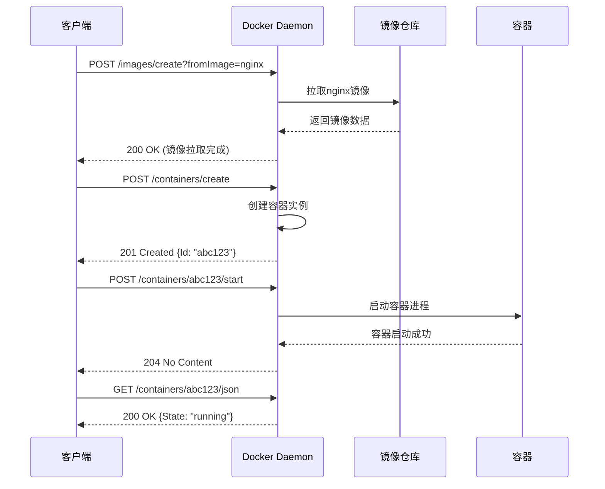
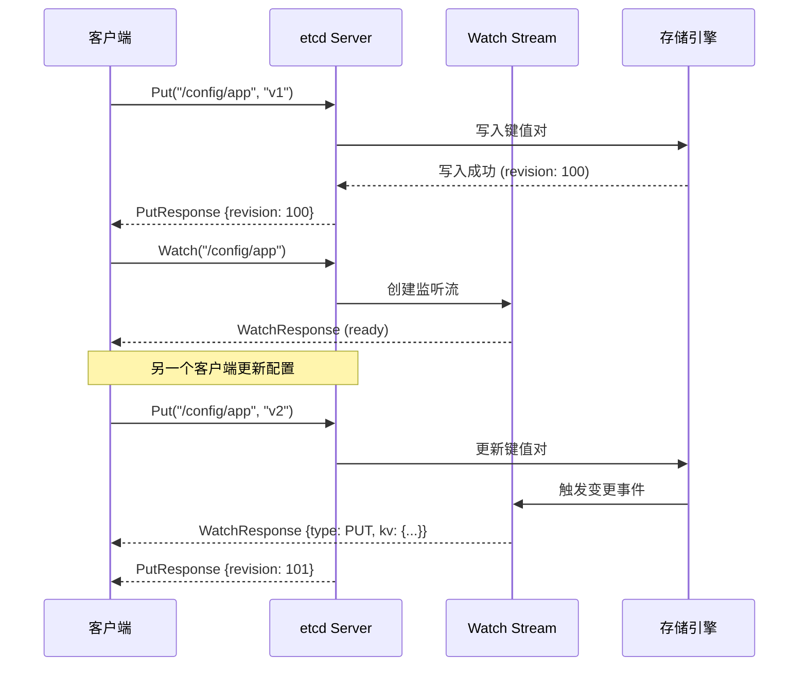

# API交互与场景详解

## 📚 文档目录

- [概述](#概述)
- [第一部分：API交互模式](#第一部分api交互模式)
  - [RESTful API交互](#restful-api交互)
  - [gRPC API交互](#grpc-api交互)
  - [Unix Socket交互](#unix-socket交互)
- [第二部分：Docker API功能详解](#第二部分docker-api功能详解)
- [第三部分：Kubernetes API功能详解](#第三部分kubernetes-api功能详解)
- [第四部分：etcd API功能详解](#第四部分etcd-api功能详解)
- [第五部分：实际应用场景](#第五部分实际应用场景)

---

## 概述

本文档深入解释虚拟化和容器化API的交互模式、功能说明和实际应用场景，帮助您：

✅ 理解不同API的交互方式和通信流程
✅ 掌握每个API的具体功能和使用方法
✅ 学习实际场景中如何组合使用这些API
✅ 获得可直接使用的代码示例和最佳实践

---

## 第一部分：API交互模式

### RESTful API交互

#### 交互原理

```yaml
客户端-服务器交互模型:
  1. 客户端发起HTTP请求
  2. 服务器处理请求
  3. 服务器返回HTTP响应
  4. 客户端解析响应

特点:
  - 无状态: 每次请求独立
  - 资源导向: URL表示资源
  - 标准方法: GET/POST/PUT/DELETE
  - 内容协商: 支持JSON/XML等格式
```

#### 完整交互流程示例

**场景：创建并启动一个Docker容器**



#### HTTP请求详解

**1. 请求结构**

```http
POST /containers/create?name=my-nginx HTTP/1.1
Host: /var/run/docker.sock
Content-Type: application/json
Accept: application/json
Content-Length: 245

{
  "Image": "nginx:alpine",
  "Cmd": ["nginx", "-g", "daemon off;"],
  "ExposedPorts": {
    "80/tcp": {}
  },
  "HostConfig": {
    "PortBindings": {
      "80/tcp": [{"HostPort": "8080"}]
    }
  }
}
```

**请求组成部分解释：**

```yaml
请求行:
  - 方法: POST (创建资源)
  - 路径: /containers/create (容器创建API)
  - 查询参数: ?name=my-nginx (容器名称)
  - 协议: HTTP/1.1

请求头:
  - Host: 目标主机 (Unix Socket路径)
  - Content-Type: 请求体格式 (JSON)
  - Accept: 期望的响应格式
  - Content-Length: 请求体长度

请求体:
  - Image: 使用的镜像
  - Cmd: 容器启动命令
  - ExposedPorts: 暴露的端口
  - HostConfig: 主机配置
```

**2. 响应结构**

```http
HTTP/1.1 201 Created
Content-Type: application/json
Content-Length: 90
Date: Wed, 22 Oct 2025 10:30:00 GMT

{
  "Id": "abc123def456...",
  "Warnings": []
}
```

**响应组成部分解释：**

```yaml
状态行:
  - 协议: HTTP/1.1
  - 状态码: 201 Created (资源创建成功)
  - 状态描述: Created

响应头:
  - Content-Type: 响应体格式
  - Content-Length: 响应体长度
  - Date: 响应时间

响应体:
  - Id: 创建的容器ID
  - Warnings: 警告信息列表
```

#### Go客户端交互示例

```go
package main

import (
    "context"
    "fmt"
    "io"
    "os"

    "github.com/docker/docker/api/types"
    "github.com/docker/docker/api/types/container"
    "github.com/docker/docker/client"
    "github.com/docker/go-connections/nat"
)

func main() {
    // 1. 创建客户端
    ctx := context.Background()
    cli, err := client.NewClientWithOpts(
        client.FromEnv,                      // 从环境变量读取配置
        client.WithAPIVersionNegotiation(),  // 自动协商API版本
    )
    if err != nil {
        panic(err)
    }
    defer cli.Close()

    // 2. 拉取镜像 (流式响应)
    fmt.Println("📥 拉取镜像...")
    reader, err := cli.ImagePull(ctx, "nginx:alpine", types.ImagePullOptions{})
    if err != nil {
        panic(err)
    }
    defer reader.Close()
    io.Copy(os.Stdout, reader) // 实时显示拉取进度

    // 3. 创建容器
    fmt.Println("\n🔧 创建容器...")
    resp, err := cli.ContainerCreate(ctx,
        &container.Config{
            Image: "nginx:alpine",
            ExposedPorts: nat.PortSet{
                "80/tcp": struct{}{},
            },
        },
        &container.HostConfig{
            PortBindings: nat.PortMap{
                "80/tcp": []nat.PortBinding{
                    {HostPort: "8080"},
                },
            },
        },
        nil, nil, "my-nginx")
    if err != nil {
        panic(err)
    }

    containerID := resp.ID
    fmt.Printf("✅ 容器创建成功: %s\n", containerID[:12])

    // 4. 启动容器
    fmt.Println("🚀 启动容器...")
    if err := cli.ContainerStart(ctx, containerID, types.ContainerStartOptions{}); err != nil {
        panic(err)
    }

    // 5. 检查容器状态
    fmt.Println("🔍 检查容器状态...")
    inspect, err := cli.ContainerInspect(ctx, containerID)
    if err != nil {
        panic(err)
    }

    fmt.Printf("✅ 容器状态: %s\n", inspect.State.Status)
    fmt.Printf("✅ 容器IP: %s\n", inspect.NetworkSettings.IPAddress)
    fmt.Printf("✅ 端口映射: 80 -> 8080\n")
}
```

**交互过程分析：**

```yaml
步骤1 - 创建客户端:
  功能: 初始化HTTP客户端
  交互: 读取环境变量(DOCKER_HOST)
  结果: 建立到Docker守护进程的连接

步骤2 - 拉取镜像:
  请求: POST /images/create?fromImage=nginx:alpine
  交互: 流式接收镜像数据
  结果: 镜像下载到本地

步骤3 - 创建容器:
  请求: POST /containers/create
  交互: 发送容器配置JSON
  结果: 返回容器ID

步骤4 - 启动容器:
  请求: POST /containers/{id}/start
  交互: 无请求体，仅发送启动信号
  结果: 容器进程启动

步骤5 - 检查状态:
  请求: GET /containers/{id}/json
  交互: 获取完整容器信息
  结果: 返回容器详细状态
```

---

### gRPC API交互

#### 交互原理

```yaml
基于HTTP/2的RPC交互:
  1. 客户端调用远程方法
  2. 使用Protocol Buffers序列化
  3. 通过HTTP/2传输
  4. 服务端反序列化并处理
  5. 返回序列化的响应

特点:
  - 强类型: Protocol Buffers定义
  - 高性能: 二进制序列化
  - 双向流: 支持流式传输
  - 代码生成: 自动生成客户端/服务端代码
```

#### 完整交互流程示例

**场景：etcd存储和监听配置变化**



#### Protocol Buffers定义

**etcd KV服务定义：**

```protobuf
syntax = "proto3";

package etcdserverpb;

service KV {
  // 存储键值对
  rpc Put(PutRequest) returns (PutResponse) {}

  // 获取键值对
  rpc Range(RangeRequest) returns (RangeResponse) {}

  // 删除键值对
  rpc DeleteRange(DeleteRangeRequest) returns (DeleteRangeResponse) {}

  // 事务操作
  rpc Txn(TxnRequest) returns (TxnResponse) {}
}

service Watch {
  // 监听键变化 (双向流)
  rpc Watch(stream WatchRequest) returns (stream WatchResponse) {}
}

// Put请求消息
message PutRequest {
  bytes key = 1;          // 键
  bytes value = 2;        // 值
  int64 lease = 3;        // 租约ID
  bool prev_kv = 4;       // 是否返回前一个值
}

// Put响应消息
message PutResponse {
  ResponseHeader header = 1;  // 响应头
  KeyValue prev_kv = 2;       // 前一个键值对
}

// 键值对消息
message KeyValue {
  bytes key = 1;           // 键
  int64 create_revision = 2;  // 创建版本
  int64 mod_revision = 3;     // 修改版本
  int64 version = 4;          // 键的版本
  bytes value = 5;            // 值
  int64 lease = 6;            // 租约ID
}
```

#### Go客户端gRPC交互示例

```go
package main

import (
    "context"
    "fmt"
    "log"
    "time"

    clientv3 "go.etcd.io/etcd/client/v3"
)

func main() {
    // 1. 创建gRPC客户端
    client, err := clientv3.New(clientv3.Config{
        Endpoints:   []string{"localhost:2379"},  // etcd端点
        DialTimeout: 5 * time.Second,             // 连接超时
    })
    if err != nil {
        log.Fatal(err)
    }
    defer client.Close()

    ctx := context.Background()

    // 2. Put操作 (一元RPC)
    fmt.Println("📝 存储配置...")
    putResp, err := client.Put(ctx, "/config/database/host", "localhost:3306")
    if err != nil {
        log.Fatal(err)
    }
    fmt.Printf("✅ 存储成功, 版本: %d\n", putResp.Header.Revision)

    // 3. Get操作 (一元RPC)
    fmt.Println("\n📖 读取配置...")
    getResp, err := client.Get(ctx, "/config/database/host")
    if err != nil {
        log.Fatal(err)
    }
    for _, kv := range getResp.Kvs {
        fmt.Printf("✅ 键: %s\n", kv.Key)
        fmt.Printf("✅ 值: %s\n", kv.Value)
        fmt.Printf("✅ 版本: %d\n", kv.ModRevision)
    }

    // 4. Watch操作 (双向流RPC)
    fmt.Println("\n👀 监听配置变化...")
    watchChan := client.Watch(ctx, "/config/database/", clientv3.WithPrefix())

    // 在另一个goroutine中更新配置
    go func() {
        time.Sleep(2 * time.Second)
        fmt.Println("\n🔄 更新配置...")
        client.Put(ctx, "/config/database/host", "192.168.1.100:3306")
        client.Put(ctx, "/config/database/port", "3306")
    }()

    // 监听变更事件
    timeout := time.After(5 * time.Second)
    for {
        select {
        case watchResp := <-watchChan:
            for _, event := range watchResp.Events {
                fmt.Printf("\n🔔 检测到变更!\n")
                fmt.Printf("   类型: %s\n", event.Type)
                fmt.Printf("   键: %s\n", event.Kv.Key)
                fmt.Printf("   新值: %s\n", event.Kv.Value)
                fmt.Printf("   版本: %d\n", event.Kv.ModRevision)
            }
        case <-timeout:
            fmt.Println("\n⏱️  监听结束")
            return
        }
    }
}
```

**gRPC交互特点：**

```yaml
一元RPC (Unary RPC):
  模式: 请求-响应
  示例: Put, Get, Delete
  特点:
    - 客户端发送单个请求
    - 服务端返回单个响应
    - 类似于RESTful API

服务器流式RPC (Server Streaming):
  模式: 请求-流响应
  示例: Range (大量数据)
  特点:
    - 客户端发送单个请求
    - 服务端返回多个响应
    - 适合大数据集传输

客户端流式RPC (Client Streaming):
  模式: 流请求-响应
  示例: 批量写入
  特点:
    - 客户端发送多个请求
    - 服务端返回单个响应
    - 适合批量操作

双向流式RPC (Bidirectional Streaming):
  模式: 流请求-流响应
  示例: Watch监听
  特点:
    - 客户端和服务端独立发送消息流
    - 实时双向通信
    - 适合长连接和事件监听
```

---

### Unix Socket交互

#### 交互原理

```yaml
本地IPC (进程间通信):
  1. 客户端连接Unix Socket文件
  2. 通过文件描述符通信
  3. 内核直接传递数据
  4. 无需网络协议栈

优势:
  - 零网络开销
  - 更高的安全性 (文件权限控制)
  - 更快的传输速度
  - 自动的权限验证
```

#### Docker Unix Socket交互

**Socket文件位置：**

```bash
# Linux/macOS
/var/run/docker.sock

# Windows (通过命名管道)
//./pipe/docker_engine
```

**交互方式对比：**

```yaml
方式1 - Go SDK (推荐):
  优点:
    - 自动处理连接
    - 类型安全
    - 错误处理完善
  代码:
    cli, _ := client.NewClientWithOpts(client.FromEnv())

方式2 - curl命令:
  优点:
    - 快速测试
    - 直观展示HTTP交互
    - 无需编程
  命令:
    curl --unix-socket /var/run/docker.sock http://localhost/containers/json

方式3 - 原始Socket编程:
  优点:
    - 完全控制
    - 理解底层原理
  复杂度: 高
```

**curl通过Unix Socket交互示例：**

```bash
# 1. 获取Docker版本
curl --unix-socket /var/run/docker.sock \
     http://localhost/version | jq

# 输出:
# {
#   "Version": "24.0.7",
#   "ApiVersion": "1.43",
#   "GoVersion": "go1.21.3",
#   "Os": "linux",
#   "Arch": "amd64"
# }

# 2. 列出容器
curl --unix-socket /var/run/docker.sock \
     http://localhost/containers/json | jq

# 3. 创建容器
curl --unix-socket /var/run/docker.sock \
     -X POST \
     -H "Content-Type: application/json" \
     -d '{
       "Image": "nginx:alpine",
       "ExposedPorts": {"80/tcp": {}}
     }' \
     http://localhost/containers/create?name=my-nginx | jq

# 输出:
# {
#   "Id": "abc123...",
#   "Warnings": []
# }

# 4. 启动容器
CONTAINER_ID="abc123..."
curl --unix-socket /var/run/docker.sock \
     -X POST \
     http://localhost/containers/$CONTAINER_ID/start

# 5. 获取容器日志
curl --unix-socket /var/run/docker.sock \
     "http://localhost/containers/$CONTAINER_ID/logs?stdout=true&follow=false"
```

**Python通过Unix Socket交互：**

```python
import socket
import json
import http.client

class UnixSocketHTTPConnection(http.client.HTTPConnection):
    """通过Unix Socket的HTTP连接"""
    def __init__(self, socket_path):
        super().__init__('localhost')
        self.socket_path = socket_path

    def connect(self):
        self.sock = socket.socket(socket.AF_UNIX, socket.SOCK_STREAM)
        self.sock.connect(self.socket_path)

# 创建连接
conn = UnixSocketHTTPConnection('/var/run/docker.sock')

# 1. 获取版本信息
conn.request('GET', '/version')
response = conn.getresponse()
version = json.loads(response.read())
print(f"Docker版本: {version['Version']}")

# 2. 创建容器
container_config = {
    "Image": "nginx:alpine",
    "ExposedPorts": {"80/tcp": {}}
}
conn.request('POST', '/containers/create?name=test-nginx',
             body=json.dumps(container_config),
             headers={'Content-Type': 'application/json'})
response = conn.getresponse()
container = json.loads(response.read())
container_id = container['Id']
print(f"容器ID: {container_id[:12]}")

# 3. 启动容器
conn.request('POST', f'/containers/{container_id}/start')
response = conn.getresponse()
print(f"启动状态: {response.status}")

conn.close()
```

---

## 第二部分：Docker API功能详解

### 系统信息类API

#### 1. 获取版本信息

**功能说明：**

```yaml
API: GET /version
用途: 获取Docker守护进程版本信息
认证: 不需要
返回: 版本号、API版本、Go版本、操作系统、架构等

使用场景:
  ✅ 检查Docker是否运行
  ✅ 验证API版本兼容性
  ✅ 收集系统信息
  ✅ 监控服务健康
```

**详细交互示例：**

```go
// 功能: 智能版本检查和兼容性验证
func checkDockerVersion(cli *client.Client) error {
    ctx := context.Background()

    // 获取版本信息
    version, err := cli.ServerVersion(ctx)
    if err != nil {
        return fmt.Errorf("Docker守护进程不可用: %w", err)
    }

    fmt.Println("📊 Docker系统信息:")
    fmt.Printf("  Docker版本: %s\n", version.Version)
    fmt.Printf("  API版本: %s\n", version.APIVersion)
    fmt.Printf("  Go版本: %s\n", version.GoVersion)
    fmt.Printf("  操作系统: %s\n", version.Os)
    fmt.Printf("  架构: %s\n", version.Arch)
    fmt.Printf("  内核版本: %s\n", version.KernelVersion)
    fmt.Printf("  构建时间: %s\n", version.BuildTime)

    // API版本兼容性检查
    minAPIVersion := "1.24"
    if version.APIVersion < minAPIVersion {
        return fmt.Errorf("API版本过低: %s < %s", version.APIVersion, minAPIVersion)
    }

    fmt.Println("✅ API版本兼容")
    return nil
}
```

**应用场景：**

```yaml
场景1 - 启动前检查:
  时机: 应用启动时
  目的: 确保Docker可用
  处理: 不可用则退出程序

场景2 - CI/CD环境验证:
  时机: 部署前
  目的: 验证环境兼容性
  处理: 记录环境信息

场景3 - 多版本兼容:
  时机: API调用前
  目的: 根据版本选择API
  处理: 动态调整API调用
```

#### 2. 获取系统信息

**功能说明：**

```yaml
API: GET /info
用途: 获取Docker系统详细信息
返回:
  - 容器统计 (总数、运行中、暂停、停止)
  - 镜像统计
  - 存储驱动信息
  - 网络配置
  - 插件信息
  - 资源限制
```

**详细交互示例：**

```go
// 功能: 全面的系统信息分析
func analyzeSystemInfo(cli *client.Client) error {
    ctx := context.Background()

    info, err := cli.Info(ctx)
    if err != nil {
        return err
    }

    // 容器统计
    fmt.Println("\n📦 容器统计:")
    fmt.Printf("  总计: %d\n", info.Containers)
    fmt.Printf("  运行中: %d\n", info.ContainersRunning)
    fmt.Printf("  暂停: %d\n", info.ContainersPaused)
    fmt.Printf("  停止: %d\n", info.ContainersStopped)

    // 镜像统计
    fmt.Println("\n🖼️  镜像统计:")
    fmt.Printf("  总计: %d\n", info.Images)

    // 存储信息
    fmt.Println("\n💾 存储信息:")
    fmt.Printf("  驱动: %s\n", info.Driver)
    fmt.Printf("  根目录: %s\n", info.DockerRootDir)
    for _, status := range info.DriverStatus {
        fmt.Printf("  %s: %s\n", status[0], status[1])
    }

    // 系统资源
    fmt.Println("\n🔧 系统资源:")
    fmt.Printf("  CPU数: %d\n", info.NCPU)
    fmt.Printf("  内存: %.2f GB\n", float64(info.MemTotal)/(1024*1024*1024))

    // 网络信息
    fmt.Println("\n🌐 网络:")
    fmt.Printf("  默认网络: %s\n", info.DefaultRuntime)

    // 安全特性
    fmt.Println("\n🔒 安全特性:")
    for _, feature := range info.SecurityOptions {
        fmt.Printf("  %s\n", feature)
    }

    // 警告信息
    if len(info.Warnings) > 0 {
        fmt.Println("\n⚠️  警告:")
        for _, warning := range info.Warnings {
            fmt.Printf("  - %s\n", warning)
        }
    }

    return nil
}
```

### 镜像管理类API

#### 1. 拉取镜像

**功能说明：**

```yaml
API: POST /images/create
用途: 从镜像仓库拉取镜像
特点: 流式响应，实时进度
参数:
  - fromImage: 镜像名称
  - tag: 标签 (默认latest)
  - platform: 目标平台
```

**详细交互示例：**

```go
// 功能: 带进度显示的镜像拉取
func pullImageWithProgress(cli *client.Client, imageName string) error {
    ctx := context.Background()

    fmt.Printf("📥 拉取镜像: %s\n", imageName)

    // 拉取镜像
    reader, err := cli.ImagePull(ctx, imageName, types.ImagePullOptions{})
    if err != nil {
        return fmt.Errorf("拉取镜像失败: %w", err)
    }
    defer reader.Close()

    // 解析并显示进度
    type ProgressDetail struct {
        Current int64 `json:"current"`
        Total   int64 `json:"total"`
    }

    type ProgressMessage struct {
        Status         string         `json:"status"`
        ProgressDetail ProgressDetail `json:"progressDetail"`
        ID             string         `json:"id"`
    }

    decoder := json.NewDecoder(reader)
    for {
        var msg ProgressMessage
        if err := decoder.Decode(&msg); err != nil {
            if err == io.EOF {
                break
            }
            return err
        }

        // 显示进度
        if msg.ProgressDetail.Total > 0 {
            percent := float64(msg.ProgressDetail.Current) / float64(msg.ProgressDetail.Total) * 100
            fmt.Printf("\r  [%s] %s: %.1f%%", msg.ID, msg.Status, percent)
        } else if msg.Status != "" {
            fmt.Printf("\n  %s", msg.Status)
        }
    }

    fmt.Println("\n✅ 镜像拉取完成")
    return nil
}
```

**应用场景：**

```yaml
场景1 - 自动镜像管理:
  触发: 容器创建前
  逻辑: 检查本地镜像 → 不存在则拉取
  代码:
    if !imageExists(imageName) {
        pullImage(imageName)
    }

场景2 - 批量镜像预热:
  触发: 部署前
  逻辑: 并发拉取多个镜像
  好处: 加速后续容器启动

场景3 - 镜像更新:
  触发: 定时任务
  逻辑: 拉取最新标签的镜像
  注意: 可能影响现有容器
```

#### 2. 构建镜像

**功能说明：**

```yaml
API: POST /build
用途: 从Dockerfile构建镜像
特点: 流式响应，构建日志
参数:
  - dockerfile: Dockerfile路径
  - t: 镜像标签
  - buildargs: 构建参数
  - target: 多阶段构建目标
```

**详细交互示例：**

```go
// 功能: 从Dockerfile构建镜像
func buildImage(cli *client.Client, contextDir, dockerfile, tag string) error {
    ctx := context.Background()

    // 创建tar包
    tar, err := archive.TarWithOptions(contextDir, &archive.TarOptions{})
    if err != nil {
        return err
    }
    defer tar.Close()

    // 构建选项
    opts := types.ImageBuildOptions{
        Tags:       []string{tag},
        Dockerfile: dockerfile,
        Remove:     true,  // 删除中间容器
        BuildArgs: map[string]*string{
            "VERSION": stringPtr("1.0.0"),
        },
    }

    fmt.Printf("🔨 构建镜像: %s\n", tag)

    // 开始构建
    resp, err := cli.ImageBuild(ctx, tar, opts)
    if err != nil {
        return err
    }
    defer resp.Body.Close()

    // 显示构建日志
    type BuildMessage struct {
        Stream string `json:"stream"`
        Error  string `json:"error"`
    }

    decoder := json.NewDecoder(resp.Body)
    for {
        var msg BuildMessage
        if err := decoder.Decode(&msg); err != nil {
            if err == io.EOF {
                break
            }
            return err
        }

        if msg.Error != "" {
            return fmt.Errorf("构建错误: %s", msg.Error)
        }

        if msg.Stream != "" {
            fmt.Print(msg.Stream)
        }
    }

    fmt.Println("✅ 镜像构建完成")
    return nil
}
```

**应用场景：**

```yaml
场景1 - CI/CD自动构建:
  流程:
    1. 代码提交触发
    2. 运行测试
    3. 构建Docker镜像
    4. 推送到镜像仓库
    5. 部署到环境

场景2 - 多阶段构建优化:
  Dockerfile:
    FROM golang:1.21 AS builder
    WORKDIR /app
    COPY . .
    RUN go build -o app

    FROM alpine:latest
    COPY --from=builder /app/app /app
    CMD ["/app"]

  好处: 减小镜像大小

场景3 - 动态构建参数:
  用途: 根据环境传递不同参数
  示例:
    BuildArgs: {
      "ENV": "production",
      "API_URL": "https://api.example.com"
    }
```

### 容器生命周期管理

#### 1. 创建容器

**功能说明：**

```yaml
API: POST /containers/create
用途: 创建容器实例 (不启动)
配置项:
  - Image: 镜像名称
  - Cmd: 启动命令
  - Env: 环境变量
  - ExposedPorts: 暴露端口
  - Volumes: 卷挂载
  - Labels: 标签
  - HostConfig: 主机配置
    - PortBindings: 端口映射
    - Binds: 目录挂载
    - Resources: 资源限制
```

**完整配置示例：**

```go
// 功能: 创建生产级容器配置
func createProductionContainer(cli *client.Client) (string, error) {
    ctx := context.Background()

    // 容器配置
    config := &container.Config{
        Image: "myapp:latest",
        Cmd:   []string{"/app/server"},

        // 环境变量
        Env: []string{
            "ENV=production",
            "LOG_LEVEL=info",
            "DB_HOST=database:5432",
        },

        // 暴露端口
        ExposedPorts: nat.PortSet{
            "8080/tcp": struct{}{},
            "9090/tcp": struct{}{}, // metrics
        },

        // 工作目录
        WorkingDir: "/app",

        // 用户
        User: "appuser:appgroup",

        // 标签
        Labels: map[string]string{
            "app":         "myapp",
            "version":     "1.0.0",
            "environment": "production",
            "maintainer":  "devops@example.com",
        },

        // 健康检查
        Healthcheck: &container.HealthConfig{
            Test: []string{"CMD", "curl", "-f", "http://localhost:8080/health"},
            Interval: 30 * time.Second,
            Timeout:  5 * time.Second,
            Retries:  3,
        },
    }

    // 主机配置
    hostConfig := &container.HostConfig{
        // 端口映射
        PortBindings: nat.PortMap{
            "8080/tcp": []nat.PortBinding{{HostIP: "0.0.0.0", HostPort: "8080"}},
            "9090/tcp": []nat.PortBinding{{HostIP: "127.0.0.1", HostPort: "9090"}},
        },

        // 目录挂载
        Binds: []string{
            "/data/app:/app/data:rw",
            "/logs/app:/app/logs:rw",
        },

        // 资源限制
        Resources: container.Resources{
            Memory:     512 * 1024 * 1024,  // 512MB
            MemorySwap: 1024 * 1024 * 1024, // 1GB (包括内存)
            CPUShares:  1024,                // CPU份额
            CPUQuota:   50000,               // 50% CPU
            CPUPeriod:  100000,
        },

        // 重启策略
        RestartPolicy: container.RestartPolicy{
            Name:              "unless-stopped",
            MaximumRetryCount: 3,
        },

        // 日志配置
        LogConfig: container.LogConfig{
            Type: "json-file",
            Config: map[string]string{
                "max-size": "10m",
                "max-file": "3",
            },
        },

        // 网络模式
        NetworkMode: "bridge",

        // DNS配置
        DNS: []string{"8.8.8.8", "8.8.4.4"},
    }

    // 网络配置
    networkingConfig := &network.NetworkingConfig{
        EndpointsConfig: map[string]*network.EndpointSettings{
            "app-network": {
                Aliases: []string{"myapp"},
            },
        },
    }

    // 创建容器
    resp, err := cli.ContainerCreate(
        ctx,
        config,
        hostConfig,
        networkingConfig,
        nil,
        "myapp-prod",
    )

    if err != nil {
        return "", fmt.Errorf("创建容器失败: %w", err)
    }

    fmt.Printf("✅ 容器创建成功: %s\n", resp.ID[:12])

    // 显示警告
    if len(resp.Warnings) > 0 {
        fmt.Println("⚠️  警告:")
        for _, warning := range resp.Warnings {
            fmt.Printf("  - %s\n", warning)
        }
    }

    return resp.ID, nil
}
```

**配置详解：**

```yaml
1. 环境变量 (Env):
  格式: "KEY=VALUE"
  用途: 传递配置给应用
  最佳实践:
    - 敏感信息使用secrets
    - 使用.env文件管理
    - 遵循12-factor原则

2. 端口映射 (PortBindings):
  格式: "容器端口/协议": [{HostIP, HostPort}]
  场景:
    - 0.0.0.0: 所有网卡可访问
    - 127.0.0.1: 仅本地访问
    - 具体IP: 指定网卡

3. 资源限制 (Resources):
  内存:
    - Memory: 内存限制
    - MemorySwap: 内存+交换区
    - MemoryReservation: 软限制
  CPU:
    - CPUShares: 相对权重(默认1024)
    - CPUQuota: 绝对限制(微秒)
    - CPUs: CPU数量(小数)

4. 重启策略 (RestartPolicy):
  - no: 不自动重启
  - always: 总是重启
  - unless-stopped: 除非手动停止
  - on-failure: 失败时重启

5. 健康检查 (Healthcheck):
  Test: 检查命令
  Interval: 检查间隔
  Timeout: 超时时间
  Retries: 重试次数
  StartPeriod: 启动等待期
```

---

## 第三部分：Kubernetes API功能详解

### Pod生命周期管理

#### 1. 创建Pod

**功能说明：**

```yaml
API: POST /api/v1/namespaces/{namespace}/pods
用途: 创建Pod实例
配置项:
  - Containers: 容器列表
  - InitContainers: 初始化容器
  - Volumes: 卷定义
  - RestartPolicy: 重启策略
  - NodeSelector: 节点选择
  - Affinity: 亲和性
  - Tolerations: 容忍度
```

**完整配置示例：**

```go
// 功能: 创建生产级Pod
func createProductionPod(clientset *kubernetes.Clientset) (*corev1.Pod, error) {
    ctx := context.Background()

    pod := &corev1.Pod{
        ObjectMeta: metav1.ObjectMeta{
            Name:      "myapp-pod",
            Namespace: "production",
            Labels: map[string]string{
                "app":     "myapp",
                "version": "v1.0",
                "tier":    "backend",
            },
            Annotations: map[string]string{
                "prometheus.io/scrape": "true",
                "prometheus.io/port":   "9090",
            },
        },
        Spec: corev1.PodSpec{
            // 初始化容器
            InitContainers: []corev1.Container{
                {
                    Name:  "init-database",
                    Image: "busybox:latest",
                    Command: []string{"sh", "-c",
                        "until nc -z database 5432; do echo waiting for database; sleep 2; done"},
                },
            },

            // 主容器
            Containers: []corev1.Container{
                {
                    Name:  "app",
                    Image: "myapp:v1.0",
                    Ports: []corev1.ContainerPort{
                        {
                            Name:          "http",
                            ContainerPort: 8080,
                            Protocol:      corev1.ProtocolTCP,
                        },
                        {
                            Name:          "metrics",
                            ContainerPort: 9090,
                            Protocol:      corev1.ProtocolTCP,
                        },
                    },

                    // 环境变量
                    Env: []corev1.EnvVar{
                        {Name: "ENV", Value: "production"},
                        {Name: "LOG_LEVEL", Value: "info"},
                        {
                            Name: "DB_PASSWORD",
                            ValueFrom: &corev1.EnvVarSource{
                                SecretKeyRef: &corev1.SecretKeySelector{
                                    LocalObjectReference: corev1.LocalObjectReference{
                                        Name: "db-secret",
                                    },
                                    Key: "password",
                                },
                            },
                        },
                    },

                    // 资源请求和限制
                    Resources: corev1.ResourceRequirements{
                        Requests: corev1.ResourceList{
                            corev1.ResourceCPU:    resource.MustParse("100m"),
                            corev1.ResourceMemory: resource.MustParse("128Mi"),
                        },
                        Limits: corev1.ResourceList{
                            corev1.ResourceCPU:    resource.MustParse("500m"),
                            corev1.ResourceMemory: resource.MustParse("512Mi"),
                        },
                    },

                    // 存活探针
                    LivenessProbe: &corev1.Probe{
                        ProbeHandler: corev1.ProbeHandler{
                            HTTPGet: &corev1.HTTPGetAction{
                                Path: "/healthz",
                                Port: intstr.FromInt(8080),
                            },
                        },
                        InitialDelaySeconds: 30,
                        PeriodSeconds:       10,
                        TimeoutSeconds:      5,
                        FailureThreshold:    3,
                    },

                    // 就绪探针
                    ReadinessProbe: &corev1.Probe{
                        ProbeHandler: corev1.ProbeHandler{
                            HTTPGet: &corev1.HTTPGetAction{
                                Path: "/ready",
                                Port: intstr.FromInt(8080),
                            },
                        },
                        InitialDelaySeconds: 5,
                        PeriodSeconds:       5,
                        TimeoutSeconds:      3,
                    },

                    // 卷挂载
                    VolumeMounts: []corev1.VolumeMount{
                        {
                            Name:      "config",
                            MountPath: "/app/config",
                            ReadOnly:  true,
                        },
                        {
                            Name:      "data",
                            MountPath: "/app/data",
                        },
                    },
                },
            },

            // 卷定义
            Volumes: []corev1.Volume{
                {
                    Name: "config",
                    VolumeSource: corev1.VolumeSource{
                        ConfigMap: &corev1.ConfigMapVolumeSource{
                            LocalObjectReference: corev1.LocalObjectReference{
                                Name: "app-config",
                            },
                        },
                    },
                },
                {
                    Name: "data",
                    VolumeSource: corev1.VolumeSource{
                        PersistentVolumeClaim: &corev1.PersistentVolumeClaimVolumeSource{
                            ClaimName: "app-data-pvc",
                        },
                    },
                },
            },

            // 重启策略
            RestartPolicy: corev1.RestartPolicyAlways,

            // 节点选择
            NodeSelector: map[string]string{
                "disktype": "ssd",
                "zone":     "us-east-1a",
            },

            // Pod反亲和性 (避免同一节点运行多个副本)
            Affinity: &corev1.Affinity{
                PodAntiAffinity: &corev1.PodAntiAffinity{
                    PreferredDuringSchedulingIgnoredDuringExecution: []corev1.WeightedPodAffinityTerm{
                        {
                            Weight: 100,
                            PodAffinityTerm: corev1.PodAffinityTerm{
                                LabelSelector: &metav1.LabelSelector{
                                    MatchExpressions: []metav1.LabelSelectorRequirement{
                                        {
                                            Key:      "app",
                                            Operator: metav1.LabelSelectorOpIn,
                                            Values:   []string{"myapp"},
                                        },
                                    },
                                },
                                TopologyKey: "kubernetes.io/hostname",
                            },
                        },
                    },
                },
            },
        },
    }

    // 创建Pod
    createdPod, err := clientset.CoreV1().Pods("production").Create(ctx, pod, metav1.CreateOptions{})
    if err != nil {
        return nil, fmt.Errorf("创建Pod失败: %w", err)
    }

    fmt.Printf("✅ Pod创建成功: %s\n", createdPod.Name)
    return createdPod, nil
}
```

**Pod配置要点：**

```yaml
1. 探针配置:
  LivenessProbe (存活探针):
    目的: 检测容器是否存活
    失败: 重启容器
    场景: 应用死锁、无响应

  ReadinessProbe (就绪探针):
    目的: 检测容器是否就绪
    失败: 从Service摘除
    场景: 启动预热、依赖未就绪

2. 资源管理:
  Requests (请求):
    作用: 调度决策依据
    保证: 至少分配该资源

  Limits (限制):
    作用: 资源使用上限
    超出: CPU限流、内存OOM

3. 亲和性配置:
  NodeAffinity: 选择特定节点
  PodAffinity: Pod聚集
  PodAntiAffinity: Pod分散（高可用）
```

---

## 第四部分：etcd API功能详解

### 分布式配置管理

#### 完整配置管理系统

```go
// 功能: 完整的配置管理系统
type ConfigManager struct {
    client *clientv3.Client
    prefix string
}

func NewConfigManager(endpoints []string, prefix string) (*ConfigManager, error) {
    client, err := clientv3.New(clientv3.Config{
        Endpoints:   endpoints,
        DialTimeout: 5 * time.Second,
    })
    if err != nil {
        return nil, err
    }

    return &ConfigManager{
        client: client,
        prefix: prefix,
    }, nil
}

// 设置配置
func (cm *ConfigManager) Set(ctx context.Context, key, value string) error {
    fullKey := cm.prefix + key
    resp, err := cm.client.Put(ctx, fullKey, value)
    if err != nil {
        return err
    }
    fmt.Printf("✅ 配置已保存 (版本: %d)\n", resp.Header.Revision)
    return nil
}

// 获取配置
func (cm *ConfigManager) Get(ctx context.Context, key string) (string, error) {
    fullKey := cm.prefix + key
    resp, err := cm.client.Get(ctx, fullKey)
    if err != nil {
        return "", err
    }
    if len(resp.Kvs) == 0 {
        return "", fmt.Errorf("配置不存在: %s", key)
    }
    return string(resp.Kvs[0].Value), nil
}

// 监听配置变化
func (cm *ConfigManager) Watch(ctx context.Context, callback func(key, value string)) {
    watchChan := cm.client.Watch(ctx, cm.prefix, clientv3.WithPrefix())
    for watchResp := range watchChan {
        for _, event := range watchResp.Events {
            key := strings.TrimPrefix(string(event.Kv.Key), cm.prefix)
            value := string(event.Kv.Value)
            if callback != nil {
                callback(key, value)
            }
        }
    }
}
```

### 分布式锁实现

```go
// 功能: 分布式锁
type DistributedLock struct {
    client  *clientv3.Client
    leaseID clientv3.LeaseID
    key     string
    ttl     int64
}

func NewDistributedLock(client *clientv3.Client, key string, ttl int64) *DistributedLock {
    return &DistributedLock{
        client: client,
        key:    key,
        ttl:    ttl,
    }
}

// 获取锁
func (dl *DistributedLock) Lock(ctx context.Context) error {
    // 1. 创建租约
    lease, err := dl.client.Grant(ctx, dl.ttl)
    if err != nil {
        return err
    }
    dl.leaseID = lease.ID

    // 2. 启动自动续约
    keepAliveChan, err := dl.client.KeepAlive(ctx, dl.leaseID)
    if err != nil {
        return err
    }
    go func() {
        for range keepAliveChan {
            // 续约成功
        }
    }()

    // 3. 尝试获取锁
    txn := dl.client.Txn(ctx).
        If(clientv3.Compare(clientv3.CreateRevision(dl.key), "=", 0)).
        Then(clientv3.OpPut(dl.key, "", clientv3.WithLease(dl.leaseID)))

    txnResp, err := txn.Commit()
    if err != nil {
        return err
    }

    if !txnResp.Succeeded {
        return fmt.Errorf("锁已被占用")
    }

    fmt.Printf("🔒 获取锁成功: %s\n", dl.key)
    return nil
}

// 释放锁
func (dl *DistributedLock) Unlock(ctx context.Context) error {
    _, err := dl.client.Revoke(ctx, dl.leaseID)
    if err != nil {
        return err
    }
    fmt.Printf("🔓 释放锁成功: %s\n", dl.key)
    return nil
}
```

---

## 第五部分：实际应用场景

### 场景1：微服务应用部署

**需求**：部署包含前端、后端、数据库的完整应用

**实现流程**：

```go
func DeployMicroservicesApp(clientset *kubernetes.Clientset) error {
    ctx := context.Background()
    namespace := "microservices"

    fmt.Println("🚀 开始部署微服务应用...")

    // 1. 部署数据库
    fmt.Println("\n📊 部署PostgreSQL...")
    deployPostgreSQL(ctx, clientset, namespace)

    // 2. 部署Redis缓存
    fmt.Println("\n💾 部署Redis...")
    deployRedis(ctx, clientset, namespace)

    // 3. 部署后端服务
    fmt.Println("\n⚙️  部署后端服务...")
    services := []string{"user-service", "order-service", "payment-service"}
    for _, svc := range services {
        deployBackendService(ctx, clientset, namespace, svc)
    }

    // 4. 部署API网关
    fmt.Println("\n🌐 部署API网关...")
    deployAPIGateway(ctx, clientset, namespace)

    // 5. 部署前端
    fmt.Println("\n🖥️  部署前端...")
    deployFrontend(ctx, clientset, namespace)

    fmt.Println("\n✅ 微服务应用部署完成!")
    return nil
}
```

### 场景2：蓝绿部署

**需求**：零停机部署，快速回滚

**实现流程**：

```go
func BlueGreenDeployment(clientset *kubernetes.Clientset, namespace, appName, newVersion string) error {
    ctx := context.Background()

    fmt.Println("🔵🟢 开始蓝绿部署...")

    // 1. 获取当前版本（蓝色环境）
    currentService, _ := clientset.CoreV1().Services(namespace).Get(ctx, appName, metav1.GetOptions{})
    currentVersion := currentService.Spec.Selector["version"]
    fmt.Printf("  当前版本（蓝色）: %s\n", currentVersion)

    // 2. 部署新版本（绿色环境）
    fmt.Printf("  部署新版本（绿色）: %s\n", newVersion)
    greenDeployment := createDeployment(appName+"-green", newVersion, 3)
    clientset.AppsV1().Deployments(namespace).Create(ctx, greenDeployment, metav1.CreateOptions{})

    // 3. 等待绿色环境就绪
    fmt.Println("  ⏳ 等待绿色环境就绪...")
    waitForDeploymentReady(clientset, namespace, appName+"-green")

    // 4. 健康检查
    fmt.Println("  🏥 执行健康检查...")
    if err := performHealthCheck(appName + "-green"); err != nil {
        fmt.Println("  ❌ 健康检查失败，回滚...")
        clientset.AppsV1().Deployments(namespace).Delete(ctx, appName+"-green", metav1.DeleteOptions{})
        return err
    }

    // 5. 切换流量到绿色环境
    fmt.Println("  🔄 切换流量...")
    currentService.Spec.Selector["version"] = newVersion
    clientset.CoreV1().Services(namespace).Update(ctx, currentService, metav1.UpdateOptions{})
    fmt.Println("  ✅ 流量已切换到绿色环境")

    // 6. 删除蓝色环境
    fmt.Println("  🗑️  删除蓝色环境...")
    clientset.AppsV1().Deployments(namespace).Delete(ctx, appName+"-blue", metav1.DeleteOptions{})

    fmt.Println("✅ 蓝绿部署完成!")
    return nil
}
```

### 场景3：金丝雀发布

**需求**：逐步切换流量，降低风险

**实现流程**：

```go
func CanaryDeployment(clientset *kubernetes.Clientset, namespace, appName, newVersion string) error {
    ctx := context.Background()

    fmt.Println("🐤 开始金丝雀发布...")

    // 金丝雀流量比例: 10% -> 25% -> 50% -> 100%
    canaryStages := []int32{1, 2, 5, 10}

    for i, canaryReplicas := range canaryStages {
        fmt.Printf("\n📊 阶段 %d: %d%% 流量到金丝雀\n", i+1, canaryReplicas*10)

        // 更新金丝雀副本数
        canaryDeployment, _ := clientset.AppsV1().Deployments(namespace).Get(
            ctx, appName+"-canary", metav1.GetOptions{})
        canaryDeployment.Spec.Replicas = &canaryReplicas
        clientset.AppsV1().Deployments(namespace).Update(ctx, canaryDeployment, metav1.UpdateOptions{})

        // 等待就绪
        waitForDeploymentReady(clientset, namespace, appName+"-canary")

        // 监控指标
        fmt.Println("  📈 监控指标...")
        time.Sleep(5 * time.Minute)

        // 检查错误率
        errorRate := checkErrorRate()
        if errorRate > 0.01 {
            fmt.Println("  ❌ 错误率过高，回滚...")
            canaryDeployment.Spec.Replicas = int32Ptr(0)
            clientset.AppsV1().Deployments(namespace).Update(ctx, canaryDeployment, metav1.UpdateOptions{})
            return fmt.Errorf("金丝雀发布失败")
        }

        fmt.Println("  ✅ 阶段通过")
    }

    // 全量切换
    fmt.Println("\n🎯 全量切换到新版本...")
    stableDeployment, _ := clientset.AppsV1().Deployments(namespace).Get(
        ctx, appName+"-stable", metav1.GetOptions{})
    stableDeployment.Spec.Template.Spec.Containers[0].Image = appName + ":" + newVersion
    clientset.AppsV1().Deployments(namespace).Update(ctx, stableDeployment, metav1.UpdateOptions{})

    // 删除金丝雀
    clientset.AppsV1().Deployments(namespace).Delete(ctx, appName+"-canary", metav1.DeleteOptions{})

    fmt.Println("✅ 金丝雀发布完成!")
    return nil
}
```

---

## 总结

本文档全面解释了虚拟化和容器化API的交互模式、功能说明和实际应用场景：

### 交互模式掌握 ✅

- RESTful API的请求/响应结构
- gRPC的四种通信模式
- Unix Socket的本地通信

### API功能理解 ✅

- Docker API的完整生命周期
- Kubernetes API的核心资源
- etcd API的分布式协调

### 实际场景应用 ✅

- 微服务应用部署
- 蓝绿部署策略
- 金丝雀发布流程

**📖 相关文档:**

- [00_API标准梳理与测试指南.md](./00_API标准梳理与测试指南.md) - API标准详解
- [00_API测试完整梳理文档.md](./00_API测试完整梳理文档.md) - 完整测试框架
- [TEST_COMPREHENSIVE_GUIDE.md](./scripts/TEST_COMPREHENSIVE_GUIDE.md) - 测试指南
- [INTEGRATION_EXAMPLES.md](./scripts/INTEGRATION_EXAMPLES.md) - 集成示例
