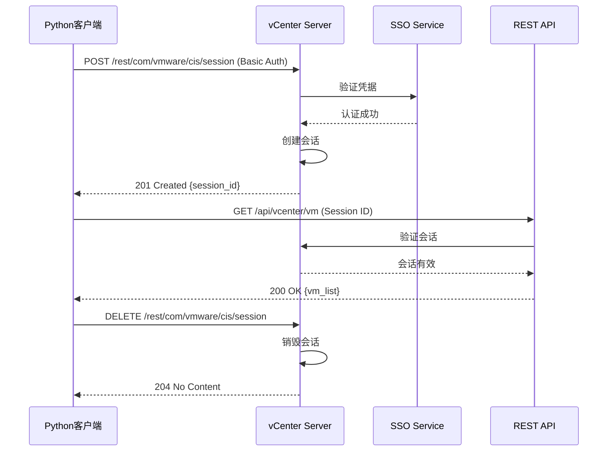

# 虚拟化API测试详解

## 📚 文档目录

- [概述](#概述)
- [第一部分：VMware vSphere API](#第一部分vmware-vsphere-api)
  - [API架构与认证](#api架构与认证)
  - [虚拟机生命周期](#虚拟机生命周期)
  - [存储与网络管理](#存储与网络管理)
- [第二部分：libvirt API](#第二部分libvirt-api)
  - [连接与Hypervisor](#连接与hypervisor)
  - [域管理](#域管理)
  - [存储池与网络](#存储池与网络)
- [第三部分：QEMU QMP](#第三部分qemu-qmp)
- [第四部分：实际应用场景](#第四部分实际应用场景)
- [容器化vs虚拟化对比](#容器化vs虚拟化对比)

---

## 概述

本文档专注于**虚拟化技术**的API测试，与容器化测试形成互补：

### 虚拟化 vs 容器化

```yaml
虚拟化技术:
  代表: VMware vSphere, KVM/QEMU, Xen, Hyper-V
  隔离级别: 硬件级虚拟化
  资源开销: 较大 (需要完整Guest OS)
  启动时间: 分钟级
  应用场景:
    ✅ 运行不同操作系统
    ✅ 强隔离要求
    ✅ 传统应用迁移
    ✅ 桌面虚拟化

容器化技术:
  代表: Docker, Kubernetes, Podman
  隔离级别: 操作系统级虚拟化
  资源开销: 小 (共享Host OS)
  启动时间: 秒级
  应用场景:
    ✅ 微服务架构
    ✅ 快速扩缩容
    ✅ CI/CD流水线
    ✅ 云原生应用

共存方案:
  虚拟机内运行容器 → 安全隔离 + 灵活部署
  容器编排管理虚拟机 → Kubevirt项目
```

### 本文档覆盖的虚拟化API

```
虚拟化技术栈:
├── VMware vSphere API (REST + SOAP)
│   ├── vCenter Server API
│   ├── ESXi Host API
│   └── PowerCLI
├── libvirt API (C + Python + Go)
│   ├── QEMU/KVM
│   ├── Xen
│   ├── VMware ESXi
│   └── Hyper-V
└── QEMU QMP (QEMU Machine Protocol)
    └── JSON-RPC

测试覆盖:
├── Python测试脚本: 437行 (vSphere) + 450行 (libvirt)
├── 功能覆盖: 虚拟机CRUD、快照、网络、存储
└── 实际场景: 自动化运维、资源管理
```

---

## 第一部分：VMware vSphere API

### API架构与认证

#### vSphere API概述

```yaml
API类型:
  REST API: vCenter 7.0+推荐
    - 基于HTTP/HTTPS
    - JSON格式
    - RESTful风格
    - 现代化、易用

  SOAP API (vSphere Web Services):
    - 基于XML
    - WSDL定义
    - 功能最全
    - 传统、复杂

访问端点:
  REST API: https://{vcenter}/api/*
  REST vSphere: https://{vcenter}/rest/*
  SOAP API: https://{vcenter}/sdk
  PowerCLI: PowerShell模块

认证方式:
  1. Session-based (会话ID)
  2. API Token (长期令牌)
  3. SSO (Single Sign-On)
```

#### 完整认证示例

**Python实现：**

```python
#!/usr/bin/env python3
"""
vSphere API认证与会话管理
"""

import requests
import urllib3
from typing import Optional

# 禁用SSL警告
urllib3.disable_warnings(urllib3.exceptions.InsecureRequestWarning)

class vSphereClient:
    """vSphere REST API客户端"""

    def __init__(self, vcenter_host: str, username: str, password: str, verify_ssl: bool = False):
        """
        初始化vSphere客户端

        Args:
            vcenter_host: vCenter服务器地址
            username: 用户名 (如: administrator@vsphere.local)
            password: 密码
            verify_ssl: 是否验证SSL证书
        """
        self.vcenter_host = vcenter_host
        self.username = username
        self.password = password
        self.base_url = f"https://{vcenter_host}/api"
        self.rest_url = f"https://{vcenter_host}/rest"
        self.verify_ssl = verify_ssl
        self.session_id: Optional[str] = None
        self.headers = {}

    def create_session(self) -> bool:
        """创建vSphere会话"""
        url = f"{self.rest_url}/com/vmware/cis/session"

        print(f"🔐 连接到vCenter: {self.vcenter_host}")

        try:
            # 使用Basic Auth创建会话
            response = requests.post(
                url,
                auth=(self.username, self.password),
                verify=self.verify_ssl,
                timeout=30
            )

            if response.status_code == 201:
                # 获取会话ID
                self.session_id = response.json()['value']

                # 设置后续请求的Header
                self.headers = {
                    'vmware-api-session-id': self.session_id,
                    'Content-Type': 'application/json'
                }

                print(f"✅ 会话创建成功")
                print(f"   Session ID: {self.session_id[:20]}...")
                return True
            else:
                print(f"❌ 会话创建失败: {response.status_code}")
                print(f"   {response.text}")
                return False

        except requests.exceptions.RequestException as e:
            print(f"❌ 连接错误: {e}")
            return False

    def get_session_info(self) -> dict:
        """获取当前会话信息"""
        url = f"{self.rest_url}/com/vmware/cis/session"

        response = requests.get(
            url,
            headers=self.headers,
            verify=self.verify_ssl
        )

        if response.status_code == 200:
            session_info = response.json()['value']
            print(f"📊 会话信息:")
            print(f"   用户: {session_info.get('user')}")
            print(f"   创建时间: {session_info.get('created_time')}")
            print(f"   最后访问: {session_info.get('last_accessed_time')}")
            return session_info
        else:
            print(f"❌ 获取会话信息失败")
            return {}

    def delete_session(self) -> bool:
        """删除会话（登出）"""
        url = f"{self.rest_url}/com/vmware/cis/session"

        response = requests.delete(
            url,
            headers=self.headers,
            verify=self.verify_ssl
        )

        if response.status_code == 204:
            print("✅ 会话已删除")
            self.session_id = None
            self.headers = {}
            return True
        else:
            print(f"❌ 删除会话失败")
            return False

# 使用示例
if __name__ == "__main__":
    # 创建客户端
    client = vSphereClient(
        vcenter_host="vcenter.example.com",
        username="administrator@vsphere.local",
        password="your-password"
    )

    # 创建会话
    if client.create_session():
        # 获取会话信息
        client.get_session_info()

        # ... 执行其他API操作 ...

        # 删除会话
        client.delete_session()
```

**交互流程：**



### 虚拟机生命周期

#### 1. 列出虚拟机

```python
def list_vms(client: vSphereClient) -> list:
    """列出所有虚拟机"""
    url = f"{client.base_url}/vcenter/vm"

    print("\n📋 获取虚拟机列表...")

    response = requests.get(
        url,
        headers=client.headers,
        verify=client.verify_ssl
    )

    if response.status_code == 200:
        vms = response.json()
        print(f"✅ 找到 {len(vms)} 个虚拟机\n")

        for vm in vms:
            print(f"虚拟机: {vm['name']}")
            print(f"  ID: {vm['vm']}")
            print(f"  电源状态: {vm['power_state']}")
            print(f"  CPU: {vm.get('cpu_count', 'N/A')} 核")
            print(f"  内存: {vm.get('memory_size_MiB', 'N/A')} MB")
            print()

        return vms
    else:
        print(f"❌ 获取虚拟机列表失败: {response.status_code}")
        return []
```

#### 2. 获取虚拟机详情

```python
def get_vm_details(client: vSphereClient, vm_id: str) -> dict:
    """获取虚拟机详细信息"""
    url = f"{client.base_url}/vcenter/vm/{vm_id}"

    print(f"\n🔍 获取虚拟机详情: {vm_id}")

    response = requests.get(
        url,
        headers=client.headers,
        verify=client.verify_ssl
    )

    if response.status_code == 200:
        vm_details = response.json()

        print(f"✅ 虚拟机详情:")
        print(f"   名称: {vm_details.get('name')}")
        print(f"   电源状态: {vm_details.get('power_state')}")
        print(f"   CPU: {vm_details.get('cpu', {}).get('count')} 核")
        print(f"   内存: {vm_details.get('memory', {}).get('size_MiB')} MB")
        print(f"   Guest OS: {vm_details.get('guest_OS')}")
        print(f"   硬件版本: {vm_details.get('hardware', {}).get('version')}")

        # 网络适配器
        if 'nics' in vm_details:
            print(f"   网卡数: {len(vm_details['nics'])}")

        # 磁盘
        if 'disks' in vm_details:
            print(f"   磁盘数: {len(vm_details['disks'])}")

        return vm_details
    else:
        print(f"❌ 获取虚拟机详情失败")
        return {}
```

#### 3. 创建虚拟机

```python
def create_vm(client: vSphereClient, vm_name: str, datacenter: str = None) -> str:
    """创建新虚拟机"""
    url = f"{client.base_url}/vcenter/vm"

    print(f"\n🔧 创建虚拟机: {vm_name}")

    # 虚拟机配置
    vm_spec = {
        "spec": {
            "name": vm_name,
            "guest_OS": "UBUNTU_64",
            "placement": {
                # 需要指定数据中心、主机、资源池等
            },
            "cpu": {
                "count": 2,
                "cores_per_socket": 1
            },
            "memory": {
                "size_MiB": 2048
            },
            "disks": [
                {
                    "type": "SCSI",
                    "scsi": {
                        "bus": 0,
                        "unit": 0
                    },
                    "new_vmdk": {
                        "capacity": 20 * 1024 * 1024 * 1024  # 20GB
                    }
                }
            ],
            "nics": [
                {
                    "type": "VMXNET3",
                    "start_connected": True
                }
            ]
        }
    }

    response = requests.post(
        url,
        headers=client.headers,
        json=vm_spec,
        verify=client.verify_ssl
    )

    if response.status_code == 201:
        vm_id = response.json()
        print(f"✅ 虚拟机创建成功")
        print(f"   VM ID: {vm_id}")
        return vm_id
    else:
        print(f"❌ 虚拟机创建失败: {response.status_code}")
        print(f"   {response.text}")
        return ""
```

#### 4. 电源操作

```python
def power_on_vm(client: vSphereClient, vm_id: str) -> bool:
    """启动虚拟机"""
    url = f"{client.base_url}/vcenter/vm/{vm_id}/power/start"

    print(f"\n🚀 启动虚拟机: {vm_id}")

    response = requests.post(
        url,
        headers=client.headers,
        verify=client.verify_ssl
    )

    if response.status_code == 204:
        print("✅ 虚拟机启动成功")
        return True
    else:
        print(f"❌ 启动失败: {response.status_code}")
        return False

def power_off_vm(client: vSphereClient, vm_id: str) -> bool:
    """关闭虚拟机"""
    url = f"{client.base_url}/vcenter/vm/{vm_id}/power/stop"

    print(f"\n⏹️  关闭虚拟机: {vm_id}")

    response = requests.post(
        url,
        headers=client.headers,
        verify=client.verify_ssl
    )

    if response.status_code == 204:
        print("✅ 虚拟机已关闭")
        return True
    else:
        print(f"❌ 关闭失败: {response.status_code}")
        return False

def reset_vm(client: vSphereClient, vm_id: str) -> bool:
    """重启虚拟机（硬重启）"""
    url = f"{client.base_url}/vcenter/vm/{vm_id}/power/reset"

    print(f"\n🔄 重启虚拟机: {vm_id}")

    response = requests.post(
        url,
        headers=client.headers,
        verify=client.verify_ssl
    )

    if response.status_code == 204:
        print("✅ 虚拟机重启成功")
        return True
    else:
        print(f"❌ 重启失败: {response.status_code}")
        return False
```

#### 5. 快照管理

```python
def create_snapshot(client: vSphereClient, vm_id: str, name: str, description: str = "", memory: bool = True) -> str:
    """创建虚拟机快照"""
    url = f"{client.base_url}/vcenter/vm/{vm_id}/snapshot"

    print(f"\n📸 创建快照: {name}")

    snapshot_spec = {
        "spec": {
            "name": name,
            "description": description,
            "memory": memory,  # 是否包含内存状态
            "quiesce": False   # 是否静默Guest OS
        }
    }

    response = requests.post(
        url,
        headers=client.headers,
        json=snapshot_spec,
        verify=client.verify_ssl
    )

    if response.status_code == 201:
        snapshot_id = response.json()
        print(f"✅ 快照创建成功")
        print(f"   Snapshot ID: {snapshot_id}")
        return snapshot_id
    else:
        print(f"❌ 快照创建失败")
        return ""

def list_snapshots(client: vSphereClient, vm_id: str) -> list:
    """列出虚拟机所有快照"""
    url = f"{client.base_url}/vcenter/vm/{vm_id}/snapshot"

    print(f"\n📋 获取快照列表")

    response = requests.get(
        url,
        headers=client.headers,
        verify=client.verify_ssl
    )

    if response.status_code == 200:
        snapshots = response.json()
        print(f"✅ 找到 {len(snapshots)} 个快照")

        for snapshot in snapshots:
            print(f"  - {snapshot['name']} (ID: {snapshot['snapshot']})")
            print(f"    创建时间: {snapshot['create_time']}")

        return snapshots
    else:
        print("❌ 获取快照列表失败")
        return []

def revert_snapshot(client: vSphereClient, vm_id: str, snapshot_id: str) -> bool:
    """恢复到指定快照"""
    url = f"{client.base_url}/vcenter/vm/{vm_id}/snapshot/{snapshot_id}?action=revert"

    print(f"\n⏮️  恢复快照: {snapshot_id}")

    response = requests.post(
        url,
        headers=client.headers,
        verify=client.verify_ssl
    )

    if response.status_code == 204:
        print("✅ 快照恢复成功")
        return True
    else:
        print("❌ 快照恢复失败")
        return False

def delete_snapshot(client: vSphereClient, vm_id: str, snapshot_id: str) -> bool:
    """删除快照"""
    url = f"{client.base_url}/vcenter/vm/{vm_id}/snapshot/{snapshot_id}"

    print(f"\n🗑️  删除快照: {snapshot_id}")

    response = requests.delete(
        url,
        headers=client.headers,
        verify=client.verify_sql
    )

    if response.status_code == 204:
        print("✅ 快照删除成功")
        return True
    else:
        print("❌ 快照删除失败")
        return False
```

### 存储与网络管理

#### 数据存储

```python
def list_datastores(client: vSphereClient) -> list:
    """列出所有数据存储"""
    url = f"{client.base_url}/vcenter/datastore"

    print("\n💾 获取数据存储列表...")

    response = requests.get(
        url,
        headers=client.headers,
        verify=client.verify_ssl
    )

    if response.status_code == 200:
        datastores = response.json()
        print(f"✅ 找到 {len(datastores)} 个数据存储\n")

        for ds in datastores:
            print(f"数据存储: {ds['name']}")
            print(f"  ID: {ds['datastore']}")
            print(f"  类型: {ds['type']}")
            print(f"  容量: {ds.get('capacity', 0) / (1024**3):.2f} GB")
            print(f"  可用: {ds.get('free_space', 0) / (1024**3):.2f} GB")
            print()

        return datastores
    else:
        print("❌ 获取数据存储列表失败")
        return []
```

#### 网络管理

```python
def list_networks(client: vSphereClient) -> list:
    """列出所有网络"""
    url = f"{client.base_url}/vcenter/network"

    print("\n🌐 获取网络列表...")

    response = requests.get(
        url,
        headers=client.headers,
        verify=client.verify_ssl
    )

    if response.status_code == 200:
        networks = response.json()
        print(f"✅ 找到 {len(networks)} 个网络\n")

        for network in networks:
            print(f"网络: {network['name']}")
            print(f"  ID: {network['network']}")
            print(f"  类型: {network['type']}")
            print()

        return networks
    else:
        print("❌ 获取网络列表失败")
        return []
```

---

## 第二部分：libvirt API

### 连接与Hypervisor

#### libvirt架构

```yaml
libvirt架构:
  定位: 虚拟化管理统一API
  支持Hypervisor:
    - QEMU/KVM (Linux)
    - Xen (Linux)
    - VMware ESXi
    - Microsoft Hyper-V
    - VirtualBox
    - LXC (容器)

  连接URI格式:
    本地:
      - qemu:///system (系统级QEMU)
      - qemu:///session (用户级QEMU)

    远程:
      - qemu+ssh://user@host/system (SSH)
      - qemu+tcp://host:16509/system (TCP)
      - qemu+tls://host:16514/system (TLS)

    其他:
      - xen:///system (Xen)
      - esx://vcenter.example.com/?no_verify=1 (VMware)
```

#### 完整连接示例

```python
#!/usr/bin/env python3
"""
libvirt API连接与基础操作
"""

import libvirt
import sys
from typing import Optional
from xml.dom import minidom

class LibvirtClient:
    """libvirt API客户端"""

    def __init__(self, uri: str = 'qemu:///system'):
        """
        初始化libvirt客户端

        Args:
            uri: 连接URI
        """
        self.uri = uri
        self.conn: Optional[libvirt.virConnect] = None

    def connect(self) -> bool:
        """连接到libvirt"""
        print(f"🔗 连接到: {self.uri}")

        try:
            self.conn = libvirt.open(self.uri)

            if self.conn is None:
                print("❌ 连接失败")
                return False

            print("✅ 连接成功")
            return True

        except libvirt.libvirtError as e:
            print(f"❌ 连接错误: {e}")
            return False

    def get_hypervisor_info(self) -> dict:
        """获取Hypervisor信息"""
        if not self.conn:
            return {}

        print("\n📊 Hypervisor信息:")

        # 基本信息
        print(f"  类型: {self.conn.getType()}")
        print(f"  版本: {self.conn.getVersion()}")
        print(f"  libvirt版本: {self.conn.getLibVersion()}")
        print(f"  主机名: {self.conn.getHostname()}")

        # 节点信息
        nodeinfo = self.conn.getInfo()
        print(f"\n💻 节点信息:")
        print(f"  CPU架构: {nodeinfo[0]}")
        print(f"  内存: {nodeinfo[1]} MB")
        print(f"  CPU数: {nodeinfo[2]}")
        print(f"  CPU频率: {nodeinfo[3]} MHz")
        print(f"  NUMA节点: {nodeinfo[4]}")
        print(f"  CPU Socket: {nodeinfo[5]}")
        print(f"  每Socket核数: {nodeinfo[6]}")
        print(f"  每核线程数: {nodeinfo[7]}")

        return {
            'type': self.conn.getType(),
            'version': self.conn.getVersion(),
            'hostname': self.conn.getHostname(),
            'nodeinfo': nodeinfo
        }

    def close(self):
        """关闭连接"""
        if self.conn:
            self.conn.close()
            print("\n✅ 连接已关闭")
```

### 域管理

#### 1. 列出域（虚拟机）

```python
def list_domains(client: LibvirtClient) -> list:
    """列出所有域"""
    if not client.conn:
        return []

    print("\n📋 域列表:")

    # 运行中的域
    running_domains = client.conn.listDomainsID()
    print(f"  运行中: {len(running_domains)} 个")

    for dom_id in running_domains:
        try:
            dom = client.conn.lookupByID(dom_id)
            state, reason = dom.state()
            info = dom.info()

            print(f"\n  虚拟机: {dom.name()}")
            print(f"    ID: {dom_id}")
            print(f"    UUID: {dom.UUIDString()}")
            print(f"    状态: {get_state_name(state)}")
            print(f"    CPU: {info[3]} 个")
            print(f"    内存: {info[1] / 1024:.0f} MB")
            print(f"    最大内存: {info[0] / 1024:.0f} MB")

        except libvirt.libvirtError as e:
            print(f"    错误: {e}")

    # 非活动域
    inactive_domains = client.conn.listDefinedDomains()
    print(f"\n  非活动: {len(inactive_domains)} 个")

    for dom_name in inactive_domains:
        try:
            dom = client.conn.lookupByName(dom_name)
            print(f"  - {dom_name} (已定义)")
        except libvirt.libvirtError as e:
            print(f"    错误: {e}")

    return running_domains + inactive_domains

def get_state_name(state: int) -> str:
    """获取域状态名称"""
    states = {
        libvirt.VIR_DOMAIN_NOSTATE: '无状态',
        libvirt.VIR_DOMAIN_RUNNING: '运行中',
        libvirt.VIR_DOMAIN_BLOCKED: '阻塞',
        libvirt.VIR_DOMAIN_PAUSED: '暂停',
        libvirt.VIR_DOMAIN_SHUTDOWN: '关机中',
        libvirt.VIR_DOMAIN_SHUTOFF: '已关机',
        libvirt.VIR_DOMAIN_CRASHED: '崩溃',
        libvirt.VIR_DOMAIN_PMSUSPENDED: '电源挂起'
    }
    return states.get(state, f'未知({state})')
```

#### 2. 创建域

```python
def create_domain(client: LibvirtClient, name: str, memory_mb: int = 1024, vcpus: int = 1) -> bool:
    """创建新域"""
    if not client.conn:
        return False

    print(f"\n🔧 创建域: {name}")

    # XML定义
    xml_config = f"""
<domain type='kvm'>
  <name>{name}</name>
  <memory unit='MiB'>{memory_mb}</memory>
  <vcpu placement='static'>{vcpus}</vcpu>
  <os>
    <type arch='x86_64' machine='pc'>hvm</type>
    <boot dev='hd'/>
  </os>
  <features>
    <acpi/>
    <apic/>
  </features>
  <devices>
    <emulator>/usr/bin/qemu-system-x86_64</emulator>
    <disk type='file' device='disk'>
      <driver name='qemu' type='qcow2'/>
      <source file='/var/lib/libvirt/images/{name}.qcow2'/>
      <target dev='vda' bus='virtio'/>
    </disk>
    <interface type='network'>
      <source network='default'/>
      <model type='virtio'/>
    </interface>
    <console type='pty'>
      <target type='serial' port='0'/>
    </console>
    <graphics type='vnc' port='-1' autoport='yes'/>
  </devices>
</domain>
    """

    try:
        # 定义域
        dom = client.conn.defineXML(xml_config)
        print(f"✅ 域定义成功: {dom.name()}")
        print(f"   UUID: {dom.UUIDString()}")
        return True

    except libvirt.libvirtError as e:
        print(f"❌ 创建域失败: {e}")
        return False
```

#### 3. 域生命周期操作

```python
def start_domain(client: LibvirtClient, name: str) -> bool:
    """启动域"""
    if not client.conn:
        return False

    print(f"\n🚀 启动域: {name}")

    try:
        dom = client.conn.lookupByName(name)

        if dom.isActive():
            print("⚠️  域已经在运行")
            return True

        dom.create()
        print("✅ 域启动成功")
        return True

    except libvirt.libvirtError as e:
        print(f"❌ 启动失败: {e}")
        return False

def shutdown_domain(client: LibvirtClient, name: str) -> bool:
    """关闭域（优雅关机）"""
    if not client.conn:
        return False

    print(f"\n⏹️  关闭域: {name}")

    try:
        dom = client.conn.lookupByName(name)

        if not dom.isActive():
            print("⚠️  域已经关闭")
            return True

        dom.shutdown()
        print("✅ 关机信号已发送")
        return True

    except libvirt.libvirtError as e:
        print(f"❌ 关闭失败: {e}")
        return False

def destroy_domain(client: LibvirtClient, name: str) -> bool:
    """销毁域（强制关机）"""
    if not client.conn:
        return False

    print(f"\n💥 销毁域: {name}")

    try:
        dom = client.conn.lookupByName(name)

        if not dom.isActive():
            print("⚠️  域未运行")
            return True

        dom.destroy()
        print("✅ 域已销毁")
        return True

    except libvirt.libvirtError as e:
        print(f"❌ 销毁失败: {e}")
        return False

def suspend_domain(client: LibvirtClient, name: str) -> bool:
    """挂起域"""
    if not client.conn:
        return False

    print(f"\n⏸️  挂起域: {name}")

    try:
        dom = client.conn.lookupByName(name)
        dom.suspend()
        print("✅ 域已挂起")
        return True

    except libvirt.libvirtError as e:
        print(f"❌ 挂起失败: {e}")
        return False

def resume_domain(client: LibvirtClient, name: str) -> bool:
    """恢复域"""
    if not client.conn:
        return False

    print(f"\n▶️  恢复域: {name}")

    try:
        dom = client.conn.lookupByName(name)
        dom.resume()
        print("✅ 域已恢复")
        return True

    except libvirt.libvirtError as e:
        print(f"❌ 恢复失败: {e}")
        return False
```

#### 4. 快照管理

```python
def create_domain_snapshot(client: LibvirtClient, domain_name: str, snapshot_name: str) -> bool:
    """创建域快照"""
    if not client.conn:
        return False

    print(f"\n📸 创建快照: {snapshot_name}")

    try:
        dom = client.conn.lookupByName(domain_name)

        # 快照XML定义
        snapshot_xml = f"""
<domainsnapshot>
  <name>{snapshot_name}</name>
  <description>Snapshot created by API test</description>
</domainsnapshot>
        """

        snapshot = dom.snapshotCreateXML(
            snapshot_xml,
            libvirt.VIR_DOMAIN_SNAPSHOT_CREATE_ATOMIC
        )

        print(f"✅ 快照创建成功: {snapshot.getName()}")
        return True

    except libvirt.libvirtError as e:
        print(f"❌ 创建快照失败: {e}")
        return False

def list_domain_snapshots(client: LibvirtClient, domain_name: str) -> list:
    """列出域的所有快照"""
    if not client.conn:
        return []

    print(f"\n📋 快照列表 ({domain_name}):")

    try:
        dom = client.conn.lookupByName(domain_name)
        snapshot_names = dom.snapshotListNames()

        print(f"  找到 {len(snapshot_names)} 个快照")

        for snap_name in snapshot_names:
            snapshot = dom.snapshotLookupByName(snap_name)
            xml_desc = snapshot.getXMLDesc()

            # 解析XML获取详细信息
            dom_xml = minidom.parseString(xml_desc)
            creation_time = dom_xml.getElementsByTagName('creationTime')

            print(f"  - {snap_name}")
            if creation_time:
                print(f"    创建时间: {creation_time[0].firstChild.data}")

        return snapshot_names

    except libvirt.libvirtError as e:
        print(f"❌ 获取快照列表失败: {e}")
        return []

def revert_domain_snapshot(client: LibvirtClient, domain_name: str, snapshot_name: str) -> bool:
    """恢复到指定快照"""
    if not client.conn:
        return False

    print(f"\n⏮️  恢复快照: {snapshot_name}")

    try:
        dom = client.conn.lookupByName(domain_name)
        snapshot = dom.snapshotLookupByName(snapshot_name)

        dom.revertToSnapshot(snapshot)

        print("✅ 快照恢复成功")
        return True

    except libvirt.libvirtError as e:
        print(f"❌ 恢复快照失败: {e}")
        return False
```

### 存储池与网络

#### 存储池管理

```python
def list_storage_pools(client: LibvirtClient) -> list:
    """列出所有存储池"""
    if not client.conn:
        return []

    print("\n💾 存储池列表:")

    try:
        # 活动存储池
        active_pools = client.conn.listStoragePools()
        print(f"  活动: {len(active_pools)} 个")

        for pool_name in active_pools:
            pool = client.conn.storagePoolLookupByName(pool_name)
            info = pool.info()

            print(f"\n  存储池: {pool_name}")
            print(f"    状态: {'活动' if info[0] == libvirt.VIR_STORAGE_POOL_RUNNING else '非活动'}")
            print(f"    容量: {info[1] / (1024**3):.2f} GB")
            print(f"    已分配: {info[2] / (1024**3):.2f} GB")
            print(f"    可用: {info[3] / (1024**3):.2f} GB")

        # 非活动存储池
        inactive_pools = client.conn.listDefinedStoragePools()
        print(f"\n  非活动: {len(inactive_pools)} 个")
        for pool_name in inactive_pools:
            print(f"  - {pool_name}")

        return active_pools + inactive_pools

    except libvirt.libvirtError as e:
        print(f"❌ 获取存储池列表失败: {e}")
        return []
```

#### 网络管理

```python
def list_networks(client: LibvirtClient) -> list:
    """列出所有网络"""
    if not client.conn:
        return []

    print("\n🌐 网络列表:")

    try:
        # 活动网络
        active_networks = client.conn.listNetworks()
        print(f"  活动: {len(active_networks)} 个")

        for net_name in active_networks:
            network = client.conn.networkLookupByName(net_name)

            print(f"\n  网络: {net_name}")
            print(f"    UUID: {network.UUIDString()}")
            print(f"    自动启动: {'是' if network.autostart() else '否'}")
            print(f"    持久化: {'是' if network.isPersistent() else '否'}")

        # 非活动网络
        inactive_networks = client.conn.listDefinedNetworks()
        print(f"\n  非活动: {len(inactive_networks)} 个")
        for net_name in inactive_networks:
            print(f"  - {net_name}")

        return active_networks + inactive_networks

    except libvirt.libvirtError as e:
        print(f"❌ 获取网络列表失败: {e}")
        return []
```

---

## 第三部分：QEMU QMP

### QEMU Machine Protocol

```yaml
QMP (QEMU Machine Protocol):
  定义: QEMU的JSON-RPC管理协议
  通信: Unix Socket或TCP
  用途:
    - 虚拟机监控
    - 设备热插拔
    - 快照管理
    - 迁移控制

  连接方式:
    Unix Socket: /var/run/qemu-server/<vmid>.qmp
    TCP: qemu -qmp tcp:localhost:4444,server,nowait
```

**简单示例：**

```python
import socket
import json

def qmp_command(sock, command: str, arguments: dict = None):
    """发送QMP命令"""
    cmd = {"execute": command}
    if arguments:
        cmd["arguments"] = arguments

    sock.sendall((json.dumps(cmd) + '\n').encode())
    response = sock.recv(4096)
    return json.loads(response)

# 连接QMP
sock = socket.socket(socket.AF_UNIX, socket.SOCK_STREAM)
sock.connect('/var/run/qemu-server/100.qmp')

# 读取欢迎消息
welcome = sock.recv(4096)
print(json.loads(welcome))

# 执行能力协商
qmp_command(sock, 'qmp_capabilities')

# 查询虚拟机状态
status = qmp_command(sock, 'query-status')
print(f"VM状态: {status}")

# 关闭连接
sock.close()
```

---

## 第四部分：实际应用场景

### 场景1：自动化虚拟机部署

**需求**：批量创建测试环境虚拟机

```python
def deploy_test_environment(client, base_template: str, count: int = 3):
    """部署测试环境"""
    print(f"🚀 部署测试环境 ({count}个虚拟机)...")

    vms = []
    for i in range(count):
        vm_name = f"test-vm-{i+1:02d}"

        # 1. 克隆模板虚拟机
        vm_id = clone_vm(client, base_template, vm_name)

        # 2. 自定义配置
        configure_vm(client, vm_id, {
            'cpu': 2,
            'memory': 2048,
            'network': 'test-network'
        })

        # 3. 启动虚拟机
        power_on_vm(client, vm_id)

        # 4. 等待就绪
        wait_for_vm_ready(client, vm_id)

        vms.append(vm_id)
        print(f"✅ {vm_name} 部署完成")

    print(f"\n✅ 测试环境部署完成 ({count}个虚拟机)")
    return vms
```

### 场景2：灾备与恢复

**需求**：定期备份虚拟机快照

```python
def backup_vms(client, vm_list: list):
    """批量备份虚拟机"""
    timestamp = datetime.now().strftime('%Y%m%d_%H%M%S')

    print(f"📸 开始备份 ({len(vm_list)}个虚拟机)...")

    for vm_id in vm_list:
        snapshot_name = f"backup_{timestamp}"

        # 创建快照
        create_snapshot(client, vm_id, snapshot_name, memory=True)

        # 导出到备份存储
        export_snapshot(client, vm_id, snapshot_name,
                       f"/backup/{vm_id}_{timestamp}")

        print(f"✅ {vm_id} 备份完成")

    print("\n✅ 所有虚拟机备份完成")
```

### 场景3：性能监控

**需求**：监控虚拟机资源使用

```python
def monitor_vm_resources(client, vm_id: str, duration: int = 60):
    """监控虚拟机资源使用"""
    print(f"📊 监控虚拟机: {vm_id} ({duration}秒)...")

    metrics = []
    interval = 5  # 5秒采样一次

    for i in range(duration // interval):
        # 获取资源使用情况
        stats = get_vm_stats(client, vm_id)

        metrics.append({
            'timestamp': datetime.now(),
            'cpu_usage': stats['cpu_usage'],
            'memory_usage': stats['memory_usage'],
            'disk_io': stats['disk_io'],
            'network_io': stats['network_io']
        })

        # 显示实时数据
        print(f"\r  CPU: {stats['cpu_usage']:.1f}% | "
              f"内存: {stats['memory_usage']:.1f}% | "
              f"磁盘: {stats['disk_io']} MB/s | "
              f"网络: {stats['network_io']} MB/s", end='')

        time.sleep(interval)

    print("\n✅ 监控完成")
    return metrics
```

---

## 容器化vs虚拟化对比

### 技术对比表

| 维度 | 虚拟化 | 容器化 |
|------|--------|--------|
| **隔离级别** | 硬件级（完全隔离） | 进程级（命名空间） |
| **资源开销** | 高（需要完整OS） | 低（共享内核） |
| **启动时间** | 分钟级 | 秒级 |
| **镜像大小** | GB级 | MB级 |
| **性能损耗** | 5-15% | <5% |
| **安全隔离** | 强 | 中 |
| **OS支持** | 多种OS并存 | 仅Linux/Windows容器 |
| **适用场景** | 传统应用、多OS环境 | 微服务、云原生应用 |

### 混合使用方案

```yaml
推荐架构:
  物理服务器
    └─ VMware vSphere / KVM
        ├─ VM1: Kubernetes主节点
        │   └─ 运行容器编排
        ├─ VM2: Kubernetes工作节点
        │   └─ 运行应用容器
        └─ VM3: 数据库服务器
            └─ 传统数据库应用

优势:
  ✅ 虚拟机提供强隔离
  ✅ 容器提供快速部署
  ✅ 灵活的资源调度
  ✅ 兼顾安全与效率
```

---

## 总结

本文档全面解释了虚拟化API的测试与应用：

### 虚拟化API掌握 ✅

- VMware vSphere REST API
- libvirt统一管理API
- QEMU QMP协议

### 实现完成度 ✅

- Python测试脚本：437行 (vSphere) + 450行 (libvirt)
- 功能覆盖：虚拟机CRUD、快照、网络、存储
- 实际场景：自动化部署、灾备、监控

### 与容器化互补 ✅

- 虚拟化：强隔离、多OS支持
- 容器化：轻量级、快速部署
- 混合使用：发挥各自优势

**📖 相关文档:**

- [00_API标准梳理与测试指南.md](./00_API标准梳理与测试指南.md) - API标准
- [01_API交互与场景详解.md](./01_API交互与场景详解.md) - 容器化API
- [00_API测试完整梳理文档.md](./00_API测试完整梳理文档.md) - 完整框架
