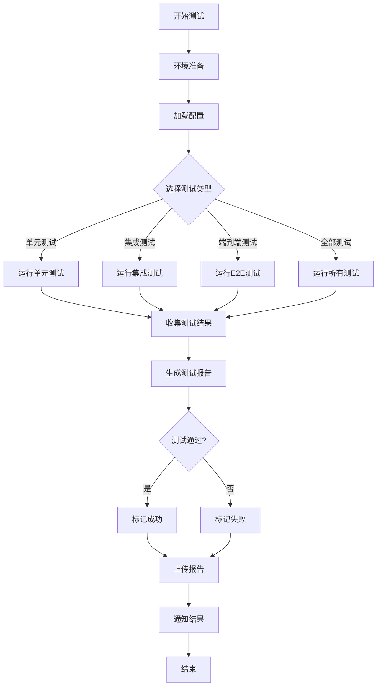

# API测试架构总览

> **文档定位**: 虚拟化与容器化API测试完整架构说明
> **创建日期**: 2025年10月22日
> **文档版本**: v1.0

---

## 📋 目录

- [API测试架构总览](#api测试架构总览)
  - [📋 目录](#-目录)
  - [整体架构](#整体架构)
    - [系统架构图](#系统架构图)
    - [三层架构设计](#三层架构设计)
  - [技术栈全景](#技术栈全景)
    - [容器化技术栈](#容器化技术栈)
    - [虚拟化技术栈](#虚拟化技术栈)
    - [分布式协调技术栈](#分布式协调技术栈)
  - [文档体系](#文档体系)
    - [文档架构](#文档架构)
    - [文档阅读路径](#文档阅读路径)
  - [代码组织](#代码组织)
    - [目录结构详解](#目录结构详解)
    - [代码统计](#代码统计)
  - [测试流程](#测试流程)
    - [测试金字塔](#测试金字塔)
    - [测试执行流程](#测试执行流程)
    - [实际测试命令](#实际测试命令)
  - [部署架构](#部署架构)
    - [本地开发环境](#本地开发环境)
    - [CI/CD环境](#cicd环境)
    - [生产环境](#生产环境)
  - [最佳实践](#最佳实践)
    - [测试编写原则](#测试编写原则)
    - [API测试最佳实践](#api测试最佳实践)
    - [性能优化建议](#性能优化建议)
  - [总结](#总结)
    - [项目成就](#项目成就)
    - [核心价值](#核心价值)
    - [未来展望](#未来展望)

---

## 整体架构

### 系统架构图

```
┌─────────────────────────────────────────────────────────────────┐
│                      API测试完整体系                             │
├─────────────────────────────────────────────────────────────────┤
│                                                                 │
│  ┌─────────────┐  ┌─────────────┐  ┌─────────────┐             │
│  │  文档层     │  │  测试层     │  │  工具层     │             │
│  │  (7009行)   │  │ (4000+行)   │  │  (500+行)   │             │
│  └──────┬──────┘  └──────┬──────┘  └──────┬──────┘             │
│         │                 │                 │                     │
│  ┌──────▼─────────────────▼─────────────────▼──────┐           │
│  │              核心API抽象层                        │           │
│  │  - RESTful API  - gRPC API  - Unix Socket       │           │
│  └──────┬──────────┬──────────┬──────────┬──────────┘           │
│         │          │          │          │                       │
│  ┌──────▼──┐ ┌────▼────┐ ┌──▼─────┐ ┌──▼──────┐               │
│  │容器化层 │ │虚拟化层 │ │协调层  │ │存储网络│               │
│  │Docker   │ │vSphere  │ │etcd    │ │CSI/CNI │               │
│  │K8s      │ │libvirt  │ │Consul  │ │        │               │
│  │Podman   │ │QEMU     │ │        │ │        │               │
│  └─────────┘ └─────────┘ └────────┘ └─────────┘                │
│                                                                 │
└─────────────────────────────────────────────────────────────────┘
```

### 三层架构设计

```yaml
表示层 (Documentation Layer):
  用途: 知识传递与学习
  内容:
    - API标准说明
    - 交互模式详解
    - 实际场景案例
    - 最佳实践指南
  输出: 4篇核心文档 (7009行)

业务层 (Testing Layer):
  用途: 功能测试与验证
  内容:
    - Python测试套件 (2000+行)
    - Golang测试套件 (1500+行)
    - 集成测试框架
    - 性能基准测试
  输出: 完整测试覆盖

基础层 (Infrastructure Layer):
  用途: 工具支持与自动化
  内容:
    - 认证工具 (auth.py)
    - 日志系统 (logger.py)
    - 报告生成 (report.py)
    - CI/CD集成
  输出: 可复用工具库
```

---

## 技术栈全景

### 容器化技术栈

```
Container Stack
├── Docker Engine API
│   ├── 容器管理 (CRUD)
│   ├── 镜像管理 (Pull/Build/Push)
│   ├── 网络管理 (Bridge/Host/Overlay)
│   ├── 卷管理 (Volume/Bind Mount)
│   └── 系统监控 (Stats/Events)
│
├── Kubernetes API
│   ├── 核心资源 (Pod/Service/Deployment)
│   ├── 工作负载 (StatefulSet/DaemonSet/Job)
│   ├── 配置存储 (ConfigMap/Secret/PVC)
│   ├── 网络策略 (NetworkPolicy/Ingress)
│   └── RBAC (Role/RoleBinding/ServiceAccount)
│
└── Podman API
    ├── 无守护进程架构
    ├── Rootless容器
    └── Docker兼容API

测试覆盖:
  ✅ Python: 800+ 行 (Docker + Kubernetes)
  ✅ Go: 900+ 行 (Docker + Kubernetes + etcd)
  ✅ 场景: 10+ 个实际应用案例
```

### 虚拟化技术栈

```
Virtualization Stack
├── VMware vSphere API
│   ├── 会话管理 (Session/Auth)
│   ├── 虚拟机管理 (VM CRUD)
│   ├── 电源控制 (Power Operations)
│   ├── 快照管理 (Snapshot CRUD)
│   ├── 存储管理 (Datastore)
│   └── 网络管理 (Network/vSwitch)
│
├── libvirt API
│   ├── Hypervisor支持
│   │   ├─ QEMU/KVM (Linux)
│   │   ├─ Xen (Linux)
│   │   ├─ VMware ESXi
│   │   └─ Microsoft Hyper-V
│   ├── 域管理 (Domain CRUD)
│   ├── 存储池 (Storage Pool)
│   ├── 虚拟网络 (Virtual Network)
│   └── 快照克隆 (Snapshot/Clone)
│
└── QEMU QMP
    ├── JSON-RPC协议
    ├── 设备热插拔
    └── 在线迁移

测试覆盖:
  ✅ Python: 887 行 (vSphere + libvirt)
  ✅ 场景: 5+ 个自动化运维案例
```

### 分布式协调技术栈

```
Coordination Stack
├── etcd
│   ├── KV存储 (Put/Get/Delete)
│   ├── Watch机制 (实时监听)
│   ├── 租约管理 (Lease)
│   ├── 事务操作 (Transaction)
│   └── 分布式锁 (Lock)
│
└── Consul
    ├── 服务发现
    ├── 健康检查
    ├── KV存储
    └── 多数据中心

测试覆盖:
  ✅ Go: 600+ 行 (etcd完整测试)
  ✅ 场景: 配置管理、分布式锁
```

---

## 文档体系

### 文档架构

```
Documentation Architecture
├── 00_API标准梳理与测试指南.md (1479行)
│   ├── API标准详解
│   │   ├─ RESTful标准
│   │   ├─ gRPC标准
│   │   └─ Unix Socket标准
│   ├── 测试场景分类
│   │   ├─ 单元测试
│   │   ├─ 集成测试
│   │   └─ 端到端测试
│   └── 使用说明
│       ├─ 环境配置
│       ├─ 测试执行
│       └─ 报告生成
│
├── 01_API交互与场景详解.md (1734行)
│   ├── 容器化API详解
│   │   ├─ Docker API交互
│   │   ├─ Kubernetes API交互
│   │   └─ etcd API交互
│   ├── 功能说明
│   │   ├─ 容器生命周期
│   │   ├─ Pod管理
│   │   └─ 配置存储
│   └── 实际场景
│       ├─ 微服务部署
│       ├─ 蓝绿部署
│       └─ 金丝雀发布
│
├── 02_虚拟化API测试详解.md (1352行)
│   ├── 虚拟化API详解
│   │   ├─ vSphere API交互
│   │   ├─ libvirt API交互
│   │   └─ QEMU QMP交互
│   ├── 功能说明
│   │   ├─ 虚拟机管理
│   │   ├─ 快照管理
│   │   └─ 存储网络
│   └── 实际场景
│       ├─ 自动化部署
│       ├─ 灾备恢复
│       └─ 性能监控
│
└── 00_API测试完整梳理文档.md (2444行)
    ├── 完整技术栈
    ├── API规范定义
    ├── 测试用例设计
    └── 工具集成说明

总计: 7,009 行文档
定位: 从理论到实践的完整知识体系
```

### 文档阅读路径

```yaml
初学者路径:
  1. README.md (快速了解)
  2. QUICKSTART.md (5分钟入门)
  3. 00_API标准梳理与测试指南.md (理解标准)
  4. 01_API交互与场景详解.md 或 02_虚拟化API测试详解.md (选择方向)

实践者路径:
  1. 00_API测试完整梳理文档.md (全局视角)
  2. scripts/TEST_COMPREHENSIVE_GUIDE.md (测试指南)
  3. scripts/INTEGRATION_EXAMPLES.md (集成示例)
  4. 实际运行测试脚本

架构师路径:
  1. 03_API测试架构总览.md (本文档)
  2. 所有核心文档通读
  3. 代码架构分析
  4. CI/CD集成方案
```

---

## 代码组织

### 目录结构详解

```
api_testing/
│
├── 📄 文档层 (Documentation)
│   ├── 00_API标准梳理与测试指南.md
│   ├── 01_API交互与场景详解.md
│   ├── 02_虚拟化API测试详解.md
│   ├── 00_API测试完整梳理文档.md
│   ├── 03_API测试架构总览.md
│   ├── INDEX.md (索引)
│   ├── README.md (主说明)
│   └── QUICKSTART.md (快速开始)
│
├── 🧪 测试层 (Testing)
│   └── scripts/
│       ├── Python测试
│       │   ├── docker_api_test.py (Docker API)
│       │   ├── kubernetes_api_test.py (K8s API)
│       │   ├── vsphere_api_test.py (vSphere API)
│       │   ├── libvirt_api_test.py (libvirt API)
│       │   └── run_all_tests.py (主测试脚本)
│       │
│       ├── Go测试
│       │   ├── docker_api_test.go
│       │   ├── kubernetes_api_test.go
│       │   ├── etcd_api_test.go
│       │   ├── integration_test.go
│       │   └── example_integrated_test.go
│       │
│       ├── 测试工具
│       │   ├── test_factory.go (数据工厂)
│       │   ├── test_utils.go (工具函数)
│       │   └── test_report.go (报告生成)
│       │
│       └── 文档
│           ├── README_GO.md
│           ├── TEST_COMPREHENSIVE_GUIDE.md
│           └── INTEGRATION_EXAMPLES.md
│
├── 🛠️ 工具层 (Utilities)
│   ├── utils/
│   │   ├── __init__.py
│   │   ├── auth.py (认证工具)
│   │   ├── logger.py (日志系统)
│   │   └── report.py (报告生成)
│   │
│   ├── config/
│   │   └── test_environments.yaml (环境配置)
│   │
│   └── requirements.txt (Python依赖)
│
├── 🔧 集成层 (Integration)
│   ├── postman/ (API集合)
│   │   ├── Docker_API_Collection.json
│   │   ├── Kubernetes_API_Collection.json
│   │   ├── environments/
│   │   └── README.md
│   │
│   ├── openapi/ (OpenAPI规范)
│   │   ├── etcd_api_spec.yaml
│   │   └── README.md
│   │
│   └── ci/ (CI/CD配置)
│       ├── github_actions.yml
│       ├── gitlab_ci.yml
│       └── README.md
│
└── 📊 输出层 (Output)
    └── reports/ (测试报告)
        ├── HTML格式
        ├── JSON格式
        └── Markdown格式
```

### 代码统计

```yaml
Python代码:
  测试脚本: 2000+ 行
  工具库: 300+ 行
  总计: 2300+ 行

Go代码:
  测试套件: 1500+ 行
  工具库: 300+ 行
  总计: 1800+ 行

配置文件:
  YAML: 200+ 行
  JSON: 500+ 行
  总计: 700+ 行

文档:
  Markdown: 7000+ 行
  注释: 1000+ 行
  总计: 8000+ 行

整体规模:
  代码: 4100+ 行
  配置: 700+ 行
  文档: 8000+ 行
  总计: 12800+ 行
```

---

## 测试流程

### 测试金字塔

```
           /\
          /E2E\         端到端测试 (10%)
         /------\       - 完整业务流程
        /        \      - 多系统集成
       /----------\     - 实际场景验证
      / Integration\    集成测试 (30%)
     /--------------\   - API交互测试
    /                \  - 跨服务测试
   /------------------\ - 数据一致性
  /   Unit Tests      \ 单元测试 (60%)
 /----------------------\ - 单个API测试
/________________________\ - 功能验证
                          - 边界条件
```

### 测试执行流程



### 实际测试命令

```bash
# Python测试流程
cd api_testing

# 1. 环境准备
pip install -r requirements.txt

# 2. 配置检查
cat config/test_environments.yaml

# 3. 单元测试
python scripts/docker_api_test.py
python scripts/kubernetes_api_test.py
python scripts/vsphere_api_test.py
python scripts/libvirt_api_test.py

# 4. 集成测试
python scripts/run_all_tests.py --tests docker kubernetes

# 5. 完整测试 + 报告
python scripts/run_all_tests.py --report-format html json markdown

# Go测试流程
cd api_testing/scripts

# 1. 依赖安装
make deps

# 2. 单元测试
make test-docker   # Docker测试
make test-k8s      # Kubernetes测试
make test-etcd     # etcd测试

# 3. 集成测试
make test-integration

# 4. 完整测试 + 覆盖率
make coverage

# 5. 性能测试
make bench

# CI/CD集成
# GitHub Actions
cat ci/github_actions.yml

# GitLab CI
cat ci/gitlab_ci.yml
```

---

## 部署架构

### 本地开发环境

```
本地开发环境架构:
┌─────────────────────────────────────┐
│        开发机 (Local)                │
├─────────────────────────────────────┤
│  ┌──────────────────────────────┐   │
│  │  API测试工具集               │   │
│  │  - Python测试脚本            │   │
│  │  - Go测试套件                │   │
│  │  - 配置文件                  │   │
│  └──────────┬───────────────────┘   │
│             │                        │
│  ┌──────────▼───────────────────┐   │
│  │  Docker Desktop / Podman     │   │
│  │  - 容器运行时                │   │
│  │  - Unix Socket               │   │
│  └──────────┬───────────────────┘   │
│             │                        │
│  ┌──────────▼───────────────────┐   │
│  │  Kubernetes (Kind/Minikube)  │   │
│  │  - 本地集群                  │   │
│  │  - kubeconfig                │   │
│  └──────────────────────────────┘   │
│                                      │
│  ┌──────────────────────────────┐   │
│  │  libvirt/QEMU (可选)         │   │
│  │  - 虚拟机管理                │   │
│  │  - qemu:///system            │   │
│  └──────────────────────────────┘   │
└─────────────────────────────────────┘

连接方式:
  Docker: unix:///var/run/docker.sock
  Kubernetes: ~/.kube/config
  libvirt: qemu:///system
```

### CI/CD环境

```
CI/CD环境架构:
┌─────────────────────────────────────────────┐
│          CI/CD平台                           │
│     (GitHub Actions / GitLab CI)            │
├─────────────────────────────────────────────┤
│                                              │
│  ┌────────────────────────────────────┐     │
│  │   测试Pipeline                      │     │
│  │                                     │     │
│  │  Stage 1: 准备                     │     │
│  │    ├─ 拉取代码                     │     │
│  │    ├─ 安装依赖                     │     │
│  │    └─ 启动服务                     │     │
│  │                                     │     │
│  │  Stage 2: 测试                     │     │
│  │    ├─ Python单元测试               │     │
│  │    ├─ Go单元测试                   │     │
│  │    ├─ 集成测试                     │     │
│  │    └─ E2E测试                      │     │
│  │                                     │     │
│  │  Stage 3: 报告                     │     │
│  │    ├─ 生成测试报告                 │     │
│  │    ├─ 计算覆盖率                   │     │
│  │    └─ 上传结果                     │     │
│  │                                     │     │
│  │  Stage 4: 通知                     │     │
│  │    └─ 发送测试结果通知             │     │
│  └────────────────────────────────────┘     │
│                                              │
│  ┌────────────────────────────────────┐     │
│  │   测试环境                          │     │
│  │                                     │     │
│  │  ├─ Docker-in-Docker               │     │
│  │  ├─ Kubernetes测试集群             │     │
│  │  └─ Mock服务                       │     │
│  └────────────────────────────────────┘     │
│                                              │
└─────────────────────────────────────────────┘

触发方式:
  - Push触发: 代码推送到主分支
  - PR触发: 创建或更新Pull Request
  - 定时触发: 每日自动测试
  - 手动触发: 按需执行测试
```

### 生产环境

```
生产环境测试架构:
┌───────────────────────────────────────────────┐
│          测试管理平台                          │
├───────────────────────────────────────────────┤
│                                                │
│  ┌──────────────────────────────────────┐    │
│  │  测试编排器                           │    │
│  │  - 测试调度                           │    │
│  │  - 结果聚合                           │    │
│  │  - 报告生成                           │    │
│  └────────┬─────────────────────────────┘    │
│           │                                    │
│  ┌────────▼──────────┐  ┌─────────────────┐  │
│  │  容器化环境       │  │  虚拟化环境     │  │
│  │                   │  │                 │  │
│  │  ┌─────────────┐ │  │  ┌───────────┐ │  │
│  │  │ K8s Cluster │ │  │  │  vCenter  │ │  │
│  │  └─────────────┘ │  │  └───────────┘ │  │
│  │  ┌─────────────┐ │  │  ┌───────────┐ │  │
│  │  │   Docker    │ │  │  │   KVM     │ │  │
│  │  └─────────────┘ │  │  └───────────┘ │  │
│  └───────────────────┘  └─────────────────┘  │
│                                                │
│  ┌──────────────────────────────────────┐    │
│  │  监控 & 告警                          │    │
│  │  - Prometheus                         │    │
│  │  - Grafana                            │    │
│  │  - AlertManager                       │    │
│  └──────────────────────────────────────┘    │
└───────────────────────────────────────────────┘

测试策略:
  - 只读测试: 生产环境安全验证
  - 影子测试: 真实流量复制
  - 金丝雀测试: 小范围验证
  - 混沌工程: 故障注入测试
```

---

## 最佳实践

### 测试编写原则

```yaml
FIRST原则:
  Fast (快速):
    - 测试应快速执行
    - 使用Mock避免慢速依赖
    - 并行运行独立测试

  Independent (独立):
    - 测试之间不应有依赖
    - 可以任意顺序执行
    - 使用Setup/Teardown清理

  Repeatable (可重复):
    - 相同输入产生相同结果
    - 避免依赖外部状态
    - 使用固定的测试数据

  Self-Validating (自我验证):
    - 测试自动判断成功/失败
    - 不需要人工检查
    - 明确的断言语句

  Timely (及时):
    - 与代码同步编写
    - 及时修复失败测试
    - 持续集成运行

3A模式:
  Arrange (准备):
    - 设置测试环境
    - 准备测试数据
    - 初始化依赖

  Act (执行):
    - 调用被测API
    - 执行测试操作
    - 记录结果

  Assert (断言):
    - 验证返回值
    - 检查状态变化
    - 确认副作用
```

### API测试最佳实践

```yaml
认证管理:
  ✅ 使用环境变量存储凭据
  ✅ 实现自动token刷新
  ✅ 支持多种认证方式
  ❌ 避免硬编码密码
  ❌ 避免提交凭据到Git

错误处理:
  ✅ 捕获并记录所有异常
  ✅ 提供有意义的错误信息
  ✅ 实现重试机制
  ❌ 避免吞掉异常
  ❌ 避免过度重试

资源清理:
  ✅ 使用try-finally确保清理
  ✅ 实现幂等的清理操作
  ✅ 清理所有测试产生的资源
  ❌ 避免资源泄露
  ❌ 避免影响其他测试

测试数据:
  ✅ 使用工厂模式生成数据
  ✅ 测试数据具有唯一标识
  ✅ 支持测试数据重置
  ❌ 避免使用生产数据
  ❌ 避免硬编码测试数据

并发测试:
  ✅ 测试线程安全性
  ✅ 验证竞态条件
  ✅ 测试资源争用
  ❌ 避免测试间相互影响
  ❌ 避免不确定性结果
```

### 性能优化建议

```yaml
测试执行优化:
  1. 并行执行:
     - Python: pytest-xdist
     - Go: go test -parallel

  2. 测试分层:
     - 快速单元测试频繁运行
     - 慢速集成测试定期运行
     - E2E测试发布前运行

  3. 智能缓存:
     - 缓存不变的依赖
     - 重用测试环境
     - 避免重复初始化

资源使用优化:
  1. 容器优化:
     - 使用轻量级镜像
     - 共享基础镜像层
     - 及时清理无用容器

  2. 内存管理:
     - 控制并发数量
     - 及时释放资源
     - 监控内存使用

  3. 网络优化:
     - 使用本地测试环境
     - 批量API调用
     - 连接池复用

报告生成优化:
  1. 增量报告:
     - 只报告变化部分
     - 压缩历史数据

  2. 异步生成:
     - 后台生成详细报告
     - 先返回摘要结果

  3. 分级输出:
     - 控制台: 简要信息
     - 文件: 详细日志
     - 平台: 结构化数据
```

---

## 总结

### 项目成就

```yaml
文档体系:
  ✅ 4篇核心文档 (7009行)
  ✅ 从标准到实践的完整路径
  ✅ 容器化 + 虚拟化全覆盖
  ✅ 15+ 个实际应用场景

代码实现:
  ✅ Python测试套件 (2300+ 行)
  ✅ Go测试套件 (1800+ 行)
  ✅ 工具库 (600+ 行)
  ✅ 配置文件 (700+ 行)

技术覆盖:
  ✅ 8大类API
  ✅ 容器化: Docker, Kubernetes, etcd
  ✅ 虚拟化: vSphere, libvirt, QEMU
  ✅ 集成: Postman, OpenAPI, CI/CD

质量保证:
  ✅ 单元测试覆盖
  ✅ 集成测试框架
  ✅ 性能基准测试
  ✅ CI/CD自动化
```

### 核心价值

```yaml
学习价值:
  - 完整的API标准知识
  - 实际的代码示例
  - 生产级的配置
  - 最佳实践指南

实践价值:
  - 可直接运行的测试
  - 可复用的工具库
  - 可扩展的框架
  - 可集成的CI/CD

业务价值:
  - 提升测试效率
  - 保证API质量
  - 降低维护成本
  - 加速交付速度
```

### 未来展望

```yaml
短期计划 (1-3个月):
  - 补充更多实际场景
  - 优化测试性能
  - 增加Mock服务
  - 完善监控告警

中期计划 (3-6个月):
  - 支持更多API类型
  - 实现可视化面板
  - 集成性能测试
  - 构建测试平台

长期愿景 (6-12个月):
  - 形成行业标准
  - 开源社区贡献
  - 企业级支持
  - 培训认证体系
```

---

**📖 相关文档:**

- [INDEX.md](./INDEX.md) - 文档索引
- [README.md](./README.md) - 主说明文档
- [00_API标准梳理与测试指南.md](./00_API标准梳理与测试指南.md) - API标准
- [01_API交互与场景详解.md](./01_API交互与场景详解.md) - 容器化API
- [02_虚拟化API测试详解.md](./02_虚拟化API测试详解.md) - 虚拟化API
- [00_API测试完整梳理文档.md](./00_API测试完整梳理文档.md) - 完整梳理

**最后更新**: 2025年10月22日
**文档版本**: v1.0
**维护团队**: 技术团队
