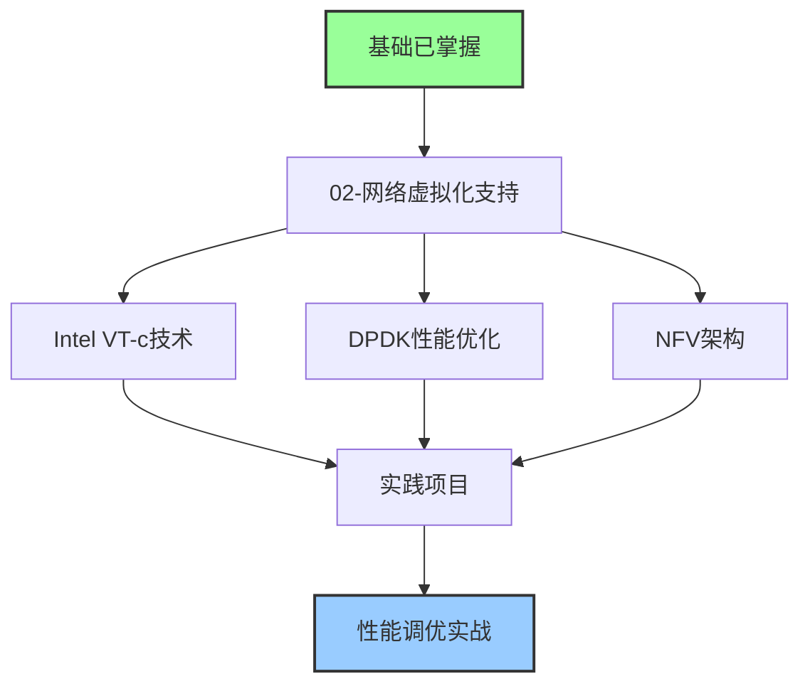
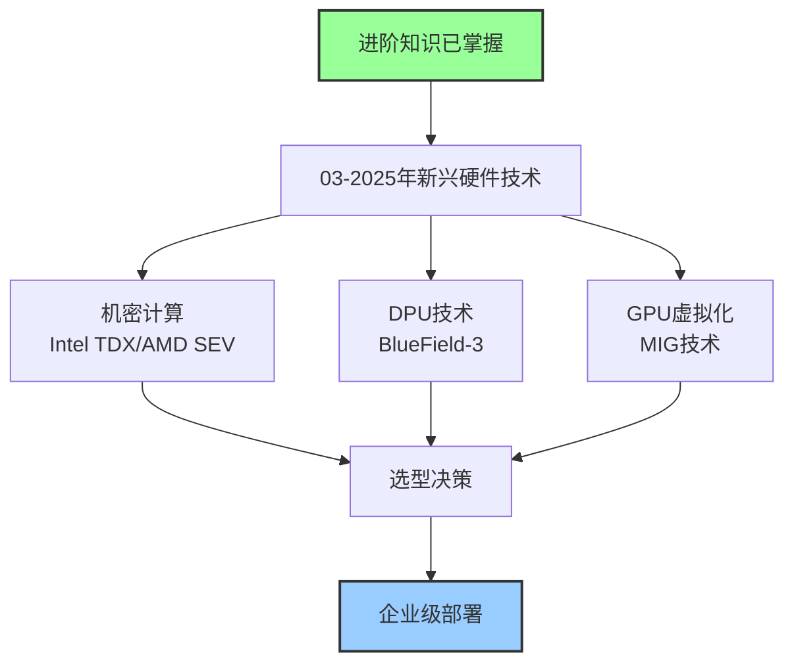
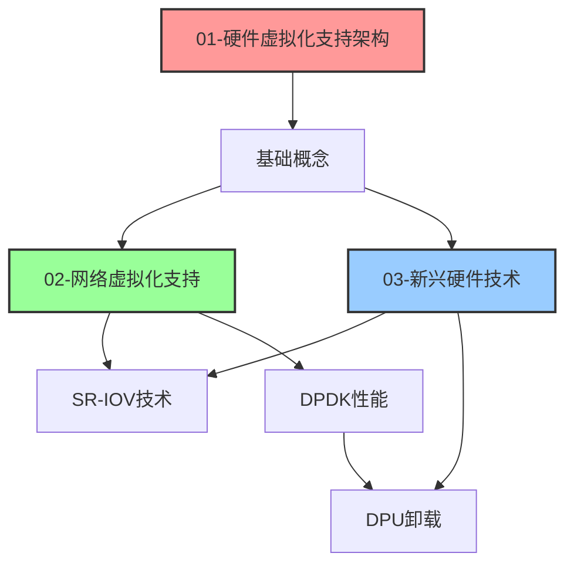

# 05_硬件支持分析 导航指南

> **目录说明**: 硬件虚拟化支持技术体系完整文档索引  
> **更新日期**: 2025年10月20日  
> **状态**: ✅ 已完成结构优化

---

## 📋 目录

- [05\_硬件支持分析 导航指南](#05_硬件支持分析-导航指南)
  - [📋 目录](#-目录)
  - [1. 文档结构概览](#1-文档结构概览)
    - [1.1 核心技术文档](#11-核心技术文档)
    - [1.2 分析报告](#12-分析报告)
  - [2. 学习路径推荐](#2-学习路径推荐)
    - [2.1 初学者路径](#21-初学者路径)
    - [2.2 进阶路径](#22-进阶路径)
    - [2.3 专家路径](#23-专家路径)
  - [3. 文档关联关系](#3-文档关联关系)
    - [3.1 技术依赖关系](#31-技术依赖关系)
    - [3.2 主题交叉引用](#32-主题交叉引用)
  - [4. 快速查找](#4-快速查找)
    - [4.1 按技术分类](#41-按技术分类)
      - [CPU虚拟化](#cpu虚拟化)
      - [内存虚拟化](#内存虚拟化)
      - [网络虚拟化](#网络虚拟化)
      - [机密计算](#机密计算)
      - [GPU虚拟化](#gpu虚拟化)
    - [4.2 按厂商分类](#42-按厂商分类)
      - [Intel技术](#intel技术)
      - [AMD技术](#amd技术)
      - [NVIDIA技术](#nvidia技术)
      - [ARM技术](#arm技术)
  - [5. 文档维护信息](#5-文档维护信息)
    - [最近更新](#最近更新)
    - [文档质量指标](#文档质量指标)
    - [反馈与贡献](#反馈与贡献)

---

## 1. 文档结构概览

### 1.1 核心技术文档

| 序号 | 文档名称 | 主要内容 | 难度 | 推荐度 |
|------|---------|---------|------|--------|
| **01** | [硬件虚拟化支持架构](./01_硬件虚拟化支持架构.md) | CPU/内存/I/O虚拟化基础 | ⭐⭐⭐ | ⭐⭐⭐⭐⭐ |
| **02** | [网络虚拟化支持](./02_网络虚拟化支持.md) | SR-IOV/DPDK/NFV技术 | ⭐⭐⭐⭐ | ⭐⭐⭐⭐⭐ |
| **03** | [2025年新兴硬件技术深度分析](./03_2025年新兴硬件技术深度分析.md) | 机密计算/DPU/GPU虚拟化 | ⭐⭐⭐⭐⭐ | ⭐⭐⭐⭐⭐ |

### 1.2 分析报告

| 文档名称 | 用途 | 状态 |
|---------|------|------|
| [结构分析报告](./结构分析报告.md) | 文档结构问题分析与修复计划 | ✅ 完成 |
| [最终结构验证报告](./最终结构验证报告.md) | 结构优化成果验证 | ✅ 完成 |
| [术语对照表](./术语对照表.md) | 统一技术术语定义 | 🔄 创建中 |

---

## 2. 学习路径推荐

### 2.1 初学者路径

**适用人群**: 刚接触虚拟化技术的学习者

**学习顺序**:

1. 📖 阅读 [01-硬件虚拟化支持架构](./01_硬件虚拟化支持架构.md) 第1-3章
2. 🔬 理解基础概念：VMX、EPT、SR-IOV
3. 💻 实践：在虚拟机中查看硬件虚拟化特性
4. 📝 完成基础测试题（见术语对照表）

### 2.2 进阶路径

**适用人群**: 有一定虚拟化基础，需要深入了解网络虚拟化

**学习顺序**:

1. 📖 阅读 [02-网络虚拟化支持](./02_网络虚拟化支持.md) 全文
2. 🔬 深入研究：DPDK、Open vSwitch
3. 💻 实践：配置SR-IOV、部署OVS-DPDK
4. 📊 性能测试：使用iperf3进行基准测试

### 2.3 专家路径

**适用人群**: 需要掌握最新硬件技术的架构师和研发人员

**学习顺序**:

1. 📖 阅读 [03-2025年新兴硬件技术深度分析](./03_2025年新兴硬件技术深度分析.md)
2. 🔬 技术评估：TDX vs SEV-SNP对比
3. 💻 实践：配置Confidential Containers
4. 📊 ROI分析：根据业务需求进行技术选型

---

## 3. 文档关联关系

### 3.1 技术依赖关系

### 3.2 主题交叉引用

| 主题 | 01文档章节 | 02文档章节 | 03文档章节 |
|------|-----------|-----------|-----------|
| **SR-IOV** | 1.1.3, 3.1.2 | 1.1.1 | 2.2.1 |
| **IOMMU** | 1.2.2, 2.2.1 | 1.2.1 | - |
| **DPDK** | 3.2.1 | 1.1.2 | 2.2.1 |
| **内存加密** | 2.3.2 | - | 1.1, 1.2 |
| **GPU虚拟化** | 3.1.1 | - | 3.1, 3.2, 3.3 |
| **性能优化** | 4.1, 4.2 | 3.1, 7.2 | 全文 |
| **安全机制** | 5.1, 5.2 | 4.1, 8.1 | 1.1, 1.2 |

---

## 4. 快速查找

### 4.1 按技术分类

#### CPU虚拟化

- 📄 [01-硬件虚拟化支持架构](./01_硬件虚拟化支持架构.md#1-cpu虚拟化支持)
  - Intel VT-x (1.1.1)
  - AMD-V (1.2.1)
  - ARM虚拟化扩展 (1.3.1)

#### 内存虚拟化

- 📄 [01-硬件虚拟化支持架构](./01_硬件虚拟化支持架构.md#2-内存虚拟化支持)
  - EPT/NPT (2.1.2)
  - 内存气球 (2.2.2)
  - TPS透明页面共享 (2.3.1)

#### 网络虚拟化

- 📄 [02-网络虚拟化支持](./02_网络虚拟化支持.md#1-网络虚拟化硬件支持)
  - SR-IOV (1.1.1)
  - DPDK (1.1.2)
  - VXLAN (2.2.2)
- 📄 [03-新兴硬件技术](./03_2025年新兴硬件技术深度分析.md#2-dpu与smartnic技术)
  - DPU架构 (2.1)
  - SmartNIC (2.3)

#### 机密计算

- 📄 [03-新兴硬件技术](./03_2025年新兴硬件技术深度分析.md#1-机密计算硬件技术)
  - Intel TDX (1.1)
  - AMD SEV-SNP (1.2)
  - Confidential Containers (1.3)

#### GPU虚拟化

- 📄 [03-新兴硬件技术](./03_2025年新兴硬件技术深度分析.md#3-gpu虚拟化与计算加速)
  - NVIDIA vGPU (3.1.2)
  - MIG技术 (3.3)
  - GPU容器化 (3.2)

### 4.2 按厂商分类

#### Intel技术

- **VT-x**: [01文档-1.1.1](./01_硬件虚拟化支持架构.md#111-intel-vt-x技术)
- **VT-d**: [01文档-1.1.2](./01_硬件虚拟化支持架构.md#112-intel-vt-d技术)
- **VT-c**: [02文档-1.1.1](./02_网络虚拟化支持.md#111-intel-vt-c技术)
- **TDX**: [03文档-1.1](./03_2025年新兴硬件技术深度分析.md#11-intel-trust-domain-extensions-tdx)
- **DPDK**: [02文档-1.1.2](./02_网络虚拟化支持.md#112-intel-data-plane-development-kit-dpdk)

#### AMD技术

- **AMD-V**: [01文档-1.2.1](./01_硬件虚拟化支持架构.md#121-amd-v技术)
- **AMD-Vi**: [01文档-1.2.2](./01_硬件虚拟化支持架构.md#122-amd-vi技术)
- **SEV-SNP**: [03文档-1.2](./03_2025年新兴硬件技术深度分析.md#12-amd-sev-snp-secure-encrypted-virtualization)

#### NVIDIA技术

- **vGPU**: [03文档-3.1.2](./03_2025年新兴硬件技术深度分析.md#312-nvidia-vgpu架构)
- **MIG**: [03文档-3.3](./03_2025年新兴硬件技术深度分析.md#33-multi-instance-gpu-mig)
- **BlueField DPU**: [03文档-2.1.2](./03_2025年新兴硬件技术深度分析.md#212-dpu产品对比)

#### ARM技术

- **虚拟化扩展**: [01文档-1.3.1](./01_硬件虚拟化支持架构.md#131-arm-virtualization-extensions)
- **SMMU**: [01文档-1.3.2](./01_硬件虚拟化支持架构.md#132-arm-smmu), [02文档-1.3.1](./02_网络虚拟化支持.md#131-arm-smmu-system-memory-management-unit)

---

## 5. 文档维护信息

### 最近更新

| 日期 | 文档 | 更新内容 | 维护者 |
|------|------|---------|--------|
| 2025-10-20 | 全部文档 | 结构统一优化 | 文档优化团队 |
| 2025-10-20 | 01文档 | 添加参考文献和版本信息 | 文档优化团队 |
| 2025-10-20 | 02文档 | 合并重复章节 | 文档优化团队 |
| 2025-10-20 | 03文档 | 统一编号格式 | 文档优化团队 |

### 文档质量指标

| 文档 | 结构一致性 | 内容完整性 | 技术准确性 | 最后审查 |
|------|-----------|-----------|-----------|---------|
| 01-硬件虚拟化 | ⭐⭐⭐⭐⭐ | ⭐⭐⭐⭐⭐ | ⭐⭐⭐⭐⭐ | 2025-10-20 |
| 02-网络虚拟化 | ⭐⭐⭐⭐⭐ | ⭐⭐⭐⭐⭐ | ⭐⭐⭐⭐⭐ | 2025-10-20 |
| 03-新兴硬件 | ⭐⭐⭐⭐⭐ | ⭐⭐⭐⭐⭐ | ⭐⭐⭐⭐⭐ | 2025-10-20 |

### 反馈与贡献

如有问题或建议，请：

1. 📧 提交Issue到项目仓库
2. 💬 联系文档维护团队
3. 🔄 定期关注文档更新

---

**文档版本**: v1.0  
**最后更新**: 2025年10月20日  
**维护者**: 文档优化团队  
**License**: CC-BY-4.0

---

**📚 建议从 [01-硬件虚拟化支持架构](./01_硬件虚拟化支持架构.md) 开始阅读！**
