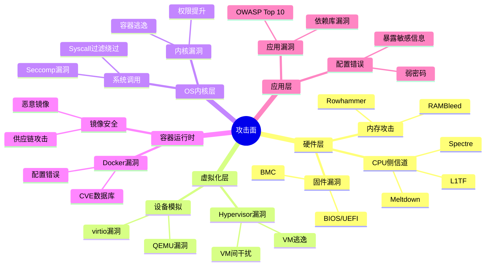
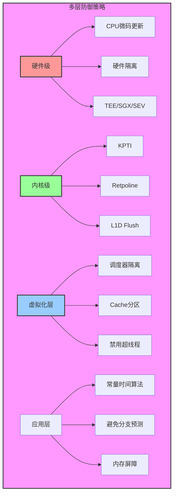
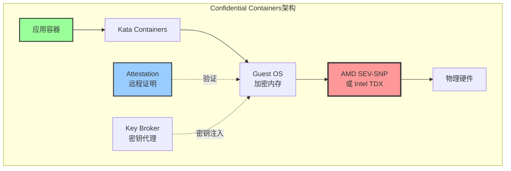
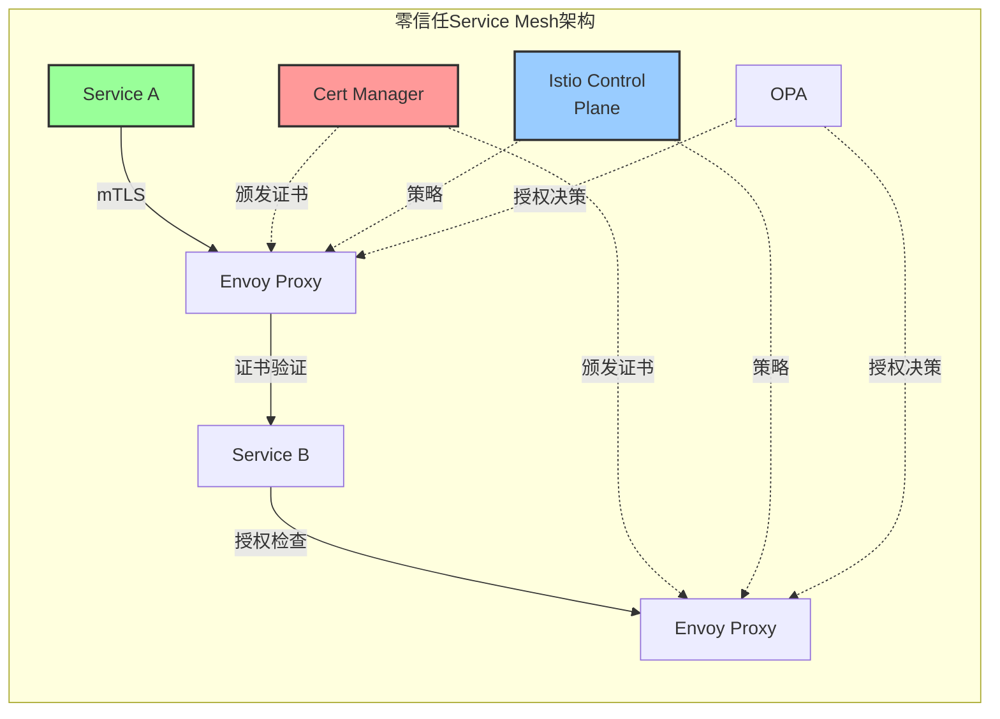
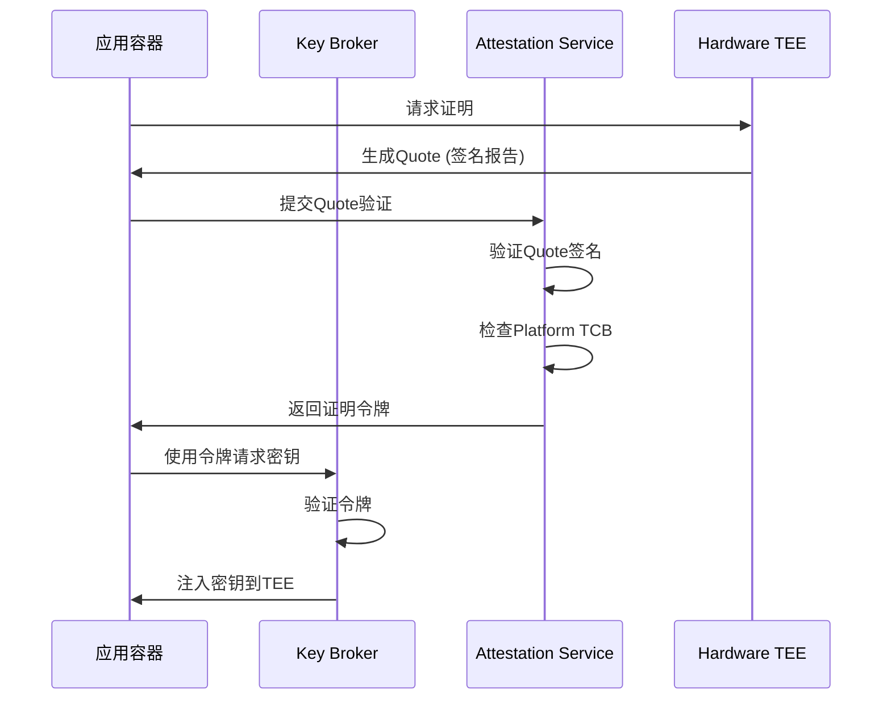
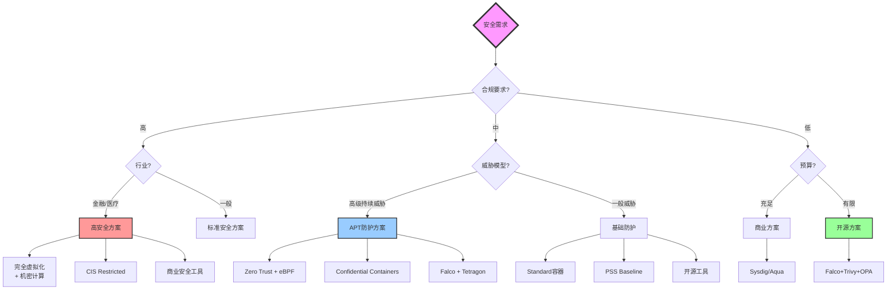

# 虚拟化与容器化安全矩阵深度分析（2025版）

> **文档定位**: 安全威胁模型、攻击面分析、零信任架构与2025合规标准  
> **对标水平**: NIST/CIS标准 + CVE数据库 + OWASP + 零信任架构  
> **更新日期**: 2025年10月20日

---

## 📋 目录

- [第一部分：安全威胁模型与攻击面](#第一部分安全威胁模型与攻击面)
- [第二部分：隔离机制安全分析](#第二部分隔离机制安全分析)
- [第三部分：访问控制与身份管理](#第三部分访问控制与身份管理)
- [第四部分：数据安全与加密](#第四部分数据安全与加密)
- [第五部分：安全合规与标准](#第五部分安全合规与标准)
- [第六部分：零信任架构](#第六部分零信任架构)
- [第七部分：机密计算与TEE](#第七部分机密计算与tee)
- [第八部分：2025年安全工具生态](#第八部分2025年安全工具生态)

---

## 第一部分：安全威胁模型与攻击面

### 1.1 STRIDE威胁模型

**STRIDE分类**（微软安全框架）:

| 威胁类型 | 英文 | 虚拟化 | 容器化 | microVM | 风险等级 |
|---------|------|--------|--------|---------|---------|
| **Spoofing** | 身份欺骗 | 中 | 高 | 中 | ⭐⭐⭐ |
| **Tampering** | 篡改 | 低 | 中 | 低 | ⭐⭐⭐⭐ |
| **Repudiation** | 抵赖 | 中 | 中 | 中 | ⭐⭐ |
| **Information Disclosure** | 信息泄露 | 中 | 高 | 中 | ⭐⭐⭐⭐⭐ |
| **Denial of Service** | 拒绝服务 | 中 | 高 | 中 | ⭐⭐⭐⭐ |
| **Elevation of Privilege** | 权限提升 | 低 | 高 | 低 | ⭐⭐⭐⭐⭐ |

### 1.2 攻击面量化分析

#### 1.2.1 攻击面矩阵



#### 1.2.2 TCB (Trusted Computing Base) 大小对比

| 技术 | TCB大小 | 关键组件 | CVE数量/年 | 攻击面评分 |
|------|---------|---------|-----------|-----------|
| **完全虚拟化** |||||
| VMware ESXi | ~20M LOC | VMKernel + VMDK | 20-40 | ⭐⭐⭐ |
| KVM/QEMU | ~15M LOC | KVM + QEMU + Host OS | 40-60 | ⭐⭐⭐⭐ |
| Hyper-V | ~18M LOC | Hyper-V + Windows | 30-50 | ⭐⭐⭐ |
| **容器化** |||||
| Docker | ~100K LOC | containerd + runc + Kernel | 50-100 | ⭐⭐⭐⭐ |
| containerd | ~50K LOC | containerd + runc + Kernel | 10-25 | ⭐⭐⭐ |
| **安全容器** |||||
| gVisor | ~50K LOC | Sentry (用户态内核) | 10-25 | ⭐⭐ |
| Kata Containers | ~50K LOC | miniOS + KVM | 5-15 | ⭐⭐ |
| Firecracker | ~30K LOC | microVM + KVM | 3-10 | ⭐ |
| **新兴技术** |||||
| WebAssembly | ~10K LOC | Wasm Runtime | <5 | ⭐ |

**攻击面评分**: ⭐ (最小) 到 ⭐⭐⭐⭐⭐ (最大)

### 1.3 逃逸攻击分析

#### 1.3.1 VM逃逸历史CVE

| CVE编号 | 年份 | 影响产品 | 严重性 | 攻击向量 | 缓解措施 |
|---------|------|---------|--------|---------|---------|
| CVE-2015-3456 | 2015 | QEMU | 高 | 软盘控制器 | 更新QEMU |
| CVE-2018-3639 | 2018 | Intel CPU | 中 | Spectre v4 | 微码更新 |
| CVE-2019-14835 | 2019 | KVM | 高 | vhost-net | 内核补丁 |
| CVE-2021-22555 | 2021 | Linux Kernel | 高 | Netfilter | 内核更新 |

#### 1.3.2 容器逃逸历史CVE

| CVE编号 | 年份 | 影响产品 | 严重性 | 攻击向量 | 缓解措施 |
|---------|------|---------|--------|---------|---------|
| CVE-2019-5736 | 2019 | runc | 高 | /proc/self/exe | 更新runc |
| CVE-2020-15257 | 2020 | containerd | 中 | 抽象socket | 更新containerd |
| CVE-2021-30465 | 2021 | runc | 高 | symlink-exchange | 更新runc |
| CVE-2022-0492 | 2022 | Linux Kernel | 高 | cgroups v1 | 内核补丁 |
| CVE-2024-21626 | 2024 | runc | 高 | 文件描述符泄露 | 更新runc |

### 1.4 侧信道攻击

#### 1.4.1 CPU侧信道攻击矩阵

| 攻击类型 | 发现年份 | 影响范围 | 缓解方案 | 性能影响 | 剩余风险 |
|---------|---------|---------|---------|---------|---------|
| **Spectre系列** ||||||
| Spectre v1 | 2018 | 所有CPU | 边界检查 | <5% | 低 |
| Spectre v2 | 2018 | 所有CPU | Retpoline | 5-15% | 低 |
| Spectre v4 | 2018 | Intel/AMD | SSBD | 2-8% | 中 |
| **Meltdown系列** ||||||
| Meltdown | 2018 | Intel | KPTI | 5-30% | 低 |
| L1TF | 2018 | Intel | L1D Flush | 2-5% | 低 |
| MDS | 2019 | Intel | Buffer清零 | 3-9% | 中 |
| **2023-2025新攻击** ||||||
| Zenbleed | 2023 | AMD Zen2 | 微码更新 | <2% | 低 |
| Downfall | 2023 | Intel | 禁用GDS | 5-15% | 中 |
| Inception | 2023 | AMD Zen3/4 | 微码更新 | <5% | 低 |

#### 1.4.2 侧信道攻击防护模型



---

## 第二部分：隔离机制安全分析

### 2.1 隔离强度量化模型

**隔离强度评分公式**:

\[
S_{\text{isolation}} = w_1 S_{\text{CPU}} + w_2 S_{\text{memory}} + w_3 S_{\text{process}} + w_4 S_{\text{network}} + w_5 S_{\text{kernel}}
\]

其中 \( \sum w_i = 1 \)，推荐权重：

- \( w_1 = 0.2 \) (CPU隔离)
- \( w_2 = 0.3 \) (内存隔离)
- \( w_3 = 0.2 \) (进程隔离)
- \( w_4 = 0.1 \) (网络隔离)
- \( w_5 = 0.2 \) (内核隔离)

### 2.2 隔离机制详细对比

| 隔离维度 | 完全虚拟化 | 容器 | microVM | gVisor | Wasm |
|---------|----------|------|---------|--------|------|
| **CPU隔离** ||||||
| 机制 | VMCS | Cgroup | VMCS | Sentry | Runtime |
| 强度 | ⭐⭐⭐⭐⭐ | ⭐⭐⭐ | ⭐⭐⭐⭐⭐ | ⭐⭐⭐⭐ | ⭐⭐⭐⭐ |
| 逃逸难度 | 极难 | 中等 | 极难 | 难 | 极难 |
| **内存隔离** ||||||
| 机制 | EPT/NPT | Cgroup | EPT/NPT | 用户态页表 | Linear Memory |
| 强度 | ⭐⭐⭐⭐⭐ | ⭐⭐⭐ | ⭐⭐⭐⭐⭐ | ⭐⭐⭐⭐ | ⭐⭐⭐⭐⭐ |
| 侧信道风险 | 中 | 高 | 中 | 中 | 低 |
| **进程隔离** ||||||
| 机制 | Guest OS | PID NS | Guest OS | Sentry | Runtime |
| 强度 | ⭐⭐⭐⭐⭐ | ⭐⭐⭐ | ⭐⭐⭐⭐⭐ | ⭐⭐⭐⭐ | ⭐⭐⭐⭐ |
| 可见性 | 完全隔离 | 部分隔离 | 完全隔离 | 完全隔离 | 完全隔离 |
| **网络隔离** ||||||
| 机制 | vNIC | Net NS | vNIC | Netstack | WASI Socket |
| 强度 | ⭐⭐⭐⭐ | ⭐⭐⭐⭐ | ⭐⭐⭐⭐ | ⭐⭐⭐⭐ | ⭐⭐⭐⭐ |
| DDoS防护 | 好 | 中 | 好 | 好 | 好 |
| **文件系统隔离** ||||||
| 机制 | 虚拟磁盘 | Mount NS | 虚拟磁盘 | VFS | WASI FS |
| 强度 | ⭐⭐⭐⭐⭐ | ⭐⭐⭐ | ⭐⭐⭐⭐⭐ | ⭐⭐⭐⭐ | ⭐⭐⭐⭐ |
| 敏感路径 | 隔离 | 暴露 | 隔离 | 过滤 | 隔离 |
| **内核隔离** ||||||
| 机制 | Guest内核 | 共享内核 | Guest内核 | 用户态内核 | 无内核 |
| 强度 | ⭐⭐⭐⭐⭐ | ⭐ | ⭐⭐⭐⭐⭐ | ⭐⭐⭐⭐ | ⭐⭐⭐⭐⭐ |
| 内核暴露 | ❌ | ✅ | ❌ | ⚠️ | ❌ |

### 2.3 Namespace安全分析

#### 2.3.1 Linux Namespace隔离能力

| Namespace | 隔离资源 | 安全强度 | 已知漏洞 | 绕过难度 | 2025建议 |
|-----------|---------|---------|---------|---------|---------|
| **PID** | 进程ID | ⭐⭐⭐ | 中等 | 中 | 启用 |
| **Network** | 网络栈 | ⭐⭐⭐⭐ | 少 | 难 | 必须启用 |
| **Mount** | 文件系统 | ⭐⭐⭐ | 中等 | 中 | 必须启用 |
| **UTS** | 主机名 | ⭐⭐ | 少 | 易 | 可选 |
| **IPC** | 进程间通信 | ⭐⭐⭐ | 少 | 中 | 启用 |
| **User** | 用户ID | ⭐⭐⭐⭐ | 中等 | 难 | **强烈推荐** |
| **Cgroup** | Cgroup根 | ⭐⭐⭐ | 多 | 中 | 启用 |
| **Time** (5.6+) | 时间 | ⭐⭐ | 新 | 未知 | 评估中 |

#### 2.3.2 User Namespace安全模型

**User Namespace映射公式**:

\[
UID_{\text{host}} = UID_{\text{container}} + UID_{\text{offset}}
\]

**安全优势**:

1. **Root权限隔离**: 容器内root = 主机普通用户
2. **权限约束**: 限制Capabilities生效范围
3. **资源保护**: 防止容器影响主机资源

**配置示例** (subuid/subgid):

```yaml
# /etc/subuid
container-user:100000:65536

# /etc/subgid
container-user:100000:65536
```

**映射关系**:

- 容器UID 0 → 主机UID 100000
- 容器UID 1 → 主机UID 100001
- 容器UID 65535 → 主机UID 165535

### 2.4 Seccomp-BPF过滤

#### 2.4.1 Seccomp模式对比

| 模式 | 允许syscall | 严格程度 | 性能影响 | 适用场景 |
|------|-----------|---------|---------|---------|
| **Disabled** | 所有 | ❌ 无限制 | 0% | ⚠️ 不推荐 |
| **Strict** | 4个基本 | ⭐⭐⭐⭐⭐ | <1% | 受限应用 |
| **Filter (BPF)** | 自定义 | ⭐⭐⭐⭐ | 1-3% | 推荐 |

**允许syscall数量对比**:

- Linux 总syscall: ~450个（Kernel 6.x）
- Docker默认允许: ~300个
- Kubernetes默认: 不限制（⚠️）
- gVisor允许: ~70个 (⭐⭐⭐⭐⭐)

#### 2.4.2 Seccomp策略示例

**严格策略**（推荐用于生产）:

```yaml
apiVersion: v1
kind: Pod
metadata:
  name: secure-pod
spec:
  securityContext:
    seccompProfile:
      type: RuntimeDefault  # 或 Localhost
  containers:
  - name: app
    image: app:latest
    securityContext:
      allowPrivilegeEscalation: false
      capabilities:
        drop: ["ALL"]
        add: ["NET_BIND_SERVICE"]
      runAsNonRoot: true
      runAsUser: 10000
      seccompProfile:
        type: Localhost
        localhostProfile: profiles/strict.json
```

**自定义Seccomp配置** (strict.json):

```json
{
  "defaultAction": "SCMP_ACT_ERRNO",
  "architectures": ["SCMP_ARCH_X86_64"],
  "syscalls": [
    {
      "names": [
        "read", "write", "open", "close", "stat", "fstat",
        "lseek", "mmap", "mprotect", "munmap", "brk",
        "rt_sigaction", "rt_sigprocmask", "rt_sigreturn",
        "ioctl", "pread64", "pwrite64", "readv", "writev",
        "access", "pipe", "select", "sched_yield", "mremap",
        "msync", "mincore", "madvise", "shmget", "shmat", "shmctl",
        "dup", "dup2", "pause", "nanosleep", "getitimer",
        "alarm", "setitimer", "getpid", "sendfile", "socket",
        "connect", "accept", "sendto", "recvfrom", "sendmsg", "recvmsg",
        "shutdown", "bind", "listen", "getsockname", "getpeername",
        "socketpair", "setsockopt", "getsockopt", "clone", "fork", "vfork",
        "execve", "exit", "wait4", "kill", "uname", "semget",
        "semop", "semctl", "shmdt", "msgget", "msgsnd", "msgrcv",
        "msgctl", "fcntl", "flock", "fsync", "fdatasync",
        "truncate", "ftruncate", "getdents", "getcwd", "chdir",
        "fchdir", "rename", "mkdir", "rmdir", "creat", "link",
        "unlink", "symlink", "readlink", "chmod", "fchmod",
        "chown", "fchown", "lchown", "umask", "gettimeofday",
        "getrlimit", "getrusage", "sysinfo", "times", "ptrace",
        "getuid", "syslog", "getgid", "setuid", "setgid",
        "geteuid", "getegid", "setpgid", "getppid", "getpgrp"
      ],
      "action": "SCMP_ACT_ALLOW"
    }
  ]
}
```

**阻止的危险syscall**:

- `ptrace`: 调试/注入
- `reboot`: 重启系统
- `mount`: 挂载文件系统
- `swapon`/`swapoff`: 交换管理
- `module_*`: 内核模块加载

---

## 第三部分：访问控制与身份管理

### 3.1 RBAC (Role-Based Access Control)

#### 3.1.1 RBAC模型（Sandhu 1996）

**数学定义**:

\[
\begin{align}
&\text{Users} \times \text{Roles} \times \text{Permissions} \\
&PA: \text{Permissions} \to \text{Roles} \\
&UA: \text{Users} \to \text{Roles} \\
&\text{check}(u, p) = \exists r: (u, r) \in UA \land (p, r) \in PA
\end{align}
\]

#### 3.1.2 Kubernetes RBAC矩阵

| 角色 | 权限范围 | 适用场景 | 安全级别 | 审计要求 |
|------|---------|---------|---------|---------|
| **Cluster Admin** | 所有资源 | 平台管理员 | ⭐ | 高 |
| **Namespace Admin** | 单Namespace | 项目管理员 | ⭐⭐⭐ | 中 |
| **Developer** | 读写Pod/Service | 开发人员 | ⭐⭐⭐⭐ | 中 |
| **Viewer** | 只读 | 运维查看 | ⭐⭐⭐⭐⭐ | 低 |
| **CI/CD Bot** | 特定资源 | 自动化 | ⭐⭐⭐ | 高 |

**最小权限原则配置示例**:

```yaml
apiVersion: rbac.authorization.k8s.io/v1
kind: Role
metadata:
  namespace: production
  name: pod-reader
rules:
- apiGroups: [""]
  resources: ["pods", "pods/log"]
  verbs: ["get", "list", "watch"]
---
apiVersion: rbac.authorization.k8s.io/v1
kind: RoleBinding
metadata:
  name: read-pods
  namespace: production
subjects:
- kind: User
  name: dev-user
  apiGroup: rbac.authorization.k8s.io
roleRef:
  kind: Role
  name: pod-reader
  apiGroup: rbac.authorization.k8s.io
```

### 3.2 Linux Capabilities

#### 3.2.1 Capabilities矩阵

| Capability | 权限 | 风险等级 | 默认Docker | 推荐 | 替代方案 |
|-----------|------|---------|-----------|------|---------|
| `CAP_CHOWN` | 修改文件所有者 | ⭐⭐ | ✅ | ⚠️ | User NS |
| `CAP_DAC_OVERRIDE` | 绕过文件权限 | ⭐⭐⭐⭐ | ✅ | ❌ | 正确权限 |
| `CAP_FOWNER` | 绕过文件所有者检查 | ⭐⭐⭐ | ✅ | ⚠️ | User NS |
| `CAP_NET_BIND_SERVICE` | 绑定<1024端口 | ⭐⭐ | ✅ | ✅ | 高端口 |
| `CAP_NET_RAW` | 原始socket | ⭐⭐⭐ | ✅ | ❌ | 应用层 |
| `CAP_SYS_ADMIN` | 系统管理 | ⭐⭐⭐⭐⭐ | ❌ | ❌ | 拆分需求 |
| `CAP_SYS_PTRACE` | 进程跟踪 | ⭐⭐⭐⭐ | ❌ | ❌ | 调试容器 |
| `CAP_SYS_MODULE` | 加载内核模块 | ⭐⭐⭐⭐⭐ | ❌ | ❌ | 主机操作 |

**危险Capabilities**（永远不应授予）:

- `CAP_SYS_ADMIN`: 几乎等同于root
- `CAP_SYS_MODULE`: 内核模块加载
- `CAP_SYS_PTRACE`: 可调试其他进程
- `CAP_DAC_READ_SEARCH`: 绕过所有文件读权限

**推荐配置**（Drop ALL + Add需要的）:

```yaml
securityContext:
  capabilities:
    drop: ["ALL"]
    add: ["NET_BIND_SERVICE"]  # 仅当需要时
```

### 3.3 Pod Security Standards (PSS)

#### 3.3.1 PSS三级标准

| 安全级别 | 限制 | 适用场景 | 安全性 | 兼容性 |
|---------|------|---------|--------|-------|
| **Privileged** | 无限制 | 系统组件 | ⭐ | ⭐⭐⭐⭐⭐ |
| **Baseline** | 基本限制 | 一般应用 | ⭐⭐⭐ | ⭐⭐⭐⭐ |
| **Restricted** | 严格限制 | 安全应用 | ⭐⭐⭐⭐⭐ | ⭐⭐ |

#### 3.3.2 Restricted策略详细要求

| 策略项 | 要求 | 说明 |
|-------|------|------|
| `runAsNonRoot` | `true` | 禁止以root运行 |
| `runAsUser` | `>= 10000` | 使用高UID |
| `allowPrivilegeEscalation` | `false` | 禁止权限提升 |
| `capabilities` | Drop ALL | 移除所有Capabilities |
| `seccompProfile` | `RuntimeDefault` | 启用Seccomp |
| `hostNetwork` | `false` | 禁用Host网络 |
| `hostPID` | `false` | 禁用Host PID |
| `hostIPC` | `false` | 禁用Host IPC |
| `privileged` | `false` | 禁止特权容器 |
| `volumes` | 受限类型 | 禁用hostPath |

**PSS实施示例**:

```yaml
apiVersion: v1
kind: Namespace
metadata:
  name: production
  labels:
    pod-security.kubernetes.io/enforce: restricted
    pod-security.kubernetes.io/audit: restricted
    pod-security.kubernetes.io/warn: restricted
```

---

## 第四部分：数据安全与加密

### 4.1 数据加密矩阵

| 数据状态 | 虚拟化方案 | 容器方案 | 加密算法 | 性能影响 | 密钥管理 |
|---------|----------|---------|---------|---------|---------|
| **静态数据** (Data at Rest) ||||||
| VM磁盘 | VMDK加密 | - | AES-256-XTS | 3-8% | vCenter KMS |
| 容器卷 | - | LUKS | AES-256-XTS | 5-10% | Kubernetes Secret |
| 镜像 | - | Registry加密 | AES-256-GCM | <2% | Harbor |
| **传输数据** (Data in Transit) ||||||
| VM迁移 | vMotion加密 | - | AES-256-GCM | 2-5% | 证书 |
| 容器网络 | - | mTLS | TLS 1.3 | 3-8% | cert-manager |
| API通信 | HTTPS | HTTPS | TLS 1.3 | 2-5% | 证书 |
| **使用数据** (Data in Use) ||||||
| 内存加密 | AMD SEV | SEV-ES | AES-128 | 5-15% | 硬件 |
| 可信执行 | Intel TDX | - | AES-128 | 3-10% | 硬件 |
| 安全飞地 | Intel SGX | - | AES-128 | 10-30% | 硬件 |

### 4.2 机密计算（Confidential Computing）

#### 4.2.1 TEE (Trusted Execution Environment) 技术对比

| 技术 | 厂商 | 隔离粒度 | 内存大小 | 性能影响 | 成熟度 | 2025可用性 |
|------|------|---------|---------|---------|--------|-----------|
| **Intel SGX** | Intel | 应用级 | ~256MB | 10-30% | 成熟 | ✅ 已部署 |
| **Intel TDX** | Intel | VM级 | 无限制 | 3-10% | 成熟 | ✅ 已部署 |
| **AMD SEV** | AMD | VM级 | 无限制 | 5-15% | 成熟 | ✅ 已部署 |
| **AMD SEV-ES** | AMD | VM级+寄存器 | 无限制 | 8-18% | 成熟 | ✅ 已部署 |
| **AMD SEV-SNP** | AMD | VM级+完整性 | 无限制 | 5-15% | 成熟 | ✅ 已部署 |
| **ARM TrustZone** | ARM | 应用级 | <512MB | 5-20% | 成熟 | ✅ 已部署 |
| **ARM CCA** | ARM | VM级 | 无限制 | 5-12% | 新 | ⚠️ 2024-2025 |

#### 4.2.2 Confidential Containers架构



**Confidential Containers优势**:

1. **内存加密**: 防止主机/Hypervisor窥探
2. **完整性保护**: 检测内存篡改
3. **远程证明**: 验证TEE状态
4. **密钥保护**: 仅TEE内可访问

### 4.3 密钥管理最佳实践

#### 4.3.1 密钥管理系统对比

| 系统 | 类型 | FIPS 140-2 | HSM支持 | 多租户 | K8s集成 | 推荐度 |
|------|------|-----------|---------|--------|---------|-------|
| **HashiCorp Vault** | 开源/商业 | ✅ (Enterprise) | ✅ | ✅ | ⭐⭐⭐⭐⭐ | ⭐⭐⭐⭐⭐ |
| **AWS KMS** | 云服务 | ✅ | ✅ | ✅ | ⭐⭐⭐⭐ | ⭐⭐⭐⭐ |
| **Azure Key Vault** | 云服务 | ✅ | ✅ | ✅ | ⭐⭐⭐⭐ | ⭐⭐⭐⭐ |
| **GCP KMS** | 云服务 | ✅ | ✅ | ✅ | ⭐⭐⭐⭐ | ⭐⭐⭐⭐ |
| **cert-manager** | 开源 | ❌ | ❌ | ⚠️ | ⭐⭐⭐⭐⭐ | ⭐⭐⭐⭐ |
| **Sealed Secrets** | 开源 | ❌ | ❌ | ⚠️ | ⭐⭐⭐⭐⭐ | ⭐⭐⭐ |

#### 4.3.2 Secret管理策略

**分层加密模型**:

\[
\text{Encrypted Secret} = E_{K_{\text{master}}}(E_{K_{\text{namespace}}}(\text{Secret}))
\]

**最佳实践**:

1. **禁止明文存储**: 使用加密etcd或外部KMS
2. **自动轮换**: 90天轮换周期
3. **最小权限**: RBAC限制Secret访问
4. **审计日志**: 记录所有Secret访问
5. **生命周期管理**: 自动过期和清理

---

## 第五部分：安全合规与标准

### 5.1 2025年安全合规矩阵

| 标准/法规 | 适用行业 | 虚拟化合规 | 容器合规 | 关键要求 | 审计频率 |
|---------|---------|-----------|---------|---------|---------|
| **ISO 27001** | 所有 | ✅ 成熟 | ✅ 成熟 | ISMS体系 | 年度 |
| **SOC 2 Type II** | 云服务 | ✅ 成熟 | ✅ 成熟 | 5大信任原则 | 年度 |
| **PCI-DSS v4.0** | 支付 | ✅ 认证 | ⚠️ 需评估 | 网络隔离 | 季度 |
| **HIPAA** | 医疗 | ✅ 认证 | ⚠️ 需加固 | PHI保护 | 年度 |
| **GDPR** | 欧盟 | ✅ 合规 | ✅ 合规 | 数据保护 | 持续 |
| **FedRAMP** | 美国政府 | ✅ 认证 | ⚠️ 评估中 | 高安全基线 | 持续 |
| **NIST 800-190** | 容器安全 | N/A | ✅ 标准 | 容器安全 | 建议 |
| **CIS Benchmarks** | 所有 | ✅ 认证 | ✅ 认证 | 加固基线 | 建议 |

### 5.2 CIS Benchmarks核心要求

#### 5.2.1 CIS Docker Benchmark v1.6 (2024)

| 类别 | 关键控制 | 基线要求 | 优先级 |
|------|---------|---------|--------|
| **主机配置** | 独立分区 | `/var/lib/docker`独立分区 | 高 |
| **Docker守护进程** | TLS认证 | 启用TLS 1.2+ | 高 |
| **守护进程配置** | 日志级别 | `info`或更低 | 中 |
| **容器镜像** | 可信镜像 | 仅使用签名镜像 | 高 |
| **容器运行时** | AppArmor | 启用AppArmor配置 | 高 |
| **容器运行时** | Seccomp | 启用Seccomp配置 | 高 |
| **容器运行时** | User NS | 启用User Namespace | 高 |
| **Docker安全** | Content Trust | `DOCKER_CONTENT_TRUST=1` | 高 |

#### 5.2.2 CIS Kubernetes Benchmark v1.8 (2024)

| 类别 | 关键控制 | 基线要求 | 优先级 |
|------|---------|---------|--------|
| **Control Plane** | API Server TLS | 启用TLS 1.3 | 高 |
| **Control Plane** | 匿名访问 | 禁用`--anonymous-auth` | 高 |
| **Control Plane** | etcd加密 | 启用at-rest加密 | 高 |
| **Worker Nodes** | kubelet认证 | 启用webhook认证 | 高 |
| **Worker Nodes** | 只读端口 | 禁用`--read-only-port=0` | 高 |
| **Policies** | Pod Security | 实施PSS Restricted | 高 |
| **Policies** | Network Policy | 实施默认拒绝 | 高 |
| **Policies** | RBAC | 启用RBAC | 高 |

### 5.3 审计与监控要求

#### 5.3.1 审计日志矩阵

| 事件类型 | 记录内容 | 保留期 | 分析工具 | 告警阈值 |
|---------|---------|--------|---------|---------|
| **认证事件** | 登录/登出/失败 | 90天+ | SIEM | 5次失败 |
| **授权事件** | 权限检查/拒绝 | 90天+ | SIEM | 异常访问 |
| **资源操作** | CRUD操作 | 90天+ | 日志系统 | 敏感操作 |
| **配置变更** | 配置修改 | 1年+ | Git+审计 | 所有变更 |
| **安全事件** | 漏洞/攻击 | 3年+ | SIEM | 立即 |

#### 5.3.2 Kubernetes审计策略

**审计级别**:

- `None`: 不记录
- `Metadata`: 记录元数据（谁、什么、何时）
- `Request`: + 请求体
- `RequestResponse`: + 响应体

**推荐配置**:

```yaml
apiVersion: audit.k8s.io/v1
kind: Policy
rules:
# 记录Secret访问
- level: RequestResponse
  resources:
  - group: ""
    resources: ["secrets"]
    
# 记录RBAC变更
- level: RequestResponse
  resources:
  - group: "rbac.authorization.k8s.io"
    
# 记录Pod创建/删除
- level: Request
  verbs: ["create", "update", "patch", "delete"]
  resources:
  - group: ""
    resources: ["pods"]
    
# 其他读操作仅记录元数据
- level: Metadata
  verbs: ["get", "list", "watch"]
```

---

## 第六部分：零信任架构

### 6.1 零信任原则

**NIST SP 800-207零信任核心原则**:

1. **永不信任，持续验证** (Never Trust, Always Verify)
2. **最小权限访问** (Least Privilege Access)
3. **假设违规** (Assume Breach)
4. **持续监控** (Continuous Monitoring)
5. **动态策略** (Dynamic Policy)

### 6.2 零信任在容器环境的实施

| 组件 | 零信任要求 | 实施方案 | 工具 | 成熟度 |
|------|----------|---------|------|-------|
| **身份验证** | mTLS everywhere | Service Mesh | Istio/Linkerd | ⭐⭐⭐⭐⭐ |
| **授权** | 微分段 | Network Policy | Calico/Cilium | ⭐⭐⭐⭐⭐ |
| **访问控制** | RBAC+ABAC | K8s RBAC | OPA | ⭐⭐⭐⭐ |
| **加密** | E2E加密 | mTLS | cert-manager | ⭐⭐⭐⭐⭐ |
| **审计** | 全量日志 | Audit Log | Falco/Fluent | ⭐⭐⭐⭐ |
| **监控** | 实时检测 | eBPF | Cilium/Tetragon | ⭐⭐⭐⭐ |

### 6.3 Service Mesh零信任架构



---

## 第七部分：机密计算与TEE

### 7.1 Confidential Computing技术栈

| 层次 | 技术 | 功能 | 信任根 |
|------|------|------|--------|
| **硬件层** | Intel TDX / AMD SEV-SNP | 内存加密 | CPU |
| **VM层** | Confidential VM | 加密VM | TEE |
| **容器层** | Confidential Containers | 加密容器 | TEE |
| **应用层** | Intel SGX | 应用飞地 | TEE |

### 7.2 远程证明（Remote Attestation）

**证明流程**:



---

## 第八部分：2025年安全工具生态

### 8.1 容器安全工具矩阵

| 工具类别 | 工具名称 | 功能 | 开源/商业 | 成熟度 | 推荐度 |
|---------|---------|------|----------|--------|-------|
| **镜像扫描** ||||||
| Trivy | 漏洞扫描 | 开源 | ⭐⭐⭐⭐⭐ | ⭐⭐⭐⭐⭐ ||
| Grype | 漏洞扫描 | 开源 | ⭐⭐⭐⭐ | ⭐⭐⭐⭐ ||
| Snyk | 漏洞+许可证 | 商业 | ⭐⭐⭐⭐⭐ | ⭐⭐⭐⭐ ||
| **运行时安全** ||||||
| Falco | 威胁检测 | 开源 | ⭐⭐⭐⭐⭐ | ⭐⭐⭐⭐⭐ ||
| Tetragon | eBPF安全 | 开源 | ⭐⭐⭐⭐ | ⭐⭐⭐⭐ ||
| Sysdig | 全栈监控 | 商业 | ⭐⭐⭐⭐⭐ | ⭐⭐⭐⭐ ||
| **策略引擎** ||||||
| OPA | 策略管理 | 开源 | ⭐⭐⭐⭐⭐ | ⭐⭐⭐⭐⭐ ||
| Kyverno | K8s策略 | 开源 | ⭐⭐⭐⭐ | ⭐⭐⭐⭐ ||
| **合规审计** ||||||
| kube-bench | CIS基准 | 开源 | ⭐⭐⭐⭐⭐ | ⭐⭐⭐⭐⭐ ||
| kube-hunter | 渗透测试 | 开源 | ⭐⭐⭐⭐ | ⭐⭐⭐⭐ ||

### 8.2 安全选型决策树



---

## 总结与建议

### 关键安全原则

1. **深度防御** (Defense in Depth)
   - 多层安全控制
   - 没有单点故障

2. **最小权限** (Least Privilege)
   - RBAC + Capabilities
   - Drop ALL + Add 需要的

3. **零信任** (Zero Trust)
   - 永不信任，持续验证
   - mTLS everywhere

4. **持续监控** (Continuous Monitoring)
   - 实时威胁检测
   - 审计日志

### 2025年安全趋势

1. **机密计算普及化**
   - TEE技术成熟
   - Confidential Containers广泛部署

2. **eBPF安全革命**
   - 内核级可观测性
   - 零性能开销监控

3. **零信任标准化**
   - Service Mesh成为标配
   - mTLS全面普及

4. **AI驱动安全**
   - 异常检测自动化
   - 威胁情报增强

### 安全检查清单

**容器安全基线**:

- [ ] 启用User Namespace
- [ ] 配置Seccomp-BPF
- [ ] Drop ALL Capabilities
- [ ] 禁用特权容器
- [ ] 实施PSS Restricted
- [ ] 启用Network Policy
- [ ] 配置RBAC
- [ ] 启用镜像扫描
- [ ] 部署Runtime Security
- [ ] 配置审计日志

**Kubernetes安全基线**:

- [ ] API Server TLS 1.3
- [ ] etcd加密
- [ ] 禁用匿名访问
- [ ] 实施RBAC
- [ ] Network Policy默认拒绝
- [ ] Pod Security Standards
- [ ] Admission Controllers
- [ ] 审计日志
- [ ] Secret加密
- [ ] 定期更新

---

## 参考文献

1. **NIST SP 800-190** (2017). "Application Container Security Guide".
2. **NIST SP 800-207** (2020). "Zero Trust Architecture".
3. **CIS Docker Benchmark v1.6** (2024).
4. **CIS Kubernetes Benchmark v1.8** (2024).
5. **OWASP Kubernetes Top 10** (2023).
6. **CVE Details** (2025). "Container Security CVE Database".
7. **Confidential Computing Consortium** (2025). "Technical Specifications".
8. **CNCF** (2025). "Container Security Best Practices".

---

**文档版本**: v1.0  
**最后更新**: 2025年10月20日  
**作者**: Security & Compliance Team  
**License**: CC-BY-4.0

---

**🛡️ 本文档提供了虚拟化与容器化从威胁模型到零信任架构的完整安全分析框架！**
