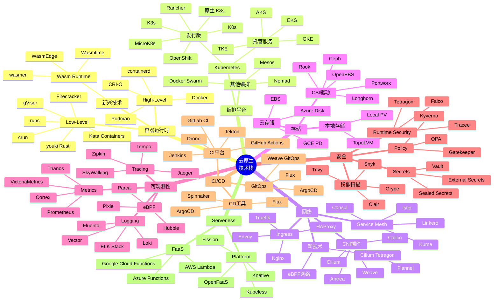
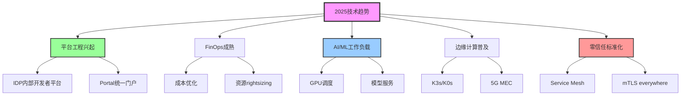
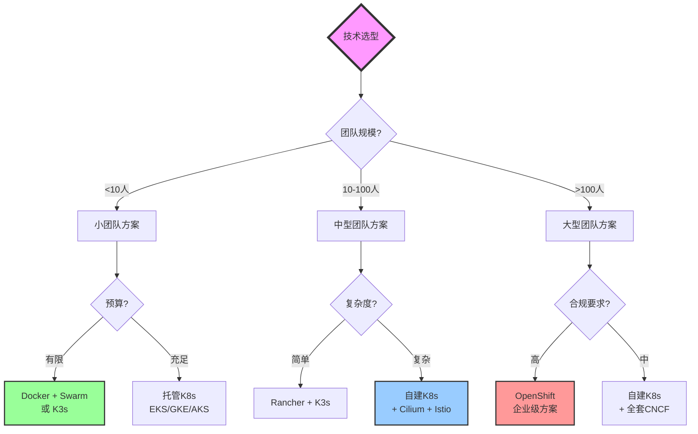

# 虚拟化与容器化技术对比矩阵深度版（2025）

> **文档定位**: 云原生技术栈全景、成熟度评估、技术选型决策  
> **对标水平**: CNCF Landscape + Gartner + Forrester + 技术雷达  
> **更新日期**: 2025年10月20日

---

## 📋 目录

- [第一部分：云原生技术栈全景](#第一部分云原生技术栈全景)
- [第二部分：容器运行时深度对比](#第二部分容器运行时深度对比)
- [第三部分：容器编排平台对比](#第三部分容器编排平台对比)
- [第四部分：网络方案深度对比](#第四部分网络方案深度对比)
- [第五部分：存储方案深度对比](#第五部分存储方案深度对比)
- [第六部分：可观测性技术栈](#第六部分可观测性技术栈)
- [第七部分：技术成熟度与投资优先级](#第七部分技术成熟度与投资优先级)
- [第八部分：技术选型决策框架](#第八部分技术选型决策框架)

---

## 第一部分：云原生技术栈全景

### 1.1 CNCF Cloud Native Landscape 2025



### 1.2 技术栈层次模型

| 层次 | 功能 | 主流技术 | 2025趋势 |
|------|------|---------|---------|
| **应用层** | 业务应用 | Microservices, Serverless | AI/ML工作负载 |
| **编排层** | 资源调度 | Kubernetes, Nomad | 多集群管理 |
| **运行时层** | 容器执行 | containerd, CRI-O | Wasm运行时 |
| **网络层** | 通信连接 | CNI, Service Mesh | eBPF加速 |
| **存储层** | 数据持久化 | CSI, 云存储 | 云原生存储 |
| **安全层** | 安全防护 | RBAC, Network Policy | 零信任+机密计算 |
| **可观测层** | 监控追踪 | Prometheus, Jaeger | eBPF可观测 |
| **基础设施层** | 物理/虚拟资源 | VM, 裸金属, 公云 | 边缘计算 |

---

## 第二部分：容器运行时深度对比

### 2.1 High-Level容器运行时对比

| 指标 | Docker | containerd | CRI-O | Podman | LXD |
|------|--------|-----------|-------|--------|-----|
| **架构** ||||||
| 守护进程 | ✅ dockerd | ✅ containerd | ✅ crio | ❌ 无守护进程 | ✅ lxd |
| 进程模型 | C/S | C/S | C/S | Fork/Exec | C/S |
| 资源占用 | 中等 (150MB) | 低 (50MB) | 低 (70MB) | 极低 (0MB) | 中等 (100MB) |
| **功能** ||||||
| Docker兼容 | ✅ 原生 | ✅ 兼容 | ✅ 兼容 | ✅ 完全兼容 | ❌ 不兼容 |
| OCI标准 | ✅ | ✅ | ✅ | ✅ | ⚠️ 部分 |
| CRI接口 | ⚠️ 通过shim | ✅ 原生 | ✅ 原生 | ❌ 无 | ❌ 无 |
| Pod原生支持 | ❌ | ❌ | ✅ | ✅ | ❌ |
| **安全** ||||||
| Rootless | ⚠️ 实验性 | ⚠️ 部分 | ✅ 完整 | ✅ 完整 | ✅ 完整 |
| User Namespace | ✅ | ✅ | ✅ | ✅ | ✅ |
| SELinux | ✅ | ✅ | ✅ | ✅ | ✅ |
| Seccomp | ✅ | ✅ | ✅ | ✅ | ✅ |
| **性能** ||||||
| 启动速度 | 中 (1-3s) | 快 (0.5-1s) | 快 (0.5-1s) | 快 (0.3-0.8s) | 中 (1-2s) |
| 内存开销 | 中 | 低 | 低 | 极低 | 中 |
| CPU开销 | 中 | 低 | 低 | 极低 | 中 |
| **生态** ||||||
| 社区活跃度 | ⭐⭐⭐⭐ | ⭐⭐⭐⭐⭐ | ⭐⭐⭐⭐ | ⭐⭐⭐⭐ | ⭐⭐⭐ |
| 企业采用 | 广泛 | 最广泛 | 广泛 | 增长 | 有限 |
| K8s推荐 | ⚠️ 弃用 | ✅ 推荐 | ✅ 推荐 | ❌ 不适用 | ❌ 不适用 |
| **2025评分** | ⭐⭐⭐ | ⭐⭐⭐⭐⭐ | ⭐⭐⭐⭐ | ⭐⭐⭐⭐ | ⭐⭐⭐ |

### 2.2 Low-Level容器运行时对比

| 指标 | runc | crun | youki | gVisor | Kata | Firecracker |
|------|------|------|-------|--------|------|-------------|
| **实现语言** | Go | C | Rust | Go | Go/Rust | Rust |
| **架构** |||||||
| 类型 | Native | Native | Native | Sandbox | VM-based | microVM |
| 隔离级别 | OS-level | OS-level | OS-level | User-space | VM | VM |
| **性能** |||||||
| 启动时间 | 100-300ms | 50-150ms | 50-120ms | 200-500ms | 1-3s | 100-300ms |
| 内存占用 | 10-20MB | 5-10MB | 5-10MB | 50-100MB | 130-200MB | 50-100MB |
| CPU性能 | 99% | 99.5% | 99.5% | 85-92% | 90-95% | 92-96% |
| **安全** |||||||
| 隔离强度 | ⭐⭐⭐ | ⭐⭐⭐ | ⭐⭐⭐ | ⭐⭐⭐⭐ | ⭐⭐⭐⭐⭐ | ⭐⭐⭐⭐⭐ |
| 内核共享 | ✅ | ✅ | ✅ | ❌ 用户态 | ❌ Guest内核 | ❌ Guest内核 |
| 逃逸风险 | 中 | 中 | 中 | 低 | 极低 | 极低 |
| **成熟度** |||||||
| 生产就绪 | ✅ | ✅ | ⚠️ | ✅ | ✅ | ✅ |
| 社区 | ⭐⭐⭐⭐⭐ | ⭐⭐⭐⭐ | ⭐⭐⭐ | ⭐⭐⭐⭐ | ⭐⭐⭐⭐ | ⭐⭐⭐⭐ |
| CVE数量/年 | 10-20 | <5 | <5 | 5-10 | 3-8 | 2-5 |
| **适用场景** |||||||
| 通用容器 | ✅ 最佳 | ✅ 推荐 | ✅ 推荐 | ❌ | ❌ | ❌ |
| 多租户 | ⚠️ | ⚠️ | ⚠️ | ✅ 推荐 | ✅ 最佳 | ✅ 最佳 |
| 边缘计算 | ✅ | ✅ | ✅ | ⚠️ | ✅ | ✅ 最佳 |
| **2025推荐度** | ⭐⭐⭐⭐ | ⭐⭐⭐⭐⭐ | ⭐⭐⭐⭐ | ⭐⭐⭐⭐ | ⭐⭐⭐⭐⭐ | ⭐⭐⭐⭐⭐ |

### 2.3 WebAssembly容器运行时（2025新兴）

| 指标 | WasmEdge | Wasmtime | wasmer | WAMR |
|------|----------|----------|--------|------|
| **实现语言** | C++/Rust | Rust | Rust | C |
| **性能** |||||
| 启动时间 | <10ms | <10ms | <10ms | <5ms |
| 内存占用 | 3-5MB | 5-10MB | 5-10MB | 1-3MB |
| CPU性能 | 94-96% | 92-95% | 93-96% | 90-93% |
| **功能** |||||
| WASI支持 | ✅ 完整 | ✅ 完整 | ✅ 完整 | ✅ 基础 |
| 多语言支持 | 20+ | 15+ | 18+ | 10+ |
| AOT编译 | ✅ | ✅ | ✅ | ✅ |
| JIT编译 | ✅ | ✅ | ✅ | ⚠️ |
| **生态** |||||
| K8s集成 | ✅ runwasi | ✅ runwasi | ⚠️ | ❌ |
| 云厂商支持 | 多家 | 多家 | 有限 | 有限 |
| 社区活跃度 | ⭐⭐⭐⭐⭐ | ⭐⭐⭐⭐⭐ | ⭐⭐⭐⭐ | ⭐⭐⭐ |
| **2025推荐度** | ⭐⭐⭐⭐⭐ | ⭐⭐⭐⭐⭐ | ⭐⭐⭐⭐ | ⭐⭐⭐ |

---

## 第三部分：容器编排平台对比

### 3.1 主流编排平台综合对比

| 维度 | Kubernetes | OpenShift | Rancher | Nomad | Docker Swarm |
|------|-----------|-----------|---------|-------|--------------|
| **成熟度** ||||||
| 版本 | v1.31 (2025) | 4.16 | 2.9 | 1.8 | v24 |
| 生产就绪 | ⭐⭐⭐⭐⭐ | ⭐⭐⭐⭐⭐ | ⭐⭐⭐⭐ | ⭐⭐⭐⭐ | ⭐⭐⭐ |
| 稳定性 | 极高 | 极高 | 高 | 高 | 中 |
| **功能丰富度** ||||||
| 核心功能 | ⭐⭐⭐⭐⭐ | ⭐⭐⭐⭐⭐ | ⭐⭐⭐⭐⭐ | ⭐⭐⭐ | ⭐⭐⭐ |
| 网络 | CNI生态 | CNI+SDN | CNI生态 | Consul | Overlay |
| 存储 | CSI生态 | CSI+OCS | CSI生态 | CSI | Volume |
| 安全 | RBAC+PSS | RBAC+SCC | RBAC | ACL | 基础 |
| 多租户 | Namespace | Project | Project | Namespace | ❌ |
| **可扩展性** ||||||
| 最大节点 | 5000+ | 2000+ | 2000+ | 5000+ | 1000 |
| 最大Pod | 150K+ | 60K+ | 60K+ | N/A | 30K |
| 集群规模 | 极大 | 大 | 大 | 极大 | 中 |
| **学习曲线** ||||||
| 入门难度 | ⭐⭐⭐⭐⭐ | ⭐⭐⭐⭐⭐ | ⭐⭐⭐ | ⭐⭐ | ⭐ |
| 运维复杂度 | ⭐⭐⭐⭐ | ⭐⭐⭐⭐⭐ | ⭐⭐⭐ | ⭐⭐ | ⭐ |
| 文档质量 | 优秀 | 优秀 | 良好 | 良好 | 一般 |
| **生态系统** ||||||
| 插件数量 | 1000+ | 500+ | 300+ | 100+ | 50+ |
| 商业支持 | 广泛 | Red Hat | SUSE | HashiCorp | Docker Inc |
| 社区规模 | 巨大 | 大 | 大 | 中 | 小 |
| CNCF项目 | ✅ 毕业 | ❌ | ❌ | ❌ | ❌ |
| **成本** ||||||
| 许可证 | 免费 | 商业 | 免费/商业 | 免费/商业 | 免费 |
| 运维成本 | 高 | 高 | 中 | 低 | 低 |
| 培训成本 | 高 | 高 | 中 | 低 | 低 |
| **2025推荐度** ||||||
| 企业级 | ⭐⭐⭐⭐⭐ | ⭐⭐⭐⭐⭐ | ⭐⭐⭐⭐ | ⭐⭐⭐ | ⭐⭐ |
| 中小企业 | ⭐⭐⭐⭐ | ⭐⭐⭐ | ⭐⭐⭐⭐⭐ | ⭐⭐⭐⭐ | ⭐⭐⭐ |
| 边缘计算 | ⭐⭐⭐⭐⭐ | ⭐⭐⭐ | ⭐⭐⭐⭐⭐ | ⭐⭐⭐⭐ | ⭐⭐ |

### 3.2 轻量级Kubernetes发行版对比

| 指标 | K3s | K0s | MicroK8s | kind | minikube |
|------|-----|-----|----------|------|----------|
| **定位** | 边缘/IoT | 轻量K8s | Dev/Edge | 测试 | 本地开发 |
| **资源需求** ||||||
| 最小内存 | 512MB | 1GB | 540MB | 4GB | 2GB |
| 二进制大小 | ~50MB | ~200MB | ~200MB | N/A | N/A |
| **性能** ||||||
| 启动时间 | <40s | <2min | <1min | <2min | <5min |
| 资源效率 | ⭐⭐⭐⭐⭐ | ⭐⭐⭐⭐ | ⭐⭐⭐⭐ | ⭐⭐⭐ | ⭐⭐⭐ |
| **功能** ||||||
| 高可用 | ✅ | ✅ | ✅ | ❌ | ❌ |
| 多节点 | ✅ | ✅ | ✅ | ✅ | ⚠️ |
| 插件生态 | 中 | 中 | 丰富 | 少 | 丰富 |
| **适用场景** ||||||
| 生产环境 | ✅ | ✅ | ⚠️ | ❌ | ❌ |
| 边缘计算 | ⭐⭐⭐⭐⭐ | ⭐⭐⭐⭐ | ⭐⭐⭐⭐ | ❌ | ❌ |
| 本地开发 | ⭐⭐⭐ | ⭐⭐⭐ | ⭐⭐⭐⭐⭐ | ⭐⭐⭐⭐⭐ | ⭐⭐⭐⭐⭐ |
| CI/CD | ⭐⭐⭐⭐ | ⭐⭐⭐⭐ | ⭐⭐⭐ | ⭐⭐⭐⭐⭐ | ⭐⭐⭐⭐ |
| **2025推荐度** | ⭐⭐⭐⭐⭐ | ⭐⭐⭐⭐ | ⭐⭐⭐⭐ | ⭐⭐⭐⭐⭐ | ⭐⭐⭐⭐ |

---

## 第四部分：网络方案深度对比

### 4.1 CNI插件综合对比

| 指标 | Calico | Cilium | Flannel | Weave | Antrea | Kube-OVN |
|------|--------|--------|---------|-------|--------|----------|
| **架构** |||||||
| 数据平面 | iptables/eBPF | eBPF | VXLAN | 加密VXLAN | OVS | OVN |
| 控制平面 | BGP | K8s CRD | etcd/K8s | gossip | K8s CRD | OVN |
| **性能** |||||||
| 吞吐量 | 高 | 最高 | 中 | 中 | 高 | 高 |
| 延迟 | 低 | 最低 | 中 | 中 | 低 | 低 |
| CPU开销 | 中 | 低 | 低 | 中 | 中 | 中 |
| **功能** |||||||
| Network Policy | ✅ 完整 | ✅ 完整 | ❌ | ⚠️ 基础 | ✅ 完整 | ✅ 完整 |
| 加密 | ✅ WireGuard | ✅ IPsec/WireGuard | ❌ | ✅ 原生 | ✅ IPsec | ✅ |
| 多集群 | ✅ | ✅ | ❌ | ✅ | ✅ | ✅ |
| Service Mesh | ⚠️ 集成 | ✅ 原生 | ❌ | ❌ | ⚠️ 集成 | ❌ |
| **可观测性** |||||||
| Flow logs | ✅ | ✅ Hubble | ❌ | ⚠️ | ✅ | ✅ |
| Metrics | ✅ | ✅ | ⚠️ | ✅ | ✅ | ✅ |
| eBPF | ✅ 可选 | ✅ 原生 | ❌ | ❌ | ❌ | ❌ |
| **生态** |||||||
| 成熟度 | ⭐⭐⭐⭐⭐ | ⭐⭐⭐⭐⭐ | ⭐⭐⭐⭐ | ⭐⭐⭐ | ⭐⭐⭐⭐ | ⭐⭐⭐ |
| 社区 | 极活跃 | 极活跃 | 活跃 | 中等 | 活跃 | 中等 |
| 商业支持 | Tigera | Isovalent | CoreOS | Weaveworks | VMware | 灵雀云 |
| **2025推荐度** |||||||
| 通用场景 | ⭐⭐⭐⭐⭐ | ⭐⭐⭐⭐⭐ | ⭐⭐⭐ | ⭐⭐ | ⭐⭐⭐⭐ | ⭐⭐⭐ |
| 高性能 | ⭐⭐⭐⭐ | ⭐⭐⭐⭐⭐ | ⭐⭐ | ⭐⭐ | ⭐⭐⭐⭐ | ⭐⭐⭐⭐ |
| 安全敏感 | ⭐⭐⭐⭐⭐ | ⭐⭐⭐⭐⭐ | ⭐ | ⭐⭐⭐ | ⭐⭐⭐⭐ | ⭐⭐⭐ |

### 4.2 Service Mesh技术对比

| 指标 | Istio | Linkerd | Consul | Kuma | OSM |
|------|-------|---------|--------|------|-----|
| **架构** ||||||
| 数据平面 | Envoy | linkerd2-proxy | Envoy | Envoy | Envoy |
| 语言 | Go/C++ | Rust | Go | Go | Go |
| **功能** ||||||
| mTLS | ✅ 自动 | ✅ 自动 | ✅ 手动 | ✅ 自动 | ✅ 自动 |
| 流量管理 | ⭐⭐⭐⭐⭐ | ⭐⭐⭐⭐ | ⭐⭐⭐ | ⭐⭐⭐⭐ | ⭐⭐⭐ |
| 可观测性 | ⭐⭐⭐⭐⭐ | ⭐⭐⭐⭐⭐ | ⭐⭐⭐ | ⭐⭐⭐⭐ | ⭐⭐⭐ |
| 多集群 | ✅ 完整 | ✅ 完整 | ✅ 完整 | ✅ 完整 | ⚠️ 基础 |
| **性能** ||||||
| 延迟开销 | +5-10ms | +2-5ms | +8-15ms | +5-10ms | +5-10ms |
| 吞吐影响 | 5-10% | 2-5% | 8-15% | 5-10% | 5-10% |
| 资源占用 | 高 | 低 | 中 | 中 | 中 |
| **复杂度** ||||||
| 学习曲线 | ⭐⭐⭐⭐⭐ | ⭐⭐ | ⭐⭐⭐ | ⭐⭐⭐ | ⭐⭐ |
| 运维复杂度 | ⭐⭐⭐⭐⭐ | ⭐⭐ | ⭐⭐⭐ | ⭐⭐⭐ | ⭐⭐ |
| **生态** ||||||
| CNCF | ✅ 毕业 | ✅ 毕业 | ❌ | ✅ 沙箱 | ✅ 沙箱 |
| 社区 | 极大 | 大 | 大 | 中 | 中 |
| **2025推荐度** | ⭐⭐⭐⭐⭐ | ⭐⭐⭐⭐⭐ | ⭐⭐⭐⭐ | ⭐⭐⭐⭐ | ⭐⭐⭐ |

---

## 第五部分：存储方案深度对比

### 5.1 云原生存储解决方案对比

| 指标 | Ceph/Rook | Longhorn | OpenEBS | Portworx | StorageOS |
|------|-----------|----------|---------|----------|-----------|
| **架构** ||||||
| 类型 | 分布式 | 分布式 | 超融合 | 分布式 | 分布式 |
| 存储后端 | OSD | iSCSI | 多种 | 专有 | 专有 |
| **性能** ||||||
| IOPS | 高 | 中 | 高 | 极高 | 高 |
| 吞吐量 | 高 | 中 | 高 | 极高 | 高 |
| 延迟 | 低 | 中 | 低 | 极低 | 低 |
| **功能** ||||||
| 块存储 | ✅ RBD | ✅ | ✅ cStor | ✅ | ✅ |
| 文件存储 | ✅ CephFS | ❌ | ✅ | ✅ | ❌ |
| 对象存储 | ✅ RGW | ❌ | ❌ | ✅ | ❌ |
| 快照 | ✅ | ✅ | ✅ | ✅ | ✅ |
| 克隆 | ✅ | ✅ | ✅ | ✅ | ✅ |
| 加密 | ✅ | ✅ | ✅ | ✅ | ✅ |
| **可扩展性** ||||||
| 最大容量 | PB级 | TB级 | PB级 | PB级 | PB级 |
| 节点数 | 1000+ | 100+ | 500+ | 1000+ | 500+ |
| **可靠性** ||||||
| 副本数 | 3+ | 3 | 3+ | 3+ | 3+ |
| 自动修复 | ✅ | ✅ | ✅ | ✅ | ✅ |
| **成本** ||||||
| 许可证 | 开源 | 开源 | 开源 | 商业 | 商业 |
| 硬件要求 | 中等 | 低 | 中等 | 高 | 中等 |
| **2025推荐度** ||||||
| 企业级 | ⭐⭐⭐⭐⭐ | ⭐⭐⭐⭐ | ⭐⭐⭐⭐ | ⭐⭐⭐⭐⭐ | ⭐⭐⭐⭐ |
| 中小规模 | ⭐⭐⭐ | ⭐⭐⭐⭐⭐ | ⭐⭐⭐⭐ | ⭐⭐⭐ | ⭐⭐⭐⭐ |
| 边缘场景 | ⭐⭐ | ⭐⭐⭐⭐⭐ | ⭐⭐⭐ | ⭐⭐ | ⭐⭐⭐ |

---

## 第六部分：可观测性技术栈

### 6.1 Metrics系统对比

| 指标 | Prometheus | Thanos | VictoriaMetrics | Cortex | Mimir |
|------|-----------|--------|-----------------|--------|-------|
| **架构** | 单机 | 分布式 | 单机/集群 | 分布式 | 分布式 |
| **性能** ||||||
| 写入速率 | 100K/s | 1M+/s | 1M+/s | 500K/s | 1M+/s |
| 查询速度 | 快 | 中 | 极快 | 快 | 快 |
| 存储压缩 | 1x | 1x | 10x | 1x | 1x |
| **功能** ||||||
| 长期存储 | ⚠️ 有限 | ✅ | ✅ | ✅ | ✅ |
| 多租户 | ❌ | ✅ | ✅ | ✅ | ✅ |
| HA | ❌ | ✅ | ✅ | ✅ | ✅ |
| **2025推荐度** | ⭐⭐⭐⭐ | ⭐⭐⭐⭐⭐ | ⭐⭐⭐⭐⭐ | ⭐⭐⭐⭐ | ⭐⭐⭐⭐⭐ |

### 6.2 Logging系统对比

| 指标 | Loki | ELK Stack | Fluentd | Vector |
|------|------|-----------|---------|--------|
| **资源占用** | 低 | 高 | 中 | 低 |
| **查询速度** | 快 | 最快 | N/A | N/A |
| **成本** | 低 | 高 | 低 | 低 |
| **2025推荐度** | ⭐⭐⭐⭐⭐ | ⭐⭐⭐⭐ | ⭐⭐⭐⭐ | ⭐⭐⭐⭐⭐ |

### 6.3 Tracing系统对比

| 指标 | Jaeger | Tempo | Zipkin | SkyWalking |
|------|--------|-------|--------|------------|
| **存储** | 多种 | S3/GCS | 多种 | ES/H2 |
| **性能** | 高 | 极高 | 中 | 高 |
| **集成** | OpenTelemetry | OpenTelemetry | Zipkin | 专有 |
| **2025推荐度** | ⭐⭐⭐⭐⭐ | ⭐⭐⭐⭐⭐ | ⭐⭐⭐ | ⭐⭐⭐⭐ |

---

## 第七部分：技术成熟度与投资优先级

### 7.1 Gartner技术成熟度曲线（2025）

```mermaid
graph LR
    subgraph Innovation["技术触发期"]
        A1[量子容器]
        A2[AI驱动调度]
    end
    
    subgraph Peak["期望膨胀期"]
        B1[边缘K8s]
        B2[多集群管理]
    end
    
    subgraph Trough["泡沫破裂低谷期"]
        C1[Serverless容器]
        C2[Unikernel]
    end
    
    subgraph Slope["稳步爬升期"]
        D1[WebAssembly]
        D2[机密计算]
        D3[eBPF]
        D4[Service Mesh]
    end
    
    subgraph Plateau["生产成熟期"]
        E1[Kubernetes]
        E2[Docker/containerd]
        E3[Prometheus]
        E4[Istio]
    end
    
    Innovation --> Peak
    Peak --> Trough
    Trough --> Slope
    Slope --> Plateau
    
    style Plateau fill:#9f9,stroke:#333,stroke-width:2px
    style Slope fill:#9cf,stroke:#333,stroke-width:2px
    style Innovation fill:#f99,stroke:#333,stroke-width:2px
```



### 7.2 技术投资优先级矩阵

| 技术 | 成熟度 | 影响力 | 采用难度 | 投资优先级 | 行动建议 |
|------|--------|--------|---------|----------|---------|
| **立即投资（高优先级）** ||||||
| Kubernetes | 成熟 | 极高 | 高 | ⭐⭐⭐⭐⭐ | 立即部署 |
| Prometheus | 成熟 | 高 | 中 | ⭐⭐⭐⭐⭐ | 立即部署 |
| Cilium eBPF | 成熟 | 高 | 中 | ⭐⭐⭐⭐⭐ | 优先考虑 |
| Service Mesh | 成熟 | 高 | 高 | ⭐⭐⭐⭐ | 按需部署 |
| **近期投资（中优先级）** ||||||
| WebAssembly | 增长 | 高 | 中 | ⭐⭐⭐⭐ | 试点项目 |
| 机密计算 | 增长 | 中 | 高 | ⭐⭐⭐⭐ | 评估验证 |
| GitOps | 成熟 | 中 | 低 | ⭐⭐⭐⭐ | 推荐采用 |
| eBPF可观测 | 增长 | 中 | 中 | ⭐⭐⭐ | 试点项目 |
| **观望评估（低优先级）** ||||||
| 边缘K8s | 增长 | 中 | 中 | ⭐⭐⭐ | 持续关注 |
| AI调度 | 早期 | 低 | 高 | ⭐⭐ | 技术跟踪 |
| 量子容器 | 概念 | 未知 | 极高 | ⭐ | 长期关注 |

### 7.3 2025年技术趋势



---

## 第八部分：技术选型决策框架

### 8.1 多维度决策矩阵

**决策因子权重模型**:

\[
Score_{\text{tech}} = \sum_{i=1}^{n} w_i \times f_i
\]

其中：

- \( w_i \): 权重因子
- \( f_i \): 各维度评分 (0-10)

**典型权重配置**:

| 场景 | 功能 | 性能 | 成本 | 生态 | 安全 |
|------|------|------|------|------|------|
| 创业公司 | 0.25 | 0.15 | 0.35 | 0.15 | 0.10 |
| 中型企业 | 0.25 | 0.20 | 0.25 | 0.20 | 0.10 |
| 大型企业 | 0.20 | 0.20 | 0.15 | 0.20 | 0.25 |
| 金融行业 | 0.15 | 0.20 | 0.10 | 0.15 | 0.40 |

### 8.2 技术选型决策树



### 8.3 技术选型检查清单

**基础评估** (必选):

- [ ] 团队技术栈匹配度
- [ ] 学习曲线可接受性
- [ ] 社区活跃度
- [ ] 文档完整性
- [ ] 商业支持可用性

**功能评估** (必选):

- [ ] 核心功能覆盖
- [ ] 可扩展性
- [ ] 多环境支持
- [ ] 插件生态
- [ ] API稳定性

**非功能评估** (重要):

- [ ] 性能基准测试
- [ ] 安全合规
- [ ] 高可用性
- [ ] 灾难恢复
- [ ] 监控可观测

**成本评估** (重要):

- [ ] 许可证成本
- [ ] 硬件成本
- [ ] 人力成本
- [ ] 培训成本
- [ ] 运维成本

---

## 总结与建议

### 2025年技术选型建议

**🏆 推荐技术组合**:

**1. 标准云原生栈** (适合大多数企业):

```text
运行时: containerd
编排: Kubernetes
网络: Cilium
存储: Longhorn/Ceph
Service Mesh: Istio/Linkerd
监控: Prometheus + Loki + Tempo
安全: Falco + Trivy + OPA
CI/CD: GitLab CI + ArgoCD
```

**2. 轻量级栈** (适合中小企业/边缘):

```text
运行时: containerd
编排: K3s/Rancher
网络: Flannel/Calico
存储: Longhorn
监控: Prometheus + Loki
安全: Trivy
CI/CD: GitHub Actions + ArgoCD
```

**3. 高安全栈** (适合金融/医疗):

```text
运行时: Kata Containers
编排: OpenShift
网络: Calico
存储: Portworx
Service Mesh: Istio
监控: Prometheus + ELK
安全: Falco + Snyk + Vault
CI/CD: GitLab + Spinnaker
```

### 关键决策原则

1. **从简单开始**: 不要一次性采用所有技术
2. **渐进演进**: 根据需求逐步增加复杂度
3. **社区优先**: 选择社区活跃的技术
4. **避免锁定**: 优先开放标准和开源方案
5. **实战验证**: POC验证后再大规模部署

---

## 参考文献

1. **CNCF** (2025). "Cloud Native Landscape".
2. **Gartner** (2024). "Hype Cycle for Cloud Infrastructure and Platform Services".
3. **Forrester** (2024). "The Forrester Wave™: Container Management".
4. **Kubernetes** (2025). "Production-Grade Container Orchestration".
5. **CNCF** (2025). "Annual Survey Report".
6. **ThoughtWorks** (2025). "Technology Radar".
7. **InfoQ** (2025). "Architecture and Design Trends Report".
8. **Cloud Native Computing Foundation** (2025). "End User Technology Radar".

---

**文档版本**: v1.0  
**最后更新**: 2025年10月20日  
**作者**: Cloud Native Architecture Team  
**License**: CC-BY-4.0

---

**🚀 本文档提供了云原生技术栈从运行时到编排的完整对比分析与选型指南！**
