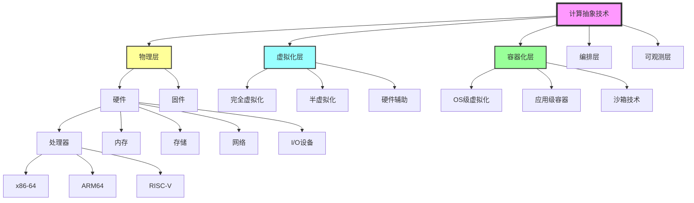
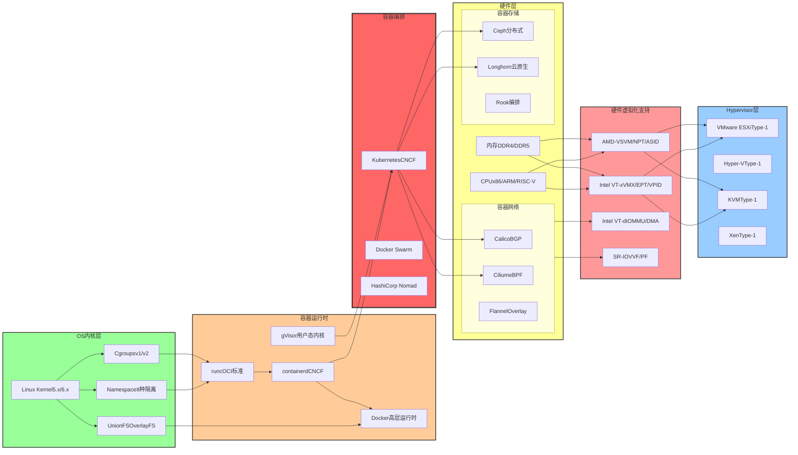
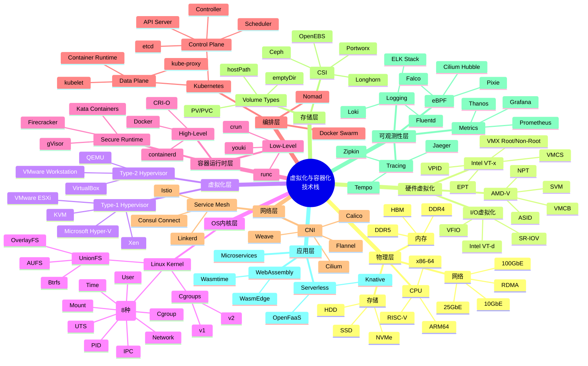
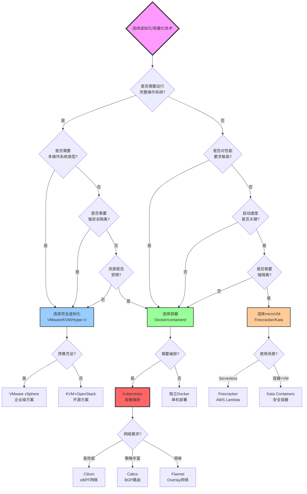
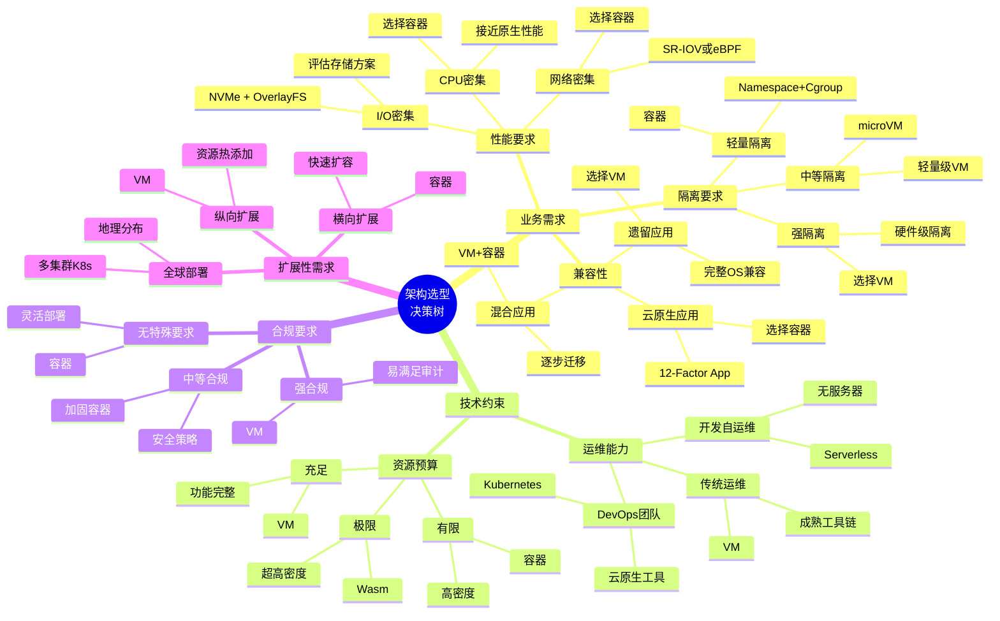
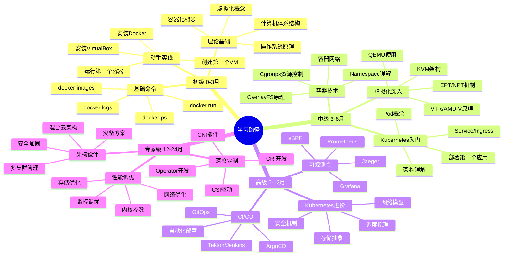

# 虚拟化与容器化的知识图谱、矩阵对比与思维导图全面梳理（2025版）

> **文档定位**: 完整的知识图谱本体、全维度矩阵对比与多视角思维导图  
> **覆盖范围**: 概念、关系、属性、层次、对比、决策、演化  
> **更新日期**: 2025年10月20日

---

## 📋 目录

- [虚拟化与容器化的知识图谱、矩阵对比与思维导图全面梳理（2025版）](#虚拟化与容器化的知识图谱矩阵对比与思维导图全面梳理2025版)
  - [📋 目录](#-目录)
  - [第一部分：知识图谱全面梳理](#第一部分知识图谱全面梳理)
    - [1.1 概念本体（Ontology）](#11-概念本体ontology)
      - [顶层概念分类](#顶层概念分类)
      - [核心概念定义表](#核心概念定义表)
      - [概念关系图谱（YAML格式）](#概念关系图谱yaml格式)
    - [1.2 关系图谱（Relationship Graph）](#12-关系图谱relationship-graph)
      - [技术依赖关系图](#技术依赖关系图)
    - [1.3 属性模型（Attribute Model）](#13-属性模型attribute-model)
      - [技术属性定义（结构化表示）](#技术属性定义结构化表示)
    - [1.4 层次分类（Hierarchical Classification）](#14-层次分类hierarchical-classification)
      - [技术栈12层分类体系](#技术栈12层分类体系)
    - [1.5 时序演化（Temporal Evolution）](#15-时序演化temporal-evolution)
      - [详细演化时间轴（1960-2025）](#详细演化时间轴1960-2025)
  - [第二部分：全维度矩阵对比](#第二部分全维度矩阵对比)
    - [2.1 技术特性矩阵](#21-技术特性矩阵)
      - [核心技术特性全面对比](#核心技术特性全面对比)
    - [2.2 性能指标矩阵](#22-性能指标矩阵)
      - [性能量化对比表](#性能量化对比表)
      - [性能数学模型](#性能数学模型)
    - [2.3 安全能力矩阵](#23-安全能力矩阵)
      - [多层次安全对比](#多层次安全对比)
    - [2.4 成本效益矩阵](#24-成本效益矩阵)
    - [2.5 适用场景矩阵](#25-适用场景矩阵)
    - [2.6 生态系统矩阵](#26-生态系统矩阵)
  - [第三部分：思维导图全面梳理](#第三部分思维导图全面梳理)
    - [3.1 技术栈思维导图](#31-技术栈思维导图)
    - [3.2 决策树思维导图](#32-决策树思维导图)
    - [3.3 演化路径思维导图](#33-演化路径思维导图)
    - [3.4 架构选型思维导图](#34-架构选型思维导图)
    - [3.5 学习路径思维导图](#35-学习路径思维导图)
  - [总结与应用指南](#总结与应用指南)
    - [知识图谱使用指南](#知识图谱使用指南)
    - [矩阵对比使用指南](#矩阵对比使用指南)
    - [思维导图使用指南](#思维导图使用指南)
  - [参考文献](#参考文献)

---

## 第一部分：知识图谱全面梳理

### 1.1 概念本体（Ontology）

#### 顶层概念分类



#### 核心概念定义表

| 概念ID | 概念名称 | 英文名称 | 定义 | 所属层级 |
|--------|---------|---------|------|---------|
| C001 | 虚拟化 | Virtualization | 通过软件模拟硬件资源，创建虚拟计算环境的技术 | L0-顶层 |
| C002 | 容器化 | Containerization | 通过OS级隔离机制，共享内核的轻量级虚拟化技术 | L0-顶层 |
| C003 | Hypervisor | Hypervisor | 虚拟机监视器，管理虚拟机生命周期的软件层 | L1-虚拟化 |
| C004 | Type-1 Hypervisor | Bare-Metal Hypervisor | 直接运行在硬件上的虚拟机监视器 | L2-Hypervisor |
| C005 | Type-2 Hypervisor | Hosted Hypervisor | 运行在宿主OS上的虚拟机监视器 | L2-Hypervisor |
| C006 | Intel VT-x | Intel Virtualization Technology | Intel的硬件辅助虚拟化扩展 | L2-硬件支持 |
| C007 | AMD-V | AMD Virtualization | AMD的硬件辅助虚拟化扩展 | L2-硬件支持 |
| C008 | EPT | Extended Page Tables | Intel的二维页表硬件支持 | L3-内存虚拟化 |
| C009 | NPT | Nested Page Tables | AMD的二维页表硬件支持 | L3-内存虚拟化 |
| C010 | VMCS | Virtual-Machine Control Structure | Intel VT-x的VM控制结构 | L3-CPU虚拟化 |
| C011 | VMCB | Virtual Machine Control Block | AMD-V的VM控制块 | L3-CPU虚拟化 |
| C012 | SR-IOV | Single Root I/O Virtualization | PCI-SIG的I/O虚拟化标准 | L3-I/O虚拟化 |
| C013 | VT-d | Intel Virtualization Technology for Directed I/O | Intel的IOMMU技术 | L3-I/O虚拟化 |
| C014 | Namespace | Linux Namespace | Linux内核的资源隔离机制 | L1-容器化 |
| C015 | Cgroups | Control Groups | Linux内核的资源限制与统计机制 | L1-容器化 |
| C016 | UnionFS | Union File System | 支持文件系统联合挂载的技术 | L2-容器存储 |
| C017 | OverlayFS | Overlay File System | Linux内核的联合文件系统实现 | L3-UnionFS |
| C018 | Docker | Docker | 最流行的容器平台 | L2-容器运行时 |
| C019 | containerd | containerd | CNCF标准容器运行时 | L2-容器运行时 |
| C020 | runc | runc | OCI标准的低层容器运行时 | L3-容器运行时 |
| C021 | Kubernetes | Kubernetes | CNCF容器编排平台 | L1-编排 |
| C022 | OCI | Open Container Initiative | 容器标准化组织 | L0-标准 |
| C023 | CRI | Container Runtime Interface | Kubernetes容器运行时接口 | L1-接口标准 |
| C024 | CNI | Container Network Interface | 容器网络接口标准 | L1-接口标准 |
| C025 | CSI | Container Storage Interface | 容器存储接口标准 | L1-接口标准 |

#### 概念关系图谱（YAML格式）

```yaml
# 虚拟化与容器化概念关系图谱
relationships:
  # 虚拟化技术依赖关系
  - from: "Hypervisor"
    to: "Hardware"
    type: "depends_on"
    strength: "strong"
    description: "Hypervisor运行依赖物理硬件"
    
  - from: "Type-1 Hypervisor"
    to: "Hardware"
    type: "runs_on"
    strength: "direct"
    description: "直接运行在硬件上"
    
  - from: "Type-2 Hypervisor"
    to: "Host OS"
    type: "runs_on"
    strength: "indirect"
    description: "运行在宿主操作系统上"
    
  - from: "Intel VT-x"
    to: "CPU"
    type: "extends"
    strength: "hardware"
    description: "扩展CPU指令集"
    
  - from: "EPT"
    to: "Intel VT-x"
    type: "part_of"
    strength: "component"
    description: "VT-x的内存虚拟化组件"
    
  - from: "VMCS"
    to: "Intel VT-x"
    type: "part_of"
    strength: "component"
    description: "VT-x的控制结构"
    
  # 容器化技术依赖关系
  - from: "Docker"
    to: "containerd"
    type: "uses"
    strength: "strong"
    description: "Docker使用containerd作为运行时"
    
  - from: "containerd"
    to: "runc"
    type: "uses"
    strength: "strong"
    description: "containerd使用runc创建容器"
    
  - from: "runc"
    to: "Namespace"
    type: "depends_on"
    strength: "strong"
    description: "runc依赖Namespace进行隔离"
    
  - from: "runc"
    to: "Cgroups"
    type: "depends_on"
    strength: "strong"
    description: "runc依赖Cgroups进行资源控制"
    
  - from: "Docker"
    to: "OverlayFS"
    type: "uses"
    strength: "medium"
    description: "Docker默认使用OverlayFS作为存储驱动"
    
  # 编排层依赖关系
  - from: "Kubernetes"
    to: "CRI"
    type: "defines"
    strength: "interface"
    description: "Kubernetes定义CRI接口"
    
  - from: "containerd"
    to: "CRI"
    type: "implements"
    strength: "interface"
    description: "containerd实现CRI接口"
    
  - from: "Kubernetes"
    to: "CNI"
    type: "uses"
    strength: "plugin"
    description: "Kubernetes通过CNI管理网络"
    
  - from: "Kubernetes"
    to: "CSI"
    type: "uses"
    strength: "plugin"
    description: "Kubernetes通过CSI管理存储"
    
  # 标准化关系
  - from: "OCI"
    to: "runc"
    type: "standardizes"
    strength: "specification"
    description: "OCI定义runc的标准"
    
  - from: "CNCF"
    to: "Kubernetes"
    type: "governs"
    strength: "governance"
    description: "CNCF管理Kubernetes项目"
    
  - from: "CNCF"
    to: "containerd"
    type: "governs"
    strength: "governance"
    description: "CNCF管理containerd项目"
    
  # 演化关系
  - from: "Docker"
    to: "Kubernetes"
    type: "enables"
    strength: "ecosystem"
    description: "Docker容器化技术推动Kubernetes发展"
    
  - from: "LXC"
    to: "Docker"
    type: "evolves_to"
    strength: "historical"
    description: "Docker早期基于LXC"
    
  - from: "Xen"
    to: "KVM"
    type: "competes_with"
    strength: "alternative"
    description: "Xen与KVM是竞争技术"
```

### 1.2 关系图谱（Relationship Graph）

#### 技术依赖关系图



### 1.3 属性模型（Attribute Model）

#### 技术属性定义（结构化表示）

```yaml
# 虚拟化技术属性模型
virtualization_technologies:
  vmware_esxi:
    basic_info:
      name: "VMware ESXi"
      type: "Type-1 Hypervisor"
      vendor: "VMware"
      license: "Commercial"
      first_release: 2001
      latest_version: "8.0"
      
    technical_attributes:
      architecture: "Bare-Metal"
      kernel: "VMKernel"
      cpu_support: ["Intel VT-x", "AMD-V"]
      memory_virtualization: ["EPT", "NPT", "Shadow Paging"]
      io_virtualization: ["VT-d", "SR-IOV", "DirectPath I/O"]
      max_vcpus_per_vm: 768
      max_memory_per_vm: "24 TB"
      max_vms_per_host: 1024
      nested_virtualization: true
      
    performance_metrics:
      startup_time: "30-60 seconds"
      cpu_overhead: "5-10%"
      memory_overhead: "~1 GB per VM"
      network_throughput: "85-95% native"
      storage_iops: "75-85% native"
      
    security_features:
      isolation_level: "Hardware-level"
      secure_boot: true
      tpm_support: true
      encryption: ["VM Encryption", "vMotion Encryption"]
      
    ecosystem:
      management: ["vCenter", "vSphere Client"]
      monitoring: ["vRealize Operations"]
      backup: ["vSphere Data Protection"]
      ha_dr: ["vSphere HA", "vSphere FT", "Site Recovery Manager"]
      
  kvm:
    basic_info:
      name: "KVM (Kernel-based Virtual Machine)"
      type: "Type-1 Hypervisor"
      vendor: "Linux Community"
      license: "Open Source (GPL)"
      first_release: 2007
      latest_version: "Kernel 6.x"
      
    technical_attributes:
      architecture: "Kernel Module"
      kernel: "Linux Kernel"
      cpu_support: ["Intel VT-x", "AMD-V"]
      memory_virtualization: ["EPT", "NPT"]
      io_virtualization: ["VFIO", "VT-d", "SR-IOV"]
      max_vcpus_per_vm: 710
      max_memory_per_vm: "24 TB"
      max_vms_per_host: "unlimited (depends on resources)"
      nested_virtualization: true
      
    performance_metrics:
      startup_time: "20-40 seconds"
      cpu_overhead: "2-5%"
      memory_overhead: "~512 MB per VM"
      network_throughput: "90-98% native"
      storage_iops: "80-90% native"
      
    security_features:
      isolation_level: "Hardware-level"
      secure_boot: true
      tpm_support: true
      encryption: ["LUKS", "dm-crypt"]
      selinux_support: true
      
    ecosystem:
      management: ["Libvirt", "oVirt", "OpenStack"]
      monitoring: ["Prometheus", "Grafana"]
      backup: ["Bacula", "Veeam"]
      ha_dr: ["Pacemaker", "Corosync"]

# 容器化技术属性模型
containerization_technologies:
  docker:
    basic_info:
      name: "Docker"
      type: "Container Runtime"
      vendor: "Docker Inc."
      license: "Apache 2.0"
      first_release: 2013
      latest_version: "24.x"
      
    technical_attributes:
      architecture: "Client-Server"
      runtime: "containerd + runc"
      isolation_mechanisms: 
        - "Namespace (PID/NET/MNT/UTS/IPC/USER/CGROUP/TIME)"
        - "Cgroups (CPU/Memory/IO)"
      storage_drivers: ["overlay2", "aufs", "btrfs", "zfs", "devicemapper"]
      default_storage: "overlay2"
      networking_modes: ["bridge", "host", "overlay", "macvlan"]
      max_containers_per_host: "1000+ (depends on resources)"
      
    performance_metrics:
      startup_time: "<1 second"
      cpu_overhead: "<1%"
      memory_overhead: "10-100 MB per container"
      network_throughput: "95-99% native"
      storage_iops: "87-95% native"
      
    security_features:
      isolation_level: "OS-level"
      seccomp_profiles: true
      apparmor_support: true
      selinux_support: true
      user_namespaces: true
      content_trust: true
      image_scanning: "Docker Scout"
      
    ecosystem:
      orchestration: ["Docker Swarm", "Kubernetes"]
      registry: ["Docker Hub", "Harbor", "Quay"]
      monitoring: ["cAdvisor", "Prometheus"]
      logging: ["Fluentd", "Logstash"]
      
  kubernetes:
    basic_info:
      name: "Kubernetes"
      type: "Container Orchestration"
      vendor: "CNCF"
      license: "Apache 2.0"
      first_release: 2014
      latest_version: "1.29"
      
    technical_attributes:
      architecture: "Control Plane + Data Plane"
      control_plane_components:
        - "API Server (kube-apiserver)"
        - "etcd (distributed key-value store)"
        - "Scheduler (kube-scheduler)"
        - "Controller Manager (kube-controller-manager)"
      data_plane_components:
        - "kubelet"
        - "kube-proxy"
        - "Container Runtime (CRI)"
      supported_runtimes: ["containerd", "CRI-O", "Docker"]
      max_nodes: 5000
      max_pods_per_node: 110
      max_pods_per_cluster: 150000
      
    performance_metrics:
      api_latency: "<1s (p99)"
      pod_startup_time: "5-10 seconds"
      cluster_recovery_time: "minutes"
      
    security_features:
      rbac: true
      pod_security_standards: ["Privileged", "Baseline", "Restricted"]
      network_policies: true
      secrets_management: true
      admission_controllers: ["ValidatingWebhook", "MutatingWebhook"]
      
    ecosystem:
      cni_plugins: ["Calico", "Cilium", "Flannel", "Weave"]
      csi_drivers: ["Ceph", "Longhorn", "OpenEBS"]
      service_mesh: ["Istio", "Linkerd", "Consul"]
      monitoring: ["Prometheus", "Grafana", "Thanos"]
      logging: ["Loki", "ELK Stack"]
```

### 1.4 层次分类（Hierarchical Classification）

#### 技术栈12层分类体系

```text
┌─────────────────────────────────────────────────────────────┐
│ Layer 11: Application (应用层)                              │
│   - Microservices, Serverless, FaaS                        │
└─────────────────────────────────────────────────────────────┘
            ↓ (depends on)
┌─────────────────────────────────────────────────────────────┐
│ Layer 10: Service Mesh (服务网格层)                         │
│   - Istio, Linkerd, Consul Connect                         │
└─────────────────────────────────────────────────────────────┘
            ↓ (manages)
┌─────────────────────────────────────────────────────────────┐
│ Layer 9: Observability (可观测性层)                         │
│   - Prometheus, Jaeger, Grafana, Loki, eBPF                │
└─────────────────────────────────────────────────────────────┘
            ↓ (monitors)
┌─────────────────────────────────────────────────────────────┐
│ Layer 8: Orchestration (编排层)                             │
│   - Kubernetes, Docker Swarm, Nomad                         │
└─────────────────────────────────────────────────────────────┘
            ↓ (orchestrates)
┌─────────────────────────────────────────────────────────────┐
│ Layer 7: Network & Storage (网络与存储层)                   │
│   - CNI (Calico/Cilium), CSI (Ceph/Longhorn)               │
└─────────────────────────────────────────────────────────────┘
            ↓ (provides)
┌─────────────────────────────────────────────────────────────┐
│ Layer 6: Image & Registry (镜像与仓库层)                    │
│   - OCI Image, Docker Hub, Harbor, Quay                    │
└─────────────────────────────────────────────────────────────┘
            ↓ (stores)
┌─────────────────────────────────────────────────────────────┐
│ Layer 5: Container Runtime (容器运行时层)                   │
│   - Docker, containerd, CRI-O, runc, gVisor                │
└─────────────────────────────────────────────────────────────┘
            ↓ (uses)
┌─────────────────────────────────────────────────────────────┐
│ Layer 4: OS Virtualization (OS级虚拟化层)                   │
│   - Namespace, Cgroups, UnionFS, Seccomp, Capabilities     │
└─────────────────────────────────────────────────────────────┘
            ↓ (implements)
┌─────────────────────────────────────────────────────────────┐
│ Layer 3: Operating System Kernel (操作系统内核层)           │
│   - Linux Kernel, Windows Kernel                           │
└─────────────────────────────────────────────────────────────┘
            ↓ (runs on)
┌─────────────────────────────────────────────────────────────┐
│ Layer 2: Hypervisor (虚拟机监视器层)                        │
│   - VMware ESXi, Hyper-V, KVM, Xen                         │
└─────────────────────────────────────────────────────────────┘
            ↓ (uses)
┌─────────────────────────────────────────────────────────────┐
│ Layer 1: Hardware Virtualization (硬件虚拟化层)             │
│   - Intel VT-x/EPT/VT-d, AMD-V/NPT, ARM EL2                │
└─────────────────────────────────────────────────────────────┘
            ↓ (extends)
┌─────────────────────────────────────────────────────────────┐
│ Layer 0: Physical Hardware (物理硬件层)                     │
│   - CPU, Memory, Storage, Network, I/O                     │
└─────────────────────────────────────────────────────────────┘
```

### 1.5 时序演化（Temporal Evolution）

#### 详细演化时间轴（1960-2025）

```mermaid
timeline
    title 虚拟化与容器化技术演化时间线
    section 虚拟化起源 (1960s-1990s)
        1965 : IBM CP-40
             : 首个虚拟机系统
        1972 : IBM VM/370
             : 商业化虚拟机
        1974 : Popek-Goldberg定理
             : 虚拟化理论基础
        1985 : 286保护模式
             : x86虚拟化挑战
        
    section 虚拟化复兴 (1999-2006)
        1999 : VMware Workstation
             : x86虚拟化突破
        2001 : VMware ESX Server
             : Type-1 Hypervisor
        2003 : Xen 1.0
             : 开源半虚拟化
        2005 : Intel VT-x
             : 硬件辅助虚拟化
        2006 : AMD-V
             : AMD硬件支持
        
    section 容器萌芽 (2000-2012)
        2000 : FreeBSD Jails
             : OS级隔离
        2004 : Solaris Zones
             : 容器概念
        2006 : cgroups
             : Linux资源控制
        2008 : LXC 1.0
             : Linux容器
        2011 : CloudFoundry Warden
             : PaaS容器
        
    section 容器革命 (2013-2016)
        2013-03 : Docker 0.1
                : 容器平台诞生
        2014-06 : Kubernetes 1.0
                : 容器编排
        2015-06 : OCI成立
                : 容器标准化
        2015-12 : containerd开源
                : 运行时标准
        2016-03 : runc 1.0
                : OCI参考实现
        
    section 云原生时代 (2017-2020)
        2017-03 : CNCF毕业项目
                : Kubernetes成熟
        2017-12 : Kata Containers
                : 安全容器
        2018-05 : gVisor开源
                : 用户态内核
        2018-12 : Istio 1.0
                : 服务网格
        2019-06 : eBPF for Observability
                : Cilium 1.5
        2020-12 : Kubernetes 1.20
                : Docker弃用警告
        
    section 新兴技术 (2021-2025)
        2021-06 : WebAssembly WASI
                : Wasm标准化
        2022-03 : Confidential Containers
                : 机密计算
        2023-06 : Kubernetes 1.27
                : Gateway API GA
        2024-01 : WasmEdge Runtime
                : Wasm容器化
        2025-10 : 融合时代
                : Wasm+Container+VM
```



---

## 第二部分：全维度矩阵对比

### 2.1 技术特性矩阵

#### 核心技术特性全面对比

| 特性维度 | 完全虚拟化(VM) | 半虚拟化(Para-Virt) | 容器(Container) | 微VM(microVM) | 沙箱容器(Sandbox) | Wasm(2025) |
|---------|----------------|-------------------|------------------|----------------|------------------|-------------|
| **基础架构** |||||||
| 隔离层级 | 硬件级 | 内核级 | 进程级 | 轻量级VM | 用户态内核 | 沙箱 |
| 共享内核 | ❌ 独立内核 | ❌ 独立内核 | ✅ 共享内核 | ❌ 独立内核 | ✅ 共享内核 | ✅ Runtime |
| TCB大小 | ~20M LOC | ~15M LOC | ~100K LOC | ~50K LOC | ~50K LOC | ~10K LOC |
| 隔离强度 | ⭐⭐⭐⭐⭐ | ⭐⭐⭐⭐ | ⭐⭐⭐ | ⭐⭐⭐⭐ | ⭐⭐⭐⭐ | ⭐⭐⭐⭐ |
| **资源开销** |||||||
| 启动时间 | 30-60秒 | 10-30秒 | <1秒 | 125ms | 200ms | <10ms |
| 内存开销 | 512MB-2GB | 256MB-1GB | 10-100MB | 128-512MB | 100-300MB | 1-10MB |
| CPU开销 | 5-15% | 2-5% | <1% | 2-3% | 3-5% | <1% |
| 存储开销 | 10-100GB | 5-50GB | 100MB-1GB | 500MB-2GB | 200MB-1GB | 10-100MB |
| 密度 | 10-50/Host | 50-100/Host | 100-1000/Host | 500-2000/Host | 300-800/Host | 10000+/Host |
| **兼容性** |||||||
| OS兼容 | 完全兼容 | 需修改Guest | 共享Host内核 | 完全兼容 | 共享内核 | WASI标准 |
| 应用兼容 | 完全兼容 | 完全兼容 | 需容器化 | 完全兼容 | 需容器化 | 需编译为Wasm |
| 二进制兼容 | ✅ 完全 | ✅ 完全 | ⚠️ 内核ABI | ✅ 完全 | ⚠️ 内核ABI | ❌ 需重编译 |
| **迁移性** |||||||
| 实时迁移 | ✅ vMotion | ✅ 支持 | ⚠️ CRIU | ✅ 支持 | ⚠️ 有限 | ✅ 快速 |
| 迁移速度 | 分钟级 | 分钟级 | 秒级 | 秒级 | 秒级 | 毫秒级 |
| 快照支持 | ✅ 完整 | ✅ 完整 | ⚠️ 文件系统 | ✅ 完整 | ⚠️ 文件系统 | ✅ 即时 |
| **管理复杂度** |||||||
| 部署难度 | ⭐⭐⭐⭐ | ⭐⭐⭐⭐ | ⭐⭐ | ⭐⭐⭐ | ⭐⭐⭐ | ⭐⭐ |
| 运维成本 | 高 | 高 | 低 | 中 | 中 | 低 |
| 学习曲线 | 陡峭 | 陡峭 | 平缓 | 中等 | 中等 | 平缓 |

### 2.2 性能指标矩阵

#### 性能量化对比表

| 性能维度 | 物理机(Baseline) | 完全虚拟化(VM) | 容器(Container) | 微VM(Firecracker) | 沙箱容器(gVisor) | Wasm(Wasmtime) |
|----|-------------|--------|-------|------|------|-------|
| **CPU性能** |||||||
| 整数运算 | 100% | 90-95% | 98-99.5% | 92-96% | 85-92% | 95-98% |
| 浮点运算 | 100% | 85-92% | 97-99% | 88-94% | 80-88% | 92-96% |
| 向量运算 | 100% | 82-88% | 96-98% | 85-90% | 75-85% | 88-94% |
| 系统调用 | Baseline | +5-15% | +0.1-1% | +2-5% | +10-30% | +1-3% |
| 上下文切换 | Baseline | +10-20% | +1-2% | +5-10% | +15-25% | +2-5% |
| **内存性能** |||||||
| 带宽 | 100% | 85-95% | 98-99.5% | 90-96% | 90-95% | 95-98% |
| 延迟 | Baseline | +5-10ns | +0-1ns | +2-5ns | +3-8ns | +1-2ns |
| TLB miss | Baseline | +2-5x | +0-5% | +1.5-3x | +10-20% | +5-10% |
| 页表遍历 | 4-level | 2D (4+4) | 4-level | 2D (4+4) | 4-level | N/A |
| **网络性能** |||||||
| 吞吐量 | 100% | 80-90% | 95-98% | 85-92% | 80-88% | 90-95% |
| 延迟 | Baseline | +50-100μs | +5-20μs | +30-60μs | +100-200μs | +10-30μs |
| PPS | 100% | 70-85% | 90-96% | 75-88% | 65-80% | 85-92% |
| 连接数 | Baseline | -20-30% | -2-5% | -10-20% | -15-25% | -5-10% |
| **存储I/O性能** |||||||
| 顺序读 | 100% | 75-85% | 90-95% | 78-88% | 85-92% | 92-96% |
| 顺序写 | 100% | 70-82% | 88-94% | 75-85% | 82-90% | 90-94% |
| 随机读IOPS | 100% | 65-78% | 85-92% | 70-82% | 78-88% | 88-94% |
| 随机写IOPS | 100% | 60-75% | 82-90% | 65-78% | 75-85% | 85-92% |
| 延迟 (p50) | Baseline | +1-3ms | +0.1-0.5ms | +0.5-1.5ms | +0.3-1ms | +0.2-0.8ms |
| 延迟 (p99) | Baseline | +5-15ms | +0.5-2ms | +2-8ms | +1.5-5ms | +1-3ms |
| **扩展性** |||||||
| 横向扩展 | N/A | 10-50实例 | 100-1000实例 | 500-2000实例 | 300-800实例 | 10000+实例 |
| 纵向扩展 | 有限 | ⭐⭐⭐ | ⭐⭐⭐⭐ | ⭐⭐⭐ | ⭐⭐⭐⭐ | ⭐⭐⭐⭐⭐ |
| 资源弹性 | N/A | 低 (需重启) | 高 (动态) | 高 (动态) | 高 (动态) | 极高 (即时) |

#### 性能数学模型

**1. CPU性能模型**:

\[
P_{\text{tech}} = P_{\text{native}} \times (1 - \alpha_{\text{trap}} - \beta_{\text{emulation}} - \gamma_{\text{overhead}})
\]

其中：

- \( \alpha_{\text{trap}} \): 陷入开销系数
- \( \beta_{\text{emulation}} \): 模拟开销系数
- \( \gamma_{\text{overhead}} \): 额外开销系数

**各技术的参数值**:

| 技术 | \( \alpha \) | \( \beta \) | \( \gamma \) | 总性能 |
|------|------------|------------|------------|-------|
| 完全虚拟化 | 0.05-0.10 | 0.02-0.05 | 0.01-0.03 | 85-92% |
| 容器 | 0.001-0.005 | 0 | 0.001-0.005 | 98-99.5% |
| microVM | 0.02-0.04 | 0.01-0.02 | 0.01-0.02 | 92-96% |
| gVisor | 0.05-0.08 | 0.03-0.05 | 0.02-0.05 | 85-92% |

**2. 内存性能模型**:

\[
T_{\text{access}} = T_{\text{native}} + T_{\text{translation}} + T_{\text{trap}}
\]

- **VM (EPT)**: \( T_{\text{translation}} = 24 \times T_{\text{memory-cycle}} \approx 24 \text{ cycles} \)
- **Container**: \( T_{\text{translation}} \approx 0 \)
- **microVM**: \( T_{\text{translation}} \approx 20 \text{ cycles} \)

**3. 网络吞吐量模型**:

\[
BW_{\text{tech}} = BW_{\text{native}} \times (1 - \beta_{\text{virtio/veth}}) - \text{protocol\_overhead}
\]

| 技术 | \( \beta \) | 协议开销 | 实际吞吐 |
|------|-----------|---------|---------|
| VM (virtio) | 0.10-0.20 | 50-100 Mbps | 80-90% |
| Container (veth) | 0.02-0.05 | 10-30 Mbps | 95-98% |
| microVM | 0.08-0.15 | 40-80 Mbps | 85-92% |

### 2.3 安全能力矩阵

#### 多层次安全对比

| 安全维度 | 完全虚拟化 | 容器 | microVM | 沙箱容器 | Wasm | 评估 |
|---------|----------|------|---------|---------|------|------|
| **隔离安全** |||||||
| 进程隔离 | ✅ VM边界 | ✅ PID NS | ✅ VM边界 | ✅ Sandbox | ✅ Runtime | VM最强 |
| 内存隔离 | ✅ EPT/NPT | ⚠️ Cgroup | ✅ EPT/NPT | ✅ Seccomp | ✅ Linear Memory | VM最强 |
| 文件系统隔离 | ✅ 虚拟磁盘 | ✅ Mount NS | ✅ 虚拟磁盘 | ✅ Mount NS | ✅ WASI FS | 持平 |
| 网络隔离 | ✅ vNIC | ✅ Net NS | ✅ vNIC | ✅ Net NS | ✅ WASI Socket | 持平 |
| 内核隔离 | ✅ Guest内核 | ❌ 共享内核 | ✅ Guest内核 | ⚠️ 用户态 | ✅ Runtime | VM最强 |
| **攻击面** |||||||
| TCB大小 | ~20M LOC | ~100K LOC | ~50K LOC | ~50K LOC | ~10K LOC | Wasm最小 |
| 内核暴露 | ❌ 隔离 | ✅ 直接暴露 | ❌ 隔离 | ⚠️ 过滤 | ❌ 隔离 | VM最安全 |
| Syscall过滤 | N/A | ✅ Seccomp | N/A | ✅ Seccomp | ✅ WASI限制 | Wasm最严格 |
| **逃逸风险** |||||||
| 逃逸难度 | 极难 | 难 | 极难 | 很难 | 极难 | VM/microVM最难 |
| 历史漏洞 | 中 (Spectre) | 高 (内核) | 低 | 中 | 极低 | Wasm最好 |
| CVE数量/年 | 20-40 | 50-100 | 5-15 | 10-25 | <5 | Wasm最少 |
| **访问控制** |||||||
| RBAC | ✅ vCenter | ✅ K8s RBAC | ✅ K8s RBAC | ✅ K8s RBAC | ✅ WASI Caps | 持平 |
| Capabilities | N/A | ✅ Linux Caps | N/A | ✅ Linux Caps | ✅ WASI Caps | 持平 |
| SELinux/AppArmor | ✅ Guest内 | ✅ Host策略 | ✅ Guest内 | ✅ Host策略 | N/A | 容器灵活 |
| **加密支持** |||||||
| 静态加密 | ✅ VMDK加密 | ✅ LUKS | ✅ VMDK加密 | ✅ LUKS | ⚠️ 有限 | VM/Container好 |
| 传输加密 | ✅ vMotion加密 | ✅ TLS | ✅ 支持 | ✅ TLS | ✅ TLS | 持平 |
| 内存加密 | ✅ AMD SEV | ⚠️ 有限 | ✅ AMD SEV | ⚠️ 有限 | ⚠️ 有限 | VM独有 |
| **合规性** |||||||
| PCI-DSS | ✅ 易满足 | ⚠️ 需加固 | ✅ 易满足 | ⚠️ 需加固 | ⚠️ 待评估 | VM最易 |
| HIPAA | ✅ 易满足 | ⚠️ 需加固 | ✅ 易满足 | ⚠️ 需加固 | ⚠️ 待评估 | VM最易 |
| FedRAMP | ✅ 认证 | ⚠️ 需评估 | ✅ 可认证 | ⚠️ 需评估 | ❌ 未认证 | VM最成熟 |
| **审计能力** |||||||
| 日志记录 | ✅ 完整 | ✅ 完整 | ✅ 完整 | ✅ 完整 | ⚠️ 有限 | 持平 |
| 行为监控 | ✅ vRealize | ✅ eBPF/Falco | ✅ 支持 | ✅ eBPF/Falco | ⚠️ 有限 | Container最强 |

### 2.4 成本效益矩阵

| 成本维度 | 完全虚拟化 | 容器 | microVM | 沙箱容器 | 评估 |
|---------|----------|------|---------|---------|------|
| **许可证成本** ||||||
| 软件许可 | $$$$$ (商业) | $ (开源) | $ (开源) | $ (开源) | 容器最低 |
| 按核心收费 | ✅ 常见 | ❌ 无 | ❌ 无 | ❌ 无 | 容器优势 |
| 企业支持 | $$$$/年 | $$/年 | $$/年 | $$/年 | 容器便宜 |
| **硬件成本** ||||||
| CPU需求 | 高 (开销大) | 低 (接近原生) | 中 | 中 | 容器最低 |
| 内存需求 | 极高 (GB/实例) | 低 (MB/实例) | 中 (512MB) | 中 (256MB) | 容器最低 |
| 存储需求 | 极高 (10-100GB) | 低 (100MB-1GB) | 中 (2GB) | 中 (1GB) | 容器最低 |
| 密度 | 10-50/物理机 | 100-1000/物理机 | 500-2000 | 300-800 | 容器最高 |
| ROI | ⭐⭐⭐ | ⭐⭐⭐⭐⭐ | ⭐⭐⭐⭐ | ⭐⭐⭐⭐ | 容器最佳 |
| **运维成本** ||||||
| 部署时间 | 小时-天 | 分钟-小时 | 分钟-小时 | 分钟-小时 | 容器最快 |
| 学习成本 | ⭐⭐⭐⭐⭐ | ⭐⭐⭐ | ⭐⭐⭐ | ⭐⭐⭐⭐ | 容器最易 |
| 管理复杂度 | 高 | 中 | 中 | 中 | 容器较易 |
| 人力投入 | 3-5人/100VM | 1-2人/1000容器 | 2-3人/500 | 2-3人/500 | 容器效率高 |
| **能耗成本** ||||||
| 功耗 | 高 | 低 | 中 | 中 | 容器最低 |
| 散热需求 | 高 | 低 | 中 | 中 | 容器最低 |
| PUE影响 | 大 | 小 | 中 | 中 | 容器最佳 |

### 2.5 适用场景矩阵

| 场景 | 完全虚拟化 | 容器 | microVM | 推荐理由 |
|------|----------|------|---------|---------|
| **企业传统应用** | ✅ 最佳 | ⚠️ 需改造 | ⚠️ 需评估 | VM支持完整OS,兼容性最好 |
| **云原生应用** | ❌ 过重 | ✅ 最佳 | ✅ 良好 | 容器轻量快速,CI/CD友好 |
| **多租户SaaS** | ✅ 强隔离 | ⚠️ 需加固 | ✅ 平衡 | VM安全性高,microVM兼顾性能 |
| **Serverless/FaaS** | ❌ 太慢 | ✅ 良好 | ✅ 最佳 | microVM快速启动+强隔离 |
| **边缘计算** | ❌ 资源消耗大 | ✅ 最佳 | ✅ 良好 | 容器轻量,适合边缘资源受限 |
| **大数据/AI训练** | ✅ 最佳 | ⚠️ GPU难 | ⚠️ GPU难 | VM支持GPU直通,性能稳定 |
| **开发测试环境** | ⚠️ 创建慢 | ✅ 最佳 | ✅ 良好 | 容器快速创建销毁 |
| **生产环境** | ✅ 成熟稳定 | ✅ 主流 | ⚠️ 新兴 | 视具体需求,VM更稳妥 |
| **合规要求高** | ✅ 最佳 | ⚠️ 需评估 | ⚠️ 需评估 | VM隔离强,易满足合规 |

### 2.6 生态系统矩阵

| 生态组件 | VMware生态 | Kubernetes生态 | 成熟度对比 |
|---------|-----------|---------------|-----------|
| **管理平台** | vCenter (商业) | Rancher/OpenShift (开源+商业) | VM更成熟 |
| **监控** | vRealize Operations | Prometheus+Grafana | K8s生态更开放 |
| **日志** | vRealize Log Insight | Loki/ELK Stack | K8s选择更多 |
| **网络** | NSX | Calico/Cilium/Istio | K8s创新更快 |
| **存储** | vSAN | Ceph/Longhorn/Rook | 持平 |
| **备份** | Veeam/Commvault | Velero/Kasten | VM更成熟 |
| **灾备** | Site Recovery Manager | Velero+多集群 | VM更完善 |
| **CI/CD** | 需集成 | 原生支持 | K8s天然优势 |
| **安全** | vShield/NSX | Falco/Cilium/OPA | K8s工具更丰富 |
| **服务网格** | NSX Service Mesh | Istio/Linkerd | K8s原生 |

---

## 第三部分：思维导图全面梳理

### 3.1 技术栈思维导图



### 3.2 决策树思维导图



### 3.3 演化路径思维导图

```mermaid
graph LR
    subgraph Era1["1960s-1990s<br/>虚拟化起源"]
        A1[IBM CP-40<br/>1965] --> A2[IBM VM/370<br/>1972]
        A2 --> A3[Popek-Goldberg<br/>定理 1974]
    end
    
    subgraph Era2["1999-2006<br/>虚拟化复兴"]
        B1[VMware Workstation<br/>1999] --> B2[VMware ESX<br/>2001]
        B2 --> B3[Xen<br/>2003]
        B3 --> B4[Intel VT-x<br/>2005]
        B4 --> B5[AMD-V<br/>2006]
    end
    
    subgraph Era3["2000-2012<br/>容器萌芽"]
        C1[FreeBSD Jails<br/>2000] --> C2[Solaris Zones<br/>2004]
        C2 --> C3[cgroups<br/>2006]
        C3 --> C4[LXC<br/>2008]
    end
    
    subgraph Era4["2013-2016<br/>容器革命"]
        D1[Docker<br/>2013] --> D2[Kubernetes<br/>2014]
        D2 --> D3[OCI<br/>2015]
        D3 --> D4[containerd<br/>2015]
        D4 --> D5[runc<br/>2016]
    end
    
    subgraph Era5["2017-2020<br/>云原生时代"]
        E1[K8s毕业<br/>2017] --> E2[Kata/gVisor<br/>2017-2018]
        E2 --> E3[Istio 1.0<br/>2018]
        E3 --> E4[eBPF可观测<br/>2019]
        E4 --> E5[K8s 1.20<br/>Docker弃用警告]
    end
    
    subgraph Era6["2021-2025<br/>融合创新"]
        F1[WASI<br/>2021] --> F2[Confidential<br/>Containers 2022]
        F2 --> F3[Gateway API<br/>2023]
        F3 --> F4[WasmEdge<br/>2024]
        F4 --> F5[融合时代<br/>2025]
    end
    
    A3 --> B1
    C4 --> D1
    B5 --> D1
    D5 --> E1
    E5 --> F1
    
    style Era1 fill:#ff9,stroke:#333,stroke-width:2px
    style Era2 fill:#9cf,stroke:#333,stroke-width:2px
    style Era3 fill:#f9f,stroke:#333,stroke-width:2px
    style Era4 fill:#9f9,stroke:#333,stroke-width:2px
    style Era5 fill:#fc9,stroke:#333,stroke-width:2px
    style Era6 fill:#f66,stroke:#333,stroke-width:3px
```



### 3.4 架构选型思维导图



### 3.5 学习路径思维导图



---

## 总结与应用指南

### 知识图谱使用指南

1. **概念查询**: 使用概念本体表快速定位技术定义
2. **关系追踪**: 通过关系图谱理解技术依赖
3. **属性对比**: 利用YAML属性模型进行详细对比
4. **层次理解**: 12层分类体系帮助建立整体认知
5. **演化洞察**: 时间线了解技术发展脉络

### 矩阵对比使用指南

1. **技术选型**: 参考技术特性矩阵和适用场景矩阵
2. **性能评估**: 使用性能指标矩阵和数学模型
3. **安全评估**: 参考安全能力矩阵进行风险评估
4. **成本核算**: 利用成本效益矩阵计算TCO
5. **生态选择**: 参考生态系统矩阵选择配套工具

### 思维导图使用指南

1. **技术栈导图**: 建立完整知识体系结构
2. **决策树导图**: 快速做出技术选型决策
3. **演化路径导图**: 理解技术发展趋势
4. **架构选型导图**: 多维度评估架构方案
5. **学习路径导图**: 规划个人技能成长路线

---

## 参考文献

1. **Popek, G. & Goldberg, R.** (1974). "Formal Requirements for Virtualizable Third Generation Architectures". _CACM_.
2. **Intel Corporation** (2023). "Intel 64 and IA-32 Architectures Software Developer's Manual Volume 3C".
3. **AMD** (2023). "AMD64 Architecture Programmer's Manual Volume 2: System Programming".
4. **Linux Kernel Documentation** (2025). "Namespaces, Cgroups, and OverlayFS".
5. **CNCF** (2025). "Cloud Native Landscape". https://landscape.cncf.io/
6. **Kubernetes Documentation** (2025). "Kubernetes v1.29 Official Documentation".
7. **Docker Documentation** (2025). "Docker Engine v24.x Documentation".
8. **OCI Specifications** (2025). "OCI Runtime & Image Specifications".

---

**文档版本**: v1.0  
**最后更新**: 2025年10月20日  
**作者**: Knowledge Graph & Visualization Research Team  
**License**: CC-BY-4.0

---

**🎉 本文档提供了虚拟化与容器化从知识图谱到矩阵对比到思维导图的完整可视化分析！**
