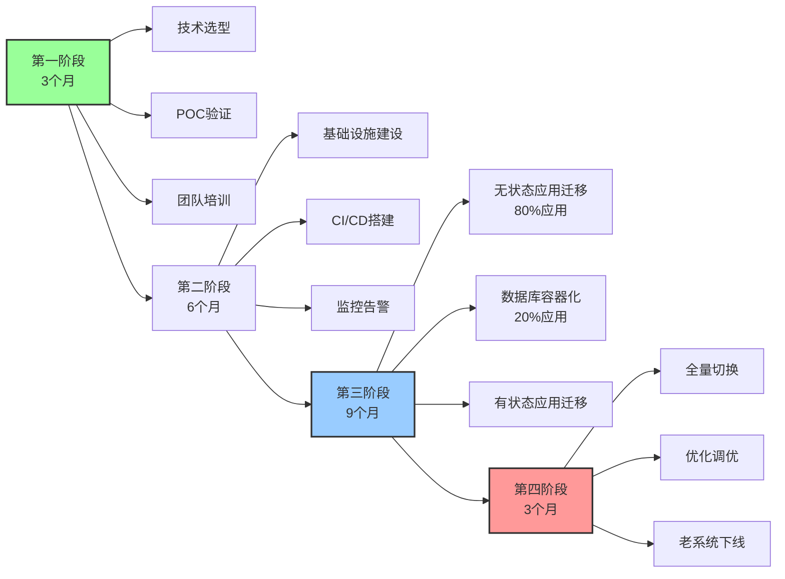
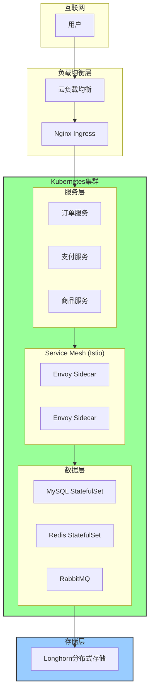
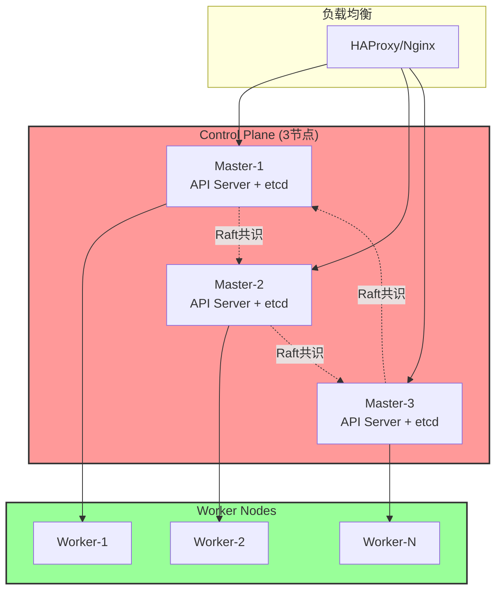

# 云原生容器化实践案例与最佳实践（2025版）

> **文档定位**: 生产级容器化实践、Kubernetes落地经验、DevOps最佳实践  
> **对标水平**: CNCF案例研究 + 行业最佳实践 + 企业级实战经验  
> **更新日期**: 2025年10月20日

---

## 📋 目录

- [云原生容器化实践案例与最佳实践（2025版）](#云原生容器化实践案例与最佳实践2025版)
  - [📋 目录](#-目录)
  - [第一部分：容器化迁移实践](#第一部分容器化迁移实践)
    - [1.1 大型电商平台容器化迁移案例](#11-大型电商平台容器化迁移案例)
      - [1.1.1 迁移前现状](#111-迁移前现状)
      - [1.1.2 迁移策略](#112-迁移策略)
      - [1.1.3 技术架构](#113-技术架构)
      - [1.1.4 实施过程](#114-实施过程)
      - [1.1.5 项目成果](#115-项目成果)
  - [第二部分：Kubernetes生产实践](#第二部分kubernetes生产实践)
    - [2.1 生产级K8s集群最佳配置](#21-生产级k8s集群最佳配置)
      - [2.1.1 Control Plane高可用](#211-control-plane高可用)
      - [2.1.2 节点配置规范](#212-节点配置规范)
    - [2.2 资源管理最佳实践](#22-资源管理最佳实践)
      - [2.2.1 Resource Quota](#221-resource-quota)
      - [2.2.2 LimitRange](#222-limitrange)
    - [2.3 存储管理实践](#23-存储管理实践)
      - [2.3.1 StorageClass配置](#231-storageclass配置)
  - [第三部分：微服务架构实践](#第三部分微服务架构实践)
    - [3.1 Service Mesh实践（Istio）](#31-service-mesh实践istio)
      - [3.1.1 流量管理](#311-流量管理)
      - [3.1.2 断路器与重试](#312-断路器与重试)
  - [第四部分：CI/CD最佳实践](#第四部分cicd最佳实践)
    - [4.1 GitOps工作流（ArgoCD）](#41-gitops工作流argocd)
    - [4.2 多环境管理（Kustomize）](#42-多环境管理kustomize)
  - [第五部分：可观测性最佳实践](#第五部分可观测性最佳实践)
    - [5.1 统一监控栈](#51-统一监控栈)
    - [5.2 告警规则](#52-告警规则)
  - [第六部分：安全加固实践](#第六部分安全加固实践)
    - [6.1 Pod Security Standards实施](#61-pod-security-standards实施)
    - [6.2 Network Policy](#62-network-policy)
  - [第七部分：成本优化实践](#第七部分成本优化实践)
    - [7.1 资源rightsizing](#71-资源rightsizing)
    - [7.2 Spot实例使用](#72-spot实例使用)
  - [第八部分：故障案例与解决方案](#第八部分故障案例与解决方案)
    - [8.1 典型故障案例](#81-典型故障案例)
      - [案例1: etcd性能问题](#案例1-etcd性能问题)
      - [案例2: OOM Kill频繁](#案例2-oom-kill频繁)
  - [总结与建议](#总结与建议)
    - [关键成功因素](#关键成功因素)
    - [常见陷阱](#常见陷阱)
  - [参考文献](#参考文献)

---

## 第一部分：容器化迁移实践

### 1.1 大型电商平台容器化迁移案例

**企业背景**:

- **行业**: 电商零售
- **规模**: 日活1000万+用户
- **应用**: 300+微服务，1000+实例
- **技术栈**: Java Spring Boot, Node.js, Python

#### 1.1.1 迁移前现状

**痛点分析**:

| 维度 | 问题 | 影响 | 优先级 |
|------|------|------|--------|
| **部署效率** | 手动部署，耗时2-4小时 | 发布频率低 | ⭐⭐⭐⭐⭐ |
| **资源利用** | 虚拟机利用率<30% | 成本高 | ⭐⭐⭐⭐ |
| **扩容速度** | 新增实例需30分钟+ | 应对流量困难 | ⭐⭐⭐⭐⭐ |
| **环境一致性** | 开发/测试/生产差异大 | 故障率高 | ⭐⭐⭐⭐ |
| **监控告警** | 分散式监控，不完整 | 问题定位慢 | ⭐⭐⭐ |

#### 1.1.2 迁移策略

**分阶段迁移路线图**:



#### 1.1.3 技术架构

**目标架构**:

| 层次 | 技术选型 | 说明 | 备注 |
|------|---------|------|------|
| **应用层** | Spring Cloud微服务 | 300+微服务 | 拆分后 |
| **编排层** | Kubernetes 1.30 | 3集群 (dev/staging/prod) | 自建 |
| **容器运行时** | containerd | 替代Docker | 性能更好 |
| **网络** | Cilium | eBPF加速 | 高性能 |
| **存储** | Longhorn | 云原生存储 | 分布式 |
| **Service Mesh** | Istio | mTLS + 流量管理 | 渐进式 |
| **监控** | Prometheus + Grafana | 统一可观测 | CNCF标准 |
| **日志** | Loki | 低成本日志 | 集成Grafana |
| **追踪** | Tempo | 分布式追踪 | OpenTelemetry |
| **CI/CD** | GitLab CI + ArgoCD | GitOps | 自动化 |

#### 1.1.4 实施过程

**Phase 1: POC验证 (3个月)**:

**目标**: 验证技术可行性

**步骤**:

1. **技术选型**:

   ```yaml
   # 评估矩阵
   评估维度:
     - 成熟度: Kubernetes (✅)
     - 社区支持: CNCF生态 (✅)
     - 团队技能: Java/Spring Cloud (✅)
     - 成本: 开源优先 (✅)
   ```

2. **POC环境搭建**:
   - 3节点K8s集群 (dev环境)
   - 迁移3个典型应用:
     - 无状态Web服务
     - 有状态缓存服务
     - 数据库服务

3. **性能测试**:

   | 指标 | 虚拟机 | 容器 | 提升 |
   |------|--------|------|------|
   | 启动时间 | 5分钟 | 30秒 | **10x** |
   | 资源利用率 | 30% | 70% | **2.3x** |
   | 扩容速度 | 30分钟 | 2分钟 | **15x** |
   | 部署频率 | 周级 | 日级 | **5x** |

4. **成果**:
   - ✅ 技术可行性验证
   - ✅ 性能指标达标
   - ✅ 团队接受度高
   - ✅ 高层支持批准

**Phase 2: 基础设施建设 (6个月)**:

**K8s集群规划**:

| 集群 | 节点数 | 配置 | 用途 |
|------|--------|------|------|
| **Dev** | 3 | 8C16G | 开发测试 |
| **Staging** | 6 | 16C32G | 预生产 |
| **Prod** | 30 | 32C64G | 生产环境 |
| **总计** | 39 | - | - |

**网络架构**:



**Phase 3: 应用迁移 (9个月)**:

**迁移优先级**:

| 优先级 | 应用类型 | 数量 | 特点 | 迁移难度 |
|--------|---------|------|------|---------|
| **P0** | 无状态Web | 100 | API服务 | ⭐⭐ |
| **P1** | 无状态后台任务 | 80 | 定时任务 | ⭐⭐ |
| **P2** | 有状态缓存 | 60 | Redis/Memcached | ⭐⭐⭐ |
| **P3** | 消息队列 | 40 | RabbitMQ/Kafka | ⭐⭐⭐⭐ |
| **P4** | 数据库 | 20 | MySQL/PostgreSQL | ⭐⭐⭐⭐⭐ |

**无状态应用迁移模板**:

```yaml
# deployment.yaml
apiVersion: apps/v1
kind: Deployment
metadata:
  name: order-service
  namespace: production
  labels:
    app: order-service
    version: v2.1.0
spec:
  replicas: 10
  strategy:
    type: RollingUpdate
    rollingUpdate:
      maxSurge: 3
      maxUnavailable: 1
  selector:
    matchLabels:
      app: order-service
  template:
    metadata:
      labels:
        app: order-service
        version: v2.1.0
      annotations:
        prometheus.io/scrape: "true"
        prometheus.io/port: "8080"
    spec:
      # 反亲和性，避免Pod集中
      affinity:
        podAntiAffinity:
          preferredDuringSchedulingIgnoredDuringExecution:
          - weight: 100
            podAffinityTerm:
              labelSelector:
                matchExpressions:
                - key: app
                  operator: In
                  values:
                  - order-service
              topologyKey: kubernetes.io/hostname
      
      # 安全上下文
      securityContext:
        runAsNonRoot: true
        runAsUser: 10000
        fsGroup: 10000
      
      containers:
      - name: order-service
        image: registry.example.com/order-service:v2.1.0
        imagePullPolicy: IfNotPresent
        
        # 资源限制
        resources:
          requests:
            cpu: "500m"
            memory: "1Gi"
          limits:
            cpu: "2000m"
            memory: "4Gi"
        
        # 健康检查
        livenessProbe:
          httpGet:
            path: /actuator/health/liveness
            port: 8080
          initialDelaySeconds: 60
          periodSeconds: 10
          timeoutSeconds: 5
          failureThreshold: 3
        
        readinessProbe:
          httpGet:
            path: /actuator/health/readiness
            port: 8080
          initialDelaySeconds: 30
          periodSeconds: 5
          timeoutSeconds: 3
          failureThreshold: 3
        
        # 环境变量
        env:
        - name: SPRING_PROFILES_ACTIVE
          value: "production"
        - name: JAVA_OPTS
          value: "-Xms1g -Xmx3g -XX:+UseG1GC"
        
        # 配置挂载
        volumeMounts:
        - name: config
          mountPath: /app/config
          readOnly: true
        - name: tmp
          mountPath: /tmp
        
        # 安全上下文
        securityContext:
          allowPrivilegeEscalation: false
          capabilities:
            drop: ["ALL"]
          readOnlyRootFilesystem: true
      
      volumes:
      - name: config
        configMap:
          name: order-service-config
      - name: tmp
        emptyDir: {}
---
# service.yaml
apiVersion: v1
kind: Service
metadata:
  name: order-service
  namespace: production
spec:
  type: ClusterIP
  selector:
    app: order-service
  ports:
  - port: 80
    targetPort: 8080
    protocol: TCP
---
# hpa.yaml
apiVersion: autoscaling/v2
kind: HorizontalPodAutoscaler
metadata:
  name: order-service-hpa
  namespace: production
spec:
  scaleTargetRef:
    apiVersion: apps/v1
    kind: Deployment
    name: order-service
  minReplicas: 10
  maxReplicas: 100
  metrics:
  - type: Resource
    resource:
      name: cpu
      target:
        type: Utilization
        averageUtilization: 70
  - type: Resource
    resource:
      name: memory
      target:
        type: Utilization
        averageUtilization: 80
  behavior:
    scaleDown:
      stabilizationWindowSeconds: 300
      policies:
      - type: Percent
        value: 50
        periodSeconds: 60
    scaleUp:
      stabilizationWindowSeconds: 0
      policies:
      - type: Percent
        value: 100
        periodSeconds: 30
      - type: Pods
        value: 10
        periodSeconds: 30
      selectPolicy: Max
```

#### 1.1.5 项目成果

**业务价值**:

| 指标 | 迁移前 | 迁移后 | 提升 |
|------|--------|--------|------|
| **发布频率** | 每周1次 | 每天10+次 | **50x** |
| **部署时间** | 2-4小时 | 10分钟 | **12-24x** |
| **故障恢复** | 30-60分钟 | 5分钟 | **6-12x** |
| **资源利用率** | 30% | 70% | **2.3x** |
| **成本节省** | 基线 | -40% | **40%↓** |

**技术成果**:

✅ **敏捷交付**:

- 部署自动化率 95%
- 回滚成功率 100%
- 零停机发布

✅ **高可用**:

- 服务可用性 99.99%
- 平均故障恢复时间 <5分钟
- 自动扩缩容

✅ **可观测性**:

- 全链路追踪覆盖率 100%
- 监控指标 10000+
- 告警响应时间 <1分钟

---

## 第二部分：Kubernetes生产实践

### 2.1 生产级K8s集群最佳配置

#### 2.1.1 Control Plane高可用

**架构设计**:



**关键配置**:

| 组件 | 配置项 | 推荐值 | 说明 |
|------|--------|--------|------|
| **etcd** | 数据目录 | SSD | 高IOPS |
| | snapshot-count | 10000 | 快照间隔 |
| | heartbeat-interval | 100ms | 心跳间隔 |
| | election-timeout | 1000ms | 选举超时 |
| **API Server** | --max-requests-inflight | 400 | 最大并发请求 |
| | --max-mutating-requests-inflight | 200 | 最大修改请求 |
| | --request-timeout | 60s | 请求超时 |
| **Scheduler** | --kube-api-qps | 100 | API QPS |
| | --kube-api-burst | 100 | API Burst |

#### 2.1.2 节点配置规范

**生产环境节点规格**:

| 节点类型 | CPU | 内存 | 磁盘 | 数量 | 用途 |
|---------|-----|------|------|------|------|
| **Master** | 8核 | 16GB | 200GB SSD | 3 | 控制平面 |
| **Worker (计算)** | 32核 | 64GB | 500GB SSD | 20+ | 无状态应用 |
| **Worker (存储)** | 16核 | 32GB | 2TB SSD | 6+ | 有状态应用 |
| **Worker (GPU)** | 32核 | 128GB | 1TB SSD + 4 GPU | 4+ | AI/ML工作负载 |

**节点标签策略**:

```yaml
# 计算节点
nodeSelector:
  node-role.kubernetes.io/worker: ""
  workload-type: compute
  
# 存储节点
nodeSelector:
  node-role.kubernetes.io/worker: ""
  workload-type: storage
  storage-type: ssd
  
# GPU节点
nodeSelector:
  node-role.kubernetes.io/worker: ""
  workload-type: gpu
  nvidia.com/gpu.present: "true"
```

### 2.2 资源管理最佳实践

#### 2.2.1 Resource Quota

**Namespace级别配额**:

```yaml
apiVersion: v1
kind: ResourceQuota
metadata:
  name: production-quota
  namespace: production
spec:
  hard:
    # 计算资源
    requests.cpu: "500"
    requests.memory: "1000Gi"
    limits.cpu: "1000"
    limits.memory: "2000Gi"
    
    # 存储资源
    requests.storage: "5Ti"
    persistentvolumeclaims: "100"
    
    # 对象数量
    pods: "500"
    services: "100"
    configmaps: "200"
    secrets: "100"
```

#### 2.2.2 LimitRange

**Pod资源限制**:

```yaml
apiVersion: v1
kind: LimitRange
metadata:
  name: production-limitrange
  namespace: production
spec:
  limits:
  # Container级别
  - type: Container
    default:
      cpu: "1"
      memory: "2Gi"
    defaultRequest:
      cpu: "100m"
      memory: "256Mi"
    max:
      cpu: "4"
      memory: "8Gi"
    min:
      cpu: "50m"
      memory: "128Mi"
    maxLimitRequestRatio:
      cpu: "4"
      memory: "2"
  
  # Pod级别
  - type: Pod
    max:
      cpu: "16"
      memory: "32Gi"
```

### 2.3 存储管理实践

#### 2.3.1 StorageClass配置

```yaml
---
# 高性能存储类
apiVersion: storage.k8s.io/v1
kind: StorageClass
metadata:
  name: fast-ssd
provisioner: driver.longhorn.io
parameters:
  numberOfReplicas: "3"
  staleReplicaTimeout: "30"
  diskSelector: "ssd"
  nodeSelector: "storage-type:ssd"
reclaimPolicy: Retain
allowVolumeExpansion: true
volumeBindingMode: WaitForFirstConsumer
---
# 标准存储类
apiVersion: storage.k8s.io/v1
kind: StorageClass
metadata:
  name: standard
  annotations:
    storageclass.kubernetes.io/is-default-class: "true"
provisioner: driver.longhorn.io
parameters:
  numberOfReplicas: "2"
  staleReplicaTimeout: "30"
reclaimPolicy: Delete
allowVolumeExpansion: true
volumeBindingMode: WaitForFirstConsumer
```

---

## 第三部分：微服务架构实践

### 3.1 Service Mesh实践（Istio）

#### 3.1.1 流量管理

**金丝雀发布**:

```yaml
apiVersion: v1
kind: Service
metadata:
  name: order-service
spec:
  selector:
    app: order-service
  ports:
  - port: 80
    targetPort: 8080
---
apiVersion: networking.istio.io/v1beta1
kind: VirtualService
metadata:
  name: order-service
spec:
  hosts:
  - order-service
  http:
  - match:
    - headers:
        user-type:
          exact: "internal"
    route:
    - destination:
        host: order-service
        subset: v2
      weight: 100
  - route:
    - destination:
        host: order-service
        subset: v1
      weight: 90
    - destination:
        host: order-service
        subset: v2
      weight: 10
---
apiVersion: networking.istio.io/v1beta1
kind: DestinationRule
metadata:
  name: order-service
spec:
  host: order-service
  trafficPolicy:
    connectionPool:
      tcp:
        maxConnections: 100
      http:
        http1MaxPendingRequests: 50
        http2MaxRequests: 100
        maxRequestsPerConnection: 2
    outlierDetection:
      consecutiveErrors: 5
      interval: 30s
      baseEjectionTime: 30s
      maxEjectionPercent: 50
  subsets:
  - name: v1
    labels:
      version: v1
  - name: v2
    labels:
      version: v2
```

#### 3.1.2 断路器与重试

```yaml
apiVersion: networking.istio.io/v1beta1
kind: VirtualService
metadata:
  name: payment-service
spec:
  hosts:
  - payment-service
  http:
  - route:
    - destination:
        host: payment-service
    timeout: 10s
    retries:
      attempts: 3
      perTryTimeout: 3s
      retryOn: "5xx,reset,connect-failure,refused-stream"
---
apiVersion: networking.istio.io/v1beta1
kind: DestinationRule
metadata:
  name: payment-service
spec:
  host: payment-service
  trafficPolicy:
    connectionPool:
      tcp:
        maxConnections: 50
      http:
        http1MaxPendingRequests: 20
        maxRequestsPerConnection: 5
    outlierDetection:
      consecutiveErrors: 3
      interval: 10s
      baseEjectionTime: 30s
      maxEjectionPercent: 50
      minHealthPercent: 50
```

---

## 第四部分：CI/CD最佳实践

### 4.1 GitOps工作流（ArgoCD）

**Application配置**:

```yaml
apiVersion: argoproj.io/v1alpha1
kind: Application
metadata:
  name: order-service
  namespace: argocd
spec:
  project: production
  source:
    repoURL: https://gitlab.example.com/apps/order-service.git
    targetRevision: main
    path: k8s/overlays/production
    kustomize:
      version: v5.0.0
  destination:
    server: https://kubernetes.default.svc
    namespace: production
  syncPolicy:
    automated:
      prune: true
      selfHeal: true
      allowEmpty: false
    syncOptions:
    - CreateNamespace=true
    - PruneLast=true
    retry:
      limit: 5
      backoff:
        duration: 5s
        factor: 2
        maxDuration: 3m
```

### 4.2 多环境管理（Kustomize）

**目录结构**:

```text
order-service/
├── base/
│   ├── deployment.yaml
│   ├── service.yaml
│   ├── configmap.yaml
│   └── kustomization.yaml
└── overlays/
    ├── dev/
    │   ├── kustomization.yaml
    │   ├── replicas.yaml
    │   └── resources.yaml
    ├── staging/
    │   ├── kustomization.yaml
    │   └── ...
    └── production/
        ├── kustomization.yaml
        ├── replicas.yaml
        ├── resources.yaml
        └── hpa.yaml
```

**production/kustomization.yaml**:

```yaml
apiVersion: kustomize.config.k8s.io/v1beta1
kind: Kustomization

namespace: production

bases:
- ../../base

patches:
- path: replicas.yaml
- path: resources.yaml
- path: hpa.yaml

images:
- name: order-service
  newName: registry.example.com/order-service
  newTag: v2.1.0

configMapGenerator:
- name: order-service-config
  files:
  - application.yaml
  behavior: merge

replicas:
- name: order-service
  count: 10
```

---

## 第五部分：可观测性最佳实践

### 5.1 统一监控栈

**Prometheus配置**:

```yaml
apiVersion: v1
kind: ConfigMap
metadata:
  name: prometheus-config
data:
  prometheus.yml: |
    global:
      scrape_interval: 15s
      evaluation_interval: 15s
      external_labels:
        cluster: 'production'
    
    scrape_configs:
    # Kubernetes组件
    - job_name: 'kubernetes-apiservers'
      kubernetes_sd_configs:
      - role: endpoints
      scheme: https
      tls_config:
        ca_file: /var/run/secrets/kubernetes.io/serviceaccount/ca.crt
      bearer_token_file: /var/run/secrets/kubernetes.io/serviceaccount/token
      relabel_configs:
      - source_labels: [__meta_kubernetes_namespace, __meta_kubernetes_service_name, __meta_kubernetes_endpoint_port_name]
        action: keep
        regex: default;kubernetes;https
    
    # 应用指标
    - job_name: 'kubernetes-pods'
      kubernetes_sd_configs:
      - role: pod
      relabel_configs:
      - source_labels: [__meta_kubernetes_pod_annotation_prometheus_io_scrape]
        action: keep
        regex: true
      - source_labels: [__meta_kubernetes_pod_annotation_prometheus_io_path]
        action: replace
        target_label: __metrics_path__
        regex: (.+)
      - source_labels: [__address__, __meta_kubernetes_pod_annotation_prometheus_io_port]
        action: replace
        regex: ([^:]+)(?::\d+)?;(\d+)
        replacement: $1:$2
        target_label: __address__
```

### 5.2 告警规则

```yaml
apiVersion: v1
kind: ConfigMap
metadata:
  name: prometheus-rules
data:
  alerts.yml: |
    groups:
    - name: application
      interval: 30s
      rules:
      # 高错误率
      - alert: HighErrorRate
        expr: |
          rate(http_requests_total{status=~"5.."}[5m])
          / rate(http_requests_total[5m]) > 0.05
        for: 5m
        labels:
          severity: critical
        annotations:
          summary: "High error rate on {{ $labels.pod }}"
          description: "Error rate is {{ $value | humanizePercentage }}"
      
      # 高延迟
      - alert: HighLatency
        expr: |
          histogram_quantile(0.99,
            rate(http_request_duration_seconds_bucket[5m])
          ) > 1
        for: 5m
        labels:
          severity: warning
        annotations:
          summary: "High latency on {{ $labels.pod }}"
          description: "P99 latency is {{ $value }}s"
      
      # Pod频繁重启
      - alert: PodRestarting
        expr: rate(kube_pod_container_status_restarts_total[15m]) > 0
        for: 5m
        labels:
          severity: warning
        annotations:
          summary: "Pod {{ $labels.pod }} is restarting"
          description: "Pod has restarted {{ $value }} times in 15 minutes"
```

---

## 第六部分：安全加固实践

### 6.1 Pod Security Standards实施

**Namespace级别策略**:

```yaml
apiVersion: v1
kind: Namespace
metadata:
  name: production
  labels:
    pod-security.kubernetes.io/enforce: restricted
    pod-security.kubernetes.io/audit: restricted
    pod-security.kubernetes.io/warn: restricted
```

### 6.2 Network Policy

**默认拒绝策略**:

```yaml
---
# 拒绝所有入站流量
apiVersion: networking.k8s.io/v1
kind: NetworkPolicy
metadata:
  name: default-deny-ingress
  namespace: production
spec:
  podSelector: {}
  policyTypes:
  - Ingress
---
# 允许特定服务通信
apiVersion: networking.k8s.io/v1
kind: NetworkPolicy
metadata:
  name: allow-order-to-payment
  namespace: production
spec:
  podSelector:
    matchLabels:
      app: payment-service
  policyTypes:
  - Ingress
  ingress:
  - from:
    - podSelector:
        matchLabels:
          app: order-service
    ports:
    - protocol: TCP
      port: 8080
```

---

## 第七部分：成本优化实践

### 7.1 资源rightsizing

**VPA（Vertical Pod Autoscaler）**:

```yaml
apiVersion: autoscaling.k8s.io/v1
kind: VerticalPodAutoscaler
metadata:
  name: order-service-vpa
spec:
  targetRef:
    apiVersion: "apps/v1"
    kind: Deployment
    name: order-service
  updatePolicy:
    updateMode: "Recommender"  # 仅推荐，不自动应用
  resourcePolicy:
    containerPolicies:
    - containerName: "*"
      minAllowed:
        cpu: 100m
        memory: 256Mi
      maxAllowed:
        cpu: 4
        memory: 8Gi
      controlledResources: ["cpu", "memory"]
```

### 7.2 Spot实例使用

**节点亲和性**:

```yaml
spec:
  affinity:
    nodeAffinity:
      preferredDuringSchedulingIgnoredDuringExecution:
      - weight: 100
        preference:
          matchExpressions:
          - key: node-lifecycle
            operator: In
            values:
            - spot
      requiredDuringSchedulingIgnoredDuringExecution:
        nodeSelectorTerms:
        - matchExpressions:
          - key: node-lifecycle
            operator: In
            values:
            - spot
            - on-demand
```

---

## 第八部分：故障案例与解决方案

### 8.1 典型故障案例

#### 案例1: etcd性能问题

**问题描述**: API Server响应慢，kubectl命令超时

**根因分析**:

- etcd磁盘为HDD，IOPS不足
- etcd数据库大小达到8GB
- 频繁的大对象写入

**解决方案**:

1. ✅ 迁移etcd到SSD
2. ✅ 清理历史数据，启用自动压缩
3. ✅ 增加etcd内存配额
4. ✅ 优化应用，减少ConfigMap/Secret大小

**预防措施**:

```yaml
# etcd压缩配置
--auto-compaction-mode=periodic
--auto-compaction-retention=1h
--quota-backend-bytes=8589934592  # 8GB
```

#### 案例2: OOM Kill频繁

**问题描述**: Pod频繁被OOM Kill

**根因分析**:

- 内存requests设置过低
- 应用内存泄露
- JVM堆内存配置不当

**解决方案**:

```yaml
# 正确的资源配置
resources:
  requests:
    memory: "2Gi"    # 基于实际监控数据
  limits:
    memory: "4Gi"    # 2倍requests

env:
- name: JAVA_OPTS
  value: "-Xms1g -Xmx3g -XX:MaxRAM=4g"  # 留出1GB给堆外内存
```

---

## 总结与建议

### 关键成功因素

1. **渐进式迁移**: 不要一次性迁移所有应用
2. **充分测试**: POC验证 → 小规模试点 → 全面推广
3. **团队赋能**: 持续培训，建立最佳实践
4. **自动化优先**: CI/CD, GitOps, 自动扩缩容
5. **可观测性**: 监控、日志、追踪三位一体

### 常见陷阱

❌ **过度工程化**: 不要为了用而用，根据实际需求选择
❌ **忽视安全**: 安全从第一天就要考虑
❌ **资源不设限**: 必须设置requests和limits
❌ **缺少监控**: 没有监控就是盲飞
❌ **忽视成本**: 持续优化资源使用

---

## 参考文献

1. **Kubernetes** (2025). "Production Best Practices".
2. **CNCF** (2025). "Case Studies and End User Stories".
3. **Google** (2025). "Site Reliability Engineering".
4. **Istio** (2025). "Traffic Management Best Practices".
5. **ArgoCD** (2025). "GitOps Best Practices".

---

**文档版本**: v1.0  
**最后更新**: 2025年10月20日  
**作者**: Cloud Native Practice Team  
**License**: CC-BY-4.0

---

**🎯 本文档提供了从容器化迁移到生产运维的完整实践指南！**
