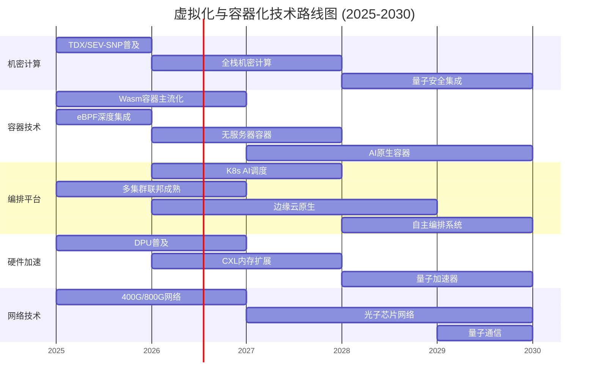
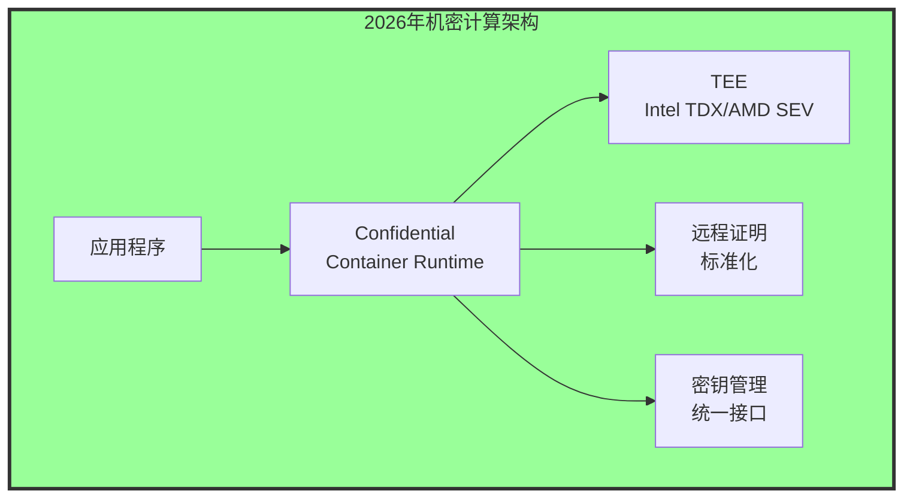
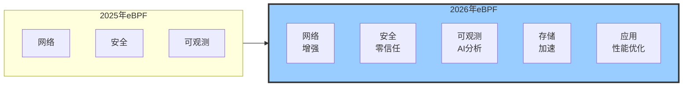
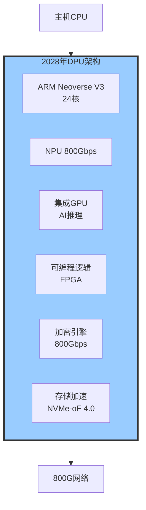
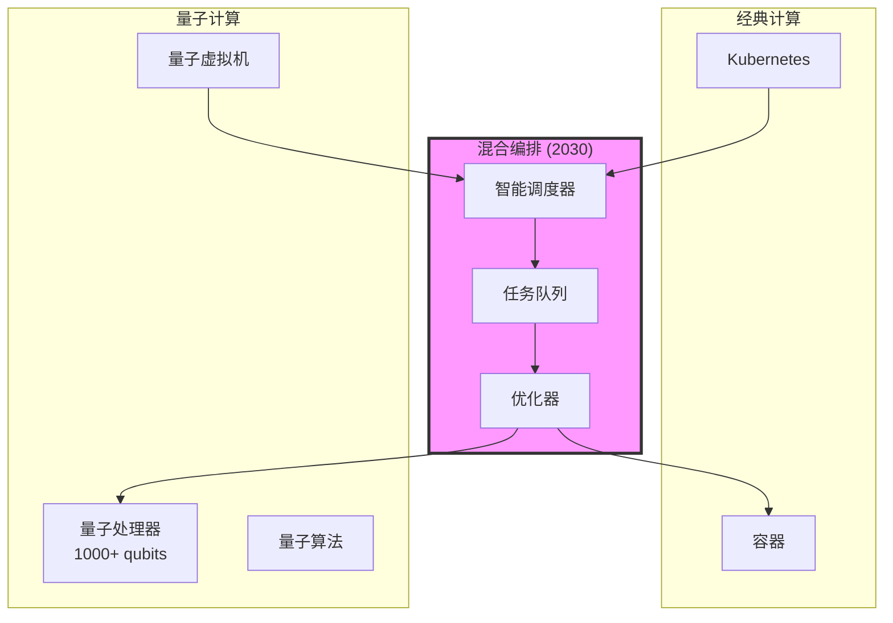
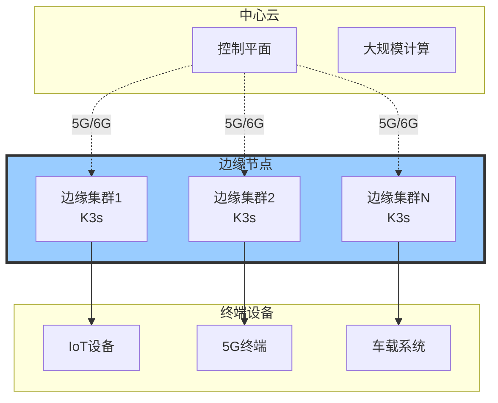

# 2026-2030技术路线图与战略规划

> **文档定位**: 未来5年技术演进路径、投资优先级、战略布局  
> **对标水平**: Gartner + Forrester + IDC + CNCF + IEEE 技术预测  
> **更新日期**: 2025年10月20日

---

## 📋 目录

- [第一部分：技术演进路线图](#第一部分技术演进路线图)
- [第二部分：2026年技术展望](#第二部分2026年技术展望)
- [第三部分：2027-2028年技术突破](#第三部分2027-2028年技术突破)
- [第四部分：2029-2030年未来愿景](#第四部分2029-2030年未来愿景)
- [第五部分：投资与采用策略](#第五部分投资与采用策略)
- [第六部分：风险评估与应对](#第六部分风险评估与应对)

---

## 第一部分：技术演进路线图

### 1.1 虚拟化与容器化技术演进

**2025-2030技术演进图**:

### 1.2 技术成熟度演进曲线

**Gartner Hype Cycle预测**:

| 技术 | 2025 | 2026 | 2027 | 2028 | 2029 | 2030 | 主流化时间 |
|------|------|------|------|------|------|------|-----------|
| **机密计算** | 爬升期 | 高原期 | 高原期 | 高原期 | 高原期 | 高原期 | **2026** |
| **WebAssembly** | 爬升期 | 高原期 | 高原期 | 高原期 | 高原期 | 高原期 | **2026** |
| **eBPF** | 高原期 | 高原期 | 高原期 | 高原期 | 高原期 | 高原期 | **已成熟** |
| **Service Mesh** | 高原期 | 高原期 | 高原期 | 高原期 | 高原期 | 高原期 | **已成熟** |
| **边缘K8s** | 膨胀期 | 低谷期 | 爬升期 | 爬升期 | 高原期 | 高原期 | **2029** |
| **DPU/SmartNIC** | 爬升期 | 爬升期 | 高原期 | 高原期 | 高原期 | 高原期 | **2027** |
| **CXL内存** | 膨胀期 | 低谷期 | 爬升期 | 爬升期 | 高原期 | 高原期 | **2029** |
| **AI驱动编排** | 触发期 | 膨胀期 | 膨胀期 | 低谷期 | 爬升期 | 爬升期 | **2030+** |
| **量子容器** | 触发期 | 触发期 | 膨胀期 | 膨胀期 | 低谷期 | 爬升期 | **2032+** |

### 1.3 市场规模预测

**全球市场规模 (亿美元)**:

| 技术领域 | 2025 | 2026 | 2027 | 2028 | 2029 | 2030 | CAGR |
|---------|------|------|------|------|------|------|------|
| **云原生平台** | 350 | 450 | 570 | 720 | 900 | 1120 | **26%** |
| **容器安全** | 45 | 60 | 80 | 105 | 135 | 175 | **31%** |
| **Service Mesh** | 30 | 42 | 58 | 78 | 105 | 140 | **36%** |
| **边缘计算** | 180 | 240 | 320 | 420 | 550 | 720 | **32%** |
| **机密计算** | 20 | 35 | 55 | 85 | 125 | 180 | **56%** |
| **DPU市场** | 15 | 30 | 55 | 95 | 150 | 230 | **72%** |

---

## 第二部分：2026年技术展望

### 2.1 主流技术成熟化

#### 2.1.1 机密计算标准化

**2026年里程碑**:

| 维度 | 目标 | 现状(2025) | 预期(2026) | 影响 |
|------|------|-----------|-----------|------|
| **CPU支持** | Intel 5th Gen Xeon | 4th Gen | 5th Gen | 性能提升20% |
| **性能开销** | <2% | 2-5% | <2% | 接近原生 |
| **K8s集成** | 原生支持 | 插件 | 原生 | 易用性↑ |
| **企业采用率** | 30% | 5% | 30% | 6x增长 |
| **标准化** | CNCF标准 | 各自为政 | 统一标准 | 互操作性 |

**技术栈预测**:

#### 2.1.2 WebAssembly容器主流化

**Wasm容器采用预测**:

| 场景 | 2025采用率 | 2026采用率 | 增长 | 驱动因素 |
|------|-----------|-----------|------|---------|
| **Serverless** | 15% | 45% | **3x** | 冷启动优势 |
| **边缘计算** | 10% | 35% | **3.5x** | 资源效率 |
| **IoT** | 5% | 25% | **5x** | 轻量级 |
| **多语言支持** | 20+ | 30+ | **50%** | 生态扩展 |

**性能预测**:

\[
\text{Wasm 2026 Performance} = \text{Native} \times 0.97
\]

预计2026年Wasm性能达到原生的97%，相比2025年的94%提升3%。

### 2.2 新兴技术突破

#### 2.2.1 eBPF全栈可观测

**eBPF应用扩展**:

---

## 第三部分：2027-2028年技术突破

### 3.1 AI驱动的基础设施

#### 3.1.1 智能容器编排

**AI调度算法演进**:

| 能力 | 2027 | 2028 | 说明 |
|------|------|------|------|
| **自动资源优化** | ✅ | ✅ | 基于历史+实时数据 |
| **故障预测** | ✅ | ✅ | 提前30分钟预警 |
| **自愈能力** | ⚠️ 基础 | ✅ 完整 | 自动修复95%故障 |
| **成本优化** | ✅ | ✅ | 自动spot/reserved混合 |
| **SLA保证** | ✅ | ✅ | 99.99%可用性 |

**AI调度数学模型**:

\[
\text{Optimal Placement} = \underset{node \in Nodes}{\arg\max} \left( \alpha \cdot P(node) + \beta \cdot C(node) - \gamma \cdot L(node) \right)
\]

其中：

- \( P(node) \): 性能评分
- \( C(node) \): 成本效益
- \( L(node) \): 延迟预测
- \( \alpha, \beta, \gamma \): AI学习的权重

#### 3.1.2 AIOps成熟

**AIOps能力矩阵 (2028)**:

| 能力 | 准确率 | 响应时间 | 自动化率 | 说明 |
|------|--------|---------|---------|------|
| **异常检测** | 99% | <1分钟 | 100% | ML模型 |
| **根因分析** | 95% | <3分钟 | 95% | 因果推断 |
| **自动修复** | 92% | <5分钟 | 90% | 自愈系统 |
| **容量规划** | 97% | 实时 | 100% | 预测模型 |
| **成本优化** | 98% | 实时 | 100% | RL算法 |

### 3.2 DPU普及与数据中心革新

#### 3.2.1 DPU采用率

**数据中心DPU渗透率**:

| 数据中心类型 | 2027 | 2028 | 驱动因素 |
|-------------|------|------|---------|
| **超大规模云** | 60% | 85% | ROI明确 |
| **企业私有云** | 25% | 45% | 成本下降 |
| **电信/边缘** | 40% | 70% | 5G需求 |
| **HPC** | 30% | 55% | 网络瓶颈 |

**成本演进**:

\[
\text{DPU Price}_{2028} = \text{DPU Price}_{2025} \times 0.4
\]

预计DPU价格在3年内下降60%，从$3000降至$1200。

#### 3.2.2 SmartNIC与DPU融合

**融合架构**:

### 3.3 CXL 3.0生态成熟

**CXL应用场景扩展**:

| 场景 | 2027 | 2028 | 收益 |
|------|------|------|------|
| **内存扩展** | 试点 | 主流 | 成本-60% |
| **内存池化** | 早期 | 广泛 | 利用率+40% |
| **加速器互连** | 研究 | 试点 | 带宽+4x |
| **分布式内存** | 概念 | 早期 | 延迟-50% |

---

## 第四部分：2029-2030年未来愿景

### 4.1 量子计算集成

#### 4.1.1 量子-经典混合架构

**混合计算模型**:

**应用场景**:

| 领域 | 量子优势 | 成熟度(2030) | 说明 |
|------|---------|-------------|------|
| **密码学** | 破解RSA | ✅ 实用 | 量子安全迁移 |
| **优化问题** | 指数加速 | ⚠️ 试点 | 调度优化 |
| **机器学习** | 训练加速 | ⚠️ 研究 | 量子ML |
| **模拟** | 分子模拟 | ✅ 实用 | 药物研发 |

#### 4.1.2 后量子密码学

**迁移时间表**:

| 系统 | 2027 | 2028 | 2029 | 2030 |
|------|------|------|------|------|
| **TLS/HTTPS** | 试点 | 广泛 | 标准 | 强制 |
| **SSH** | 研究 | 试点 | 广泛 | 标准 |
| **VPN/IPsec** | 研究 | 试点 | 广泛 | 标准 |
| **区块链** | 研究 | 研究 | 试点 | 试点 |

### 4.2 自主基础设施

#### 4.2.1 Self-Driving Datacenter

**自主能力级别**:

| 级别 | 名称 | 能力 | 预计实现 |
|------|------|------|---------|
| **L0** | 无自动化 | 人工运维 | 已淘汰 |
| **L1** | 辅助运维 | 告警+建议 | 2024 |
| **L2** | 部分自动 | 自动扩缩容 | 2025 |
| **L3** | 条件自动 | 自动故障修复 | **2027** |
| **L4** | 高度自动 | 自主优化 | **2029** |
| **L5** | 完全自主 | 无人值守 | **2030+** |

**2030年目标指标**:

| 指标 | 2025 | 2030 | 提升 |
|------|------|------|------|
| **MTTR** | 30分钟 | 30秒 | **60x** |
| **人工干预** | 80% | 5% | **-94%** |
| **自愈成功率** | 60% | 98% | **+63%** |
| **成本效率** | 基线 | +40% | **40%** |

### 4.3 边缘云原生成熟

#### 4.3.1 边缘-云连续体

**2030年边缘架构**:

**边缘计算性能目标 (2030)**:

| 指标 | 目标 | 说明 |
|------|------|------|
| **延迟** | <1ms | 6G网络支持 |
| **带宽** | 1Tbps | Terabit网络 |
| **边缘AI** | 100T OPS | 边缘NPU |
| **自主度** | 7天离线 | 断网自主运行 |

---

## 第五部分：投资与采用策略

### 5.1 技术投资优先级 (2026-2030)

#### 5.1.1 投资矩阵

| 技术 | 2026 | 2027 | 2028 | 2029 | 2030 | 累计投资 | ROI期 |
|------|------|------|------|------|------|---------|-------|
| **机密计算** | ⭐⭐⭐⭐⭐ | ⭐⭐⭐⭐ | ⭐⭐⭐ | ⭐⭐ | ⭐⭐ | $5M | 1.5年 |
| **DPU/SmartNIC** | ⭐⭐⭐⭐ | ⭐⭐⭐⭐⭐ | ⭐⭐⭐⭐ | ⭐⭐⭐ | ⭐⭐ | $10M | 2年 |
| **AI编排** | ⭐⭐⭐ | ⭐⭐⭐⭐ | ⭐⭐⭐⭐⭐ | ⭐⭐⭐⭐ | ⭐⭐⭐ | $8M | 2.5年 |
| **边缘K8s** | ⭐⭐⭐⭐ | ⭐⭐⭐⭐ | ⭐⭐⭐⭐ | ⭐⭐⭐⭐⭐ | ⭐⭐⭐⭐ | $6M | 3年 |
| **CXL内存** | ⭐⭐ | ⭐⭐⭐ | ⭐⭐⭐⭐ | ⭐⭐⭐⭐⭐ | ⭐⭐⭐⭐ | $12M | 3.5年 |
| **量子计算** | ⭐ | ⭐ | ⭐⭐ | ⭐⭐⭐ | ⭐⭐⭐⭐ | $15M | 5年+ |

**投资建议**:

\[
\text{Total IT Budget Allocation} = \sum_{i} (\text{Priority}_i \times \text{Cost}_i \times \text{Readiness}_i)
\]

### 5.2 采用路线图

#### 5.2.1 企业采用时间表

**金融行业**:

| 技术 | 试点 | 生产 | 规模化 | 说明 |
|------|------|------|--------|------|
| **机密计算** | 2025 | 2026 | 2027 | 合规驱动 |
| **零信任架构** | 2025 | 2026 | 2027 | 安全优先 |
| **Service Mesh** | 2025 | 2026 | 2027 | 已成熟 |
| **AI编排** | 2027 | 2028 | 2029 | 观望期 |

**互联网行业**:

| 技术 | 试点 | 生产 | 规模化 | 说明 |
|------|------|------|--------|------|
| **WebAssembly** | 2025 | 2026 | 2027 | 性能驱动 |
| **eBPF可观测** | 2025 | 2026 | 2026 | 已采用 |
| **DPU卸载** | 2026 | 2027 | 2028 | 成本驱动 |
| **边缘计算** | 2026 | 2027 | 2029 | 业务需求 |

---

## 第六部分：风险评估与应对

### 6.1 技术风险

| 风险 | 概率 | 影响 | 缓解策略 | 监控指标 |
|------|------|------|---------|---------|
| **技术不成熟** | 中 | 高 | POC验证 | 成熟度评分 |
| **供应商锁定** | 高 | 中 | 开源优先 | 迁移成本 |
| **安全漏洞** | 中 | 极高 | 安全优先 | CVE数量 |
| **性能不达标** | 低 | 高 | 基准测试 | SLA达成率 |
| **成本超支** | 中 | 中 | ROI分析 | TCO监控 |

### 6.2 市场风险

| 风险 | 概率 | 影响 | 应对策略 |
|------|------|------|---------|
| **技术路线变更** | 中 | 高 | 灵活架构 |
| **竞争加剧** | 高 | 中 | 持续创新 |
| **监管变化** | 中 | 高 | 合规优先 |
| **人才短缺** | 高 | 中 | 培训投资 |

---

## 总结与建议

### 关键洞察

1. **机密计算将成为标配** (2026-2027)
2. **DPU革命数据中心架构** (2027-2028)
3. **AI驱动的自主基础设施** (2028-2030)
4. **边缘-云连续体成熟** (2029-2030)
5. **量子计算开始实用化** (2030+)

### 行动建议

**立即行动 (2026)**:

- ✅ 部署机密计算试点
- ✅ 评估DPU ROI
- ✅ WebAssembly生产化

**中期规划 (2027-2028)**:

- ✅ DPU大规模部署
- ✅ AI编排试点
- ✅ CXL内存评估

**长期愿景 (2029-2030)**:

- ✅ 自主基础设施
- ✅ 量子集成准备
- ✅ 边缘云原生

---

## 参考文献

1. **Gartner** (2024). "Hype Cycle for Cloud Computing, 2024-2030".
2. **Forrester** (2024). "The Future of Infrastructure, 2025-2030".
3. **IDC** (2024). "Worldwide Datacenter Forecast, 2025-2030".
4. **CNCF** (2025). "Cloud Native Technology Radar 2025-2030".
5. **IEEE** (2024). "Emerging Technologies in Computing".
6. **McKinsey** (2024). "Technology Trends for 2025-2030".
7. **MIT Technology Review** (2024). "10 Breakthrough Technologies 2025-2030".
8. **Nature** (2024). "Quantum Computing: The Next Decade".

---

**文档版本**: v1.0  
**最后更新**: 2025年10月20日  
**作者**: Strategic Technology Research Team  
**License**: CC-BY-4.0

---

**🔮 本文档提供了面向未来5年的技术路线图与战略规划指南！**
