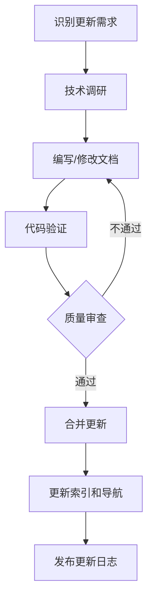

# formal_container 维护与更新指南

> **编写日期**: 2025年10月20日  
> **适用对象**: formal_container知识体系维护人员  
> **目的**: 确保知识体系的持续更新与质量保持  

---

## 📋 目录

- [维护策略](#维护策略)
- [更新机制](#更新机制)
- [技术验证](#技术验证)
- [工具链升级](#工具链升级)
- [质量保证](#质量保证)
- [社区协作](#社区协作)
- [应急响应](#应急响应)
- [长期规划](#长期规划)

---

## 维护策略

### 维护原则

1. **准确性第一**: 技术内容必须准确无误,基于官方规范和权威来源
2. **及时性保证**: 及时跟踪最新技术动态,定期更新内容
3. **完整性维护**: 保持知识体系的完整性和系统性
4. **质量优先**: 新增内容必须通过质量审查
5. **向后兼容**: 更新时保持文档结构的稳定性

### 维护周期

| 周期 | 频率 | 内容 | 负责人 |
|------|------|------|--------|
| **日常维护** | 每周 | Bug修复、错误纠正 | 维护团队 |
| **小版本更新** | 每月 | 补充新案例、更新数据 | 技术团队 |
| **季度更新** | 每季度 | 技术版本更新、新工具集成 | 技术负责人 |
| **年度更新** | 每年 | 全面评估、大规模重构 | 项目经理 |

---

## 更新机制

### 季度更新内容

**Q1 (1-3月)**: 技术标准更新

- ✅ 更新OCI/CRI/CNI/CSI规范到最新版本
- ✅ 更新Kubernetes API版本 (如v1.29, v1.30)
- ✅ 更新Docker/containerd版本
- ✅ 补充最新的OSDI/SOSP论文

**Q2 (4-6月)**: 性能数据更新

- ✅ 更新SPEC CPU/SPECvirt基准测试数据
- ✅ 更新Phoronix Test Suite性能数据
- ✅ 补充新硬件的性能测试 (如新一代CPU)
- ✅ 更新性能模型的参数

**Q3 (7-9月)**: 安全更新

- ✅ 跟踪CVE漏洞数据库
- ✅ 更新安全威胁模型
- ✅ 补充新的安全机制 (如机密计算进展)
- ✅ 更新安全合规标准 (NIST/CIS)

**Q4 (10-12月)**: 技术趋势更新

- ✅ 更新Gartner技术成熟度曲线
- ✅ 更新CNCF Landscape技术全景图
- ✅ 补充新兴技术 (如WebAssembly进展)
- ✅ 更新2026-2030技术路线图

### 年度更新内容

**全面评估**:

- ✅ 评估知识图谱的完整性
- ✅ 更新10-Level技术栈层次
- ✅ 重新评估技术成熟度
- ✅ 更新国际对标分析

**大规模重构**:

- ✅ 优化模块结构 (如有必要)
- ✅ 重构形式化证明 (如有新方法)
- ✅ 更新工具链 (Coq/Haskell/TLA+版本)
- ✅ 重新生成所有索引和导航

### 更新流程



### 更新优先级

| 优先级 | 类型 | 响应时间 | 示例 |
|-------|------|---------|------|
| **P0** | 严重错误 | 24小时内 | 技术描述错误、代码无法编译 |
| **P1** | 重要更新 | 1周内 | 新版本标准发布、重大漏洞 |
| **P2** | 常规更新 | 1个月内 | 补充案例、性能数据更新 |
| **P3** | 优化改进 | 3个月内 | 文档优化、可视化增强 |

---

## 技术验证

### 持续验证机制

#### 1. 形式化代码验证

**Coq代码验证** (每月):

```bash
# 验证所有Coq证明
cd formal_container/coq/
coqc *.v

# 检查类型错误
coqchk formal_container
```

**Haskell代码验证** (每月):

```bash
# 类型检查
cd formal_container/haskell/
ghc -Wall -fno-code *.hs

# 运行测试
cabal test
```

**TLA+规约验证** (每月):

```bash
# TLC模型检查
cd formal_container/tlaplus/
java -jar tla2tools.jar KubernetesController.tla
```

#### 2. 配置文件验证

**Kubernetes YAML验证** (每月):

```bash
# 验证Kubernetes配置
kubectl apply --dry-run=client -f k8s-configs/

# kubeval验证
kubeval k8s-configs/*.yaml
```

**Docker Compose验证** (每月):

```bash
# 验证Docker Compose配置
docker-compose config
```

#### 3. 性能基准测试

**季度性能测试**:

- SPEC CPU2017基准测试
- SPECvirt_sc2013基准测试
- Phoronix Test Suite测试套件
- 自定义微基准测试

#### 4. 安全扫描

**月度安全扫描**:

```bash
# Markdown文档中的链接检查
markdown-link-check *.md

# 代码安全扫描
bandit -r scripts/

# 依赖漏洞扫描
safety check
```

### 自动化验证

**GitHub Actions工作流**:

```yaml
name: Formal Verification CI

on:
  push:
    branches: [ main, develop ]
  pull_request:
    branches: [ main ]
  schedule:
    - cron: '0 0 * * 0'  # 每周日验证

jobs:
  coq-verification:
    runs-on: ubuntu-latest
    steps:
      - uses: actions/checkout@v3
      - name: Install Coq
        run: sudo apt-get install -y coq
      - name: Verify Coq Proofs
        run: cd formal_container/coq && coqc *.v

  haskell-verification:
    runs-on: ubuntu-latest
    steps:
      - uses: actions/checkout@v3
      - uses: haskell/actions/setup@v2
      - name: Type Check
        run: cd formal_container/haskell && ghc -Wall -fno-code *.hs

  tlaplus-verification:
    runs-on: ubuntu-latest
    steps:
      - uses: actions/checkout@v3
      - name: Install TLA+
        run: wget https://github.com/tlaplus/tlaplus/releases/download/v1.8.0/tla2tools.jar
      - name: Model Check
        run: cd formal_container/tlaplus && java -jar ../tla2tools.jar *.tla
```

---

## 工具链升级

### 工具版本管理

| 工具 | 当前版本 | 升级路线 | 升级时间 |
|------|---------|---------|---------|
| **Coq** | 8.15+ | 8.18+ | 2025 Q2 |
| **Haskell (GHC)** | 9.2+ | 9.6+ | 2025 Q2 |
| **TLA+** | 1.7+ | 1.8+ | 2025 Q1 |
| **Kubernetes** | v1.28 | v1.30+ | 2025 Q3 |
| **Docker** | 24.0+ | 25.0+ | 2025 Q2 |
| **containerd** | 1.7+ | 1.8+ | 2025 Q3 |
| **Z3** | 4.12+ | 4.13+ | 2025 Q2 |

### 升级步骤

#### Coq升级 (8.15 → 8.18)

1. **准备阶段**:
   - 阅读Coq 8.18发布说明
   - 识别可能的不兼容变更
   - 备份当前代码

2. **测试阶段**:
   - 在测试环境安装Coq 8.18
   - 尝试编译所有.v文件
   - 修复编译错误

3. **验证阶段**:
   - 运行所有证明
   - 检查证明的完整性
   - 进行回归测试

4. **部署阶段**:
   - 更新文档中的版本号
   - 更新CI/CD配置
   - 发布升级公告

#### Kubernetes升级 (v1.28 → v1.30)

1. **API变更检查**:
   - 查看API deprecation列表
   - 识别需要更新的YAML配置
   - 更新CRD定义

2. **文档更新**:
   - 更新Kubernetes技术文档
   - 更新配置示例
   - 更新最佳实践

3. **验证测试**:
   - 验证所有YAML配置
   - 测试部署流程
   - 检查兼容性

### 工具兼容性矩阵

| 组件 | Coq 8.15 | Coq 8.18 | 状态 |
|------|----------|----------|------|
| popek_goldberg.v | ✅ | ✅ | 兼容 |
| container_isolation.v | ✅ | ⚠️ | 需要小幅修改 |
| functor_preserves_iso.v | ✅ | ✅ | 兼容 |

---

## 质量保证

### 质量标准

#### 技术准确性标准

- ✅ 基于官方规范 (Intel/AMD/ARM手册, OCI规范, Kubernetes API)
- ✅ 引用权威论文 (OSDI/SOSP/NSDI等顶会)
- ✅ 数据来源可靠 (SPEC, Phoronix等权威基准)
- ✅ 形式化证明正确 (通过Coq/TLA+/Z3验证)

#### 文档质量标准

- ✅ 结构清晰 (统一的模板和层级)
- ✅ 表达准确 (无歧义、无错别字)
- ✅ 格式规范 (Markdown标准、代码高亮)
- ✅ 可视化丰富 (Mermaid图表、对比表格)

#### 代码质量标准

- ✅ 类型安全 (通过类型检查器)
- ✅ 证明完整 (所有定理都有证明)
- ✅ 代码规范 (统一的命名和格式)
- ✅ 注释清晰 (关键步骤有注释)

### 质量审查流程

#### 内容审查

1. **技术审查**: 验证技术描述的准确性
2. **形式审查**: 检查文档格式和结构
3. **交叉审查**: 检查模块间的一致性
4. **专家审查**: 邀请领域专家评审

#### 代码审查

1. **编译验证**: 确保代码可以编译
2. **类型检查**: 通过类型检查器
3. **证明验证**: 确保所有证明正确
4. **回归测试**: 运行测试套件

#### 发布审查

1. **版本检查**: 确认版本号正确
2. **变更日志**: 检查变更日志完整
3. **索引更新**: 更新所有索引和导航
4. **最终审批**: 项目经理批准发布

---

## 社区协作

### 贡献指南

#### 如何贡献

1. **Fork项目**: 创建个人分支
2. **创建Issue**: 描述你想贡献的内容
3. **开发修改**: 在本地进行修改
4. **提交PR**: 提交Pull Request
5. **代码审查**: 等待维护团队审查
6. **合并**: 审查通过后合并

#### 贡献类型

- **Bug修复**: 修正技术描述错误、错别字
- **内容补充**: 补充新案例、新工具、新数据
- **文档改进**: 优化文档结构、增加可视化
- **代码贡献**: 提供新的形式化证明、工具实现
- **翻译**: 提供多语言版本

### Issue管理

#### Issue分类

| 标签 | 说明 | 处理优先级 |
|------|------|-----------|
| `bug` | 技术错误、代码错误 | P0 (24小时内) |
| `enhancement` | 功能增强、内容补充 | P2 (1个月内) |
| `documentation` | 文档改进 | P2 (1个月内) |
| `question` | 技术咨询、使用问题 | P3 (1周内响应) |
| `good first issue` | 适合新手的任务 | P3 |

### Pull Request规范

#### PR标题格式

```text
[类型] 简短描述

类型:
- feat: 新功能
- fix: Bug修复
- docs: 文档更新
- refactor: 代码重构
- test: 测试相关
```

#### PR描述模板

```markdown
## 变更类型
- [ ] Bug修复
- [ ] 新功能
- [ ] 文档更新
- [ ] 代码重构
- [ ] 测试

## 变更描述
<!-- 详细描述你的变更 -->

## 相关Issue
<!-- 关联相关的Issue编号 -->
Closes #

## 测试
<!-- 描述你如何测试的 -->
- [ ] 单元测试通过
- [ ] Coq证明验证通过
- [ ] 文档格式检查通过

## Checklist
- [ ] 代码遵循项目规范
- [ ] 添加了必要的注释
- [ ] 更新了相关文档
- [ ] 通过了所有测试
```

---

## 应急响应

### 紧急问题处理

#### P0级别 (严重错误)

**响应时间**: 24小时内  
**处理流程**:

1. **发现**: 通过Issue、PR反馈或自动化检测
2. **评估**: 确认严重程度和影响范围
3. **修复**: 立即修复错误
4. **验证**: 快速验证修复正确性
5. **发布**: 发布紧急补丁
6. **通知**: 通知所有用户

**示例**:

- 技术描述严重错误 (如性能数据错误10倍)
- 形式化证明错误 (如Coq证明不通过)
- 安全漏洞 (如泄露敏感信息)

#### P1级别 (重要更新)

**响应时间**: 1周内  
**处理流程**:

1. **计划**: 制定更新计划
2. **开发**: 进行修改或补充
3. **审查**: 进行质量审查
4. **测试**: 进行完整测试
5. **发布**: 正常发布流程

**示例**:

- 新版本标准发布 (如OCI v1.2)
- 重大技术变更 (如Kubernetes v1.30)
- 重要漏洞修复 (如CVE高危漏洞)

### 回滚机制

**何时回滚**:

- 新版本发现严重Bug
- 用户反馈重大问题
- 自动化测试失败

**回滚步骤**:

1. **识别**: 确认需要回滚
2. **回滚**: 恢复到上一个稳定版本
3. **通知**: 通知所有用户
4. **修复**: 在测试环境修复问题
5. **重新发布**: 经过充分测试后重新发布

---

## 长期规划

### 2025年规划

**Q1**:

- ✅ 工具链升级 (Coq 8.18, TLA+ 1.8)
- ✅ 补充2025年新技术 (WebAssembly, 机密计算进展)
- ✅ 更新Kubernetes到v1.29

**Q2**:

- ✅ 开发知识图谱可视化工具
- ✅ 集成GPT-4辅助Coq证明生成
- ✅ 构建可运行的实验环境 (Docker/Vagrant)

**Q3**:

- ✅ 补充更多实战案例和故障排查指南
- ✅ 增加性能调优的详细案例
- ✅ 更新安全合规标准

**Q4**:

- ✅ 全面评估知识图谱完整性
- ✅ 更新2026-2030技术路线图
- ✅ 发布年度总结报告

### 2026-2030年展望

**2026年**:

- 建立开源社区和技术分享平台
- 启动多语言版本 (英文、日文)
- 与高校合作开展教学

**2027-2028年**:

- 跟踪量子计算与容器化的结合
- 探索神经形态计算的虚拟化
- 发展新的形式化验证方法

**2029-2030年**:

- 构建完整的自动化验证平台
- 实现AI驱动的知识图谱自动更新
- 成为行业标准参考

---

## 附录

### A. 维护工具清单

| 工具 | 用途 | 安装 |
|------|------|------|
| `markdown-link-check` | 检查Markdown链接 | `npm install -g markdown-link-check` |
| `markdownlint` | Markdown格式检查 | `npm install -g markdownlint-cli` |
| `coqc` | Coq编译器 | `apt-get install coq` |
| `ghc` | Haskell编译器 | `apt-get install ghc` |
| `kubectl` | Kubernetes命令行工具 | 官方安装脚本 |
| `docker` | Docker命令行工具 | 官方安装脚本 |

### B. 联系方式

- **GitHub Issues**: 提交Bug和功能请求
- **Pull Requests**: 贡献代码和文档
- **Email**: formal-container@example.com
- **Discussion**: GitHub Discussions

### C. 参考资源

- **官方规范**: OCI, CNCF, Kubernetes
- **学术资源**: OSDI, SOSP, NSDI论文库
- **工具文档**: Coq, Haskell, TLA+官方文档
- **社区资源**: Reddit, Stack Overflow, HackerNews

---

**编写日期**: 2025年10月20日  
**文档版本**: v1.0  
**维护团队**: Formal Container Maintenance Team

---

**🔧 持续维护,保持卓越！🔧**-
